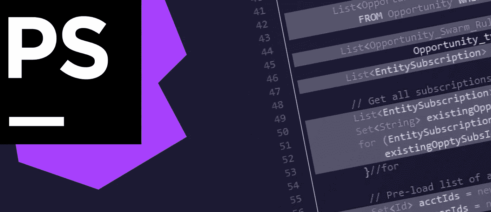
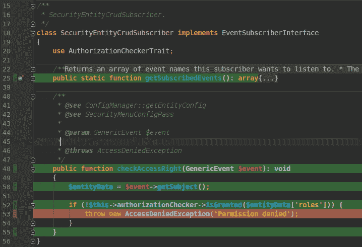
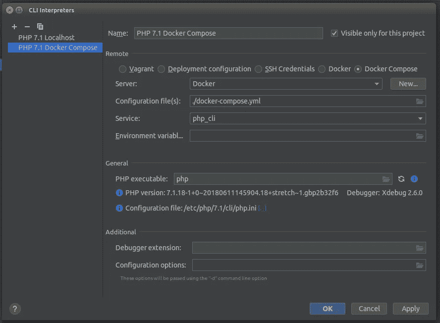
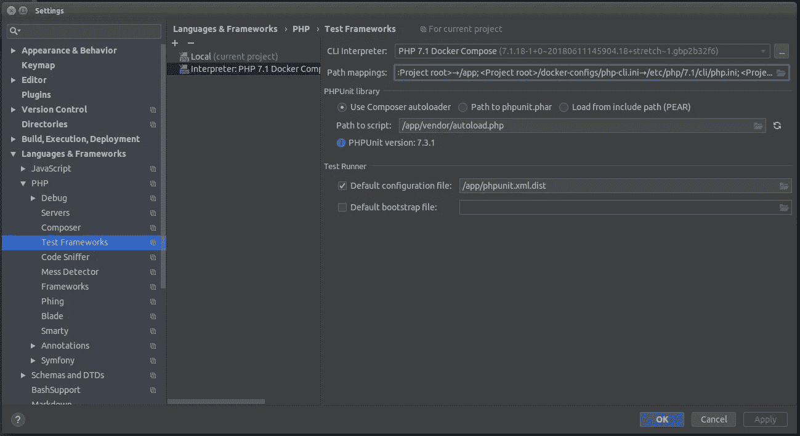
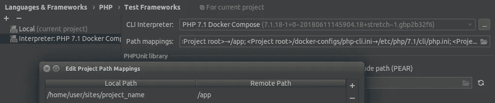

# 在 Docker 中使用 PHPStorm 中的代码覆盖率运行 PHPUnit 测试

> 原文：<https://medium.com/hackernoon/running-phpunit-tests-with-code-coverage-in-phpstorm-when-working-in-docker-12724c8b0f58>

## 作者:阿尔特姆·亨瓦尔德

在 **PhpStorm** 中，可以创建*运行/调试配置*并从 IDE 中运行它们。它允许项目参与者使用设置中的“共享”标志共享通用配置。其中一个操作是在开发过程中运行单元测试。让我们讨论如何通过 **Docker** 来微调这个过程。

有一个插件 **PHPUnit 代码覆盖率**，用于显示 PhpStorm 测试的代码覆盖率。PhpUnit 可以使用生成代码覆盖率报告的选项来运行。该报告将包含测试执行期间对每个操作员的呼叫次数的信息。使用这些统计数据，我们可以计算测试代码覆盖率的百分比，因为如果文件中有操作符在测试期间从未被调用过，那么这段代码就没有被测试覆盖。这就是插件以表格的形式显示的文件和目录导航。该插件还可以用绿色或红色突出显示文件中的行，这些行相应地被测试覆盖或不被测试覆盖:

为了让这个插件在 PhpStorm 中正确工作，并从 Docker 容器中配置 PHP CLI，应该采取一系列额外的操作。

首先，到目前为止，已经运行的容器的工作还没有正确实现。这是一个众所周知的缺点，在这里[讨论](https://intellij-support.jetbrains.com/hc/en-us/community/posts/360000062320-Docker-compose-PHPUnit-kill-my-container-after-running-the-test)。有一个[问题](https://youtrack.jetbrains.com/issue/PY-18901)是用户建议可能的解决方案，还有一个[问题](https://youtrack.jetbrains.com/issue/WI-37986)是计划解决这个问题。我建议你订阅它们以保持消息灵通。简而言之，当您从 Docker 设置运行*运行配置*时，只要脚本在容器中执行，PhpStorm 就会用 PHP 重启容器，之后，容器就会停止。从 PhpStorm 的测试运行结果中可以观察到:

这种方法使得永久开发成为不可能。当您在 IDE 中编写测试和特性，然后运行测试，之后切换到浏览器并手动测试特性，您需要手动重启 PHP 容器，因为 PhpStorm 在从 *Run/Debug* 菜单运行控制台脚本后会停止它。为了避免这种副作用，直到 JetBrains 开发人员解决它，社区已经制定了最简单的解决方案。您需要创建另一个 PHP 容器，它将专门用于 PhpStorm 中的*运行/调试配置*。IDE 将运行它，停止它或其他什么。同时，您的主要 PHP 容器不会被终止，您将能够从 web 浏览器(或任何其他用于 HTTP 调用的客户端)运行您的代码。在这种情况下，配置如下所示:

**docker-compose.yml**

**php_cli** 容器应该继承自 **PHP** 容器或者是它的副本。根据具体的 PHP 映像和具体的平台，容器内的 root 访问对于代码覆盖插件的正确工作是必要的。我们已经通过在控制台 PHP 的映像中添加额外的指令解决了这个问题。如果在代码覆盖生成期间，PhpStorm 通知您它不能访问某个类别，那么，您需要添加到**中。/docker-configs/PHP-image/docker file**将以下内容归档:

**。/docker-configs/PHP-image/docker file**

现在，我们需要从 Docker 中为我们来自*运行/调试*的脚本设置并选择 PHP 服务器。为此，在 PhpStorm 的设置中，选择语言&框架→PHP→CLI 解释器并添加一个新的服务器。此外，勾选“仅对该项目可见”选项，因为对于每个项目，您都应该有一个单独的 docker-compose.yml，以避免 PhpStorm 中的项目间连接共享。选择 Docker Composer 的配置，然后在服务下拉菜单中选择我们已经创建的配置， **php_cli** :

你还需要进入*语言&框架→ PHP →测试框架*设置，通过远程解释器为 *PHPUnit 创建一个新的配置。在解释器的下拉列表中，选择我们之前设置的那个，PHP 7.1 Docker Compose。您可以默认配置 **PHPUnit** 设置。由于测试是从 Docker 运行的，我们需要根据文件在容器中的位置来指定文件的路径。在我们的例子中，项目在`/app`文件夹中，这就是为什么自动加载器的路径被指定为`/app/vendor/autoload.php`，而配置文件的路径是`/app/phpunit.xml.dist`。正确地指定这个路径很重要，因为不会有来自 PhpStorm 的线索。*

我们还应该提到，为了让 PhpStorm 正确地处理包含覆盖率结果的文件，您需要正确地指定文件的路径。为此，在为 Docker 设置的配置的 T *est 框架*设置中，您必须向*路径映射*中添加一个新规则。本地路径应该指源代码本地存储的目录。例子中是`home/user/sites/project_name`。*远程路径*是指向 Docker 容器中项目根目录的路径。在我们的例子中是`/app`:

应该这样做，因为代码覆盖率报告存储了 PHPUnit 处理的文件的路径。Docker 中生成的报告相应地保存了文件的路径，这些路径与文件在容器中的位置有关。当报告中提到的文件在 PhpStorm 中打开时，PhpStorm 会突出显示其中的行覆盖。相反，如果本地文件路径和报告文件路径不一致，PhpStorm 将无法理解 Docker 容器路径符合本地路径，因此应该突出显示该文件。

完成所有设置后，我们重新组装容器，运行它们，并在浏览器中处理项目。同时，我们在 PhpStorm 中运行测试。它们在 **php_cli** 容器中执行，不影响 **PHP** 容器。部署一个单独的容器来运行控制台实用程序不受 PHPUnit 的限制。现在您已经有了一个来自 **php_cli** 容器的配置解释器，您可以在 PhpStorm 中创建其他*运行/调试配置*，例如，任何也将在这个短命容器中运行的 php 脚本。因此，您可以在 IDE 中立即看到实现结果，而不必切换到终端并手动键入命令。它还允许优化开发过程，因为在*运行/调试配置*中，您可以在 PhpStorm 中分配专用热键，以便例行任务的运行将被限制在键盘上的快捷键中。

PhpStorm 中 Docker 问题的另一个可能来源是一个 **docker-compose** 实用程序。别忘了更新。我自己也遇到过 PhpStorm 不想运行的情况，因为我的电脑上安装了一个太早的版本。当前版本的更新解决了这个问题。你可以在这里查看当前版本[，你可以在这里](https://github.com/docker/compose/releases)找到 **docker-compose** 更新[的指南。](https://docs.docker.com/compose/install/#install-compose)

P.S .如果 JetBrains 开发人员最终改进了他们 IDE 中 docker-compose 实用程序的行为(这个问题不仅对 PhpStorm 来说很紧迫)，那么就不再需要所描述的方法了。

*原载于 stfalcon.com***。**