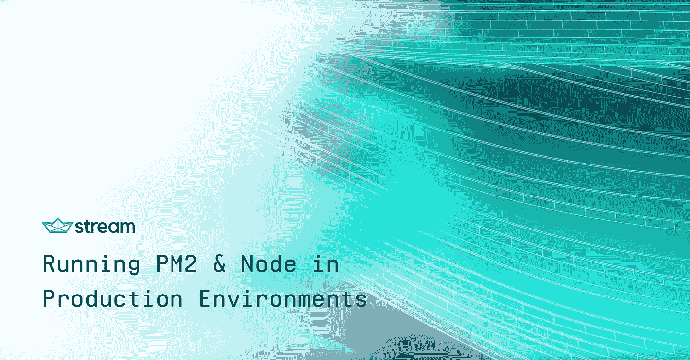

# 在生产环境中运行 PM2 & Node.js

> 原文：<https://medium.com/hackernoon/running-pm2-node-js-in-production-environments-13e703fc108a>

[https://getstream.io/try-the-api](https://getstream.io/try-the-api)

在 Stream，我们构建了许多展示和示例应用程序来展示我们的服务必须提供的令人敬畏的特性。对于我们几乎所有的应用程序，我们都在一个实例上托管它们——通常是 [DigitalOcean](https://www.digitalocean.com/) 或 [AWS EC2](https://aws.amazon.com/ec2/) 。

虽然维护您的代码库并保持它的相关性是困难的，但我们发现最具挑战性的方面是维护一个…