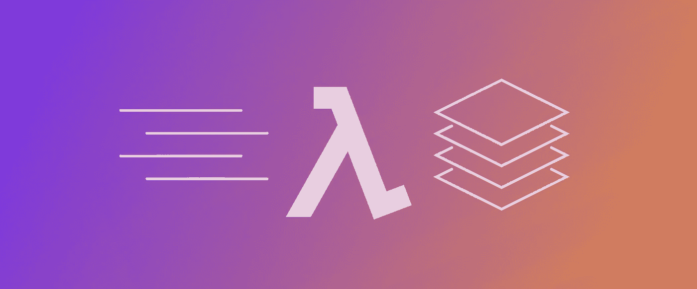

# AWS Lambda 层上的硒和无头铬

> 原文：<https://medium.com/hackernoon/running-selenium-and-headless-chrome-on-aws-lambda-layers-python-3-6-bd810503c6c3>



AWS 已经将 Lambda 函数的超时限制从 5 分钟延长到 15 分钟，并且 AWS 在 re:Invent 2018 上发布了新的 Lambda layers 功能，有了这些新功能，我们现在可以将 Selenium 测试迁移到无服务器框架，而不会出现任何性能问题！

在多次尝试使用不同版本的 chrome 驱动程序和二进制文件后——我最终找到了让它工作的方法——Chrome driver 能够在 Lambda 层内运行无头 Chrome 并与之交互。

我创建了 [**无服务器框架**](https://serverless.com/) (≥1.34.0)项目来发布和使用带有 Selenium 和 Headless Chrome 的 Lambda 层，因此团队能够使用 Python 进行 UI 测试，而无需在服务器或本地机器上运行 Selenium。

## 硒和无头铬

不兼容版本的无服务器 chrome、chromedriver 和 Selenium 会导致 **Chrome 不可达**错误。通过我的测试，这些版本最终可以很好地配合使用:

*   Python3.6
*   硒 2.37
*   [ChromeDriver2.37](https://sites.google.com/a/chromium.org/chromedriver/downloads)
*   [无服务器 Chrome v1.0.0.41](https://github.com/adieuadieu/serverless-chrome/releases?after=v1.0.0-46)

## 文件结构

根目录下有 2 个子 sls 项目， **seleniumLayer** 是 Selenium Lambda 层，存储 Selenium 库、无头 Chromium 驱动和二进制。 **lambda** 是正常的 lambda 函数，用于进行 UI 测试

```
root
── /**seleniumLayer**/  # lambda layers
  ├── /**selenium** lambda layer of selenium lib
  │  └──/python/      # python libs
  │   └── /lib/    
  │     └── /python3.6/*    
  ├── /**chromedriver**/    # lambda layer of headless Chrome 
  │ ├── /chromedriver   # chrome driver
  │ └── /headless-chromium # headless chrome binary
  └── /serverless.yaml     
── /**lambda**/            # lambda function
  ├── /handler.py      # source code of lambda function 
  └── /serverless.yaml # serverless config
```

## 安装 Selenium 库

Lambda 运行时在`/opt`目录中包含路径，以确保您的函数代码可以访问包含在层中的库。

要在层中包含库，请将它们放在 python/lib/python 3.6/site-packages/中

```
# download Selenium 2.37 to layer directory
$ pip3.6 install -t seleniumLayer/*selenium/*python/lib/python3.6/site-packages selenium==2.37
```

## 安装无头 Chrome 驱动和二进制

转到**根目录**下，安装 chrome 二进制文件和驱动程序

```
# download chrome driver
$ mkdir -p seleniumLayer/chromedriver
$ cd seleniumLayer/chromedriver
$ curl -SL https://chromedriver.storage.googleapis.com/2.37/chromedriver_linux64.zip > chromedriver.zip
$ unzip chromedriver.zip
$ rm chromedriver.zip# download chrome binary
$ curl -SL https://github.com/adieuadieu/serverless-chrome/releases/download/v1.0.0-41/stable-headless-chromium-amazonlinux-2017-03.zip > headless-chromium.zip
$ unzip headless-chromium.zip
$ rm headless-chromium.zip
```

将以下代码复制到**/selenium layer/server less . YAML**

```
**service**: selenium-layer

**provider**:
  **name**: aws
  **runtime**: python3.6
  **region**: ap-southeast-2
  **timeout**: 900

**layers**:
  **selenium**:
    **path**: selenium
    **CompatibleRuntimes**: [
      **"python3.6"** ]
  **chromedriver**:
    **path**: chromedriver
    **description**: chrome driver layer
    **CompatibleRuntimes**: [
      **"python3.6"** ]
**resources**:
  **Outputs**:
    **SeleniumLayerExport**:
        **Value**:
          **Ref**: SeleniumLambdaLayer
        **Export**:
          **Name**: SeleniumLambdaLayer
    **ChromedriverLayerExport**:
       **Value**:
         **Ref**: ChromedriverLambdaLayer
       **Export**:
         **Name**: ChromedriverLambdaLayer
```

## λ函数

并将下面的代码复制到 **/lambda/handler.py**

```
**from** selenium **import** webdriver
**from** selenium.webdriver.chrome.options **import** Options

**def** hello(event, context):
    options = Options()
    options.binary_location = **'/opt/headless-chromium'** options.add_argument(**'--headless'**)
    options.add_argument(**'--no-sandbox'**)
    options.add_argument(**'--single-process'**)
    options.add_argument(**'--disable-dev-shm-usage'**)

    driver = webdriver.Chrome(**'/opt/chromedriver'**,chrome_options=options)

    driver.get(**'https://www.neaminational.org.au/'**)
    body = **f"Headless Chrome Initialized, Page title: {driver.title}"** driver.close();
    driver.quit();

    response = {
        **"statusCode"**: 200,
        **"body"**: body
    }

    **return** response
```

将以下代码复制到**/lambda/server less . YAML**

```
**service**: selenium-lambda

**provider**:
  **name**: aws
  **runtime**: python3.6
  **region**: ap-southeast-2
  **timeout**: 900

**functions**:
  **hello**:
    **handler**: handler.hello
    **layers**:
      - ${cf:selenium-layer-dev.SeleniumLayerExport}
      - ${cf:selenium-layer-dev.ChromedriverLayerExport}
```

## 部署 Lambda 层

转到/ **硒化层**目录

```
 $ sls deploy
```

## 部署λ函数

转到/ **lambda** 目录

```
$ sls deploy
```

## 开始测试

转到/ **lambda** 目录

```
 $ sls invoke --function hello
```

您应该会得到如下响应

```
{
"statusCode": 200,
"body": "Headless Chrome Initialized, Page title Home | Neami    National"
}
```

我希望这篇文章对你有用，你可以在我的 **GitHub repo** 中找到完整的项目:

[](https://github.com/yai333/Selenium-UI-testing-with-AWS-Lambda-Layers) [## yai 333/Selenium-UI-使用 AWS-Lambda-Layers 进行测试

### 用 AWS Lambda 层进行 Selenium UI 测试。为 yai 333/Selenium-UI-testing-with-AWS-Lambda-Layers 开发做出贡献…

github.com](https://github.com/yai333/Selenium-UI-testing-with-AWS-Lambda-Layers) 

## 了解更多信息

[](/neami-apps/how-to-add-nodejs-library-dependencies-in-a-aws-lambda-layer-with-serverless-framework-d774cb867197) [## 如何使用无服务器框架在 AWS Lambda 层中添加 NodeJs 库依赖项

### 无服务器计算在 re:Invent 2018 上得到推动。AWS 宣布了简洁的 Lambda 层，它给了开发者多达五个…

medium.com](/neami-apps/how-to-add-nodejs-library-dependencies-in-a-aws-lambda-layer-with-serverless-framework-d774cb867197)