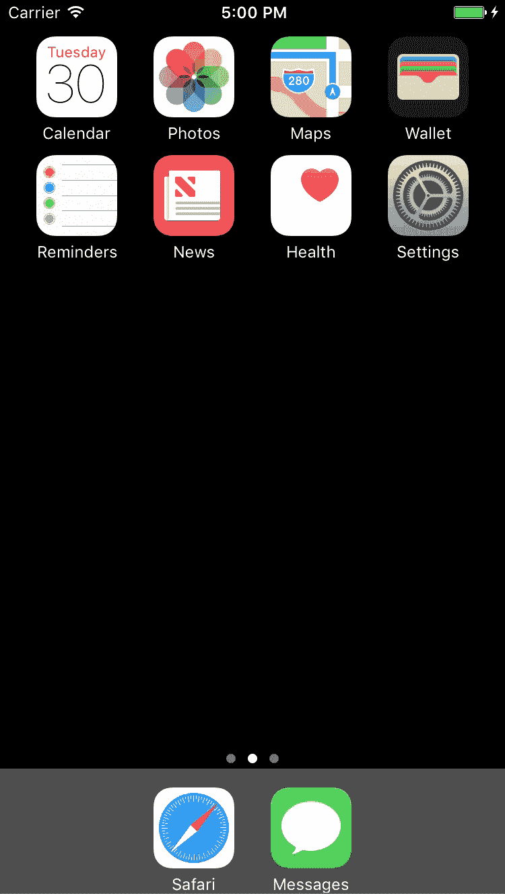

# 在 iOS 中使用脸书登录运行 UITests

> 原文：<https://medium.com/hackernoon/running-uitests-with-facebook-login-in-ios-4ac998940c42>

Source: Google

今天，我试图在我的应用程序上运行一些 UITest，它使用脸书登录。这是我的一些笔记。

# 挑战

*   脸书面临的挑战是它使用了