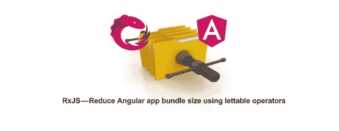
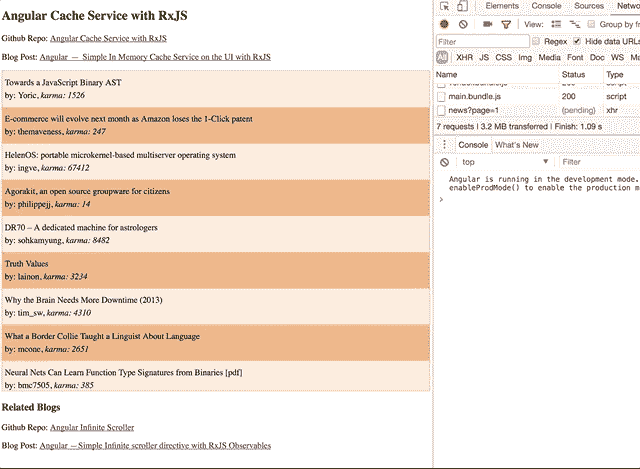
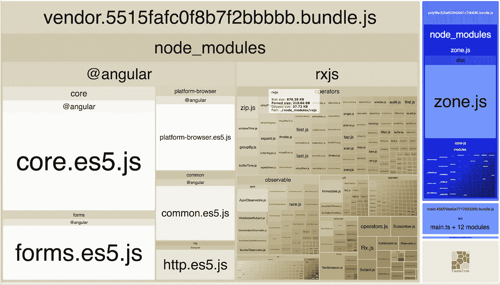
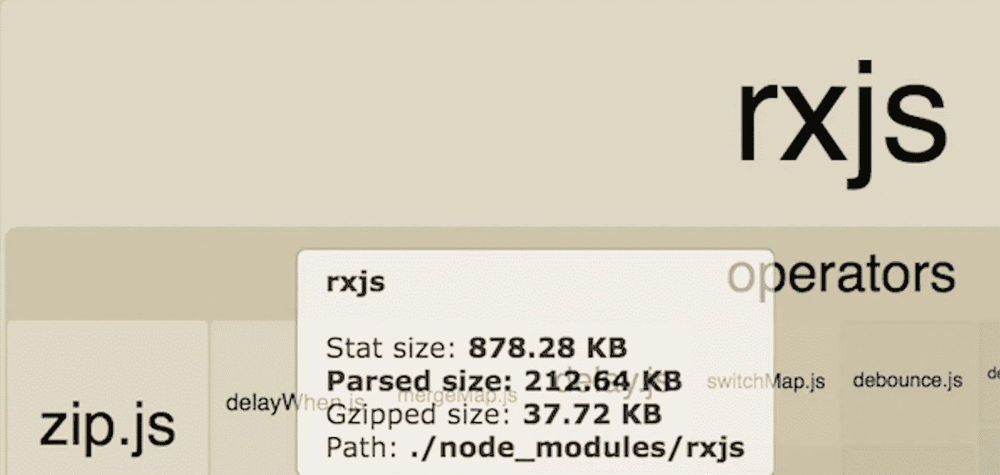
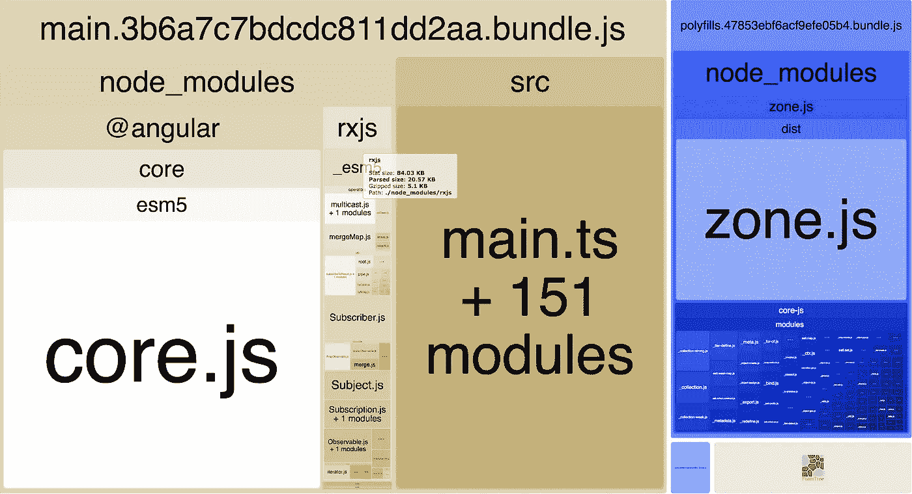
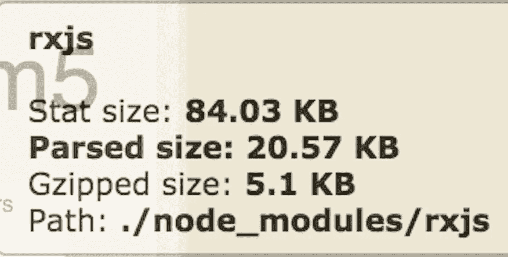

# RxJS 使用可允许的运算符减小角度应用程序包的大小

> 原文：<https://medium.com/hackernoon/rxjs-reduce-bundle-size-using-lettable-operators-418307295e85>



RxJS 版本 5。5 在 RxJS 的导入过程中引入了一个有影响的变化，并添加了可允许的操作符。这篇博客文章是一个小的比较，说明了 lettable 操作符是如何提高应用程序的包大小的。我选择 Angular 作为我的框架来展示这一点，但这可以在 vanilla js 或任何框架中完成。

# 方法

*   RxJS 导入流程的变化
*   可出租运算符简介
*   通过 webpack 或其他捆绑器使用 RxJS< 5.5
*   Collect metrics on bundle sizes on RxJS < 5.5
*   Upgrade to RxJS 5.5 and update the application
*   Collect metrics on upgraded application

# Changes in the imports when using RxJS

In version 5.5, we can import operators/creation utils using es6 imports.

```
 import { map, scan, filter } from 'rxjs/operators'; 
```

Any operator (function) can be imported from 【

Observable creation methods have also been updated.

```
 import { of } from 'rxjs/observable/of';
import { from } from 'rxjs/observable/from';
import { range } from 'rxjs/observable/range'; const source$ = of(1,2,3);const rangeSource$ = range(0,5); 
```

# Introduction to lettable operators

Lettable Operators are functions that accept an observable and return an observable. A new method has been introduced to Observable’s prototype called 【 . Using 【 we can compose n-number of functions to act on our observable-emitted values. Lets see an example of 【 using map, scan and filter.

Operator which are part of the prototype of the observable are not***tree-shake able***实现一个小应用。这将增加包的大小，因为即使不使用操作符，它们也会成为包的一部分。然而，可允许的操作符是纯函数。未使用时，它们被排除在捆绑包之外。即使是 linters 也能识别出这些函数是声明的，但并没有在任何地方使用。

***摇树就是死码淘汰的过程。***

```
*Note: A few operators have been renamed to avoid conflicts with Javascript keywords*do -> tap 
switch -> switchAll
catch -> catchError
finally -> finalize
```

在这一点上，假设我们想在每次转换后执行控制台记录值的副作用。我们可以通过添加重命名的方法`tap`来实现。

# RxJS 中的 Angular 应用< 5.5

I am going to use an Angular application which I have used in few of my previous blog posts.

demo: [https://ashwin-sureshkumar . github . io/angular-cache-service-blog/](https://ashwin-sureshkumar.github.io/angular-cache-service-blog/)

github:[https://github . com/ashwin-sureshkumar/angular-cache-service-blog](https://github.com/ashwin-sureshkumar/angular-cache-service-blog)



我不打算讨论这个应用程序是如何构建的，因为它已经在以前的博客文章中讨论过了。这篇文章主要关注 RxJS 和应用程序的构建标准。

# 收集捆绑包大小 RxJS < 5.5 的指标

为了可视化我们的构建度量，我们需要安装`webpack-bundle-analyzer`

```
npm install webpack-bundle-analyzer --save-dev
```

现在，是时候构建我们的应用程序了。

```
ng build --prod --stats-json // Above command builds our application in prod mode and also,      // generates stats.json, and stores it in /dist/stats.json
```

要可视化我们的指标，运行下面的命令。

```
webpack-bundle-analyzer dist/stats.json
```

这将在浏览器中打开一个应用程序。



在上面的截图中，重点关注`rxjs`部分。我们可以看到，每一个操作符、util、调度器和可观察类型都被导入到我们的供应商中，即使我们在应用程序中没有利用它们中的大部分。这是我们的应用程序附带的不必要的代码。关注下面的 rxjs 统计。



# 将我们的应用程序升级到 RxJS 5.5

让我们将示例应用程序升级到 RxJS 5.5，Angular 版本升级到 5.1，并安装所需的对等依赖项。

```
$ npm install @angular/{animations,common,compiler,compiler-cli,core,forms,http,platform-browser,platform-browser-dynamic,router}@5.1.1
```

**感谢** [**伊戈尔·米纳尔**](https://medium.com/u/96d4cd23fa0e?source=post_page-----418307295e85--------------------------------) **，我们知道 Angular 应用程序中的树摇动依赖于 Angular build-optimizer 包，所以请确保安装它。**

```
// command to runnpm install @angular-devkit/build-optimizer
```

我们的应用程序的主要变化是无限滚动指令、hackernews 服务和 AppComponent

# 收集升级后的应用程序的指标

在上一步中，我们已经安装了 bundle analyzer，因此让我们构建应用程序并可视化我们的指标。

```
ng build --prod --stats-json// once build is finished webpack-bundle-analyzer dist/stats.json
```



在上面的 metrics visual 中，你可以看到 rxjs 部分并不包含操作符、可观察值、util 函数等的完整列表。与我们之前看到的相比，这个包非常小。下面是对统计数据的进一步观察。



**请注意确保您正在使用的外部库遵循相同的方法。如果没有，他们的进口将影响您的捆绑大小。**

虽然这篇文章描述了如何使用 lettable 操作符来减少包的大小，但我希望它能激起您对包的大小、性能以及如何在考虑性能的情况下构建应用程序的好奇心。如果你喜欢这篇文章，请分享，评论和推荐。