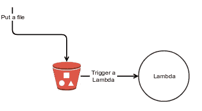
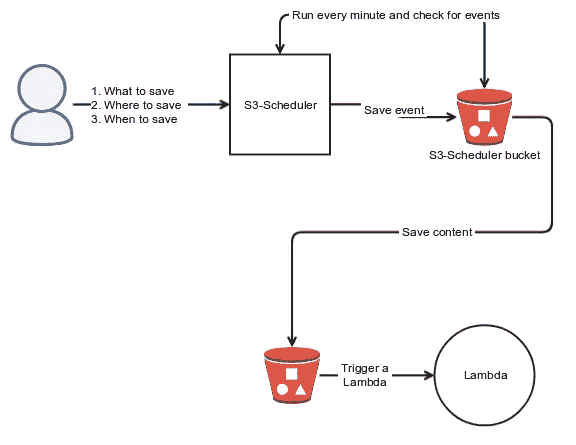

# S3 的诡计，用它作为调度程序

> 原文：<https://medium.com/hackernoon/s3-trickery-using-it-as-a-scheduler-c618103b1cf2>

“March calendar” by [Charles Deluvio 🇵🇭🇨🇦](https://unsplash.com/@charlesdeluvio?utm_source=medium&utm_medium=referral) on [Unsplash](https://unsplash.com?utm_source=medium&utm_medium=referral)

使用[无服务器](https://hackernoon.com/tagged/serverless)的一个有趣之处在于，你可以尝试新的想法，然后弹指一挥间就能提供这些想法。我不止一次提到 s3 是一个强大的工具，它不仅仅是一个弹性持久层。

 [## S3 两个世界中最好的

### S3 不仅仅可以用来存储数据。查看扩展其功能的新方法。

hackernoon.com](https://hackernoon.com/s3-the-best-of-2-worlds-92576f23c000) 

在这篇文章中，我将演示如何使用 s3 作为调度机制来执行各种任务。

# 概观

Simple S3 flow

S3 和一个λ函数一起创建了一个简单的事件基础流。例如，将 Lambda 附加到 s3 PUT 事件并创建一个新文件，然后调用 Lambda 函数。要创建一个调度事件，您所要做的就是编写您想要在指定时间执行的文件；然而，AWS 使您能够使用 cron 或 rate expression 仅创建重复发生的[事件。当您想要安排一次性事件时会发生什么情况？你被卡住了。](https://docs.aws.amazon.com/lambda/latest/dg/tutorial-scheduled-events-schedule-expressions.html)

s3-scheduler 库使您能够做到这一点。具体来说，它使用 s3 作为调度机制，使您能够调度一次性事件。

## 它是如何工作的

每个事件都是一个单独的文件。在后台，库使用循环机制每 1 分钟唤醒一次，使用 s3 的[过滤功能](https://boto3.readthedocs.io/en/latest/guide/collections.html)扫描相关文件，如果预定时间已过，则将文件移动到相关的 bucket + key。

为了正常运行，图书馆必须知道三个问题的答案:

1.  要保存什么内容，
2.  保存位置(桶+键)→将触发适当的 Lambda 函数，并且
3.  何时将其移至合适的铲斗。

## 编码细节

要保存的内容保持不变，第 2 点和第 3 点(见上文)被编码在密钥的名称中，并使用`|`作为各部分之间的分隔符。例如，要将 8 月 5 日的相关内容复制到一个名为`s3-bucket`的桶和一个名为`s3_important_files`的文件夹中，调度程序将生成以下文件:`2018–08–05|s3-bucket|s3_files-important`。通过将元数据保留在实际内容之外，我们获得了以下好处:

*   它加快了复制过程，而无需阅读全部内容来决定何时何地进行复制。
*   它允许内容是二进制的，而不仅仅是基于文本的。
*   通过使用 s3 过滤功能，降低了获取正确文件的成本。
*   有更容易的调试；只需查看文件名即可了解何时何地复制。

# 基本用法

## 装置

`pip install s3-scheduler`

## 设置循环流程

该库使用 AWS 内置功能每 1 分钟运行一次。配置取决于您的框架。例如，对于 Zappa，请使用以下内容:

## 行程安排

在初始化期间，调度程序需要存储桶和保存实际调度细节的文件夹。请记住，每个事件都是一个单独的文件；因此，有必要将它们保存在某个地方。何时调度是一个简单的`datetime`对象。

## 填料

如果要在计划事件发生之前取消它，请执行以下操作:

# 鳍状物

在 AWS [无服务器](https://hackernoon.com/tagged/serverless)世界中的调度有点棘手。目前， [AWS](https://hackernoon.com/tagged/aws) 只提供类似 cron 的功能，但是这篇文章展示了一种可以用来创建更健壮的调度功能的技术。

# 阅读“来自战壕”系列

*   [从战壕进行无服务器测试](https://hackernoon.com/serverless-testing-from-the-trenches-790e77301c74)
*   [来自战壕的无服务器多云](https://hackernoon.com/serverless-multi-cloud-from-the-trenches-50a615ba234c)
*   无服务器环境中的开发流程——请跟随我获取最新消息