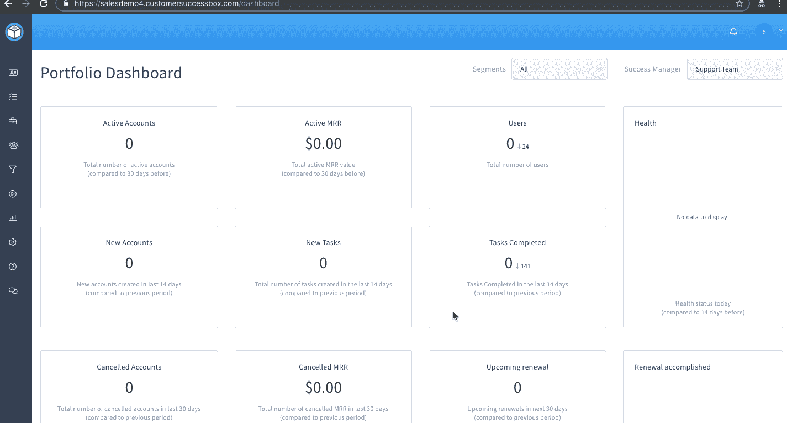
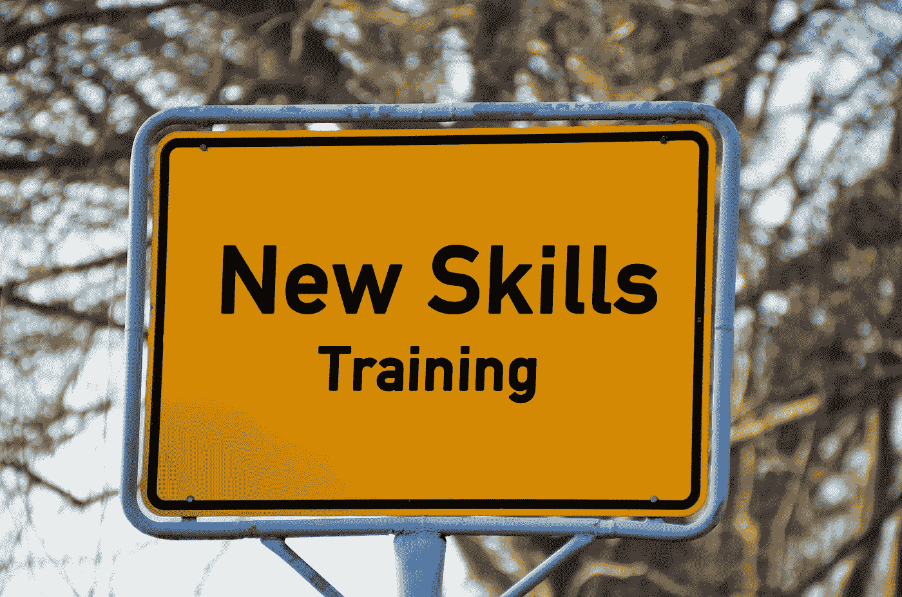

# SaaS 留住客户的最佳实践，以最大限度地提高续订率

> 原文：<https://medium.com/hackernoon/saas-customer-retention-best-practices-to-maximize-renewals-29397a19f739>

在 SaaS 世界，客户获取成本(CAC)很高，与客户的终身价值(LTV)相比，初期付款微不足道。

根据[研究](https://www.forentrepreneurs.com/saas-metrics-2/)，为了让你的公司成长和可持续发展，LTV 值应该至少是 CAC 的 3 倍。这意味着客户需要不止一次续签合同。

如果没有高的客户保持率，一家 SaaS 公司将会倒闭，不管其他指标有多好。

你可以相信，如果客户没有任何问题，客户会续签合同。

这是一种被动的方法，是不正确的。

在这个时代，尤其是在 SaaS 领域，你需要有一个积极主动的方法。否则，客户会流失，你既找不到原因也做不了什么。

下面的 SaaS 客户维系最佳实践将帮助您了解客户的需求，以便您能够积极主动地采取行动，最大限度地提高续订率。

## **第 0 步:了解客户的需求**

帮助科技公司利用客户成功获利的[客户改善](https://customerkaizen.com/)的首席执行官[保罗·里维斯](https://www.linkedin.com/in/paulalanreeves/)表示，第一步是了解客户想要实现什么，他们如何衡量，然后确保后续步骤旨在实现并跟踪这一点。

了解客户期望的结果是该流程的关键部分，这将直接影响成功计划的设计。

销售或 BD 代表可以在签约前接洽流程中进行这一发现，或者 CSM 可以在成交流程中进行这一发现。最好在入职前获得这些信息，这样 CSM 就可以在开始时有一个推荐的计划。

如果你不知道自己是否能达到预期的结果，那么签下一个客户的风险总是更大。

## **第一步:改进入职流程**

最高的流失风险发生在入职过程中。因此，无论你的入职流程有多好，仍然会有改进的机会。

入职培训的目的应该是帮助客户在无需付出太多努力的情况下达到他们的第一个感知价值点。

这里重要的一点是，不同客户的早期价值根据他们各自的用例可能是不同的。

因此，基于不同的用例，您可能需要不同的入职流程。

另一件事是以一种有节奏的、经过深思熟虑的方式教授那些功能，这将帮助客户尽快实现他们的早期价值。

入职时不需要教授所有功能。为了以循序渐进的方式帮助客户加入，并让他们有一个平稳的体验，[你可能正在寻找一个加入框架](/nworld-publications/designing-a-customer-onboarding-framework-for-b2b-saas-a7752f32464e)。

## **第二步:定义、监控并持续报告客户关键绩效指标**

如果你不能衡量它，你就不能改进它。

为了确保公司走在正确的道路上，您需要定期定义和监控客户 KPI。

有几个[重要的 KPI](https://customersuccessbox.com/blog/10-customer-success-kpis/)，如 MRR(月留存率)、客户留存率和投资组合增长，每个客户成功团队都会衡量这些 KPI。

但是，这些是您的内部 KPI。您应该关注的是客户指标，如产品采用率、产品粘性和其他有助于您实现内部 KPI 的领先指标。

不要关注太多的指标，因为这会使成功计划失控。应该选择并监控两到三个 KPI。

定义策略以确保这些 KPI 可以改进。之后，全部的焦点应该放在实施和报告上，直到 KPI 在理想的范围内。

## **第三步:关注客户对产品的参与度**

客户参与通常会给你一个未来将要发生的事情的预览。

如果客户参与度低，这意味着客户已经停止使用该产品，留住客户的可能性很低。除非你做一些创新的事情来帮助客户实现目标，否则很难留住他们。

客户成功平台在这方面可以发挥作用。他们监控数百万个数据点，得出显示客户当前状态的健康评分。健康状况的好坏可以根据用例预先定义。

因此，在合同需要更新之前，你会知道状态，并有足够的时间采取主动行动。

那些身体健康的顾客提供了另一个独特的机会。通过使用客户成功软件，您将知道他们最常用的功能，这可能会带来追加销售的机会。然后，你可以向他们推销一个高级定价方案，帮助他们以更少的投入更快地实现目标。

## **步骤 4:在制定成功计划的过程中设定正确的客户期望**

不要向顾客推销你无法帮助他们实现的梦想。

在开始与客户合作之前，与他们讨论他们希望通过使用该产品达到什么目的。然后清楚地告诉他们什么是可能的，同时给出一个现实的时间表。

从一开始就保持透明可以防止将来出现很多问题。此外，这也有助于建立你和客户之间的信任，因为他们知道你确实兑现了你所说的话。

此外，客户和客户成功经理都应该知道需要完成哪些任务，以便客户能够尽早实现价值。这防止了任何误解。

一旦客户和成功经理达成一致，所有的焦点都将是实现早期目标。

一旦这个目标实现了，继续下一个目标，然后下一个，等等。

成功计划需要是一个动态的文档，它随着客户的目标而发展，这些目标将随着客户目标的变化和您自己的产品路线图的进展而发展。

## **第五步:投资客户关系**

[Yasasree Nerayanuri](https://www.linkedin.com/in/yasasree-nerayanuri-2ba23647/) ， [Freshworks](https://www.freshworks.com/) 的客户成功主管，相信在客户组织中建立和投资垂直向上和水平的客户关系。客户流失的主要原因之一(对于中端市场客户更是如此)是利益相关者的变化。因此，您可能希望确保公司的所有利益相关者都参与进来，并提供与他们相关的内容

根据你所在的行业，利益相关者流失可能会对你产生不利影响，甚至比产品问题更严重。一旦你失去了产品冠军，留住客户就变得非常困难，尤其是如果你还没有在公司的各个层面建立联系的话。

## **第六步:一致的沟通**

无论客户参与度有多高，与客户的持续沟通都至关重要。这样，客户就会知道你是积极主动的，并且总是愿意提供任何帮助。沟通可以通过电话、视频会议或电子邮件进行。

还有，不是所有的东西都能被数据捕捉到。有些事情只有和客户谈了才能知道。这也可以给你一些有价值的见解，可能有助于产品的改进。

从一开始，就确定你互动的频率。根据需要，可以是每周、每月或每季度。

但是，请记住，并不是所有的客户都希望定期沟通。一些客户更喜欢自助服务模式，拥有一个带有自助服务指南的帮助中心将有助于他们不费吹灰之力就能获得所需的服务。

## **第 7 步:捕捉、细分和分享客户声音**

[mind touch](https://www.linkedin.com/in/arijhoffman/)的客户成功营销主管 Ari Hoffman 说，“在客户旅程的不同接触点捕捉、细分和分享客户的声音”。

使用健康评分、CSM 洞察和推荐来决定哪些客户可以给出评论、视频推荐、参与案例研究并提供未来推荐。

利用这些相关的客户评价、评论和案例研究，将它们注入到客户之旅中，帮助新客户了解他们行业中的其他人是如何使用您的产品来实现预期结果的。

这反过来会帮助你的新客户信任你，相信他们购买你的产品是正确的选择。

**总结**

以上是一些常见的 SaaS 客户保持最佳做法，将提高您的保留率。即使留存率增加了几个百分点，它也能为你的年度经常性收入创造奇迹。

额外收获:我想补充的另一件事是，一切都要和合同期限挂钩。如果你有一个 SaaS 的产品，客户每月更新一次，你就一直在更新。这将最终改变你们的互动方式(或者至少改变你们成功交往的策略)。

现在，您已经了解了最佳实践，是时候实施它们并通过最大限度地留住客户来增加您的经常性收入了。

你准备好了吗？

*如果你喜欢这篇文章，* ***随便打那个拍手👏按钮几下*** *帮助别人找到它*😄