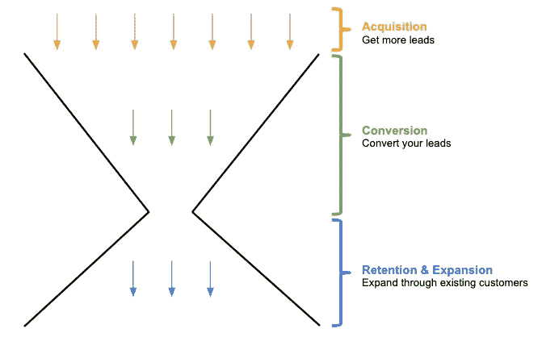

# 发展 SaaS 业务

> 原文：<https://medium.com/hackernoon/saas-growth-series-part-1-how-to-grow-your-saas-business-507491539439>

这是我发表的一系列文章中的第一篇，这些文章讲述了任何一家 SaaS 公司，只要它的产品符合市场需求，它就能增加收入。

我在 browser stack 的产品和增长团队工作了两年，在那里我看到公司的收入几乎每年翻一番。BrowserStack 是 SaaS 初创企业遵循[3–3–2–2–2](https://stripe.com/atlas/guides/business-of-saas)增长模式的典型例子。我在 [BrowserStack](http://browserstack.com/) 的经历是在成长周期的中后期，而我在 [WebEngage](http://webengage.com/) 的经历是在成长周期的早期到中期。

通过这些经历，我花了很多时间研究 SaaS 初创公司的增长模式，以及他们如何增加收入。我的大部分知识都是基于我在 [BrowserStack](http://browserstack.com/) 和 [WebEngage](http://webengage.com/) 采取的举措、创始人在我加入公司之前采取的举措以及其他团队为了促进增长而采取的项目。

# 概观

通过漏斗可以更好地理解增长模型。任何增长分析都始于识别漏斗中的主要瓶颈并解决它们。因此，让我们从了解 SaaS 公司的典型增长漏斗开始我们的增长系列。

Growth Funnel

增长漏斗包括三个步骤:

*   **第一步(获取)**:主要通过你的营销计划，让更多的用户了解你的产品。这里的目标是让用户访问你的网站或下载你的应用程序。
*   **第二步(转化)**:这包括将你的访客转化为注册用户，并将注册用户转化为付费用户。
*   **第三步(保留&扩展)**:这包括通过减少客户流失来发展现有的付费客户，通过追加销售和交叉销售来扩大每笔交易的规模，以及扩展到同一公司的其他团队。

在这篇文章中，我将只简要介绍这些步骤。在我以后的文章中，我将通过我们在 [BrowserStack](http://browserstack.com/) 和 [WebEngage](http://webengage.com/) 进行的项目的实际例子来详细介绍这些步骤，以解决我们面临的瓶颈。

# **第一步:采集**

顾名思义，收购就是你如何让更多的人知道你的产品，以便他们访问你的网站或下载你的应用程序。请记住，您的努力应该只集中在获取与您的业务相关的人物角色上。如果你的目标市场仅仅是美国的开发人员，那么获取其他角色将是对你的时间和金钱的次优使用，并且不会推动增长。

假设你已经想好了你的目标人物角色，你可以做很多不同的事情来让你的目标人物角色意识到你的产品。我在下面列出了其中的一些:

*   **推荐**:让现有客户将你的产品推荐给他们的联系人。像 BrowserStack 这样的产品纯粹是通过推荐发展起来的，因为用户对该产品非常满意。即使一个免费增值业务有一个伟大的产品也可以帮助建立牵引力。 [Mailchimp](http://mailchimp.com) 和 [Dropbox](http://dropbox.com) 如此受欢迎的原因之一是，人们看到了他们免费产品的巨大价值，以至于他们去告诉他们的朋友，然后建立了病毒推荐循环。
*   内容营销:这包括你的博客文章、案例研究、白皮书等。内容需要时间来构建，但它可以帮助你快速获得相关用户，这些用户很可能对你的产品有真正的需求。这个想法是，当客户在谷歌上搜索与你的产品相关的关键词时，在搜索结果的第一页显示你的网站内容。
*   **整合**:如果你有一个产品可以与另一个流行产品整合，它可能会帮助你获得已经在使用该流行产品的用户。
*   **会议**:这主要适用于年度合同价值(ACV)在数万美元范围内的初创公司。
*   **PR** :这包括你在 [TechCrunch](http://techcrunch.com) 、 [Product Hunt](http://producthunt.com/) 等等的报道。我也会包括你在这里的演讲。
*   **SEO** :这包括现场优化，比如用相关关键词建立登陆页面等。，以及一些场外的努力，如通过从流行的出版物获得推荐流量的链接建设。
*   数字营销:如果你有钱，你也许可以投资 SEM 广告或展示广告。我在这方面没有任何经验，但是[许多其他成功的 SaaS 公司都是这样成功推动收购的](https://labs.openviewpartners.com/slack-saas-growth-strategy/#7)。
*   **业务发展/合作关系**:这些可以是与你的业务相关的任何公司的合作关系。例如， [HubSpot](http://hubspot.com/) 与代理商建立了合作关系，然后代理商将 HubSpot 销售给他们的客户。他们在这一项目上非常成功，HubSpot 40%的收入来自于通过代理开展的业务。

# 第二步:转换

根据您获得的潜在客户类型，转换会有所不同。它可以根据获取渠道(脸书、LinkedIn、谷歌有机搜索、谷歌付费搜索等)而变化。)、位置(美国、西欧、东南亚等。)、一年中的时间等。出于本文的目的，我将只从整体上谈论转换。

转换可以用多种方式定义。我认为转换主要包括两件事:

1.  从网站访问者转化为注册用户(或从应用安装转化为注册用户)
2.  从注册用户转变为付费用户

从网站访问者到注册用户的转变通常发生在你的营销网站上(即客户在登录或注册之前在你的网站上看到的一切)。另一方面，从注册用户到付费用户的转化取决于你的产品和营销网站。让我们简单介绍一下你可以做的一些事情来提高转化率。

## **从网站访问者转化为注册用户**

以下是一些可以提高这种转化率的方法:

*   **登陆页面**:不同的客户有不同的需求。理想情况下，你应该有许多不同的登录页面，来满足你的产品所迎合的不同角色的需求。
*   **标识**:在你的网站上放一堆客户标识增加了社交证明，并提供了人们在决定注册试用产品之前所寻找的外部验证。
*   **客户评价**:除了客户标识之外，来自真实人物的真实客户评价可以大大增加社交证明和验证。在 [BrowserStack](http://browserstack.com/) 网站上，你会看到来自[约翰·瑞西格和克里斯·科伊尔](http://browserstack.com/)的评价。任何看到这些推荐的前端开发者(BrowserStack 的目标市场)都会考虑注册，以防他/她不相信这个产品。
*   内容:包括博客文章、案例研究、白皮书等。在你的网站上。所有这些都有助于建立价值主张、品牌，并在客户中建立对您产品的某种认知，从而让他们试用您的产品。
*   聊天:拥有一个反应迅速的支持团队总是有帮助的，他们可以实时回答访问者的问题。[对讲机](http://intercom.com)、[通井器](https://www.drift.com/)、[奥拉克](https://www.olark.com/)等工具。可以帮助建立与访客的这种接触渠道。
*   **品牌化&整体用户体验**:虽然我已经把它作为一个单独的类别，但它也包含了以上几点。你需要给客户留下正确的印象，让他们注册——网站的设计必须很棒，插图必须直观，语言或文案必须让客户能够很容易地联想到它，等等。

## **从签约转为付费客户**

以下是一些可以提高这种转化率的方法:

*   **产品上线**:客户应该能够很快看到你产品的价值。客户越早发现你的产品，他们就会越早购买订阅。
*   定价:你需要建立针对不同角色的定价计划。如果你的主要角色之一是自由职业者，那么你需要在你的定价页面上有一个迎合自由职业者的计划。
*   **重要特征**:如果你将注册但从未购买订阅的用户的行为与在某个时间段内注册并购买订阅的用户的行为进行比较，你会看到这两个队列的行为有明显的差异。您将能够在客户购买订阅之前准确地确定他们需要试用您的产品，然后您可以相应地构建您的产品体验。例如，在 BrowserStack，我们发现的一件事是，注册后在我们的移动浏览器上尝试网站测试的用户比那些只在桌面浏览器上尝试网站测试的用户更有可能转化为付费用户。因此，我们开始考虑如何让更多的客户在移动浏览器上尝试网站测试，以提高转化率。
*   **点滴邮件**:这包括自动发送给你的客户的点滴邮件，以帮助他们，让他们相信你的产品提供的价值。
*   **免费增值限制**:如果你有一个免费增值产品，在产品中内置一个自然扩展策略会有所帮助，这样一旦用户达到免费计划的使用限制，他们就会想要升级。这种情况越早发生，对您的业务越有利。例如，Dropbox 的免费增值计划被限制在 2GB，在你开始试用后，你可能会很快达到 2GB。
*   **销售策略**:如果你所在的市场的平均合同价值(ACV)在数万美元的范围内，那么你可能需要你的销售团队付出专门的努力，以便将潜在客户转化为付费客户。因此，在这种情况下，转化率的增加将通过优化您的销售策略和流程来实现。

请记住，转换的过程从来都不是线性的。在你的访问者转变之前，可能会有很多接触点。因此，你提高转化率的策略将是上面提到的项目的组合。

# 第三步:保留和扩展

根据我的经验，让现有客户继续使用你的产品并购买比获得新客户更容易。在这一步，我将介绍如何从现有客户那里增加收入。

保留和扩展主要有三种方式:

*   **降低流失率**:任何业务都有流失率。如果你有企业客户，你的年流失率可能在较低的个位数。另一方面，如果你的主要客户是初创公司或自由职业者，你的年流失率可能高达 40-50%。找出您的客户取消订阅的原因，然后制定减少取消的策略，这一点非常重要。你甚至可以建立一个预测模型，在客户流失真正发生之前预测它，这样你就可以采取措施防止客户流失的发生。
*   **交叉销售和追加销售**:你可以向同一个客户交叉销售其他产品，例如 [Atlassian 的](http://atlassian.com)战略，他们可以向已经使用其产品的客户销售多种产品，或者你可以向同一个客户追加销售相同的产品。如果您看到您的客户不断达到他们的计划限额或可能很快达到他们的计划限额，就会发生追加销售。
*   **落地&扩展**:如果一个大企业的一个团队已经在使用你的产品，那么扩展到同一公司的其他团队就变得很容易了。

# 你从哪里开始？

如果你正处于创业的早期阶段，你需要认真考虑的一个指标是你的流失率。即使你的转换率或收购率没有那么高，但对你的业务未来不利的肯定是流失率。如果您处于早期阶段，并且您的许多客户正在取消他们的订阅，那么您可能还没有实现产品与市场的契合，并且您不应该担心这个阶段的增长。

如果你已经实现了产品与市场的契合，为了实现增长，你需要找出增长漏斗中的主要瓶颈。一旦你发现了这些瓶颈，你需要对它们进行优先排序，并制定策略来消除这些瓶颈。

你可以点击阅读 SaaS 成长系列[的第二部分。](/@arpitrai/saas-growth-series-part-2-how-to-get-traction-for-your-saas-product-93c899711e41)