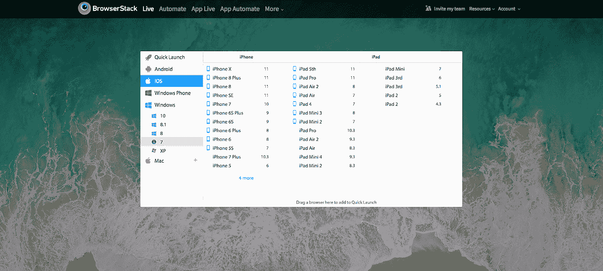

# 为 SaaS 的新产品吸引顾客

> 原文：<https://medium.com/hackernoon/saas-growth-series-part-2-how-to-get-traction-for-your-saas-product-93c899711e41>

*你可以在这里* *阅读 SaaS 成长系列第一部* [*。*](https://hackernoon.com/saas-growth-series-part-1-how-to-grow-your-saas-business-507491539439)

所以你花了很多周或几个月来打造你的 SaaS 产品。那么，你如何着手为你的产品增加吸引力呢？你如何获得你的第一个 100 个付费客户？

在这篇文章中，我将讲述我所学到的为 SaaS 产品增加吸引力的方法。为了让这篇文章更加贴切，我将做一些宽泛的假设。我假设正在构建的产品是面向 SMB 市场(自助销售)而不是企业(在企业中，你需要一个销售团队来推销产品)。我还假设你在最初的构建阶段已经做了足够多的客户开发，这样你就构建了一个市场真正想要的产品(如果你愿意，可以称之为[产品-市场匹配](https://en.wikipedia.org/wiki/Product/market_fit))。这将包括在整个构建阶段与一组 5 或 10 个客户或潜在客户定期合作——在开始构建之前研究和验证想法，定期反馈您所构建的内容等。

一旦你的基本产品到位，你就开始建立牵引力。SaaS 初创公司的吸引力可以有多种定义——有些定义为在 ARR 中获得 100 万美元，有些定义为获得前 100 个付费客户，有些定义为获得 1000 个免费或付费客户使用你的产品等。我把吸引定义为获得你的第一批 100 个*非附属*付费客户。这些客户没有在构建阶段与您合作过。这些顾客可能从未听说过你。

# 获取非关联客户的渠道

所有获取客户的基础都建立在识别正确的客户、锁定他们并获取他们的基础上。现在让我们来探索一下你可以用来获得这 100 个非附属付费客户的渠道。

## **个人联系人**

如果你可以依靠你的个人关系网获得你的第一个 100 个客户，你可以忽略这篇文章的其余部分。严肃地说，如果你真的可以依靠你的个人关系或你的个人关系的关系来获得你的第一个 100 个客户，你的工作就变得更容易了。一些在 SaaS 领域很受欢迎的人(例如 [Hiten Shah](https://hitenism.com/) )拥有如此庞大的追随者，以至于为他们制造的任何新产品建立吸引力变得非常容易。

你也可以参加行业会议，亲自邀请潜在客户使用你的产品。记住，这里的重点是要接触到你的前 100 个客户。因此，即使是在 Twitter 上联系那些过去在 Twitter 上发布过与你的产品直接或间接相关的问题的人，也可能有助于获得第一批客户。

## **公关/社区/博主/影响者/目录列表**

我把很多东西放在这个包罗万象的公关类别下。任何可以通过宣传帮助你建立知名度的东西都属于这一类。这可能包括在[产品搜索](http://producthunt.com/)上介绍你的产品(有一个完整的流程来正确地做这件事——这里是、这里是和这里是)、黑客新闻、 [TechCrunch](http://www.techcrunch.com/) 、 [VentureBeat](http://venturebeat.com/) 或任何类似的在线社区、博客等。识别这些在线社区或博客的另一种方法是在 [SimilarWeb](https://www.similarweb.com/) 上查看竞争对手的收购来源，并锁定这些来源。你也应该直接在软件列表上列出你的产品，比如 [Capterra](https://www.capterra.com/) 、 [G2 人群](https://www.g2crowd.com/)等。

该渠道还包括您可以从影响者那里获得的覆盖面。影响者是 B2C 创业公司中被滥用最多的渠道。然而，如果有影响力的人开始谈论你的产品，SaaS 产品的红利可能会非常高。当 [BrowserStack](http://www.browserstack.com) 推出他们的产品时，前端工程领域的知名人士，如[约翰·雷西格](https://johnresig.com/)、[克里斯·科伊尔](https://chriscoyier.net/)和[保罗·爱尔兰](https://www.paulirish.com/)使用了该产品，喜欢上了它，并自愿在推特上谈论它。对于 BrowserStack 来说，这是获得第一批客户的最佳方式。

## **内容和 SEO**

为 SEO 生成内容和优化是一个渐进的长期策略，可以带来巨大的好处，但只有经过一段时间的持续努力才能实现。为了优化获得 SEO 好处的时间，你可以在构建产品的同时开始构建内容(博客文章),这样一旦你准备好发布产品，SEO 就可以开始交付。请注意，你必须对你创造的内容的种类很聪明。为了找出你应该创作的内容，上[谷歌广告](https://www.google.com/ads/)查看人们搜索的关键词，注意谷歌上建议的或相关的关键词，或者上 [SimilarWeb](https://similarweb.com) 查看你的竞争对手排名较高的关键词，并据此创作内容。

如果你能根据你的内容吸引访问者，你应该向他们要电子邮件地址，这样你甚至在发布前就有了一个可靠的潜在客户名单！

## **付费广告**

如果你有资金，你可以探索付费广告的领域。也许你对*内容和 SEO* 关键词的发现可以用在这里。然而，你可能会在几十个关键词上烧钱，最终找到一组适合你的关键词。

## **业务开发和销售**

如果你的销售对象是 ACV(年度合同价值)很高的企业(任何地方都超过每年 20，000 美元)，这一点是适用的。此外，有了这么大的 ACV，吸引力甚至意味着获得你的前 10 个广泛使用你的产品的付费客户。

如果你向企业销售，你可能需要某种内部销售团队来为你销售。当然，在你试图获得首批客户的最初阶段，在你雇佣销售人员之前，主要是创始人在做销售。

## **伙伴关系**

如果你能借助一个更大、更受欢迎的产品，那不是很好吗？对于一家发布首款产品的初创公司来说，建立互利的合作关系是很困难的。然而，如果做得好，这可能是一个获得新客户的好方法。几年前，微软在他们的[开发者](https://developer.microsoft.com/en-us/microsoft-edge/tools/vms/)页面上宣传了 [SauceLabs](http://saucelabs.com/) 和 [BrowserStack](http://browserstack.com) ，作为从微软网站下载 VM(虚拟机)软件来测试你的网站在 IE 浏览器上的表现的更简单的网站测试替代方案。下载和使用虚拟机的过程既复杂又耗时。因此，微软与软件开发人员建立了良好的关系，向他们介绍了这些更简单的网站测试方法。此外， [SauceLabs](http://saucelabs.com) 和 [BrowserStack](http://browserstack.com) 最终通过与微软的合作关系获得了成百上千真正需要该产品的客户。

## **病毒式传播/口碑传播**

如果你有一个伟大的产品，希望人们会与他们的朋友和同事谈论它。纯粹依靠口碑，BrowserStack 的收入从零增长到两位数的百万美元。人们尝试了这个产品，喜欢上了它，并把它传播到他们的网络中。

或者你可以在产品中加入机制，让它像病毒一样传播。如果你让你的朋友注册，Dropbox 会给你更多的空间。当 [WebEngage](http://www.webengage.com) 推出他们的第一款网站通知产品时，你可以在该产品的免费用户使用的所有通知上看到 WebEngage 的标志和 WebEngage 的链接。这给产品注入了巨大的病毒。同样，当您使用 [Typeform](http://typeform.com) 提交表格或 [SurveyMonkey](http://surveymonkey.com) 进行调查时，您会注意到一旦您提交了原始表格或调查，这两个产品都会提示您创建自己的表格或自己的调查。这就在产品中创造了巨大的病毒，可以帮助你快速获得新用户。

# 入职体验

即使你能够利用你的获取渠道来获取用户，你的努力也不会产生结果，除非你有一个很好的产品上线体验。

新用户应该能够很快察觉到你的产品为他们提供的价值。用户越快获得你产品的众所周知的 [*啊哈时刻*](https://hackernoon.com/getting-to-the-aha-moment-creating-a-killer-onboarding-experience-b12e21e8a87e) ，他们就越快转化为付费客户。 [BrowserStack](http://browserstack.com) 做得很漂亮，只要你注册，就有数百种浏览器和设备可供你测试你的应用或网站。使用 BrowserStack 到达*啊哈时刻*只需不到 10 秒钟。

BrowserStack Onboarding Experience

几乎所有我能想到的伟大公司，比如 [Mailchimp](http://mailchimp.com) 、 [Dropbox](http://dropbox.com) 、 [Asana](http://asana.com) 、 [Zendesk](http://zendesk.com) 等等。我从一开始就投入了很多时间来打造这种出色的入职体验。事实上，在某些方面，你的入职甚至在用户真正注册之前就已经开始了。如果你的主页上没有一个令人信服的信息，或者如果你不能传达你的产品所提供的价值或它所解决的问题，那么很有可能你的大多数访问者甚至不会在你的网站上注册。

# 要跟踪的指标

假设你已经能够产生足够的吸引力，并且你的入职体验很好，你如何定量地跟踪你的初始客户是否能够在一段时间内从你的产品中获得价值。你最初的客户的行为可能预示着在更大的客户基础上的长期成功。

以下是你应该每天、每周、每月跟踪和分析的一些关键指标，以推断你的初始客户是否真的能够从你的产品中获得价值。

*   **独特使用天数**:如果你的产品在一段持续的时间内，一周内有 3 天或更多的独特使用天数，你就知道你的产品为用户提供了某种价值，这种价值推动了这种行为
*   **总使用时间**:你的用户每天、每周或每月在你的产品上花费的时间越多，产品为他们提供的价值就越高
*   **激活率**:我把激活率定义为注册并广泛使用你的产品*的用户占总注册用户的比例*。这种广泛的用法可以有多种定义。在 [BrowserStack](http://browserstack.com) ，我们开发了一个公式，可以在注册后的头几天对用户的参与度进行评分。某些参数，如某些功能的使用或在多种设备上的测试，会导致更高的分数，代表更积极的用户。我们的目标是确定临界值，然后努力提高那些参与度低于临界值的用户的激活率
*   **采用率**:如果你有像 [Asana](http://asana.com) 或 [Front](http://frontapp.com) 这样迎合团队的产品，你应该跟踪用户是否邀请了他们的团队成员加入账号，以及团队中每个成员的激活率。如果团队成员的激活率很低，那么应该在产品中内置一些机制，通过这些机制可以提高产品在团队中的采用率
*   **流失率**:如果你的大多数用户取消了他们的订阅，或者即使在激活后也不再使用产品，那么你应该质疑你的产品是否已经达到了 PMF 阶段

# 结束语

虽然你可能会在多个获取渠道上投入精力，但你通常会发现，只有一两个获取渠道会给你带来最大的回报。你识别这些关键获取渠道的过程越快，你就能越快获得你的第一批 100 个非附属付费客户。

最后，不管获取渠道如何，如果你的目标是自助销售(即中小企业客户)，你应该在入职方面付出足够的努力。打造给客户留下持久印象的优秀产品的关键几乎总是始于出色的入职体验！

你可以在这里阅读 SaaS 增长系列[的第一部分。](https://hackernoon.com/saas-growth-series-part-1-how-to-grow-your-saas-business-507491539439)