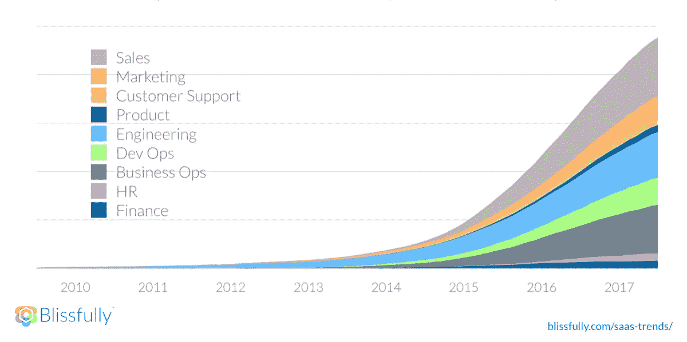
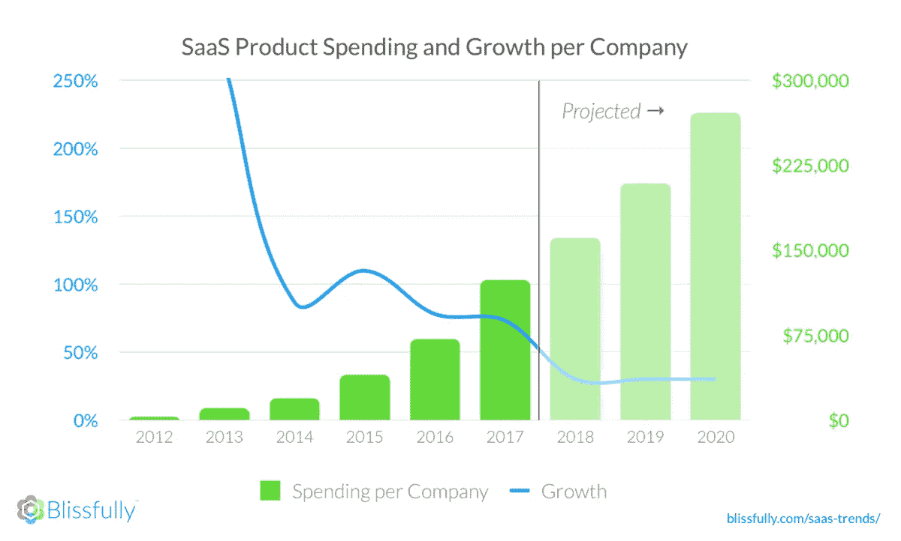
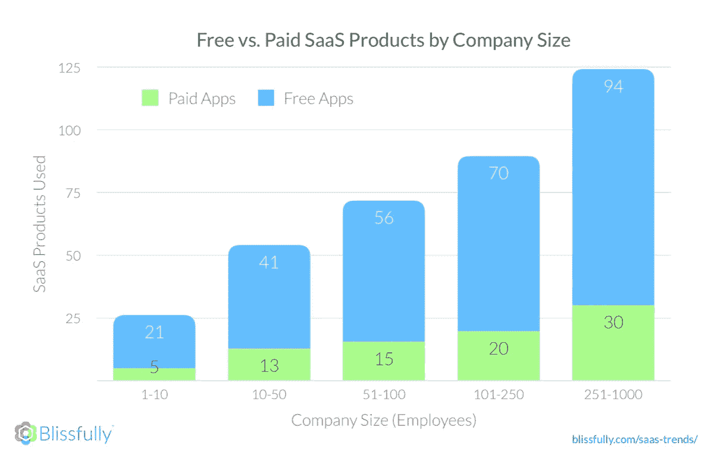
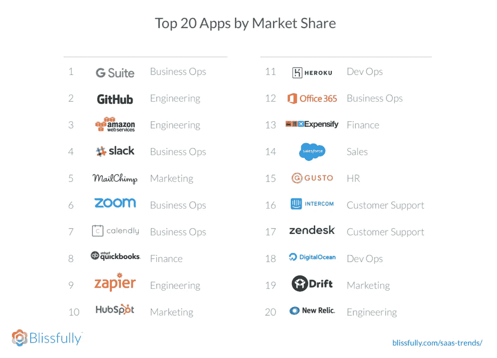

# SaaS 支出到 2020 年翻一番。你准备好了吗？

> 原文：<https://medium.com/hackernoon/saas-spending-to-double-by-2020-will-you-be-ready-efee5bfde314>

SaaS 的采用极大地改变了工作场所。我们使用的应用程序已经成为我们工作中最个人化的部分之一。这种趋势可能始于营销团队脱离 IT，做出他们自己的软件决策，但结果是每个团队都希望自由选择最适合他们的 SaaS 工具。虽然 SaaS 在过去十年中一直以疯狂的速度增长，但我们最新的分析预测，SaaS 的增长仍然是一艘火箭船。

作为一个 [SaaS 管理](https://www.blissfully.com/product-tour/saas-management/)平台，[愉快地](https://www.blissfully.com/)提供了整个组织内 SaaS 应用使用和支出的实时可见性。这为我们提供了一个关于 SaaS 扩散对各种规模的组织的影响的令人难以置信的视角，并且我们每个季度都分析了超过八年的数据，这些数据涵盖了各种规模的数百家公司的样本。在我们最新的报道中——[幸福地 Q1 2018 SaaS 趋势](https://www.blissfully.com/saas-trends/download-report/)——我们带来了三个令人难以置信的关键收获:

1.  (公司)规模不重要。每个人都喜欢 SaaS。😍
2.  免费应用比以往任何时候都更受欢迎。🙌
3.  SaaS 扩散正在加剧。如果你现在没有混乱，到 2020 年你可能会。👀

# 人人都爱 SaaS

SaaS 的增长不仅限于工程或营销等技术团队，每个团队都在构建 SaaS 堆栈。事实上，随着所有部门的个人承担起 SaaS 供应商选择和实施的责任，公司不得不重新思考 IT，以管理整个组织中这些不断增长的 SaaS 堆栈。虽然不同的部门以不同的速度增长，但它们都在疯狂增长。

公司规模似乎也无关紧要。拥有 15 名员工的公司和拥有 1000 名员工的公司的 SaaS 增长率大致相同。

# 到 2020 年，SaaS 的支出将翻一番

虽然每家公司的 SaaS 订阅数量预计将在未来两年内增长 95%，但中等规模的公司平均每月在 SaaS 订阅上花费 20，000 美元，自 Q1 2017 年以来每月增加 5，000 美元。根据我们的预测，各种规模的公司在 SaaS 的支出将增长更快，到 2020 年将增长 118%。

这种增长将给每家公司带来更大的压力，迫使它们制定 SaaS 管理战略。每个团队可能都知道哪些应用程序会提高他们的工作效率，但不是每个人都精通采用新应用程序带来的安全性、合规性、员工管理和成本问题。SaaS 公司在减少选择、实施和支持他们的应用程序的障碍方面已经变得令人难以置信的好——这使得将新 SaaS 带入公司比以往任何时候都更容易。

免费增值是许多 SaaS 公司采用的一种策略，以减少采用的关键障碍之一——预算。我们是免费增值的坚定信仰者，但我们惊讶地发现，平均而言，各种规模的公司使用的免费应用比付费应用多 3 倍。😱尽管对 B2B 的有效性存在争议，免费增值显然仍然是 SaaS 公司赢得用户的策略。随着时间的推移，最好的应用程序已经知道如何变得超级有粘性，并找到基于价值的升级路径。这不仅限于单个团队或职能部门。我们的趋势数据揭示了 SaaS 供应商的机会领域，涉及到公司在不同增长阶段最常采用的技术类型，以及哪些部门增长最快。

只要看看按市场份额排名的前 10 名 SaaS 供应商就知道了，前 10 名中有 7 家采用了免费增值模式，这显然是有效的。

对用户来说，好消息是 SaaS 的竞争没有放缓——自 2017 年 Q1 奥运会以来，SaaS 应用的数量增加了 42%。每个季度，新应用都在我们的排行榜上攀升，按市场份额、收入排名榜首，按增长率排名增长最快的应用。如果你的一天中有一项活动仍然是高度手工的，或者你在电子表格中跟踪——可能有一个 SaaS 提供商准备好了提供帮助。

## [获取完整报告，了解更多见解和更多前 20 名排行榜](https://www.blissfully.com/saas-trends/download-report/)

幸福 Q1 2018 年 SaaS 趋势报告包含了对 SaaS 供应商和使用 SaaS 技术的企业都有用的信息。立即下载完整报告，了解有关 SaaS 的更多信息，以及各种规模的公司都在使用哪些应用程序。

*原载于 2018 年 6 月 24 日*[*www.blissfully.com*](https://www.blissfully.com/blog/saas-spending-to-double-by-2020-will-you-be-ready/)*。*