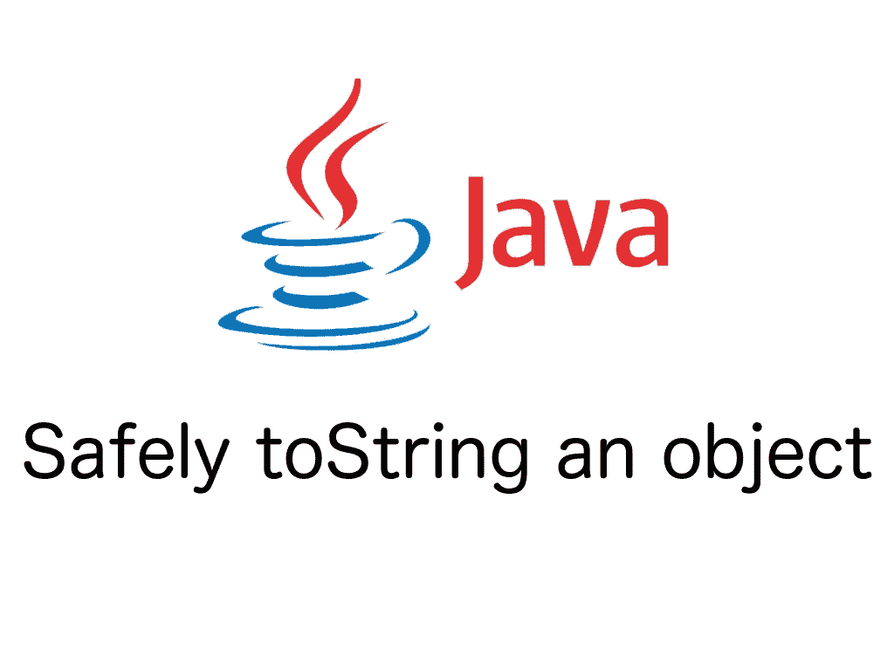

# 安全地转换 Java 对象的字符串

> 原文：<https://medium.com/hackernoon/safely-tostring-a-java-object-a3d6ea3c404>

## 避开 NPE



Safely toString a Java object

> 本文原帖[此处](http://www.dassiorleando.xyz/safely-tostring-a-java-object)。

# 概观

在这篇小文章中，我们将看到如何谨慎地获取对象的字符串表示(tostring ),这意味着避免 NullPointerException。

# 语境

获取一个 [Java](https://hackernoon.com/tagged/java) 对象的**字符串**表示是我们经常做的事情，用于日志记录、调试，或者仅仅是为了概览的目的。

对于空对象，我们将被定向到 NullPointerException，因为 toString 正在使用对象的字段。

在之前甚至没有检查 null 值的情况下，只需使用 **String.valueOf(object)** 方法，而不是直接使用 object.toString()。

下面是 IntelliJ 生成的 String.valueOf 的内容:

这里清楚地描述了空值是如何在 toString 之前捕获的。

这个函数还被包装成 Objects 实用函数，可通过:**Objects . tostring(Object o)**访问，可读性更好。

# 一个真实的例子

让我们假设您的应用程序逻辑使用两个具有某些属性的模型，其中一个依赖于另一个:

*   ObjectB: propB
*   对象 A: propA、对象 B1 和对象 B2

考虑到依赖项 objectB2 是可选的，在代码中的某个地方，您可能希望将 ObjectA 的每个属性(甚至是可选的属性)转换成字符串。

这里有一种不需要检查无效性的方法:

**ObjectB** 类:

**ObjectA** 类将 objectB2 作为可选属性:

下面的 **JUnit** 测试说明了我们现在如何得到 ObjectA 实例的[安全](https://hackernoon.com/tagged/safe)字符串表示:

我们在控制台中输出的 ObjectA 字符串是:

```
ObjectA{propA=’Fake propA’, objectB1=ObjectB{propB=’Fake propB’}, objectB2=null}
```

在这个[页面](http://www.dassiorleando.xyz/jdk-7-objects-class-check-nullity-throw-npe)上可以找到**对象**类的更多用法。

# 结论

总之，我们在这里已经看到了一种安全地用嵌入属性来字符串化一个对象的适当方法。

像往常一样，代码可以在 [GitHub repo](https://github.com/dassiorleando/jse) 中获得。

## 感谢你阅读这篇文章，如果你喜欢，请推荐并分享。
在[脸书](https://www.facebook.com/dassiorleando)、[推特](https://twitter.com/sajouguetdassi)、 [LinkedIn](https://www.linkedin.com/in/dassi-orleando-257b04ab/) 上关注我，并访问我的[博客](http://www.dassiorleando.xyz/)。

**干杯！**