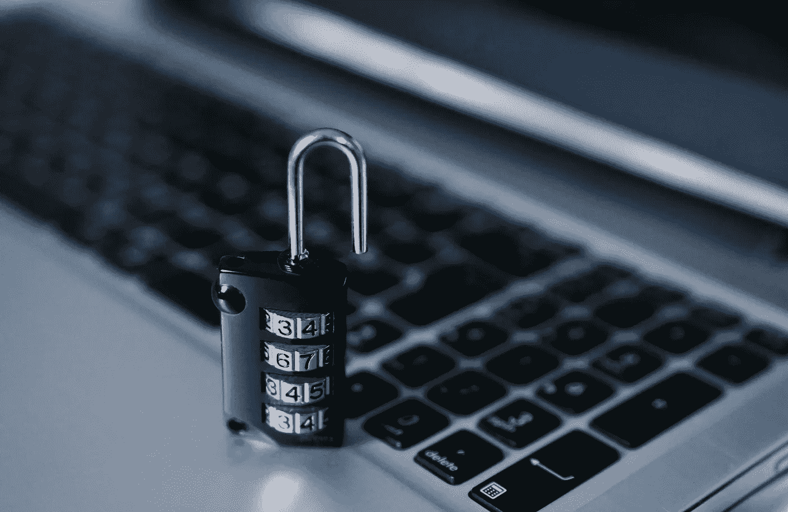
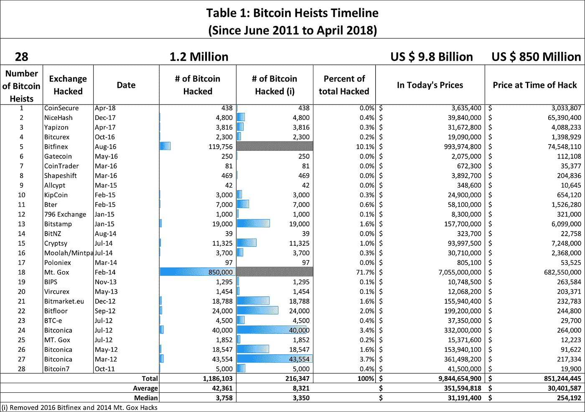
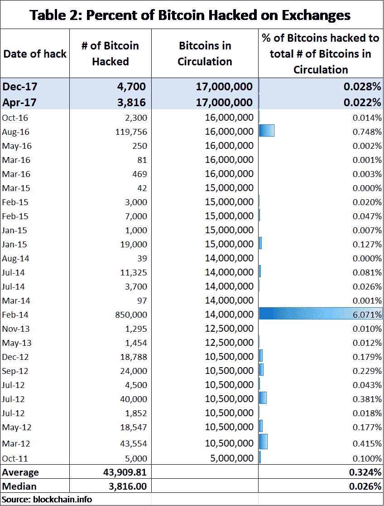
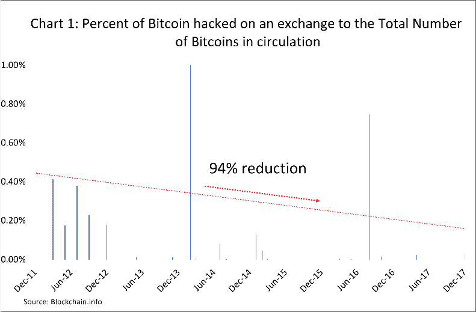

# 安全第一:浏览加密技术

> 原文：<https://medium.com/hackernoon/safety-first-navigating-through-the-crypto-anarchy-a560cea9a791>

canva.com

随着最近的黑客攻击，许多投资者心中的问题是:我的密码有多安全？虽然黑客攻击是所有加密货币的问题，但对于这份笔记，我们决定使用[比特币](https://hackernoon.com/tagged/bitcoin)作为黑客攻击概率的代理。购买加密货币不再是狂野的西部体验。然而，投资者仍然面临着大量的不稳定和风险。这些风险不仅与关于[加密货币](https://hackernoon.com/tagged/cryptocurrency)是否会继续存在的理论争论有关，还与一些黑客是否会窃取你的珍贵硬币有关。请记住，加密货币交易所没有得到联邦存款保险公司的保险，因此，与股票或债券不同，对于那些损失资金的投资者来说，没有任何保证。此外，美国证券交易委员会(sec)最近称加密交易所“[可能是非法的在线平台](https://www.sec.gov/news/public-statement/enforcement-tm-statement-potentially-unlawful-online-platforms-trading)”，因为这些交易所都没有在证券监管机构注册。

Source: Bitcoincharts.com, and DigiCor.io research

因此，投资者往往对投资加密货币犹豫不决，而且理由充分。自 2011 年以来，大约 28 个加密交易所遭到黑客攻击，导致近 120 万比特币被盗。这相当于黑客入侵时被盗的近 9 亿美元比特币，按当前汇率计算为 98 亿美元。这大约占所有现有比特币供应量的 0.7%。

# 黑客历史

比特币历史上最大的黑客攻击发生在 2014 年(见表 2 ),当时大约 850，000 枚比特币从现在臭名昭著的 Mt. Gox 交易所消失。自 2011 年以来，仅这一次黑客攻击就占了所有比特币黑客攻击的 70%以上(见表 2)。

如果你在 Mt. Gox 被成功黑客入侵时拥有比特币，你有 6%的几率失去你的比特币。事实是 Mt Gox 交易所黑客是一个异常值，在过去十年的任何一年中，你的比特币被盗或被黑客攻击的平均概率接近 0.3%(见表 2)。过去几年，你的比特币在交易所被黑的几率已经下降。在 21 世纪初，你的比特币被黑客攻击的平均几率是 0.4%。如今，这一数字接近 0.02%，表明在过去 7 年中提高了 93%(见图 1)。虽然黑客攻击成功的概率很低，但它不是零，对于许多投资者，尤其是那些投入大量资本的投资者来说，0.02%的概率仍然是不可接受的。接下来的问题是，如何尽可能降低被黑客攻击的几率？嗯，有一些受欢迎的选择，如多签名钱包和冷藏你的钱包。

# 钱包

在深入这个话题之前，理解密码世界中的“钱包”是有帮助的。钱包是一种追踪数字资产所有权的软件。钱包总是特定于硬币的，并且通常不具有交叉兼容性(例如，使用比特币钱包来存储以太坊)。这个软件最重要的组成部分是公钥和私钥。公钥允许网络“看到”每个钱包的所有权。私钥允许交易发生。事实上，私钥用于“签署”交易，从而证明所有权。钥匙非常重要，因为它们允许从钱包里取钱。数字资产交易所的账户，如 Poloniex 和 Bittrex，被认为是“热钱包”，因为这些公司在其基础设施和服务器中保存了您的信息，使您可以进行快速交易。如果黑客能够攻击 Poloniex，而你拥有他们的账户，那么黑客就有可能窃取你的硬币。幸运的是，由于多签名钱包的出现，热门钱包变得更加安全。

# 多重签名钱包

多签名钱包或多签名更像是一个需要多个私钥来进行交易的保险箱。例如，我们在 DigiCor 使用的主要服务提供商之一 BitGo 提供多签名钱包，并发行 3 种不同的密钥。一个密钥由 BitGo 持有，另一个密钥由用户持有，第三个密钥是备份，用户可以为自己保留或交给值得信任的人保管。要收回您的加密，您将需要 2 到 3 个密钥来操作，具体取决于您与 BitGo 的协议。因此，即使黑客能够进入你的电脑，从而得到你的私人密钥，他们也很难得到另外两个密钥。这使得 multi-sig 成为防止比特币落入潜在罪犯手中的一项重要进展。然而，multi-sig 并不是完全证明，正如用 [BitFinex](https://www.coindesk.com/bitcoin-bitfinex-hack-multi-sig/) 黑客所实现的那样。虽然还不清楚黑客是如何获得各种密钥的，但问题是，我还能做什么来保证我的密码安全呢？两个字:冷藏。

# 冷藏

冷藏钱包是保证密码安全的最有效的方法之一。这是因为它涉及离线存储你的比特币钱包密钥——也就是说，远离互联网接入、黑客和恶意软件。这可以通过多种方式实现，从简单地将您的私钥存储在一张纸上、硬件(如 USB)或第三方服务提供商处。每种冷藏方法都有不同的风险、麻烦和价格。例如，将您的私钥保存在锁在保险箱中的 USB 上意味着 USB 在运输过程中可能会被破坏或损坏。另一方面，纸钱包可能非常便宜(实际上是一张写有你的私人密钥信息的纸)，但也有风险，因为纸可能会被撕破、丢失、烧毁、被盗或以其他方式损坏。因此，那些大量投资的人可能会考虑让别人管理他们的冷藏钱包和访问资金所需的敏感密钥。例如，在 [DigiCor](http://www.digicor.io/) ，我们使用合格的托管人和 BitGo 安全技术来保护您的投资安全。尽管这一选项目前仅适用于合格的投资者，但对于那些具有长期投资眼光的投资者来说，这种保护加密货币的方法提供了最高级别的安全性。

喜欢你读的吗？ [**报名参加我们的快讯**](https://digicor.io/pages/newsletter) **！**

# 包裹

最终，随着加密货币的价值和受欢迎程度的增长，黑客们会想出新的创新方法来尝试窃取你的钱。尽管交易所正在减少黑客数量，但在交易所保留大量加密资产仍有风险。幸运的是，加密货币的安全性并不一定相互排斥，许多人选择使用多签名钱包和冷藏解决方案的组合来确保他们的比特币是安全的。然而，设置这一过程对于初学者来说可能是一项艰巨的任务，并且仍然不能保证您的硬币的安全，因为所有投资者都容易受到一般人为错误或对冷藏选项的依赖的影响。幸运的是，有服务提供商提供冷藏解决方案，但重要的是，你总是做自己的尽职调查，以确保他们会明智地处理你的投资。此外，冷存储少量密码可能既昂贵又麻烦，这使得这种方法对于大规模投资最为有效。

*原载于 2018 年 5 月 24 日*[*blog . digicor . io*](https://blog.digicor.io/how-to-keep-your-crypto-safe-in-the-wild-west-crypto-world/)*。*

***重要交底***

*本出版物包含从被认为是真实可信且备受推崇的来源获得的信息。转载材料经许可使用，并注明出处。我们已经尽了合理的努力来发布可靠的数据和信息，但作者不能对所有材料的有效性或其使用的后果承担责任。此处包含的某些信息可能已经过时，不再适用:信息来源在最初发布时被认为是可靠的，但不能保证。*

*本文包含的观点是作者的观点，但不一定是 DigiCor Asset Management 的观点。这些观点可能会在不通知的情况下发生变化。本出版物仅用于教育目的，不应被视为投资建议或对任何特定证券、策略或投资产品的推荐。*

*对特定数字资产的引用仅用于说明目的，并非旨在也不应被解释为购买或出售此类证券的建议。作者或 DigiCor Asset Management 可能拥有也可能不拥有或曾经拥有引用的数字资产，如果拥有此类数字资产，并不表示将继续持有此类数字资产。*

*本材料包含假设的插图，本材料的任何部分都不代表任何 DigiCor 资产管理产品或服务。此处包含的任何内容都不构成会计、法律、税务、证券或投资建议，也不构成关于任何投资的适当性的意见，也不构成任何类型的招揽。读者应该意识到所有的投资都有风险。*