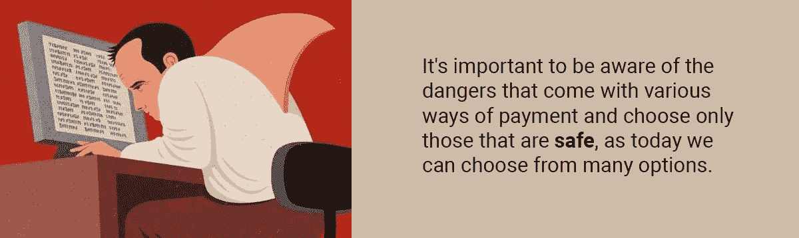

# 安全还是隐私？现在你可以两者兼得

> 原文：<https://medium.com/hackernoon/safety-or-privacy-now-you-can-have-both-afd9ce0f270e>

安全和隐私是人类的基本需求。我们能做些什么来比现在更安全？我们必须控制与第三方共享的数据量。使用支付方式，我们基本上在安全和隐私之间选择:现金给我们更多的隐私，但安全性更低，因为我们把它放在口袋里，信用卡在这方面更安全，但它们需要在购买期间将我们的支付信息发送到许多地方。很难选择，不是吗？

这并不意味着我们应该害怕使用一个或另一个。相反，为了保证资金和数据的安全，我们应该知道所有的细微差别。今天，我们有许多选择:现金、信用卡/借记卡、移动支付和加密支付。让我们来看看每种方法的优缺点。

# 现金和信用卡完全不安全

**现金。**超过[每年发生 40 万起抢劫](http://www.globalsecurityexperts.com/home-security-2/crime-prevention-advice/robbery-statistics-and-tips.html)，其中大约 90%发生在人口密集的大城市地区。其他抢劫发生在较小的城市和人口较少的地区。在世界上许多国家，口袋里揣着现金到处走是不安全的；那样的人很容易成为目标。

有了现金，一个人很容易被抢劫——对劫匪来说没有任何障碍，毕竟，他们可以拿到纸币就跑。这不仅仅是为了钱[——统计数据](https://www.nytimes.com/1984/12/11/science/don-t-resist-robbery-chicago-study-warns.html)显示，许多抢劫导致受害者死亡，当劫匪遇到受害者的任何抵抗时，这种结果的几率甚至更高。

信用卡使它的拥有者成为一个不那么有趣的目标——为了得到某人的钱，一个强盗必须获得实体卡，例如强行拿走它，并且必须知道密码才能取钱。当一个抢劫犯在去自动取款机的路上时，受害者可以联系银行并封锁卡。受害者不太可能和劫匪一起去银行取钱，因为每台 ATM 机附近都有很多摄像头。但是信用卡也有一个问题:通过获得额外的资金保护，你失去了你的隐私。

任何人都可以查看你的信用记录，并立即获得他们想要了解的关于你的所有信息。此外，银行的任何人都可以看到你在何时何地买了什么东西；它将永远记录在您的帐户历史中。这种跟踪是没有办法防御的。如果这些信息泄露到任何地方，任何欺诈者都会发现:

*   你的姓名和地址。通常是你的真实地址
*   你有多富有，你的存款余额，以及你最后一次购物
*   你的银行和账号

因此，任何人都可以看到你的账户里有多少钱，你住在哪里。这可能不是你想和所有人分享的信息。即使你银行的员工对使用这些信息不感兴趣，这些数据也可以卖给需要的人。目前还不知道 2014 年巴克莱银行发生了多大规模的[泄露](https://www.esecurityplanet.com/network-security/barclays-bank-breach-exposes-27000-customers-personal-data.html)，但是关于其 27000 名客户的数据后来在黑市上被出售。我们还可以记得 2016 年的[黑客事件，当时土耳其集团 Bozkurtlar 攻破了六家银行的安全系统，并将他们在网上找到的所有数据都公布了出来，包括超过 100 万名客户的数据，其中一些甚至包括账户余额。所有这一切都可能再次发生——一切都是可破解的。](https://news.softpedia.com/news/six-more-banks-supposedly-hacked-by-turkish-hackers-504069.shtml)

未来防止这种结果的唯一方法是没有信用卡或银行账户，这在当今几乎是不可能的。

# 更好的东西——移动支付

更高级的选择是**移动支付**。这是一个广义的术语，指使用任何设备的任何支付，如 Apple Pay 等虚拟[智能手机钱包](https://en.wikipedia.org/wiki/Digital_wallet)，或移动电子商务支付，也可分为应用内支付和移动网络浏览器支付。一般来说，就安全性而言，它比其他支付方式更安全，但它也有与信用卡相同的缺陷，这意味着在某些时候有人仍然可以访问您的信息。

如果你在零售店的 PoS 终端使用数字钱包，你永远不会将你的银行信息暴露给任何人，因为你的手机上甚至没有这些信息。在交易过程中，钱包创建一个包含所有必要信息的[令牌](https://www.techopedia.com/definition/4140/token)，并将其交给商家。你的手机上只有你的数字钱包账户信息；即使有人设法解密，他们也不会得到任何有价值的东西，甚至是你的名字。此外，丢失你的手机是很难的——一个普通人每天检查它 [110 次](http://www.dailymail.co.uk/sciencetech/article-2449632/How-check-phone-The-average-person-does-110-times-DAY-6-seconds-evening.html)，所以你不必担心它会落入坏人之手。

由于我们今天拥有先进的加密方法，应用内和移动网络浏览器支付对您的资金来说可能更加安全，例如

*   [双因素认证](https://en.wikipedia.org/wiki/Multi-factor_authentication) —你的银行向你发送一条短信或带有代码的推送通知，以确保批准交易的确实是你。
*   支付网关 —授权在线卡支付的验证器。该过程类似于零售店中的 PoS 授权。最受欢迎的是 [PayPal](https://www.paypal.com/) 和[支付快递](https://www.paymentexpress.com/)。

然而，这些工具对你的隐私来说并不是完全安全的，因为最终，它将被存储在你的银行历史中，就像其他所有的卡支付一样，虽然没有人可以在商家端破解它，但银行的任何人仍然可以检查它。此外，这些处理器有时会出现大数据泄露，如 TIO Networks 的安全漏洞，当时其 160 万客户的个人数据被盗。

**许多人仍然认为移动支付不安全**——ISACA 的一项[调查](https://www.isaca.org/Pages/mobile-payment-security-study.aspx?cid=pr_1110000&appeal=pr)显示，在 900 名网络安全专家中，只有 23%的人认为这些支付是安全的。但是有什么办法让它们更安全呢？当然啦！只需将区块链和加密支付加入其中。

# 加密货币是解决方案

转向加密货币支付有利于那些关心安全的人。加密货币没有现金和信用卡的缺陷:

*   这是一种人对人的付款，他们之间没有任何中间人
*   唯一需要支付的是公共地址，任何人都可以为自己创建几乎无限数量的地址
*   没有人存储可能与钱包主人有关的信息
*   如果一个人只使用装有少量钱的[热钱包](https://en.bitcoin.it/wiki/Hot_wallet)，没人知道他或她有多少钱
*   只有钱包的主人可以使用他们的资金，因为每个地址都有一个私钥，不可能被[破解](https://www.weusecoins.com/amazing-math-bitcoin-private-keys/)或被[暴力破解](http://i.imgur.com/hrf9AxS.jpg)

进行交易时，需要钱包主人的批准。这可以在不损害所有者的情况下完成，例如，通过使用像 [Ledger Nano S](https://www.ledger.com/products/ledger-nano-s) 和 [Trezor](https://trezor.io/) 这样的硬件钱包。[硬件钱包](https://en.bitcoin.it/wiki/Hardware_wallet)不能被篡改，因为它们有 2FA，私钥从不离开钱包。

没有第三方参与，因为矿工批准网络上的所有交易，并获得报酬。不再向银行请求:所有的加密交易都是通过“推送”方式完成的:是你向另一个地址发起支付。

也有私人加密货币，像 [Monero](https://getmonero.org/) 和 [Zcash](https://z.cash/) ，允许完全匿名，还有各种工具可以帮助你保持身份安全，甚至与其他加密货币相比:链上的交易无法被跟踪。如果你的初始地址是已知的，无论你是寄钱还是收款，都是匿名的——没有暴露你自己和显示你是谁、你有多少钱以及你住在哪里的危险。

# 每个人的安全

许多公司可能会从转向加密支付和区块链中受益，尤其是那些关注安全的公司。PinkTaxi 是区块链的一家初创公司，其使命是在乘坐出租车时为女性提供额外的安全保障。他们只雇佣女性，而且只有女性可以使用这项服务。

妇女经常成为出租车司机的受害者。Javier Miglino 是一名律师，也是非政府组织 Defendamos Buenos Aires 的创始人，[说](https://www.forbes.com/sites/melissarowley/2018/03/07/how-this-entrepreneur-is-countering-sexual-assault-in-argentina-one-taxi-ride-at-a-time/#5011b87c3e9e) 平均来说，99%的性侵案件都是出租车司机所为。这就是 PinkTaxi 解决的问题，区块链提供了帮助，让司机和乘客都受益:

*   通过接受加密交易，它允许**乘客**保留他们的隐私，因此个人信息不会被发送到公司。另一方面，它允许在区块链上跟踪所有的乘坐，允许透明和不变性。路线记录在区块链上，不能更改。
*   这个建立在区块链上并允许使用密码的平台不仅让乘客受益，也让**司机**受益。一旦旅程结束，并确认一切顺利，司机会通过智能合约自动收到她的付款。

少骚扰，少抢劫，少危险。这是加密支付的一个真实用例。

虽然这种支付方式可能仍然不受欢迎，但它们有着光明的未来。正如你所看到的统计数据，P2P 支付有增长的趋势，千禧一代可能会继续使用替代支付系统。总部位于区块链的支付解决方案通过消除高额费用并同时保持透明度和安全性而胜出。没有人会拿走你的钱，除非你自己送去。那么，crypto 会获得支付市场的份额吗？答案是:肯定！

## 关于作者:

[基里尔·希洛夫](http://twitter.com/kirills4ilov)——geek forge . io 和 Howtotoken.com 的创始人。采访全球 10，000 名顶尖专家，他们揭示了通往技术奇点的道路上最大的问题。加入我的**# 10k QA challenge:**[geek forge 公式](https://formula.geekforge.io/)。