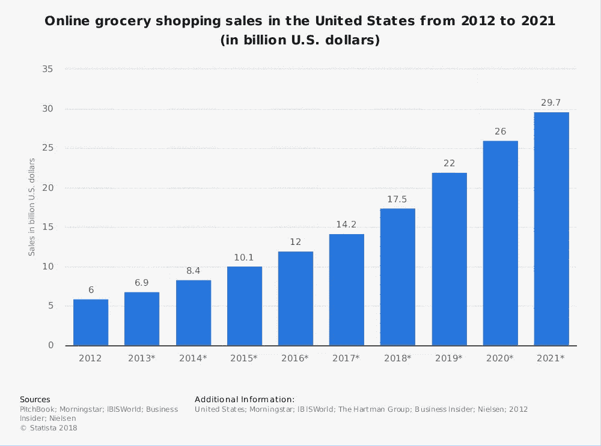

# 当天送达，今天送到你附近的地方。

> 原文：<https://medium.com/hackernoon/same-day-deliveries-coming-to-a-place-near-you-today-ab429d3448a9>

# 人工智能和区块链将如何改变我们接收商品的方式。

在过去的几周里，美国最大的公司沃尔玛宣布，它正计划将其当天送货服务扩展到美国 100 多个不同的城市。目前仅在 6 个市场可用，他们的目标是在今年年底前将他们的服务提供给超过 40%的美国家庭。

他们试图与当天送达巨头亚马逊竞争，但他们并不孤单，因为越来越多的公司开始在各种产品和商品上提供这种曾经优质的服务。

这很有道理。

对这种服务的需求越来越大。2017 年，美国在线杂货销售额总计约 142 亿美元，预计到 2021 年，这一数字将升至近 300 亿美元。

但推动当天送达市场的不仅仅是杂货店购物。美国一家全国性快递服务机构 Dropoff 今年 2 月对 995 人进行的一项调查发现，47%的人在过去 12 个月中为任何商品的更快交付时间支付了额外费用。50%的人表示，如果当天送货成为常态，他们会更倾向于在网上购物，74%的人表示，他们更有可能再次光顾提供当天服务的在线商店。

那么，在需求明显存在的情况下，市场将如何调整以满足需求呢？

经典的“中枢辐射”模式在全球或远距离配送方面有其优势，但它不是为管理当天送达服务而设计的。它通常能做到的最好的是“第二天”，对于同城交付，包裹通常会通过“枢纽”走低效的路线到达目的地。

一些公司已经看到了市场的缺口，并开始扮演中间人的角色，收取促进交货的佣金。但是这个系统也有它的缺陷，今年早些时候，点对点运输平台 [VOLT](https://volttech.io) 的首席执行官菲利普·李告诉 [IrishTechNews](https://irishtechnews.ie/how-volt-are-using-blockchain-for-the-last-mile-delivery-philip-lee-dubai-bii-march-19th/) 。“信使和顾客并不总是(正确地)匹配，因此 Volt 的员工不得不(自己)管理订单。”

所以为了解决这个问题，[伏特](https://volttech.io)想出了另一个办法。

他们开发了一个基于区块链的点对点(P2P)去中心化平台，通过直接连接信使和寄件人，省去中间人和他们的佣金。使用人工智能来简化过程，将发送者与正确的信使匹配，将提高交付的效率。由于平台的去中心化特性，这项服务将完全透明，让各方都能安全地追踪费用和支出。

这种方法将降低客户的费用，为信使提供更多利润，并且由于更有效的递送系统，还将减少排放。

随着当天送达市场的持续增长，越来越多的公司和 indivudals 将寻求利用像 [VOLT](https://volttech.io) 这样的服务。小企业尤其会寻找一种方式来与大企业竞争，随着技术继续朝着越来越分散的未来发展，更多像 VOLT 这样的公司将加入进来，提供一种更智能、更便宜、更有效的替代方式来替代当前的做事方式。

来源:

[https://irishtechnews . ie/how-volt-are-use-区块链最后一英里配送-Philip-lee-Dubai-bii-March-19/](https://irishtechnews.ie/how-volt-are-using-blockchain-for-the-last-mile-delivery-philip-lee-dubai-bii-march-19th/)

[https://www . twice . com/retailing/ship-it-fast-and-they-will-spend](https://www.twice.com/retailing/ship-it-fast-and-they-will-spend)

[https://medium.com/volt-technology](https://medium.com/volt-technology)