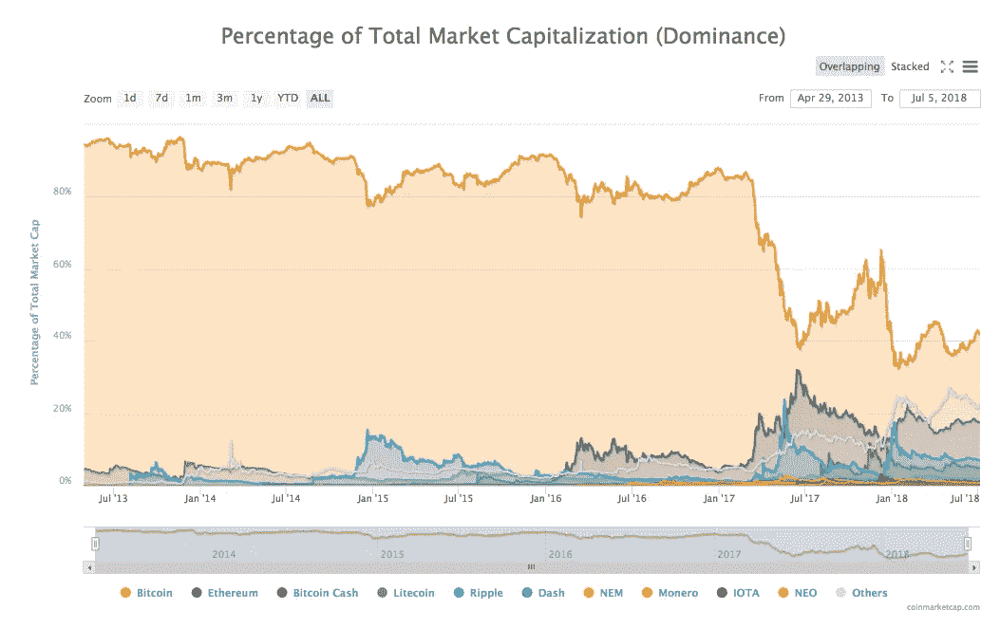

# 比特币市场份额的比特币优势图表的样本数据。

> 原文：<https://medium.com/hackernoon/sample-data-from-bitcoin-dominance-chart-on-coin-market-cap-9f3f3f0f7afe>

Bitcoin dominance chart

coin market cap([coin market cap](https://medium.com/u/61618ab68590?source=post_page-----9f3f3f0f7afe--------------------------------))有一些全球图表，可以帮助你深入了解整个加密货币市场。你可以在 https://coinmarketcap.com/charts/的[上找到它们。我对优势图表特别感兴趣，因为我试图分析比特币和替代比特币的优势如何影响市场，以及它在过去一年的重要日期中扮演了什么角色。](https://coinmarketcap.com/charts/)

最近，当我试图从上面的图表中为一篇关于“比特币的统治地位和其他人的崛起”的文章做采样时，https://medium . com/@ gokulnk/bit coin-Dominance-and-the-emerging-of-Others-64a 7996272 ad 花了很多时间来获取数据，这真的很令人恼火。我不得不将鼠标移到图表上，手动将数据复制到我正在写的文章中。我用的是 MAC 分屏，在分屏之间切换焦点并不容易。这只会增加挫败感。知道怎么做就评论一下。

所以我开始编写一个小脚本来获取数据。虽然这个脚本比我预期的时间长了一点，但是我想每当我想做采样的时候，我会节省很多时间。我正在发布这个脚本，这样其他人也可以使用它。

你可以检查要点

访问页面[https://coinmarketcap.com/charts/](https://coinmarketcap.com/charts/)并将以下代码复制粘贴到控制台中，以获取相关数据。你也可以编辑`coinsForDominance`和`datesForDominance`变量来获得你需要的数据。

如果对你有帮助，请告诉我。