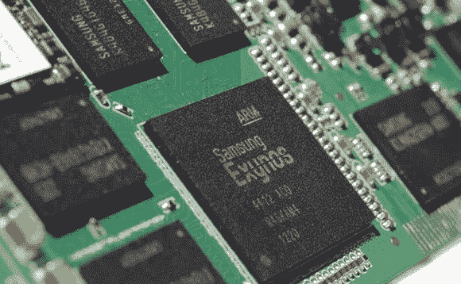

# 三星将加入加密货币热潮

> 原文：<https://medium.com/hackernoon/samsung-to-join-the-cryptocurrency-craze-3b56ecb6163c>

随着三星宣布将加入矿业游戏，著名的矿业集团比特大陆和迦南创意公司将有机会大展拳脚。昨天，三星证实将开始制造 ASIC(专用集成芯片)芯片，用于加密货币开采专用设备。这些将用于运行网络上的挖掘节点，这些节点在许多众所周知的加密货币背后运行区块链。
“三星的代工业务目前从事加密货币挖矿芯片的制造。但是，我们无法透露关于我们客户的更多细节。”引用了公司发言人的话。
比特大陆和迦南创意公司生产采矿设备，并与 TSMC 合作。TSMC 将是三星的直接竞争对手。如果三星决定自己制造矿工或引入新的合作伙伴，那么这可能会打破比特大陆在矿工市场的垄断地位。
此前，韩国媒体报道称，三星与一家未透露姓名的中国分销合作伙伴进行了合作。
三星已经看到其参与销售的大部分显卡主要用于采矿目的。这将显示对 ASIC 芯片的巨大需求，从而解释韩国科技巨头的这一不同寻常的历程。三星在与其手机和电视相关的技术领域占据了大部分销售份额，并且刚刚超过英特尔成为世界上最大的芯片制造商。如果这个项目被证明是成功的，那么这可能会巩固该公司在硅谷的股份。
此外，这可以缓解目前 GPU 面临的压力，降低它们的价格以及 ASIC 矿商的价格。
Joshua 从 2013 年开始投资和交易 a 的法定货币。他最近进入了加密领域，将投资组合扩展到长期硬币投资、ico 和日内交易。