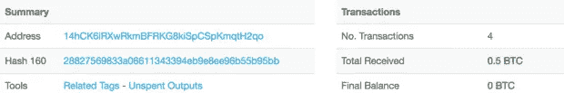

# 撒旦勒索软件催生新的传播方式

> 原文：<https://medium.com/hackernoon/satan-ransomware-spawns-new-methods-to-spread-4136647145e>

今天，我们分享一个例子，说明以前已知的恶意软件如何不断演变，并添加新技术来感染更多的系统。

[bleeding computer](https://www.bleepingcomputer.com/news/security/new-satan-ransomware-available-through-a-ransomware-as-a-service-/)2017 年 1 月首次报道撒旦勒索软件。最近，撒旦勒索软件被发现利用永恒之蓝漏洞在受损环境中传播([巴特布雷兹的博客](https://bartblaze.blogspot.com.es/2018/04/satan-ransomware-adds-eternalblue.html))。这与以前的 WannaCry 勒索软件活动有关。虽然微软在 2017 年 3 月修补了与 EternalBlue 相关的漏洞，但许多环境仍然容易受到攻击。

不同寻常的是，我们发现了撒旦勒索软件的样本，不仅包括 EternalBlue，还包括一组更大的传播方法:

这种撒旦变种试图通过以下方式传播:

*   JBoss CVE-2017–12149
*   WebLogic CVE-2017–10271
*   永恒蓝色漏洞 CVE-2017–0143
*   Tomcat web 应用程序暴力强制

# 恶意软件分析

下面是 2018 年 5 月初撒旦勒索软件使用前面提到的所有技术的样本，我们将对其进行分析。

姓名:sts.exe

文件大小:1.7 兆字节

MD5:[c 290 CD 24892905 fbcf 3c b 39929 de 19 a 5](https://www.virustotal.com/#/file/3e3f8570c11dff0b5a0e061eae6bdd66cf9fa01d815658a0589d98873500358d)

我们在分析样本中看到的第一件事是恶意软件是用 MPRESS 打包程序打包的:

该示例的主要目标是丢弃撒旦勒索软件，加密受害者的主机，然后请求比特币支付。之后，该示例还将尝试使用诸如 EternalBlue 之类的漏洞在网络中传播。

# 永恒的蓝色

恶意软件会在受害者的主机中放入几个永久蓝色文件。这些文件是漏洞利用的公开版本，没有任何修改或自定义实现。所有文件都放在受感染系统的 C:\Users\All Users\文件夹中:

Sts.exe 通过扫描同一网段内的所有系统来启动跨网络传播的过程。通过以下命令行，易受 SMB EternalBlue 漏洞攻击的系统将执行之前丢弃的库 down64.dll。

down64.dll 试图在目标的内存中加载代码，然后使用合法的微软 certutil.exe 工具下载 sts.exe。这是一种已知的下载技术，在米特 ATT & CK 被描述为[远程文件复制— T1105](https://attack.mitre.org/wiki/Technique/T1105) 。

# 如此多的功绩…

该示例使用一些其他网络活动继续在网络中传播。

受到危害的系统将向/Clist1.jsp 发出 HTTP PUT 请求，以执行 jsp 文件，从而在目标服务器上下载另一个 sts.exe 示例。

另一种用来感染其他系统的有趣技术是识别 Apache Tomcat 服务器并对其实施暴力的能力。它向/manager/html 发出一个 HTTP GET 请求，如果响应是“401 未授权”，它就开始使用最常用的用户名和密码列表来强制访问该文件:

# 加密

在感染了同一个网络中的其他系统后，该样本最终将撒旦勒索病毒放入 C:\Satan.exe 文件中。这个可执行文件也作为原始示例打包在 MPRESS 中。

执行 Satan.exe 会启动勒索软件攻击，首先会停止以下进程:

Satan.exe 在“C:\Windows\Temp\KSession”中创建了一个名为 KSession 的文件，并在其中存储了一个主机标识符。

加密文件用【satan_pro@mail.ru】重命名。<original_filename>。撒旦文件名。然后，该进程开始向命令和控制服务器发送数据，使用 KSession 文件中存储的参数值发出 GET 请求。</original_filename>

GET /data/token.php？status = ST & code = xxxxxxxxxxxxxxxxxxxxxxxxxxxx HTTP/1.1 连接:保持活动状态

用户代理:Winnet 客户端

主持人:45.124.132.119

加密后，Satan.exe 在 C:\_How_to_decrypt_files.txt 中创建一个带有说明的便笺，然后执行记事本打开该便笺。

该说明包含系统解密说明和联系电子邮件地址:satan_pro@mail[。]ru，请求比特币付款，如下面的笔记示例所示:

追踪之前提到的比特币钱包:

14 hck 6 irxwrkmbfrk G8 kisppckmqth 2 qo，至今只收到极少数款项，最近一次付款是在 2018 年 5 月 12 日。在撰写本文时，它的余额为 0.5 BTC，价值约为 3600 美元。

# 结论

这是一个令人担忧的趋势，勒索软件不会消失，它正在适应包括最近和不同的利用/技术，以更创新和成功的方式传播。

# 用 AlienVault USM 检测撒旦勒索软件

因为像撒旦勒索软件这样的威胁不断以新的方法发展，所以您的检测[工具](https://hackernoon.com/tagged/tools)始终拥有最新的威胁情报至关重要。AlienVault USM 不断收到来自 AlienVault 实验室[安全](https://hackernoon.com/tagged/security)研究团队和 OTX 的威胁情报更新。通过使用多种内置安全功能，AlienVault USM 可以检测到许多变化不太频繁的常见恶意软件行为。用于传播 Satan 勒索软件的技术将在 AlienVault USM 中触发以下警报:

*   系统危害—可疑行为—危害的 OTX 指标
*   交付和攻击—可疑行为—Certutil.exe 曾经下载过一个文件
*   交付和攻击—漏洞扫描— JBoss 扫描
*   系统受损-可疑行为-从 Oracle WebLogic 进程执行的命令

以及以下网络活动:

*   WebLogic XML decoder RCE(CVE-2017–10271)-漏洞利用-代码执行
*   Tomcat 服务器—环境感知—默认凭证
*   可能的永恒之蓝漏洞 M3 MS17–010—漏洞—代码执行—永恒之蓝
*   撒旦勒索软件—系统妥协—勒索软件感染

# 用 OTX 端点威胁猎人检测撒旦勒索软件

您可以使用 [OTX 端点威胁猎人](https://otx.alienvault.com/endpoint-threat-hunter/welcome)免费搜寻恶意软件和其他威胁。这项免费服务使用 OTX 目录中的危害指示器(IOCs ),使您能够扫描终端上的威胁。OTX 端点威胁猎人通过以下方式检测撒旦:

*   基于文件和网络的指标(如下，并在 [OTX](https://otx.alienvault.com/pulse/5ae76e6a0009fd0d0acea525)
*   漏洞利用的一般检测。

# 检测—危害的指示器

文件哈希:

3 e3f 8570 c 11 dff 0 b5 a0e 061 aee 6 BDD 66 cf 9 fa 01d 815658 a 0589d 98873500358d

15 ffbb 8d 382 CD 2 ff 7 b 0 BD 4c 87 a 7c 0 bffd 1541 C2 Fe 86865 af 445123 BC 0 b 770d 13

b 556 b5 c 077 e 38 dcb 65d 21 a 707 c 19618d 02 E0 a 65 ff 3 f 9887323728 EC 078660 cc 3

15292172 a 83 F2 e 7 f 07114693 ab 92753 ed 32311 DFB a7 d 54 Fe 36 cc 7229136874d 9

0439628816 cabe 113315751 e 7113 a9e 9 f 720 D7 e 499 ffdd 78 acba C1 ed 8 ba 35887

93027 b 47 ef 0 b 6 f 7d 933017320951 bbbeef 792 A8 f1 BC 43 B3 Fe 96 C2 b 61 f1 DC 2636

CDE 45 f 7 ff 05 f 52 b 7215 E4 b 0 ea 1 F2 f 42 ad 9b 42031 e 16 a3 be 9772 aa 09 e 014 BAC db

85b 936960 FBE 5100 c 170 b 777 e 1647 ce 9 f 0 f 01 E3 ab 9742 DFC 23 f 37 CB 0825 b 30 b 5

ca 63 dbb 99d 9 da 431 BF 23 ACA 80 DC 787 df 67 bb 01104 FB 9358 a 7813 ed 2 FCE 479362

db 0831 e 19 a4 E3 a 736 ea 7498 dadc 2d 6702342 f 75 FD 8 f 7 fbae 1894 ee 2e 9738 C2 b 4

aa 8 ADF 96 fc 5a 7 e 249 a6 a 487 faaf 0ed 3 e 00 c 40259 fdae 11d 4 caf 47 a 24 a9 d 3 aaed

be 8 EB 97d 8171 b 8 c 91 c 6 BC 420346 f 7 a6 D2 D2 f 76809 a 667 ade 03 c 990 feffadaad 5

0259d 41720 f 7084716 a3 B2 bb 34 AC 6d 3021224420 f 81 a4 e 839 b 0 b 3401 e 5 ef 29 f

50f 329 e 034 db 96 ba 254328 cd1e 0f 588 af 6126 c 341 ed 92 ddf 4 aeb 96 BC 76835937

aceb 27720115 a 63 b 9d 47 e 737 FD 878 a 615 c 52435 ea 4 EC 86 ba 8e 58 e 744 BC 85 C4 f 3

cf 25 BDC 6711 a 72713d 80 a4a 860 df 724 a 79042 be 210930 dcb fc 522 da 72 b 39 bb 12

b 7d 8 FCC 3 FB 533 e5e 0069 e 00 BC 5a 68551479 e54a 990 bb 1b 658 E1 BD 092 c 0507d 68

b2a 3172 a 1d 676 f 00 a 62 df 376d 8da 805714553 bb 3221 a 8426 f 9823 A8 a 5887 daaa

f0df 80978 B3 a 563077 def 7 ba 919 e2f 49 e 5883d 24176 e6b 3371 A8 eef 1 EFE 2 b 06 a

5 f 30 aa 2 Fe 338191 b 972705412 b 8043 b 0a 134 CDB 287d 754771 fc 225 f 2309 e 82 ee

cf 12 ECA 0e 10 DC 3370d 7917 e 7678 DC 09629240d 3 e 7 cc 71 C5 AC 0 df 68576 bea 0682

# IP 地址:

45.124.132.119

# URI 路径:

/invoker/只读

/orders.xhtml

/Clist1.jsp

/管理器/html

/wls-wsat/CoordinatorPortType