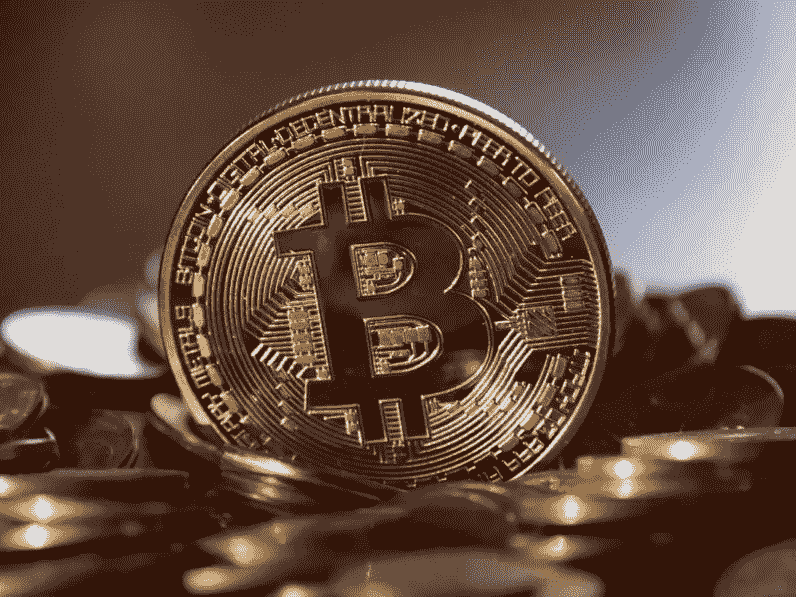

# 中本聪是世界上最富有的 50 个人之一

> 原文：<https://medium.com/hackernoon/satoshi-nakamoto-is-one-of-the-50-richest-people-in-the-world-45c5d036c3ab>

当比特币昨天达到 19，771 美元的高点时，它的发明者成为了这个星球上第 44 位最富有的人——如果你去看看[福布斯的榜单](https://www.forbes.com/billionaires/list/#version:static)，注意到[石英](https://qz.com/1159188/bitcoin-price-approaches-20000-making-satoshi-nakamoto-worth-19-4-billion/)。问题？即使在它推出八年后，我们仍然不知道那是谁。

在过去的几年里，许多人都被怀疑是发明者，他的笔名是中本聪。名单包括密码学学生迈克尔·克利尔、芬兰游戏开发商维利·莱顿维尔塔，甚至还有《快速公司》确定的三人组。

世界上可能最接近揭露中本聪的事件要追溯到 2015 年 12 月，当时澳大利亚警方在悉尼搜查了商人克雷格·史蒂夫·赖特的家。

《连线》和 Gizmodo 通过大量电子邮件、博客帖子和泄露的法律采访记录确认了赖特的身份。莱特当时没有证实，但后来他声称自己确实是全世界都在寻找的中本聪。他随后未能证明自己是比特币的创造者，因为他无法用密码签署加密货币发展过程中产生的第一块数据(真正的 Satoshi 能够做到)。

在寻找比特币的真正发明者的过程中，我们又回到了起点。无论他们是谁，Quartz 指出，他们的估计财富为 98 万 BTC，价值 194 亿美元，高于亿万富翁沙特投资者阿尔瓦利德·本·塔拉勒王子，低于苹果联合创始人史蒂夫·乔布斯的遗孀劳伦娜·鲍威尔·乔布斯。

当然，由于比特币如此不稳定，在撰写本文时，该货币的价值已降至 18981 美元，使 Satoshi 的净资产降至 186 亿美元。这仍然是一个相当大的数目，它使他们保持在前 50 名的名单上，仅比沙特王子低一位，比俄罗斯天然气和化学亿万富翁列昂尼德·米赫尔松领先一位。现在是套现的好时机吗？

*这个故事是 Abhimanyu Ghoshal 写的，最初发表在* [*下期网*](https://thenextweb.com/hardfork/2017/12/18/whoever-created-bitcoin-is-now-among-the-worlds-50-richest-people/) *。*