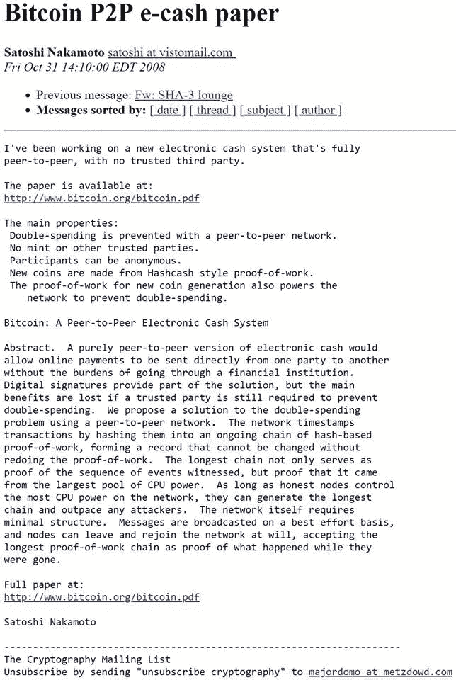

# 中本聪十年前发布了比特币——为什么它很重要

> 原文：<https://medium.com/hackernoon/satoshi-nakamoto-released-bitcoin-ten-years-ago-why-it-was-important-9fbec43fe5ca>

## 10 年前的今天，中本聪向一个密码朋克加密邮件列表宣布了一个叫做“比特币”的新事物对于密码领域的人来说，这一点的重要性不言而喻，但十年后，世界上大多数人仍在努力理解这意味着什么。事实上，即使是那些“知情人士”也仍然对这一点的重要性有不同的看法，所以我将与你分享一个人的观点:中本聪的声明对我来说意味着什么。

Satoshi 是一个匿名的人或一群人，存在于互联网的最深处。他们利用互联网使*成为一种机制，可以在没有所有者或控制者的情况下可靠地跟踪公共时间和数字。当你考虑到以前制造的每一个时钟或计算系统都由某个地方的个人或公司拥有和控制时，Satoshi 使这些我们在历史上都知道的数学和时间概念变得可靠和可用，而无需可识别的跟踪器。这在人类历史上是前所未有的。*

如果你问我关于比特币的问题，我会告诉你，它很粗糙，考虑不周，是由一个不懂基本政治或经济的人发明的。我要告诉你的是，自从这项发明问世以来，它就被一群骗子和自私自利的个人(可能包括我自己)所利用，让他们变得比他们真正应得的更富有。我会告诉你不要把你的钱放进去。但这是题外话。

Satoshi 为这些不依赖他人的普通必需品创造了蓝图。当你认为依赖是自由的对立面时，Satoshi 代表了一个更自由的社会，在这个社会中，任何人都可以独立地履行他们生活中一些最重要的职能，就像他们呼吸空气一样自然，或者像地球上的重力一样自然。不需要依赖银行家、会计师、政府或其他许多你习惯花大价钱购买的东西。Satoshi 使时间和金钱可以在任何一个有网络连接的人之间共享，而不需要付钱给其他人。

一个人(或一群人)发明了如此深奥的东西，然后消失在太空中，这是一件神奇的事情。就好像上帝亲自来告诉我们一个新的物理定律。我们现在可以享受我们生活中最重要的两个方面，这两个方面以前只能由其他人提供——通常是以很高的个人成本。那些控制时间的人和那些控制金钱的人总是在这场激烈的竞争中脱颖而出，但突然之间，规则可能发生了变化，你再也无法操纵他们获胜了。

我不认为比特币会存活下来。从长远来看，它在经济上和实践上都有太多的缺陷和粗糙之处。许多最有影响力的比特币核心社区成员似乎支持一种循环观点，即比特币现在的价值是基于未来会有更多人购买它，这鼓励其他人购买伯尼·马霍夫(Bernie Madhoff)提供的长期可靠性系统。但是那些基本的自由，为你自己提供可靠的时间和金钱(或者真的，数字)的衡量标准，会一直存在。这取决于业内人士(希望)完善这个粗略的概念，使每个人都可以使用它们。我们每天都在努力以各种可能的方式探索和应用这一概念，在全球的努力下，也许我们中的一些人会成功。也许吧。

今天标志着分布式系统、密码学、自由、半导体、深层次统计分析、金融、电力、经济学、哲学、(网络)安全、人类学和社会学的高速增长十年。整个新一代都受到鼓舞，要利用空闲和清醒的时间深入研究这些概念，以完善这支革命性的新生力量。我很幸运来到布拉格参加敌无双 4，这是一个由来自世界各地的数千人组成的聚会，致力于建设“以太坊”，我们许多人(出于各种原因)认为这是这条道路上的第二块(很可能不是最后一块)踏脚石。2008 年 10 月 31 日将永远是一个值得庆祝的日子，一种力量被释放到世界上，让每个人的生活变得更好。或者把事情搞砸，但我们尽量不要这么做。不管怎样，这是活着的最有趣、最迷人、最具挑战性和最令人兴奋的时刻，我非常幸运能与它同行。太他妈朋克了。

革命将是分散的。