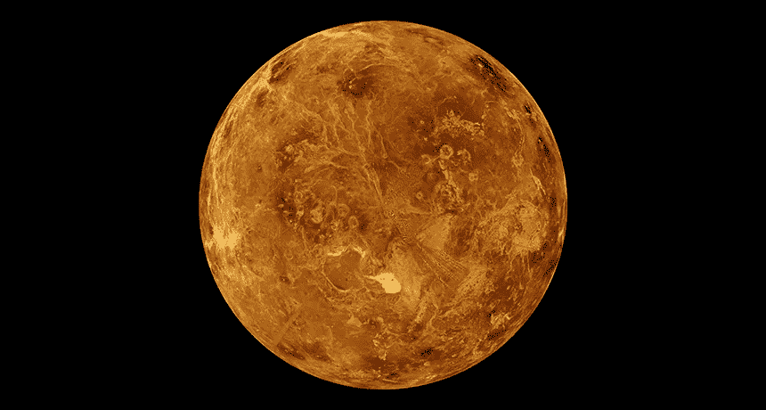

# Satoshi 从未在比特币白皮书中提及任何关于 ETF 的内容

> 原文：<https://medium.com/hackernoon/satoshi-never-mentioned-anything-about-the-etf-in-the-bitcoin-whitepaper-ff62bf2961a0>

*毕竟，他从来没有给出过“一旦比特币取得进展，就继续猛攻 SEC”这样的指示。*

在这篇文章中，我将尝试向你展示为什么 BTC 的价格将是 0 美元长期的情况下，交易所交易基金和其他法规符合它。我还将证明，如果比特币缺乏单一的内在品质，那么投资比特币的人数、钱包的数量以及团队的技术实力都无法确保比特币的价格不断上涨。

我先举个挑衅的例子。假设有人拿金星，把它的表面分成 2100 万个相等的小块，每个小块又分成 1 亿个微小的小块。然后，这些碎片以某种方式分布在那些已经确认了脸书账户的人(或那些在一些 ICO 中超过 KYC 的人)中间。例如，最先提交的获得更多，而那些后来提交的获得更少。稍后，区块链将被部署，这表示它将与比特币一样，具有采矿功能。让我们假设，由于某些情况，比如说，迈克菲的预测或 SEC 成员的某种声明，所有比特币矿工都转向开采这种#venuscoin。投资者将等待“到月球”。后来，其他人拿走了水星(我故意选择不适合居住的行星)，把它分成 8400 万块，并呼吁一些较小的名人，如卡戴珊的支持，这样价格就会上涨。

诸如此类…

在某种程度上，人们会开始问自己“我们实际上交换了什么？”任何人都可以创造他/她的区块链，将一些遥远的星球分成碎片…但是说真的，为什么金星比水星更糟糕，或者反之亦然？恰恰是稀缺性决定了它们的价值吗？还是区块链是公开的，每个人都能看到？还是说它是不可改变的？还是犹太人？或者投资于某个特定星球的人的数量？或者 Venus 团队在提供新特性方面更快，但是 Mercury 团队可以在同一天复制这些特性，对吗？

这种情况最终将非常类似于郁金香，或南 See 公司和类似的。

但那又如何，比特币是一种创新！是的，比特币本身就是一个伟大的创新。这与人们最终制造出第一架飞行飞机的事件不相上下。直到 1902 年，人们已经知道了发动机、机翼和底盘，但是没有人能够飞起来。

我的意思是，如果你想让比特币有价值，它必须有助于解决某个问题。它确实解决了——它提供了没有审查的交易。这类似于书籍的情况，即谁在背后复制它们:起初，这是牧师的特权，然后是僧侣，后来是科学家，现在我们已经到了任何人都可以在亚马逊上上传他们的书的地步。这个社会正在被逐渐改造，以展示每个参与者的潜力。这就是自由。当然，这种自由会在金融领域出现。而当它完全浮出水面时(我认为，不会早于几代人)，比特币将不再那么相关，就像不再要求僧侣重写书籍一样。但是今天，对于那些无法获得比特币的人来说，比特币处理着一项非常重要的私人交易任务。

那么,“比特币符合监管”是什么意思，它会导致什么？这一切都是关于交易所交易基金，对交易所的控制，对那些在交易所存钱和取钱的人的完全 KYC，大量投资以占有大部分 BTC 硬币的主要投资基金，导致网络中真正“不受审查”的交易量将每天越来越少。然后我们有了贝宝，但是有了采矿，还有一些每天消耗数百万美元的奇怪设备。我并不反对 Paypal，但它不再能解决比特币要解决的问题。它的价格很快就会变成 0 美元，因为人们会明白他们卖的是维纳斯的作品。

但是，在经济自由到来的地平线之外，会发生什么呢？嗯，我认为我们将拥有由特定经济体的资源/生产/ GDP 支持的货币，对所有参与者透明地发挥作用。

“Satoshi”的推广代码在 Hacker Noon 的招聘板上获得了 3 个免费的招聘信息。