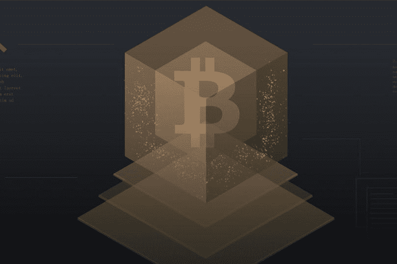
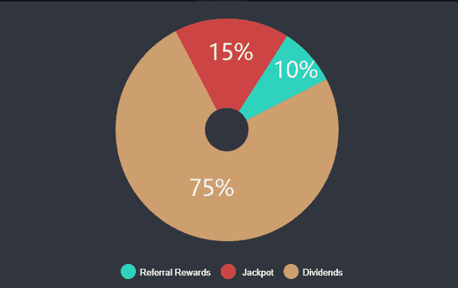
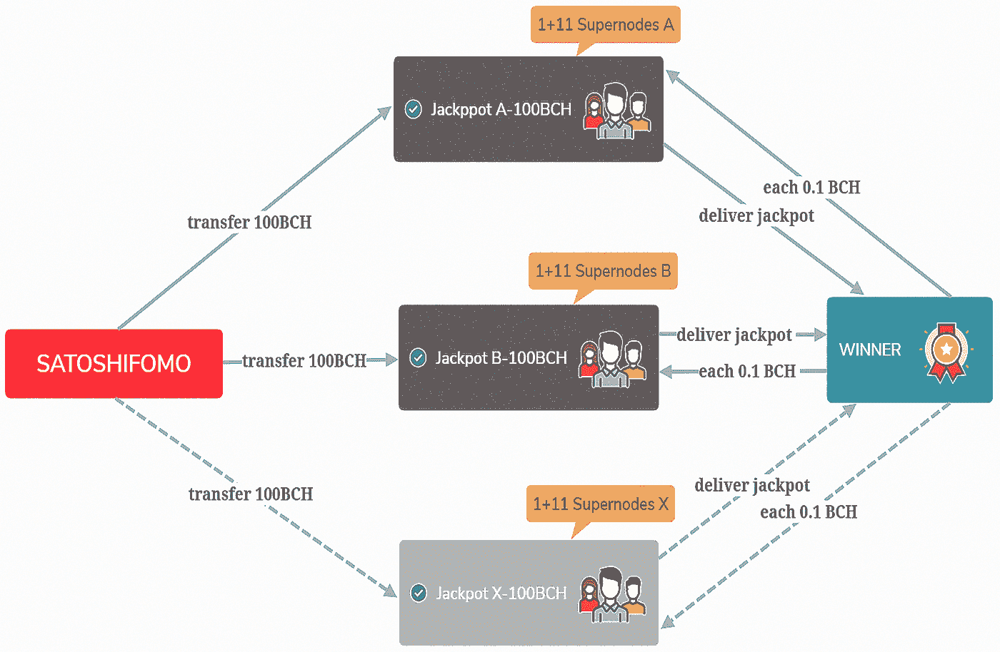

# SatoshiFomo，首款基于比特币现金区块链打造的 Dapp 游戏

> 原文：<https://medium.com/hackernoon/satoshifomo-the-first-dapp-game-built-on-the-bitcoin-cash-blockchain-26f72d180908>

Dapp games 通常也被称为区块链游戏，被认为是区块链技术在金融业以外最实际的应用，并在 2018 年获得了快速增长。他们在向公众普及和规范区块链技术方面发挥了重要作用。随着 SatoshiFomo 的推出，比特币现金也迎来了它的第一款 dapp 游戏。

**SatoshiFomo 是什么？**
SatoshiFomo 是一款运行在比特币现金网络上的分散式投资游戏，玩家通过购买每轮游戏中他们的股份密钥来投资获利。每购买一把钥匙，这一轮就会延长，钥匙的价格也会随之上涨。钥匙持有者从游戏中获得一系列被动收入，因为钥匙是在一轮游戏中购买的，而在一轮游戏结束时购买最后一把钥匙的玩家赢得累积奖金。该游戏突出了以下特点。

**容易玩。**与比特币现金应用平台 SatoshiGame 整合后，无缝 ingame 支付现已推出。此外，这款游戏在 PC 和移动设备上都可以玩。

**最高股息率。在投资游戏中，人们最关心的是投资回报率。与其他同类游戏相比，SatoshiFomo 的分红率高达 75%，并且可以随时提现，这意味着玩家可以在极短的时间内期望获得两倍甚至三倍的投资。在 testnet 上，当第二个 1 BCH 进来时，1 BCH 的第一个投资者设法实现了 100%的投资回报率。这是可能的，因为如果你是第一个投资者，你将在付款后立即收到 75%的退款。如果你用你自己的推荐链接来投资，你将能够赚回 85%。**

**三倍利润封顶。**在 SatoshiFomo 中，关键持有人可以获得的最高股息不超过其先前投资的 3 倍。封顶是为了防止最早的 1%玩家拿走 99%的红利。最大程度上保证了后期参与者的利润。需要指出的是，玩家总是可以将他们的红利进行再投资，以期待更多的利润。

基于 1+m-of-n 多重签署机制的 DPOS 共识。智能合约的缺失一直是开发者在比特币现金区块链上构建 dapps 的巨大障碍。然而，通过引入基于多重签名机制的 DPOS 共识(这是比特币的关键特征)，SatoshiFomo 成功实现了最大程度的去中心化。

对于游戏中存放的每 100 个 BCH，将通过散列当时的块高度和时间戳来生成随机数，以从 50 个候选玩家中确定 11 个超级节点。它们与官方公钥一起构成了一个 1+m-of-n 多签名地址。这里“1”代表官方公钥，“m-of-n”表示播放器超级节点。对于这个多签名地址的任何事务请求，都需要官方签名和 11 个超级节点中的 6 个超级节点签名才能通过。例如，如果一个事务有官方签名，但没有超级节点的签名，它将失败，反之亦然。此外，为了鼓励超级节点承担他们的义务，每个超级节点每次签名将获得 0.1 BCH。

整体机制的运作类似于 EOS 的 DPOS 共识。不得不指出的是，与智能合约相比，它可能没有看起来那么分散。然而，由于每个头奖都是由一个随机的 1+m-of-n 多重签名地址保护的，因此几乎不可能被个人或团体拿走。

**为什么选择比特币现金？**

截至目前，大部分 dapp 游戏都是以太坊直播。但这并不意味着以太坊是一个完美的平台。以太坊又堵车或者油费疯涨都不是新闻了。在这种情况下，没有游戏体验可言。比特币现金网在这一点上有自己的优势。

**处理速度快。**回复强大的零确认机制，几秒钟即可完成交易。不再需要等待。

**交易费用低。**与以太坊不同，在以太坊中，你有时必须为矿工的单笔交易支付超过 100Gwei，可能是几美元，而比特币现金的交易费用不到 1 美分。

**高可扩展性。大多数人会认为比特币现金只是一种加密货币，但事实上，它也是 dapps 和游戏的顶级平台。通过适当的设计，也可以构建复杂且可玩的应用程序。**

SatoshiFomo 不仅是一项社会实验，也是对比特币现金网络中巨大潜力的探索。

该网站将于 10 月 28 日晚 11 点(世界协调时/美国东部时间晚 7 点)上线。加入我们的社区获取更新:

网址:[https://fomo.satoshigame.org/](https://fomo.satoshigame.org/)

不和:[https://discordapp.com/invite/hQGuWDH](https://discordapp.com/invite/hQGuWDH)

电报:[https://t.me/joinchat/KZzg_A_Lwq8CjDpWaSmIcQ](https://t.me/joinchat/KZzg_A_Lwq8CjDpWaSmIcQ)