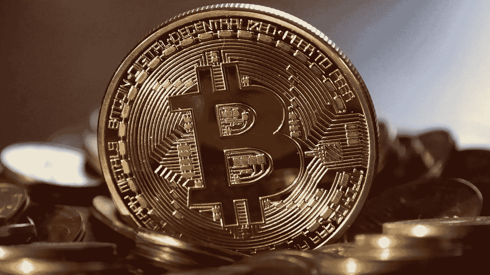

# 聪的金子

> 原文：<https://medium.com/hackernoon/satoshis-gold-8c9d9a3c6b1b>

无论中本聪是过去还是现在，他/她/他们/它在很短的时间内做出了很多真正有影响力的决定。如果 Satoshi 还活着的话，可以说他每天都在这个空间里做着最聪明的事情——什么也没做。正如每个霍德勒都知道的那样，什么都不做是让比特币变得更有价值的最有效方法之一。不动它会使可用数量更加稀缺，只要有需求，就会推高价格。但是 Satoshi 的退出比这更聪明。它间接地给了比特币*合法性。*

通过离开，Satoshi 确保了比特币继续抵制审查，并且只通过其共识规则管理*。没有任何一个实体，即使是 Satoshi，能够再次篡改比特币的基本治理原则。是的，任何人都可以叉代码或构建自己的加密货币，但只有比特币才能保证长期防篡改。如果 Satoshi 决定转移他的筹码，他会立刻成为地球上最富有的 50 个人之一。分析师的普遍猜测是，在这样的事件发生后，比特币的价格会暴跌，但另一方面，在比特币现金分叉之前，每个人都这么说。从长远来看，这并不重要，因为无论任何一个实体选择如何处理他们的硬币，总数都限制在 2100 万。*

每一种加密货币都有一位创始人、发明家、首席程序员或其他潜在的领导者或大师，他们的话比该社区中任何其他人的话都更受重视。比特币没有。在这方面，它确实比替代硬币更分散。参考原始论文说了什么或没说什么，充其量是没有抓住要点。Satoshi 首先设想的是一种分散的货币形式。除了网络上 95%的共识外，任何东西都不是比特币。任何人说了什么或者没说什么*都无所谓，*包括聪说了什么。牛顿也有一些关于引力的伟大想法，但他对这个问题没有最终决定权。比特币现在是、将来也会是我们都认同的样子，这种治理模式可以说是人类有史以来发明的最合理、最科学的模式。它甚至比民主更反脆弱。我们应该比现在更加珍惜它。

比特币没有领袖。Satoshi 的话与网络的进步无关。*黄金*没有领袖。以太坊不是比特币。莱特币不是比特币。比特币现金不是比特币。

说到黄金，开采比特币和开采黄金有着显著的不同。当比特币价格上涨时，挖掘变得更加困难，但单位时间内产生的比特币数量不会改变。由于这种动态挖掘难度调整机制，比特币可以保持其最基本的属性之一——预定的通货膨胀率。每十分钟就有固定数量的比特币产生，这个数字每四年减半。到 2020 年，这一数字将从 12.5 降至 6.25。这使得比特币挖矿*在某种程度上是可预测的*。另一方面，当黄金价格上涨时，黄金开采仍然和以前一样困难，尽管利润有所增加。当然，地球上的黄金数量是有限的，但是没有人知道确切的数量，也不知道需要多长时间才能开采完。

Satoshi 的遗产不能被夸大，但他的话不是，也不应该是，比特币的主宰。权力下放是这里的关键。让我们珍惜那把钥匙，就像它是比特币私钥一样。