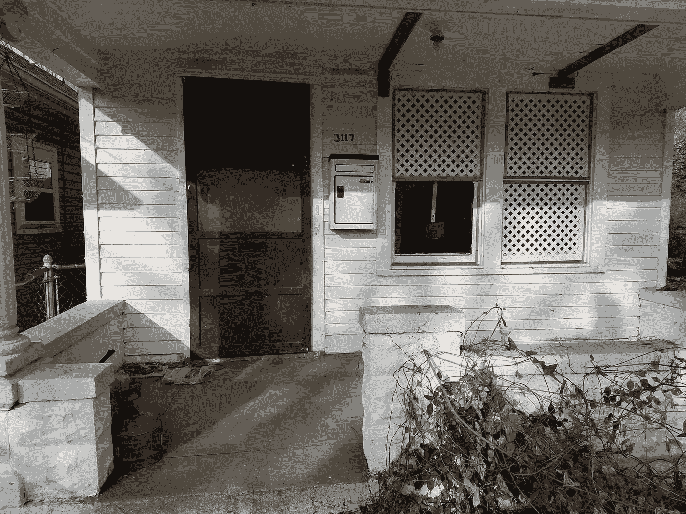
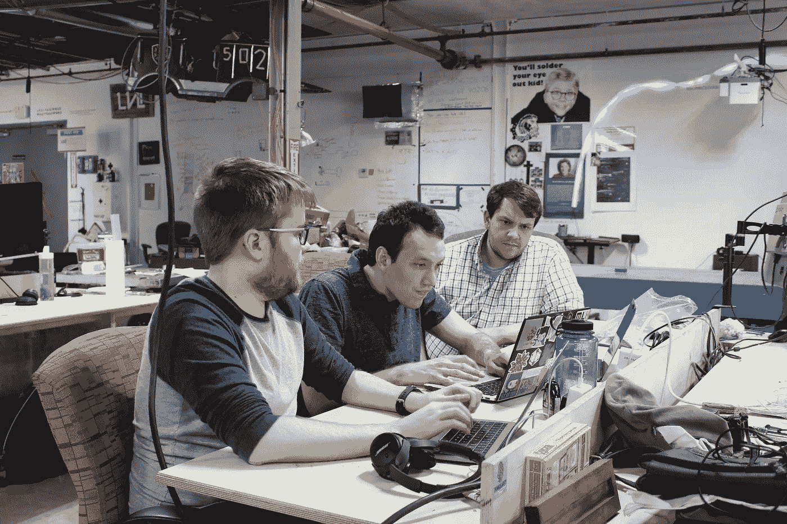
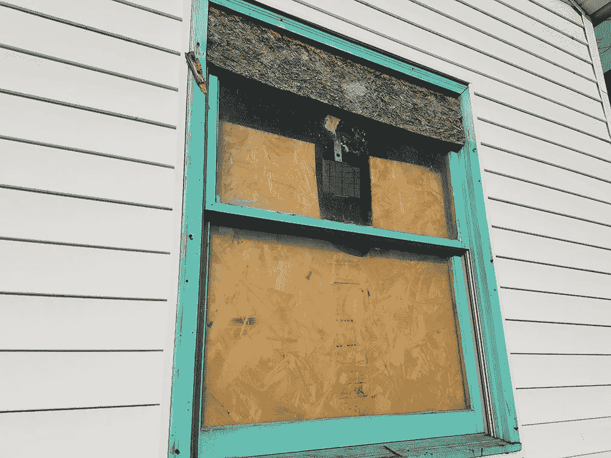
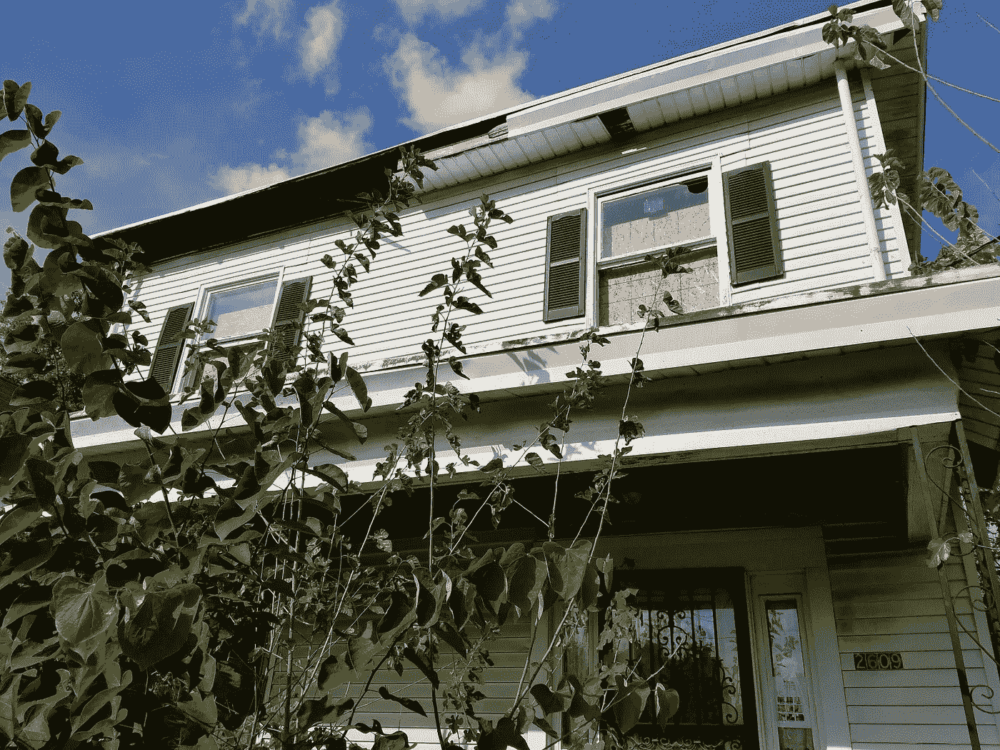
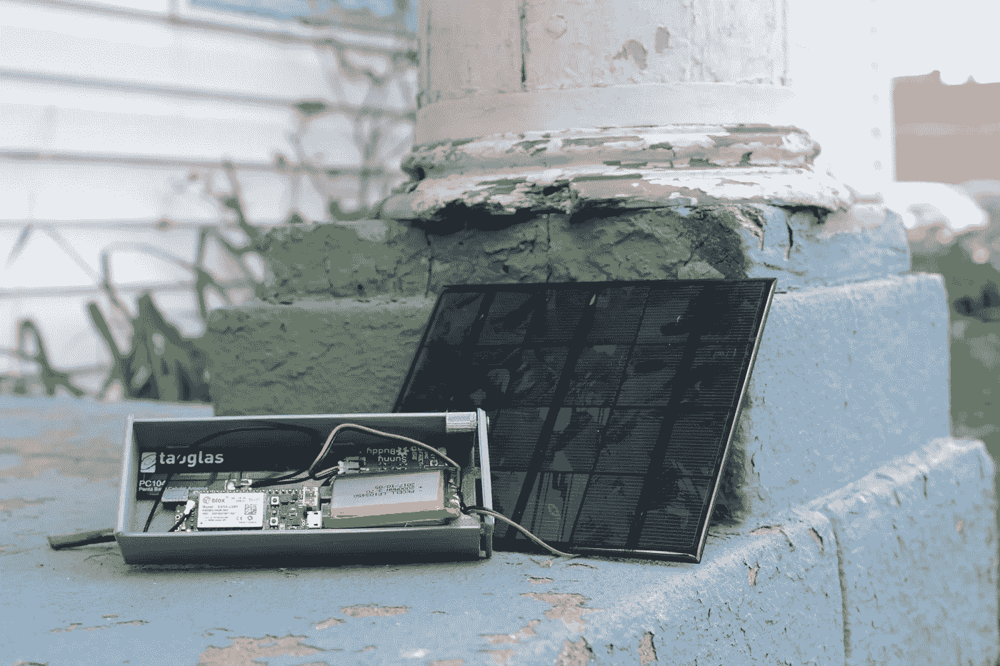

# 用 CASPER Security 拯救生命和财产

> 原文：<https://medium.com/hackernoon/saving-lives-saving-property-with-casper-security-1dd029d702a1>

## CASPER Security 如何使用电子设备在火灾发生前阻止其发生。

A CASPER protected home in Louisville, Kentucky.

W 当三名[软件](https://hackernoon.com/tagged/software)工程师在 2015 年肯塔基州的 [LVL1 黑客马拉松](http://www.lvl1.org)上联合起来时，他们找到了团结在一起的共同事业——帮助他们的城市监视有着火风险的废弃建筑。内森、詹姆斯和大卫在 LVL1 的黑客伙伴和一名前美国宇航局工程师的帮助下，创造了一种安全设备，使路易斯维尔的建筑变得不那么危险。基于他们围绕粒子电子的设计，该团队设计了完全自主太阳能事件响应器的缩写，以帮助城市监视处于危险中的财产。

Nathan, James, & David of CASPER Security.

# 发人深省的统计数字

根据路易斯维尔市的统计，在他们的大都市地区有 6000 到 7000 处空置房产。由于无人监管，几乎被遗忘，这些建筑已经成为灾难的避风港。卡斯珀对该市空置建筑的研究发现，两栋或更多建筑的所有火灾中，近 50%涉及至少一栋此类建筑。

CASPER devices are typically placed in the window or doorframe.

疫情也不仅限于路易斯维尔。国家防火协会估计全国每年平均有 30，200 起建筑火灾发生在废弃的建筑中，每年有超过 3，000 名消防员在灭火时受伤

除了火灾之外，这些建筑容易发生洪水、结构倒塌，甚至被用作帮派和其他犯罪活动的藏身之处。CASPER 确实在他们的社区中发现了一个需要解决的问题。

# 保持监控，保证它的安全

CASPER 是一种分立的监控工具，可以固定在废弃建筑内的窗户、门和其他表面。由太阳能供电，并通过使用[电子的深度睡眠模式](https://blog.particle.io/2018/06/07/choosing-the-right-sleep-mode-for-your-electron/)持续“开启”。CASPER 监控声音、运动、温度等。数据通过粒子的蜂窝网络传输到云端，用户，主要是建筑业主和城市官员，使用它来通知更安全的城市规划。

Monitored buildings help save lives. Simple as that.

当然，这对于预防火灾、洪水、非法闯入等非常有效，但它也是一个重要的经济效益。路易斯维尔能够同时远程监控数以千计的建筑，而不是投资支持他们单薄的检查员队伍。

除了人员成本，卡斯珀还节省了城市拆迁成本。一次拆除估计要花费超过 15k 美元，如果这笔钱再投资于 CASPER monitoring，可以支付 100 年的保险费用！更进一步说，一百万美元可以支付 80 栋建筑的拆除费用，或者支付 750 栋不同建筑一年的监控费用。对城市社区产生积极影响的选择是显而易见的。

CASPER devices, powered by the Particle Electron.

# 更安全的未来

在路易斯维尔项目试点成功后，CASPER 将他们的建筑和救生服务推向全国。密苏里、密歇根和纽约的主要城市已经开始使用 CASPER 来加强他们社区的安全，随着该公司知名度的提高，甚至更多的城市，尤其是东北部的城市，也开始注册。要了解更多关于 CASPER 能为你的社区做些什么，一定要在他们的[网站](http://caspersecurity.com/)上联系他们。

[*本帖最初出现在粒子博客上。*](https://blog.particle.io/2018/08/30/saving-lives-saving-buildings-with-casper-securities/) 👻