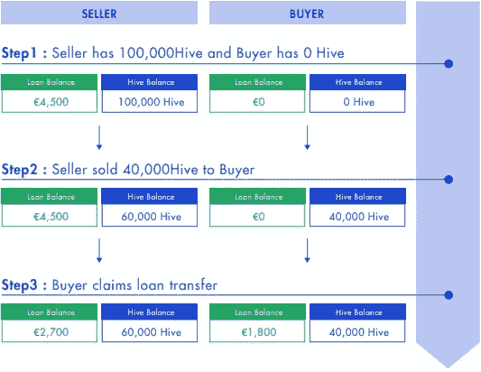
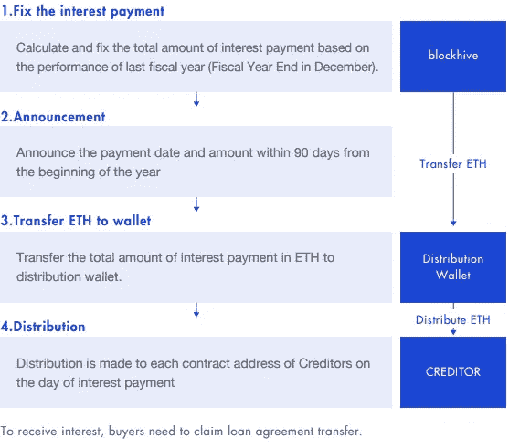

# 告别 ICOs，秘密集资有了新形式。

> 原文：<https://medium.com/hackernoon/say-goodbye-to-icos-crypto-fundraising-has-a-new-form-427629f4b33d>

加密货币行业最有争议的部分仍然是令人兴奋的 100 倍初始硬币发行，即 ICO。

在任何情况下，任何不稳定的，不受监管的，有这些盈利水平的事情都不会持续很久——ico 根本不遵守基本的货币法律。

抛开现金的角度，ICO 实际上是为值得组织筹资而设计的，通常是在瑞士联邦理工学院，并向投机者提供他们自己特定的代币，以期望在以后获得更大的激励。

利用筹集的资产，组织寻找能力，基础和不同的商业形式，期望真正成为世界级的区块链球员。

相反，ICOs 变成了一个筹集大量资金的秘密工具，只是为了让金融专家面对失败的项目、无项目、虚弱的团体、离开诡计和彼此的虚假陈述商标。

因此，筹集的资产只不过是一些 a 级企业的钱包变热了。

这并不是说每个人都喜欢 scammy 练习，因为毫无疑问有真正的设计师团队尝试真正的事业和理解重大问题。

现在，想象一下，如果现金只流向那些优秀的设计师团队——不幸的是，他们没有吸引投资者的展示资产——而不是那些骗人的团队？

# 酪

我对欺诈性 ico 永无止境的挫败感让我想到了一个名为 Blockhive 的创新项目，并立即迷上了阅读他们提供的内容。

Blockhive 团队认为，由于以下缺点，需要 ICO 的替代方案。代币经济是建立在需求基础上的，有时候卖代币没有意义，因为代币对你的业务没有真正的作用。

虽然术语 **ILP** 听起来确实有点令人畏惧，但它是一个很容易掌握的概念，并且充分利用了**智能合约**。

与 ICO 相反，ILP 以**加密贷款**的形式为企业筹集资金，并通过智能合同将借款人和债权人合法地捆绑在一起。

**事实上，在阅读 Blockhive 白皮书的最后，我试图说服自己，为什么这不是进行 ico 的程序。**

传统贷款协议成为问题是有原因的。

**程序。数百种浪费时间的纸质程序。**

当发行人支付利息和本金时，他们需要知道债权人的 KYC 和银行账户。

当债权人希望将他们的权利转让给他人时，发行人需要知道贷款的金额、转让的日期和新债权人的 KYC。

Blockhive 来了，它提供了一个具有法律约束力的数字化贷款协议，称为**初始贷款采购** (ILP)。

有了这种创新的贷款结构，公司现在可以**获得他们需要的贷款**来扩大其生态系统，同时允许**债权人从他们贷出的钱中赚取利息**。

所有 KYC 的信息和交易都记录在区块链上，所有的资金交易将通过智能合同自动执行。

怎么会？使用**未来贷款访问令牌(平面)— HIVE。**

当债权人对 ILP 做出承诺时分配给债权人，并根据他们签署的贷款协议的 0.045€价值获得 **1 个 Hive token。**

**block HIVE 将总共发行 10 亿个 HIVE 代币，全部用于资助项目。**

这是它如何工作的要点—

如图所示，HIVE 嵌入了一个考虑余额和利息支付的逻辑逐步流程。

作为年利息，债权人将获得 blockhive 社区使用该平台产生的利润的 20%。

**利息以 ETH 支付。**

来自 blockhive 白皮书-

> 如果项目 A 产生 2,000 ETH 的利润，项目 B 产生 3,000 ETH 的利润，则总利润为 5000 ETH，利息总额为 1000 ETH(5000 ETH x 20%)，通过**智能合同**分配给债权人。

因此，Blockhive 非常成功地为加密货币市场提供了一个完整的功能

***增值的令牌。***

附注——我与这个项目无关，但确实参与了 ILP :)

## 干杯，感谢您的阅读。

对于你进入密码市场的第一步的最终资源，加上你的第一笔投资，如何投资，请查看我的指南

 [## 如何通过交易和投资加密货币赚钱？

### 比特币！莱特币！以太坊！—激动！不知所措！还有什么不可以。

medium.com](/@shauryamalwa/how-to-almost-make-millions-by-trading-cryptocurrency-2f7bd5c1cedd) 

这些步骤让我在几个月内从 1000 美元变成了 30000 美元。

让它变大的唯一方法是自己学习如何抓鳟鱼。另一边见。干杯！

****************************************************************

鼓掌 1 次或 50 次。它帮助我获得曝光率。谢谢大家！

_

阐述我多年来的想法，并超级热衷于写区块链、交易、加密货币和生活。

我的目标是以一种精致、易懂的方式将加密货币带给大众。复杂无助于任何人，有偏见的媒体也是如此。

是的，我认为这个系统是一个巨大的谎言，是时候改变它了。

_

#longlivecrypto。

***************************************************************