# 向 iOS 垃圾邮件制造者说再见

> 原文：<https://medium.com/hackernoon/say-goodbye-to-ios-spammers-851e8fe81ecb>

## 印度 TRAI 迫使苹果公司对抗垃圾邮件的威胁

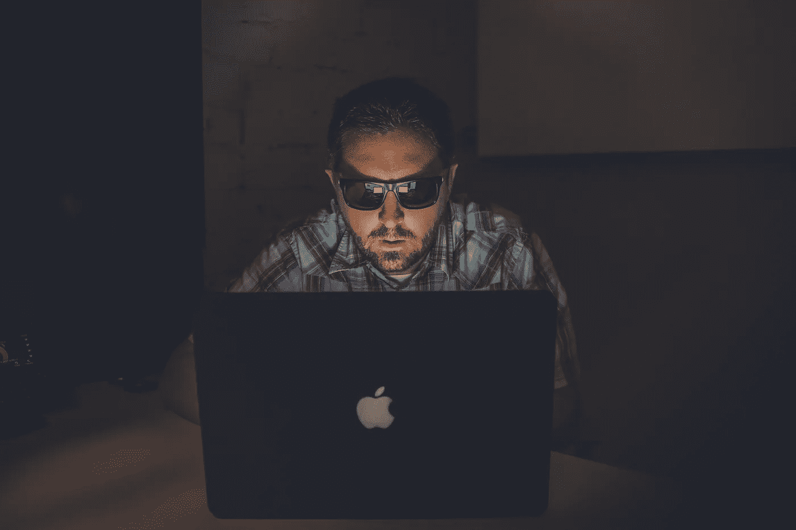

iOS12.1 brings bad news for spammers (Photo by [NeONBRAN](https://unsplash.com/photos/_Kmtj6UIlGo?utm_source=unsplash&utm_medium=referral&utm_content=creditCopyText)D on [Unsplas](https://unsplash.com/search/photos/spam?utm_source=unsplash&utm_medium=referral&utm_content=creditCopyText)h)

与西方不同，只有 1%的印度人使用 iPhones。当然，这主要是由于苹果的天价定价。一部最新规格的安卓智能手机的价格只有最新款 iPhone 的十分之一。此外，机器人还提供了 iPhones 没有的有用功能。就像你不能把 u 盘连接到 iPhone 上分享音乐一样。对于大多数印度人来说，这是一个交易破坏者，当被告知音乐需要付费时，他们似乎很惊讶。好吧，也许他们确实知道，但他们不理解。比如，我“知道”盗版是不好的，但我并不真正“知道”这意味着什么，直到我开始写作，意外地发现我的一个故事以另一个名字逐字逐句地发表了！然而，即使是 1%对苹果来说在印度也是一个巨大的市场，因为加起来[今年上半年在印度销售了近 100 万部 iphone](https://www.theverge.com/2018/7/25/17611438/iphone-in-india-obstacles-to-success)。

作为那些印度 iPhone 用户中的一员，我一直很羡慕 Android 的一个特别的功能:它能够屏蔽垃圾电话和短信，就像这个。

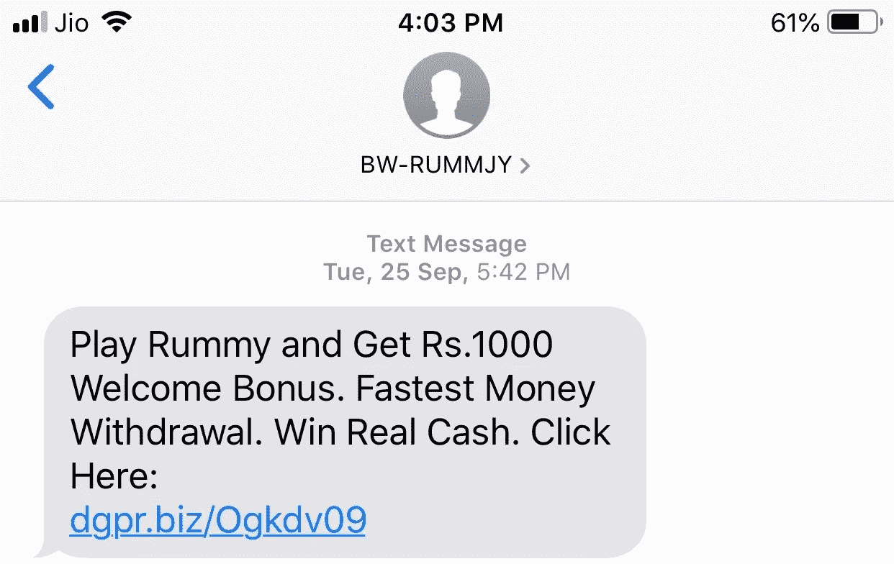

iOS 确实提供了屏蔽功能，但似乎并不能阻止消息的进入。而且，奇怪的是，这些垃圾邮件发送者没有号码。或者如果他们有一个号码，它不起作用，按下呼叫按钮会带你去任何地方。

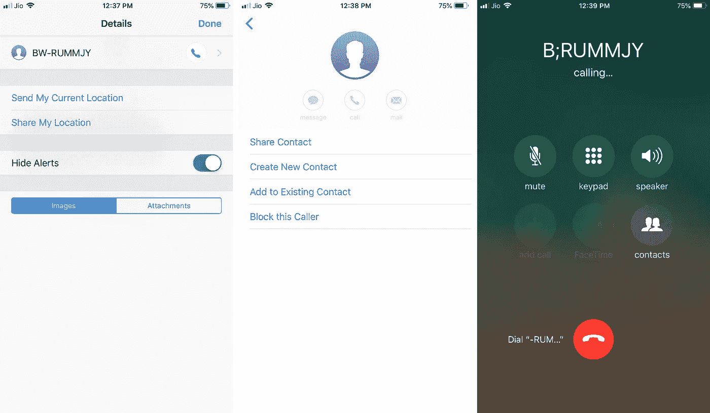

我是猜测，但我认为骗子正在利用 iMessage 的功能，通过链接到苹果 ID 而不是电话号码来发送信息。

另一方面，Android 有一个名为 [DND](https://play.google.com/store/apps/details?id=trai.gov.in.dnd&hl=en_IN) 的应用，是印度电信管理局(TRAI)的官方应用。它让您直接报告垃圾邮件电话和信息 TRAI，并得到垃圾邮件发送者被禁止。这可能就是为什么我的安卓系统从来没有收到垃圾电话。这是可能的，因为安卓，或者更确切地说是谷歌，允许 TRAI 访问垃圾电话和信息，并识别发送者。

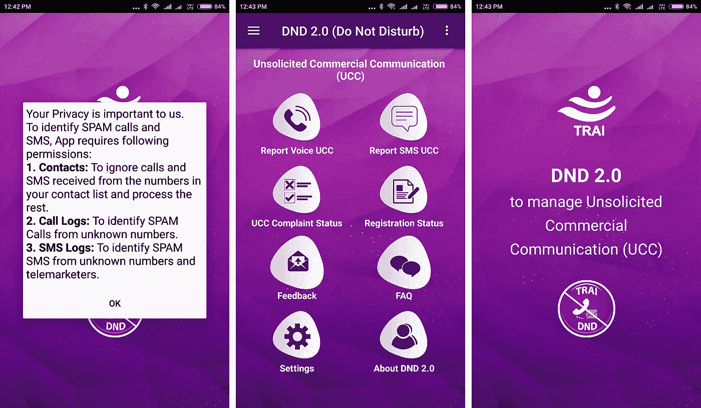

苹果不允许任何应用程序访问信息、通话或联系人。他们认为这侵犯了 iPhone 用户的隐私。然而，随着垃圾邮件的威胁在 iOS 上失去控制，TRAI 威胁说[在印度禁止 iPhones 手机](https://www.themobileindian.com/news/apple-on-the-verge-of-india-ban-if-it-doesnt-approve-trais-anti-spam-app-23124)除非识别和阻止垃圾邮件发送者的设备被允许。

最终，随着 iOS 12.1 的发布，苹果公司提出了一个折中的解决方案。您现在可以向 TRAI 举报垃圾邮件发送者，而无需完全查看您的所有电话和短信。它看起来确实类似于 Android 应用程序，但在实验中，我认为苹果提取了垃圾邮件发送者的数据和垃圾邮件内容，并将其发送到 TRAI(而不是让 TRAI 访问 iPhone)。但这仍然是黑客可以利用的手机后门。我猜这就是为什么苹果如此大张旗鼓地将这个设施内置到 iOS 中。

接着，我让[在新闻](https://timesofindia.indiatimes.com/business/india-business/pesky-calls-issue-apple-writes-to-trai-on-new-features-to-flag-spam-calls/articleshow/65312638.cms)中读到，你可以通过在 iOS 设置中启用“垃圾邮件”扩展来清除垃圾邮件。然而，尽管我把手机更新到了最新的 iOS 12.1，我最初还是找不到这个“不想要的通信”扩展。最后，我做了我一开始就应该做的事情，访问了苹果网站。就在那时，我意识到这个功能只适用于第三方应用程序。我想补充一点，虽然印度的 TRAI 可能已经迫使苹果允许垃圾邮件报告，但苹果似乎已经向全世界的客户提供了[设施](https://support.apple.com/en-us/HT207099)。

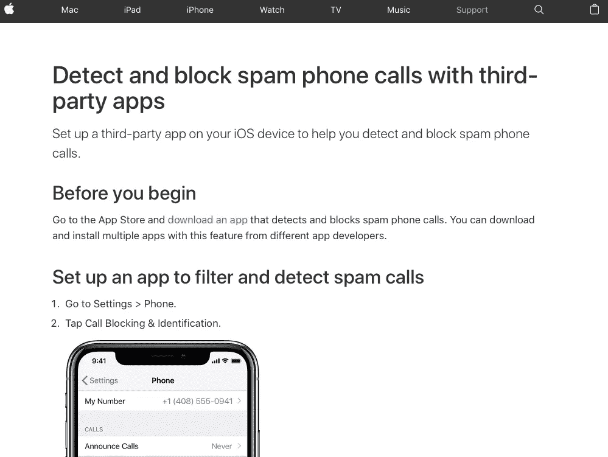

然后，我回到我的 iPhone，在 iOS 设置应用中搜索“报告”，并在“短信/电话报告”设置中的苹果冗长免责声明中找到了黄金。

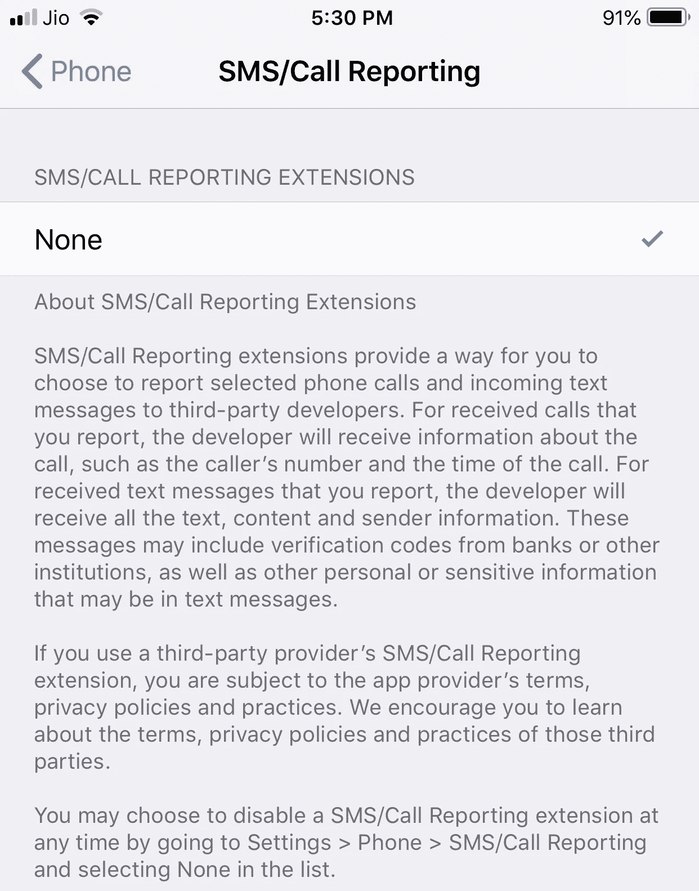

从字里行间来看，它确实声明这个功能只有在第三方应用程序的帮助下才能工作。

所以我在 iOS 应用商店搜索，在那里找到了几个应用。现在还为时尚早，我想很快会有更多这样的应用出现。目前，我决定试用一款名为 VeroSMS 的免费增值应用。它不像其他同类应用那样坚持定期订阅。基本功能是免费的，但你需要向₹249 支付 4 美元来获得高级功能。事实上，我早些时候试用过这个应用程序。但当时它的能力非常有限。它可以根据我给的关键词识别垃圾短信，并在“信息”应用程序中将这些短信归类到一个单独的垃圾文件夹中。不过，我想高级版当时才一美元。

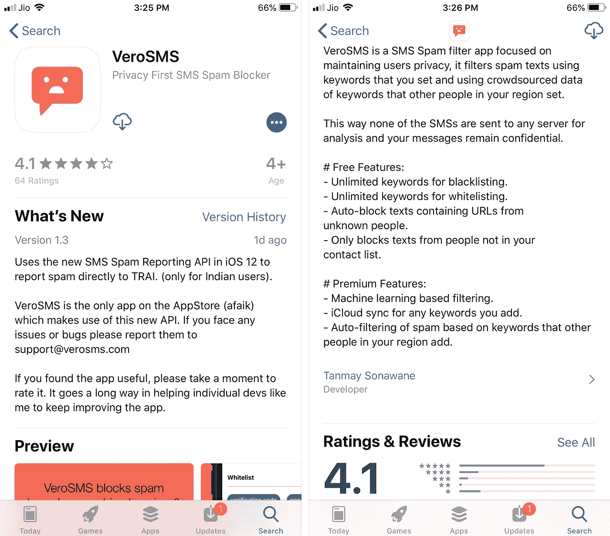

安装 VeroSMS 后，我在 iOS 设置应用中启用了它。你必须在电话和信息设置里都这样做。

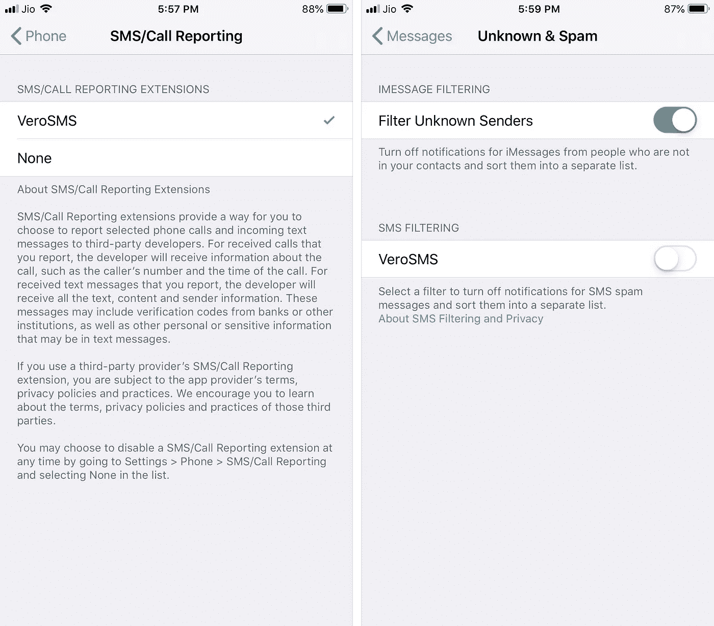

这是苹果第一次允许开发者访问有限的信息和电话记录内容。因此，当我发现苹果发出警告说我向 TRAI 报告的信息内容将与 Vero 的开发者共享时，我并不感到惊讶。我对此没有意见，因为垃圾邮件中没有我感兴趣或重要的内容。

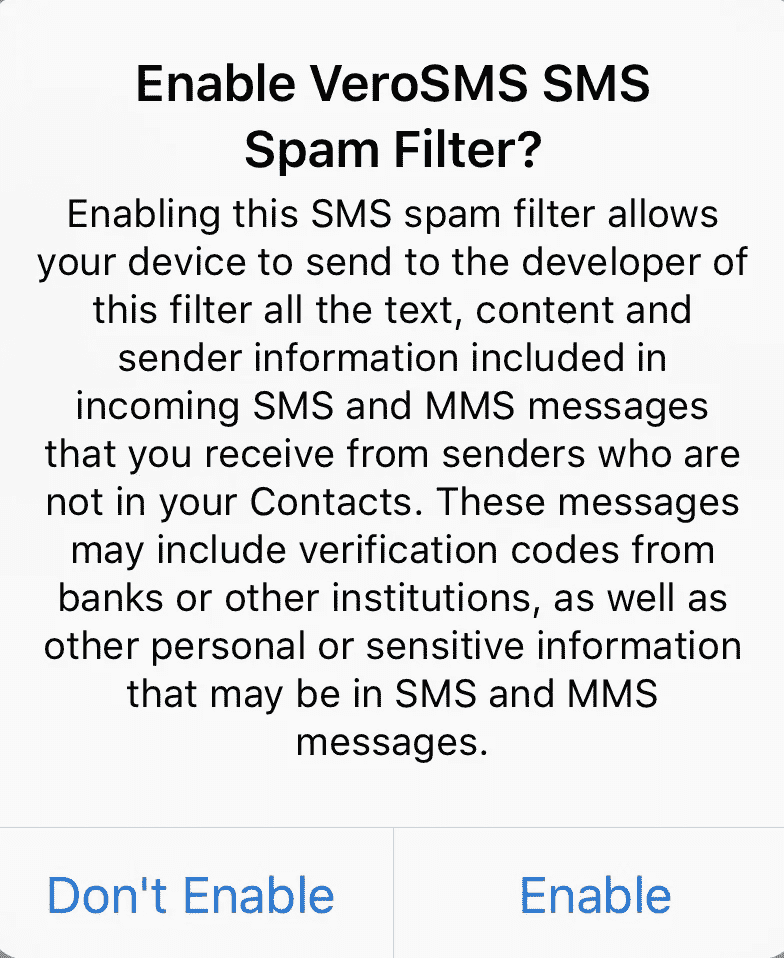

在安装过程中，该应用程序要求我将关键词添加到黑名单和白名单中，我从收件箱的垃圾邮件中提取了几个关键词。Vero 确实提供了一个选项，可以使用众包关键词作为付费的高级功能。如果应用程序有效，这可能值四美元。

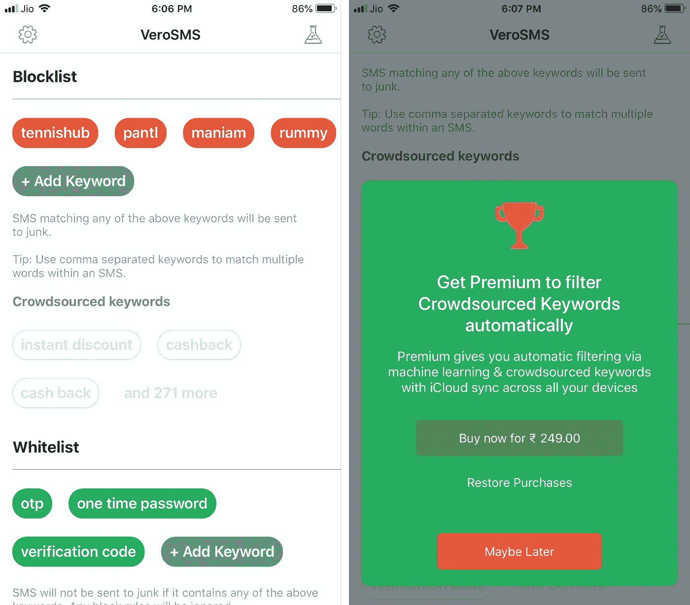

然后我检查了 iOS messages 应用程序，发现它现在有两个标签，新标签是“未知和垃圾”，我想这是基于我在 VeroSMS 应用程序中添加的关键字。点击“拉米牌”信息，然后点击“更多”，我找到了一个报告信息的选项。

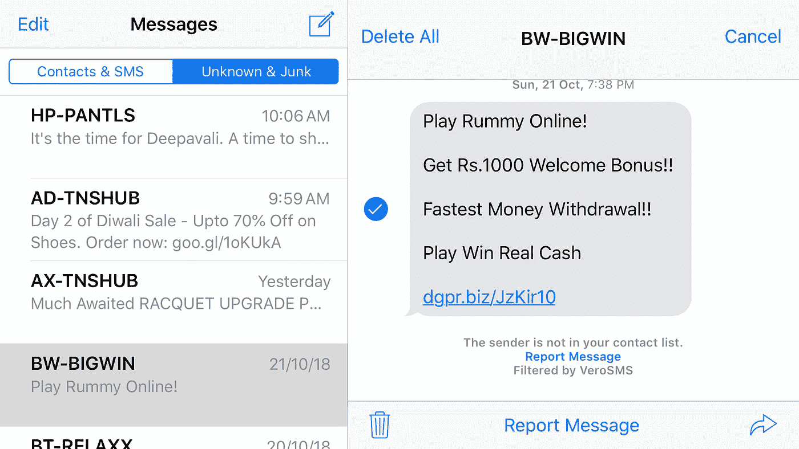

因此，我点击了“报告”,并点击下一页中的“发送”,却收到了我的服务提供商发来的一条消息，称只有在收到令人不快的垃圾邮件后三天内报告，投诉才会被登记。

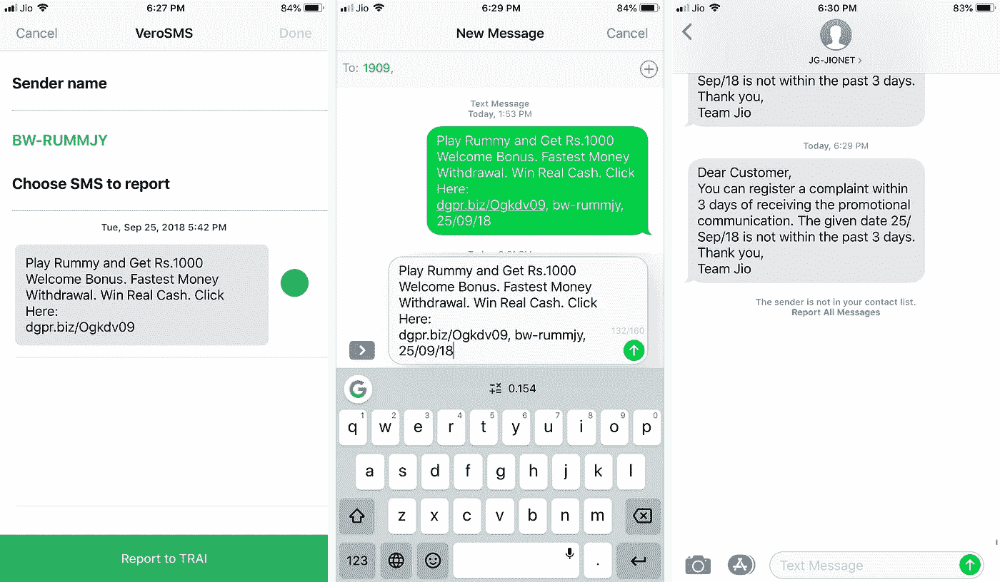

我用几个小时前收到的一条新的垃圾邮件再试了一次。我曾经在这个网球相关网站上查询过一些球。从那以后，我一直收到他们的促销信息。尽管我多次试图退订，但都没有成功。随着印度节日的到来，在过去的几天里，他们不断给我发信息。也许我可以给他们打个电话，要求退订他们的邮件列表。所以我点击最后一条消息，然后点击下一个窗口中的音频呼叫按钮，但我的网络提供商通知我该号码不存在。

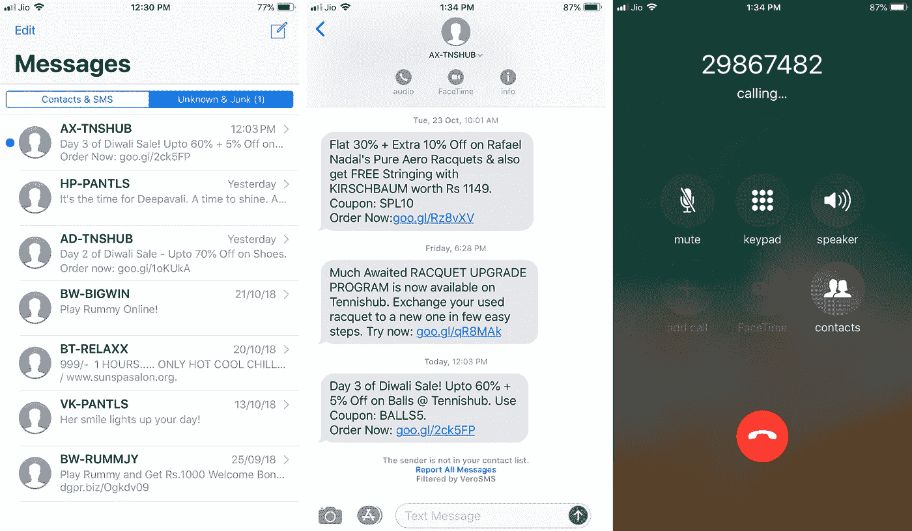

现在，这是一个滥用客户数据的明显案例，我不再对通过反垃圾邮件应用程序报告他们感到任何内疚。

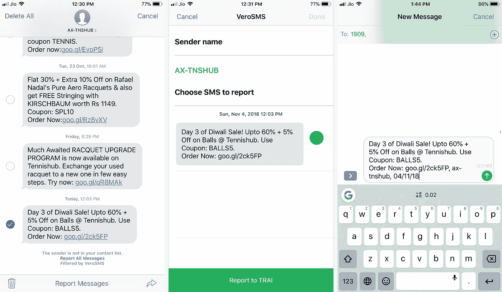

通过后，我从网络提供商处收到一条消息，告知我的投诉已被登记。

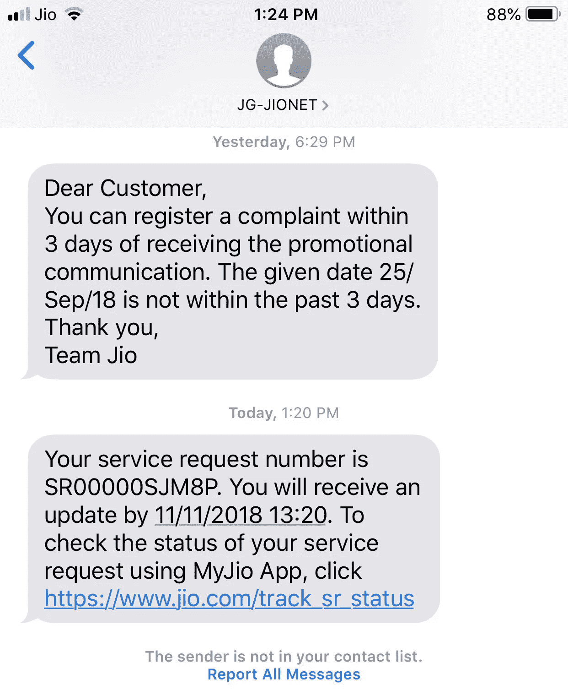

看起来 iOS 垃圾邮件过滤器确实在运行。布丁的证据是，如果我的 iPhone 变得像我的 Android 一样没有垃圾邮件，但对于这一点，我们必须拭目以待。

然而，我觉得 iOS 垃圾邮件制造者的时代已经结束了。