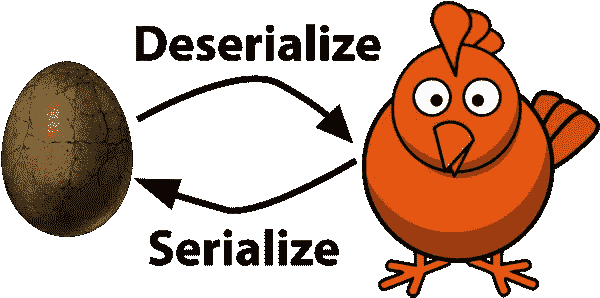

# MapR-DB 的 Scala 对象序列化

> 原文：<https://medium.com/hackernoon/scala-object-serialization-for-mapr-db-792817d3962d>

之前，我们已经讨论了 MapR-DB 的一些优势和特性。然而，这一次我们将在使用这个企业级数据库时动手。

当使用 MapR-DB 时，由于 MapR-DB 数据是使用 JSON 格式存储的，所以经常要在 JSON 之间序列化和反序列化我们的业务对象(通常称为 POJO)。这些操作非常常见和频繁，所以我们将从 Scala 的角度来看看它们。

## MapR-DB 文档 API

创建新对象并将其插入 MapR-DB 需要遵循一系列步骤。让我们看看典型的工作流程。

这是插入 MapR-DB 的基本步骤。这个片段可以扩展为更复杂的用例，但本质上，它们看起来与这个非常相似。

这里有一个问题很容易识别。我们通过 fluent API 创建`document`对象的方式很不方便。通常，我们希望传递一个 POJO，而不是手动构建文档。

在 Java 中，我们可以做以下事情。

在上面的代码中，我们可以看到我们的类`Link`用于创建将被保存到数据库的文档。MapR-DB 将利用 Java Beam 对象来创建文档对象。

现在，当使用 Scala 时，这个问题变得更加乏味，不管怎样，Scala 应该是你的首选语言。

## Scala 问题

使用 Scala，我们也可以像在 Java 中一样使用 Java Bean 来创建所需的对象，但是其他问题很快就会出现。让我们看看之前使用的同一个例子，但是这次是在 Scala 中。

如果您尝试这样做，您会发现对象`link`不能被转换成 Java Bean，因为值`_id`以`_`开始。这可能看起来很小，但是所有插入 MapR-DB 的文档都应该有字段`_id`，将这个最初的小问题转化为一个交易破坏者。

我们总是可以回头对我们拥有的每个 POJO 对象使用手动对象构造，但是由于显而易见的原因，我们应该一想到这个想法就放弃。

另一种方法是研究将 Scala 对象转换成文档的机制。很明显，我们需要一个类型类来完成繁重的工作，并为转换系统带来灵活性。

让我们定义一个类型类来完成这项工作。因为没有更好的名字，就叫它`MySerializer`吧。

正如我们所见，`MySerializer`使用一种默认的方式，通过 Jackson 序列化将对象转换成文档。拥有一个默认的序列化器是一个很好的选择，因为大多数对象都会使用它，但是并不是每个人都是一样的，所以我们也需要专门化。

现在，我们的代码将如下所示。

如前所述，有时默认的文档转换不起作用，例如，让我们看看下面的例子。

当试图将生成的文档保存到数据库时，使用默认转换器和`Person`会导致错误。如前所述，MapR-DB 需要一个`_id`作为文档键。在这种情况下，我们需要为类`Person`定制一个转换器。

这就是类型类机制的亮点。我们可以指定从 Person 创建文档的确切方式。让我们看看怎么做。

请注意，我们有两个选项，一个是使用默认的序列化程序，另一个是使用自定义的序列化程序来处理相关的特定对象。这允许一个细粒度的序列化机制，最终产生泛型，而无需放弃专门化。

同时，序列化系统在对象本身之外。我们应该能够在完全不影响对象的情况下修改序列化的工作方式。最终，我们可以基于特定的上下文来重写序列化是如何完成的，同时根据需要为不同的情况使用不同的序列化机制。这在 Java 中几乎是不可能的，但是 Scala 是特别多态世界中的巨兽。

# 结论

MapR-DB OJAI API 很好，但是它不能很好地处理 Scala 对象，尤其是那些不符合 Java Bean 规范的对象。另一方面，Scala 提供了像类型类这样的高级构造，允许我们在保持类型安全和支持特定多态性的同时解决许多互操作性问题。

*感谢* [*Lombok 项目*](https://projectlombok.org/) *帮助我们写出更干净的 Java 代码。*

*感谢 S*[*imularum*](https://github.com/mpilquist/simulacrum)*在 Scala 中启用类型类，无需样板文件。*