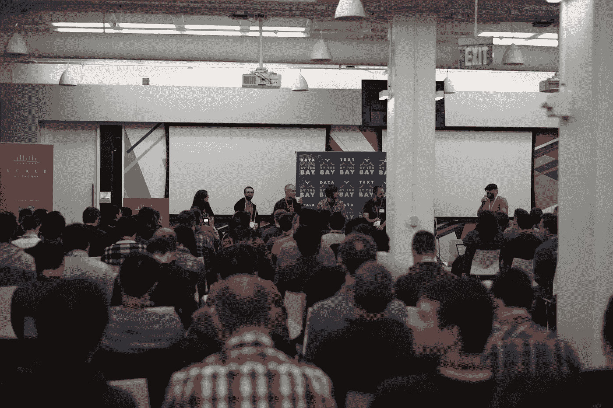

# 2018 年海湾规模:无 BS 黑客大会

> 原文：<https://medium.com/hackernoon/scale-by-the-bay-2018-a-no-bs-hacker-conference-6c7a905c0143>

[Scale By the Bay](http://scale.bythebay.io) (旧金山，Twitter 总部，2018 年 11 月 15 日至 17 日)是旧金山标志性的开发者大会，现已进入第六年。它始于 2013 年的硅谷 Scala 研讨会，或简称为 Funconf，旨在提供函数式和有趣的编程，起源于 SF Scala 和 SF Spark meetups。

英特尔圣克拉拉公司用他们的 Cue 系统招待了我们，该系统是用 Scala 编写的，现在是威瑞森的一部分。他们使用 Scala 中的范畴理论框架 scalaz 构建了一些最大的函数式代码库，并开发了像 Nelson 这样的系统，严谨地部署了 Scala 代码。这个团体产生了许多明星，如 Ryan Delucci、现在 Lyft 的 Tim Perrett、现在 Unison 的联合创始人 Runar 比雅纳松和现在 Target 的 Adel Bert Chang——他们都是海湾的常客。

我们在 2014 年成为 Scala By the Bay，去年成为 Scale By the Bay，这反映了我们一直拥有的广泛的编程语言，都专注于利用现有资源进行深思熟虑的工程设计。多年来，它已经发展了一个充满激情的社区，本质上是湾区的开发人员社区，专注于 web 级后端编程，始终包括分布式系统、设计正确性、测试驱动的开发和 devops 基础部署规程。到目前为止，它包括机器学习，人工智能，基于强类型的全栈编程，以及分布式系统的云/边缘/物联网迭代。今年第一次，我们有了一个小的区块链工程轨道，由 Haskell 和 Scala 初创公司代表，他们构建了设计正确的企业区块链平台。

现在有三个传统路线，每个路线持续三天，大致反映了机构群体的主要兴趣:

**深思熟虑的软件工程**是原始函数式编程轨道的延伸，它强调了这样一个事实，即我们有许多开发人员使用 Java、C++和非[纯粹]函数式语言工作。然而，将我们团结在一起的是后退方法——将问题作为一般情况的一个实例，不要重复自己，并在准备好的时候概括为可组合的抽象。然后把它们作为开源图书馆提供给所有人，由博客文章、我们聚会上的谈话、SBTB 和其他地方来支持。

**反应式微服务**——这些是软件架构的方法，由部分组成整体，并使这些部分无缝交互，或至少以易于推理和调试的方式交互。

**端到端数据管道(可选用于 ML/AI)** —我们的系统跨越从开发运维到人工智能应用的整个堆栈，我们拥有其中的精华。Salesforce 等公司为每个组织提供从开始到 AI 的数据，帮助客户从自己的用户数据中获取价值。

深思熟虑的软件工程小组包括 Scala 的创始人马丁·奥德斯基、鲁纳·比雅纳松、DTrace 的创始人布莱恩·坎特里尔、网飞机器学习工具的领导者朱莉·皮特。Cliff Click 是软件工程师的工程师，JVM HotSpot Just in Time 编译器的创始人，H2O.ai 的联合创始人，在集群上提升编译器技术。

人工智能小组包括 IBM Watson 的首席技术官 Ruchir Puri、Workday 的数据产品负责人 Peter Skomoroch、斯坦福大学副教授兼黎明实验室的联合创始人 Peter Bailis 以及 sisu.ai、Google Cloud 的 ML 工程师 Michelle Casbon，并由 CrowdFlower(现为 Figure)和 now Weights and Biases 的创始人 Lukas Biewald 主持。

云计算和边缘小组包括 Capital One 的战略负责人 Bernard Golden、思科的区块链计划负责人 Anoop Nannra、Google Cloud 的开发者倡导者 Holden Karau 以及联合创始人 Zededa 的 Roman Shaposhnik 和 Apache Software Foundation 的董事会成员。

今年最强的主题之一是流式数据。Neha Narkhede 是 Confluent 的创始人之一，也是 Apache Kafka 的创始人之一，她将在第二天发表主题演讲。流媒体讲座包括 Lyft 的 Apache Flink 和 Beam，Oracle 的 Reactive Java，Capital One 的 Scala/Akka real-time，Lightbend 的 Alpakka，Akka/Kafka connector 等等。

具有网络规模数据处理的人工智能是最强的赛道之一——我们不是将人工智能作为图表和笔记本来处理，而是对数百万用户的实时反馈回路，例如优步、Twitter 或 Saleforce 的用户。我们的方法是为机器学习和人工智能集成数据管道，其中处理和聚合是人工智能不可或缺的一部分，也与 UX 一起循环，并通过适当的 DevOps 进行操作。我们看看强类型 Tensolrflow，Horovod，优步的快速深度学习训练，Sourced.tech 的 AI on AI，以及许多其他人工智能工程讲座。

我们通过带有代码的工程演示来了解新兴技术——今年是量子计算，微软的 Q#领先，摩根大通的 Scala 领先。我们还发现了一个将区块链理解为分布式系统的好方法，用 Symbiont 的 Haskell 和 Constellation Labs 的 Scala 实现功能。

我们的观众逐年增加，所有的赞助商都在招聘工程师。70%的赞助以工程师通行证的形式回到发起人手中，每个人回家时都有一大堆 OSS 想法要尝试，一堆要测试，还有具体的项目要实施。我们认为 SBTB 是“带回家的后端”。我们每年都会进行一次培训，这是一个定制的全天实践研讨会，由领先的开发人员授课，他们通常是手头技术的创造者。2015 年，我们创建并运行了 SMACK Stack，这个概念也是我们创建的(Scala/Mesos/Akka/Cassandra/Kafka)。去年，我们与谷歌 Istio 团队和特使的创造者 Matt Klein 一起进行了 Istio/特使培训。今年，我们自己的培训，高级软件工程，是由 Cliff Click 教授的。我们还有多种搭配培训——基础 Staricase Scala 书籍的合著者 Bill Venners 在 Damiano 教授入门和高级 Scala 静修课程，并进行徒步旅行，John De Goes，函数式编程的传奇人物，教授为期四天的函数式 Scala 课程。我们是唯一一个可以让几十名学生参加四整天的范畴理论课程的社区！

所以，如果你本质上是一名黑客，请于 11 月 15 日在 Twitter 总部加入我们！在 [scale.bythebay.io](http://scale.bythebay.io) 预订您的座位。