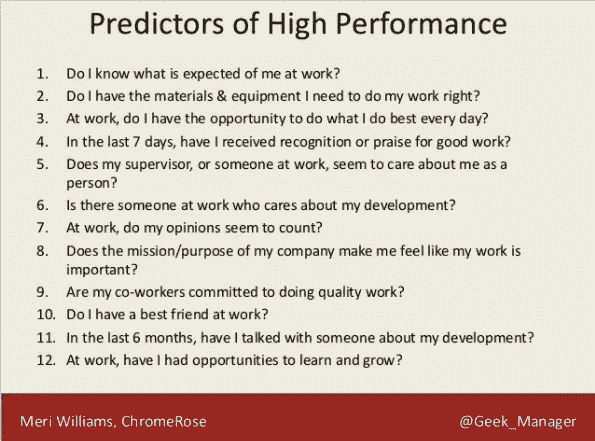

# 规模峰会 2018 笔记

> 原文：<https://medium.com/hackernoon/scale-summit-2018-notes-718f8231ab26>

今年，我参加了我的第三次 [Scale Summit](http://www.scalesummit.org/) 活动，这是一次关于构建可扩展的高性能系统的会议。

我总结了我参加的各种会议的[笔记](https://hackernoon.com/tagged/notes)

# 扩展团队和文化主题演讲

这一天以来自 [@Geek_Manager](http://twitter.com/Geek_Manager) 的主题演讲开始，题目是关于[扩展](https://hackernoon.com/tagged/scaling)团队&文化的 5 件事我希望我能早点知道…

 [## 规模峰会上的规模团队和文化主题演讲

### 今天上午，我很高兴在 2018 年 Scale 峰会上做开幕主题演讲，感谢大家的热烈欢迎。下面…

blog.geekmanager.co.uk](http://blog.geekmanager.co.uk/2018/03/16/scaling-teams-culture-keynote-at-scale-summit/) 

1.  干对人类交流不起作用

*   人们需要不止一次地听到一些事情，它才会被记录下来
*   架构决策记录显示了为什么事情在过去被完成的背景

2.扩展团队是为了创造成功的条件

*   [首先，打破所有规则](https://www.amazon.co.uk/gp/product/1416502661)

*   [了解驱动](https://www.amazon.co.uk/gp/product/184767769X)
*   目标、自主、掌握和包容

3.拐点

*   在不同的转折点，不同的东西是免费的
*   在较小的团队中，每个人都更容易知道发生了什么
*   在正确的时间关注正确的问题
*   你不是网飞，可能没有同样的问题
*   [被幸福绊倒](https://www.amazon.co.uk/dp/B002RI9IZQ)
*   人类编辑过去，不擅长预测未来
*   最有用的学习对象就在你面前

4.人员可观察性>测试

*   无论你如何努力，你的影响可能与你的意图不符
*   需要检查你的意图是否符合现实

5.文化添加比文化契合重要得多

*   专注于从差异中获得最大收益
*   我们不是可互换的资源单位

*   把人和角色看作是选角的问题
*   组建能力互补的团队

# 解决实际问题的实用方法

*   1 大型服务器比分布式系统更容易处理，而且成本和几个小型服务器差不多
*   由于必须进行手动故障切换等工作，自动化失败的风险可能大于停机时间的成本
*   更简单、更小的系统让您更快进入市场
*   犯错的代价与确保自己正确的代价相比是什么？
*   业务背景是什么
*   GDPR 可能会在不同的方向上降低冒险的成本
*   权衡 it 成为您必须维护的遗留系统的成本
*   遗留系统可能会变成你不了解的任何东西
*   弄清楚什么是优先事项，以及你为什么要做出权衡
*   您可以为遗留系统构建新的替代系统，但永远不会完全迁移到这些系统
*   在建造替代品之前，让旧的东西变得更好。隔离旧系统，将 API 放在它们前面
*   用问题来描述吉拉门票，这样你们可以讨论很多解决方案
*   当你发货时，你怎么知道它在工作？
*   解释“为什么我们可以只是？”

# 云孩子的锡

如果你只使用过云，如何处理一个需要你在“真正的”服务器上运行的项目

*   运行自己的虚拟机管理程序？像网卡这样的许多设备都支持直通虚拟机

杀戮和替代机器

*   可以网络引导和安装机器吗
*   这样做的速度会受到 BIOS 的限制
*   完全安装可以实现 10 -15 分钟的周期

创建基本规则，没有服务器是神圣的

*   牛不是宠物
*   构建任何东西时都要考虑可用性
*   有热备盘

*   原始硬件比 AWS 便宜
*   购买新硬件时，降低容量门槛
*   考虑支持包和硬件生命周期
*   将费用分类为顶点，而不是资本支出
*   你可以在 6 小时内得到一台新的服务器
*   容量规划需要是某人的工作
*   可以使用超出保修期的硬件，如 Jenkins
*   您拥有一个计算池，而不是具有专用作业的服务器
*   如果您继续在硬件上运行更多的虚拟机，您将在某个时候达到硬件的物理极限。例如，打开网卡是在硬件中完成的，直到在软件中进行模拟时速度要慢得多
*   必须处理磁盘故障
*   [Ubuntu 的金属即服务](https://maas.io/)
*   【Packet.net】T2 购买裸机电脑

# 生产绩效监控

新遗迹

*   易于上手
*   非常贵
*   向他们推送数据，如果你的服务器崩溃了，它可能无法推送你需要的关键数据

描摹

*   [齐普金](https://zipkin.io/)
*   [耶格](https://github.com/jaegertracing/jaeger)
*   [x 射线](https://aws.amazon.com/xray/)，便宜，UX 穷
*   采样可能会丢失您真正需要的痕迹
*   遇到错误条件后，不能选择追溯跟踪，需要选择在入口点跟踪
*   XRay < OpenTrace，因为您不能轻松地将其切换出来
*   很难开始，因为你需要人来修改代码
*   通过在黑客日炫耀来获得认同
*   如果上下文在线程之间传递，跨度跟踪可能会很棘手
*   即使只有一个线程，它也需要和你使用的所有库一起工作
*   对于新代码来说很容易，但是没有人真的会回去检测所有的旧代码

石墨 vs 普罗米修斯

*   如果您处于受监管的环境中，或者您的安全团队很难访问抓取端点，那么拉模型可能很难部署到现有项目中
*   推送网关可以解决这个问题
*   需要更改代码以公开 Prometheus 的指标端点
*   管理 TSDBs 很难
*   Prometheus 难以应对 300–400 个节点的 Kubernetes 集群，需要添加更多实例，联盟困难重重
*   宿主石墨很好，在顶部添加了警报

为什么要用普罗米修斯？

*   Kubernetes 为它添加了端点
*   标准化指标格式
*   可以向指标添加标签
*   查询语言和数据存储很好

[蜂巢？](https://honeycomb.io/)

*   很高兴看到更大的画面，然后深入到共同因素
*   不是日志记录的替代品
*   存储大量数据点的廉价方式，比自己构建和维护类似的解决方案成本更低
*   可以根据事件是成功还是错误对其进行采样

记录

*   买一个麋鹿栈，每个人都有，维护自己的很难
*   如果你有钱，Splunk 很棒
*   将跟踪 id 附加到日志中，以便可以将它们链接回来
*   为 Elasticsearch 打开异步写入

# 生产中的测试策略

登录 prod 并执行一系列操作的监控系统对房间里的一些人来说工作得很好

*   发现了属于其他团队的漏洞和问题
*   向请求添加标题，以将它们标识为测试运行，以便系统可以决定如何响应它。对于像支付系统这样可以丢弃请求并返回虚假数据的系统非常有用
*   需要确保在系统改变时更新模拟数据
*   与第三方 API 交互时要小心，因为发布看起来像垃圾邮件或命中率限制的数据，容易被禁止，并破坏您的 prod 应用程序
*   针对生产系统运行这些测试意味着它们还会向您可以监控的标准系统发出指标/日志

卡纳灵

*   允许您在环境之间切换名称
*   向用户子集展示您的代码，由特性标志等控制

*   如果您可以快速回滚，就不需要部署蓝/绿设备
*   [如何部署软件](https://zachholman.com/posts/deploying-software)
*   [Github 科学家](https://github.com/github/scientist)——用于安全测试新代码路径(可用于多种语言)

影子流量部署

*   小心你给下游系统带来的额外负担

复制流量的方法

*   在客户机中有代码，由向新老系统发出请求的特性标志控制
*   使用 Kafka streams 之类的东西来重放针对新系统的 prod 流量，或者将其传输到开发环境中

[特使代理](https://www.envoyproxy.io/)

*   对第三方 API 的请求进行速率限制
*   测试凭据交换

功能标志

*   将所有新特性放在特性标志之后，这样您就可以在早期小规模地部署它
*   请务必在结束时移除旗帜
*   产品所有者可以控制谁/何时打开标志

# 可观察性或者有没有人试过[蜂巢](https://honeycomb.io/)？

*   如果有事件，您可以生成指标
*   如果您只存储指标，您会丢失事件
*   可以将 CPU 峰值与系统中发生的其他事件关联起来
*   在事件过去之前，不知道您需要什么数据
*   指标显示，你有问题。可观察性向您展示异常度量的共同特征
*   [Etsy 天际线](https://github.com/etsy/skyline)

eBPF

*   很棒但很新，不是在很多内核中
*   可以挂钩到内核中发生的事件，没有开销
*   目前难以使用

# 自 2017 年规模峰会/对明年的预测以来发生了什么变化

*去年的预测*

**Alexa /语音接口无法使用**

*   美国似乎比欧洲更大
*   Homepod 似乎还没有起飞
*   [Alexa 嘲笑你](https://www.theverge.com/circuitbreaker/2018/3/7/17092334/amazon-alexa-devices-strange-laughter)
*   如果你住在一个小房子里，有一个 Alexa 控制你的锁，你可以在房子外面喊“Alexa 开门”

**生锈**

*   围棋似乎在运营领域很受欢迎，但在其他领域却不那么受欢迎
*   Firefox 伺服重写 Rust 大获成功
*   WASM 看起来很有趣

**英国退出欧盟**

*   还是一团乱，不清楚

**IR35 / Gov Tech**

*   人们一直在离开 GDS，没有人真正接管社区领袖的角色

**纱线**

*   包锁文件变得越来越流行
*   人们从 npm 转移到-> yarn
*   很难跟上软件包更新的速度
*   [dependent bot](https://dependabot.com/)，提醒你更新，并通过互联网查看新版本的测试运行结果，以测试其安全性

AWS 上的 Kubernetes

*   发生
*   所有主要的云现在都有它
*   还没有准备好黄金时间，作为一个营销事件在 reinvention 上发布
*   Kubernetes 很复杂， [Nomad](https://www.nomadproject.io/) 更容易运行，如果你打算自己做的话
*   现在，在 Kubernetes 上管理有状态服务让人兴奋不已

**麋鹿 CVE**

*   没有发生
*   意外暴露在互联网上的 Elasticsearch 集群勒索软件

对明年的预测

**不杀死宿主的更聪明的病毒**

*   隐藏和挖掘加密货币更有价值
*   直到市场崩溃

**SWE 道德规范**

*   将成为更热门的话题，在沃尔沃事件后越来越多
*   机器学习伦理将成为一个更大的话题
*   对机器学习的更多攻击

**幕后众包**

*   使用机械土耳其人
*   Duolingo 与学习相反语言的用户交换翻译
*   会继续增长

**更多针对硬件的攻击**

*   也许针对 AMD 芯片的新攻击[已经发生](https://www.wired.com/story/amd-backdoor-cts-labs-backlash/)？

**一个国家的 CA 链将被撤销**

**社交媒体监管**

*   谁为你看到的广告付费更加透明
*   越来越多的垃圾邮件看起来像是人类写的

**私营公司将开始与政府部门竞争**

*   城市制图车。

你可以在 [#ScaleSummit18 标签](https://twitter.com/search?f=tweets&q=%23ScaleSummit18&src=typd&lang=en)上查看该活动的推文，我甚至是其中之一