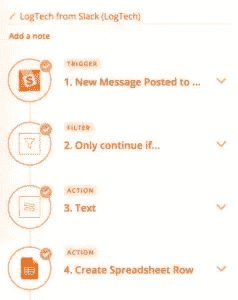
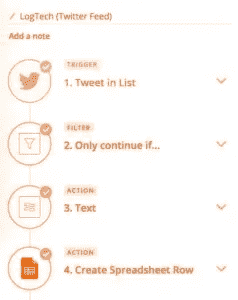
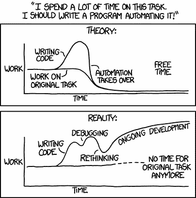
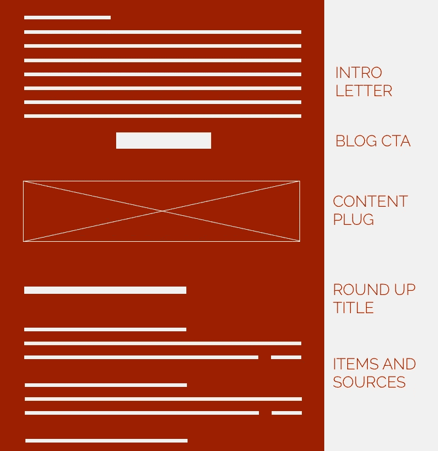

# 在 2 小时/月内扩展 10K+读者 B2B 时事通讯[How To]

> 原文：<https://medium.com/hackernoon/scaling-a-10k-reader-b2b-newsletter-in-2-hours-month-how-to-4663e2c80992>

**我太忙了，没时间阅读这篇概述:**

*   提供价值的时事通讯非常有用。但是策展是一个 b$%h。
*   识别正确的数据源，然后使用它们自动管理[时事通讯](https://hackernoon.com/tagged/newsletter)项目(Twitter 列表、内部 Slack 频道和一些聪明的 Zapier 功夫)可以帮助你通过令人难以置信的消息灵通的时事通讯扩大你的用户群。
*   找到合适的时事通讯指标进行跟踪。我的最爱？潜在客户细分和打开/发送的用户交互。

## 时事通讯很重要。尤其是 B2B。

[脸书关掉出版商的水龙头](https://techcrunch.com/2018/01/28/how-publishers-will-survive-facebooks-newsfeed-change/)证明了**拥有**的直接访问是至关重要的，让用户和潜在客户的电子邮件变得非常重要。但是一封[电子邮件](https://hackernoon.com/tagged/email)并不能作为一个很好的借口来锁定用户群。这就是为什么一份优秀的时事通讯是一座金矿，可以在销售周期中保持领先地位，从读者那里获得有机转发，并细分潜在客户。

带着这些目标，我想与社区分享我构建特定行业 B2B 时事通讯的策略，这有助于 [Freightos](https://www.freightos.com/) 扩展一个超级有针对性的五位数分发列表**经常达到 30%以上的打开率**。

最精彩的部分？只需**不到两个小时的工作/月**——一年一天的工作，就能获得来自顶尖潜在客户的 40，000 多个印象。

# 我是这样做的。

## 第一步:发现你的利基。

从**定义你的简讯的目标**开始，无论是培养销售就绪状态的潜在客户，品牌知名度，还是其他任何东西。

然后**决定你的目标是谁**。更节俭的观众选择意味着更少的时间在推广标签土地和更多的时间查查电子邮件香格里拉。

最后一步？找到他们生活中缺少的东西。Groove 的[100K 之旅](https://www.groovehq.com/blog/100k)为创业者提供了创业的最新信息。产品搜索用新产品的每日文摘杀死了它。你选择的具体内容类型将决定**频率**。

例如，我想去物流公司找技术决策者。如果你认为这听起来很无聊，那你绝对是对的。因此，我决定通过展示他们领域中真正令人敬畏的技术发展，让他们感觉自己是自内燃机以来最酷的东西:

*   **观众**:物流公司的技术决策者
*   **目标**:持续认知，推动销售漏斗
*   **利基**:展示物流技术
*   **频率**:每月

内容监管时间到了。

## 第二步:精心策划。自动地。

高德纳咨询公司的顾问靠报告市场趋势获得报酬。营销人员不会。

为了节省成本，我需要一种自动编译最佳更新的方法。好消息是，我公司内外的人已经在为我的时事通讯策划行业新闻了…他们甚至不知道。

[输入我与扎皮尔的恋情](http://www.buchman.co.il/how-to-build-a-die-hard-user-base/)，帮助我自动策划:

*   公司内部知识
*   外部思想领袖
*   媒体

## 挖掘我公司的知识源泉。

像 Slack 上的许多公司一样，我们有两个行业新闻频道:一个竞争频道(*#竞争*)和一个行业新闻频道(*#日志技术-更新*)。这两个网站本质上都是众包新闻聚合器，由业内最优秀的人——我的同事们——编辑。我只需要在月底编辑时事通讯的时候，让这些裤子变得容易分析。

## **扎皮尔魔法:**

1.  我们的#competition 或#logtech-updates 频道发布了新的 Slack 消息。
2.  Zapier 的过滤确保只有带有非 Freightos 链接的邮件继续在流中流动。
3.  Zapier 格式化程序隔离从 Slack 通道发布的 URL。
4.  在我的简讯谷歌电子表格中存储链接、消息内容和日期

## 外部固化

这个行业只用了几个月的时间就发现了经常分享精彩内容的 Twitter 移动用户。我将它们添加到一个私人 Twitter 列表中(这是使用 Twitter IMO 的最佳方式),并使用 Zapier 轻松地将它们存储在我的 Google 时事通讯电子表格中。

## **扎皮尔魔法:**

1.  在 Twitter 列表中创建一条新的 Tweet
2.  Zapier 的过滤确保了一个 URL 的存在，并且该推文是一个转发
3.  Zapier 的格式化程序隔离了推文的 URL
4.  在 Google Sheets 中创建了一个新行，包含 Tweet URL、发布 Tweet 的用户、赞、转发和描述

我应该提到，我试图用 Hootsuite 来管理这个列表，但是浏览一个月的 tweets 是完全不可伸缩的。

## 媒体

虽然 95%的时事通讯内容来自自动化来源，但我每月都会在 TechCrunch、Verge、Wired 和 Mashable 上运行一个快速的*网站:www.domain.com* 搜索，根据上个月的结果进行过滤，并添加关键词，以确保我没有错过任何重大信息。

这个*可以*自动化……但是我坚信只有自动化的事情才能节省时间，并且发现在这个过程中仍然有太多的猜测。

XKCD 承担自动化的任务

根据我的 Twitter 列表的推文、内部 Slack 消息和有趣的媒体阅读，我只剩下一个 URL、描述、日期和 Twitter 参与细节的电子表格。剩下我要做的就是从 300 个项目中挑选出 15-20 个项目，留给我的是:

*   一个源域，剥离路径混乱(即 techcrunch.com)
*   源 URL
*   描述

该开始写作了。

## 第三步:发表社论。

在这一点上，我可能已经花了大约 10 分钟为这个月的时事通讯整理内容。但是布赫曼妈妈没有培养出懒惰的作家…所以我打开每一篇我想分享的文章，用 20-25 个字的描述来总结，加上一个有趣的标题。

大约 20 分钟后，我已经准备好了最好的行业新闻。这意味着是时候发表社论了。

我明白了，人们不想要*只是*更新——他们需要真实的、人类的声音。每份时事通讯都以大约 150-200 字的评论开始。它可以基于我最近看的一部电影，我读过的一篇文章，或者一个随机的谷歌搜索…但是它需要插入时事通讯的总主题。

记住，为了提高投资回报率，读者最终需要回到你的网站。因此，在 lead insight 之后，我会向读者推荐我们网站上的一篇长篇博文，后面是我们策划的每月行业综述。头条通常会获得 12%-15%的点击率，这对我来说很好。

由于最终结果是一份信息量惊人的简讯(如果我自己这么说的话)，我会偶尔大声喊出历史内容或我们创建的免费工具，作为简讯各部分之间的广告。无论如何，**每一条内容都应该提供价值**。

Wireframe of the roundup newsletter

## 步骤 4:根据参与度进行修剪和细分。

## 确保出色的指标

对自己狠一点。如果你的打开率不在那里，你要么用诱饵和开关建立你的列表，要么不提供优秀的内容。为了确保我在轨道上，我跟踪打开率和点击率(咄)，我也喜欢跟踪独特的电子邮件打开的数量。伟大的、信息丰富的电子邮件有被转发的趋势；我希望每个收件人平均打开两次，这是你的邮件被转发的好迹象。

## 收集见解

通过跟踪常规阅读行为，你可以获得超级英雄级别的洞察，了解你的用户想要什么。如果你的 VIP 用户点击进入关于具体竞争对手的文章，这对你的销售团队来说是无价的信息。看到有人点击产品更新，也是无价的。在我上个月的电子邮件中，我看到一家顶级物流公司的 R&D 副总裁点击了一个链接，内容是他们的竞争对手正在与另一家初创公司合作。我来的地方是纯金的。

## 盆景树吧。

盆景树可以定期修剪高达 10%。你的邮件列表也可以。炒掉不开邮件的人。我喜欢发出电子邮件，询问未参与的用户是否想要退订——如果他们不打算进来，就没有理由让他们在派对入口处徘徊。

## 接触超级明星。

我最喜欢与读者建立关系的一个方面是，偶尔，你可以通过请求在许可营销银行建立信用。对我来说，这有两种形式:

1.  **贡献内容:**我喜欢邀请人们参与调查，然后我们将调查结果转化为内容。这将带来更多的电子邮件。这创造了一个神一样的内容营销循环。
2.  **推产品:**不要害怕，等时机成熟了，就来求婚。无论是在 PS 中，针对细分的有购买意向的用户的目标电子邮件，还是真正有趣的新产品发布，你都必须偶尔尝试将人们推入漏斗。

尽情享受吧！

*自动化时事通讯很容易。让你的鼓掌自动化有点难。如果你喜欢这个，展示一些*💗和👏走开。