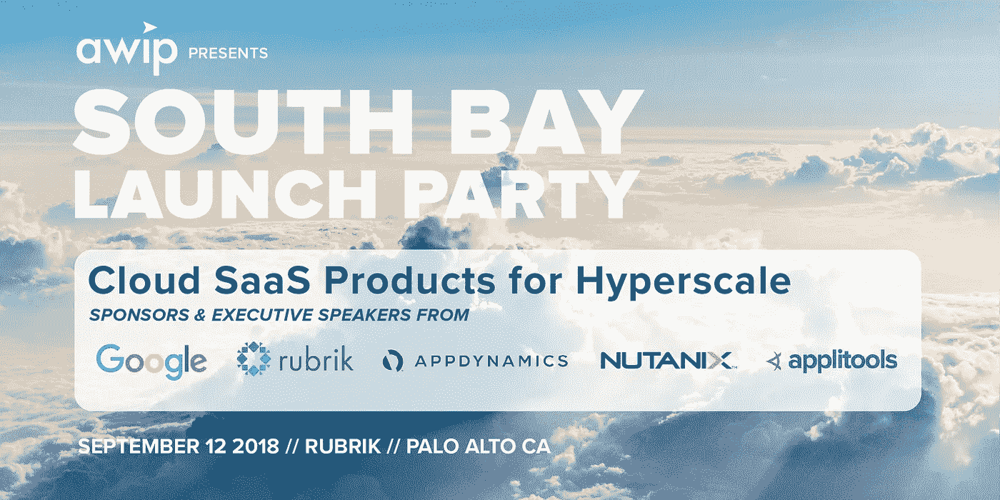
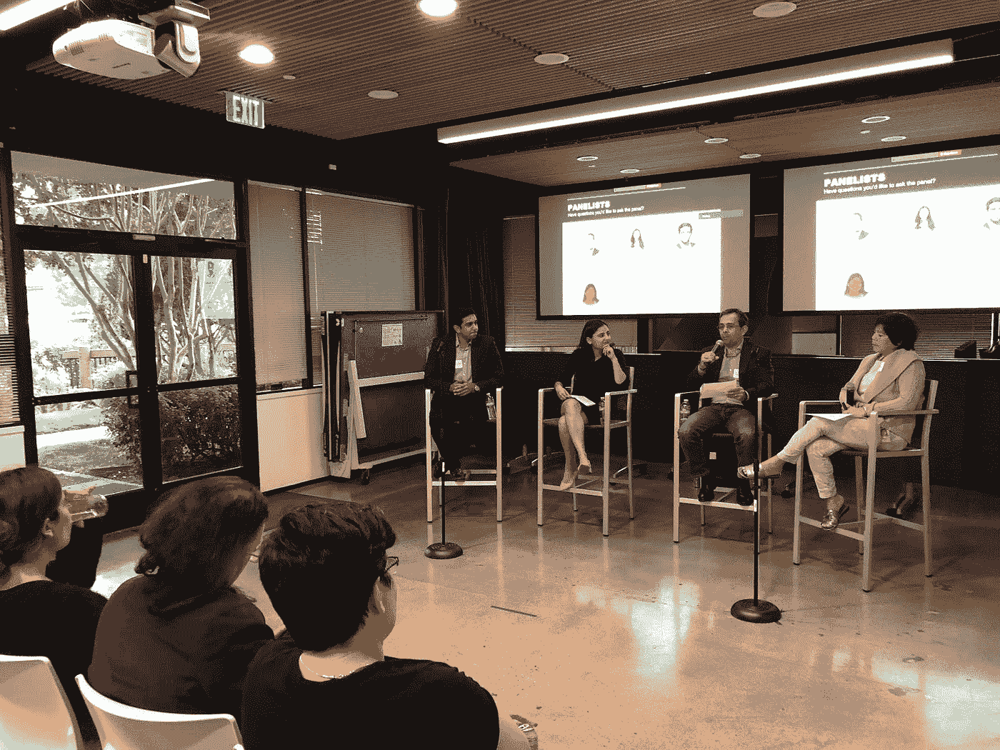

# 提升 B2B SaaS 产品的超高增长——提升女性产品地位的活动(AWIP)

> 原文：<https://medium.com/hackernoon/scaling-b2b-saas-products-for-hypergrowth-an-event-by-advancing-women-in-product-awip-b26e5bc33c8e>

演职员表:产品团队中前进的女性，[*阿洛克·古普塔*](https://www.linkedin.com/in/alokg95/) *，* [*卡普尔*](https://www.linkedin.com/in/kanika-kapoor/)

传统上，企业软件行业中的公司与基于消费者的同行有很大的不同。虽然消费类公司专注于快速迭代周期，极度关注用户体验和消费者病毒式传播，但企业公司已经被定型为移动速度慢得多，更强调企业客户的纯功能。

然而，企业行业最近经历了重大的发展和变化，行业更多地转向基于云和软件即服务(SaaS)的解决方案，Salesforce 是先驱。值得注意的是，这允许更快的产品迭代，更多的指标(作为更快的速率)来帮助驱动数据驱动的决策，以及更可预测的经常性收入模型。此外，为 hypergrowth 构建这些 SaaS 产品要求产品经理重新思考他们如何构建这些产品并将其交付给客户，以便为客户实现即时价值最大化，并保持粘性，从而保持和增加他们的收入流。

为了分享她们的故事，讨论她们为实现高速增长而打造 SaaS 产品的方法，[Advancing Women in Product](https://www.advancingwomeninproduct.org/)(AWIP)在 Rubrik 位于帕洛阿尔托的总部举办的首届南湾分会活动上，邀请了一批产品经理。专题小组的主讲人有 [Shay Mowlem](https://www.linkedin.com/in/shaymowlem/) (产品的 SVP，Rubrik)[Nikita Maheshwari](https://www.linkedin.com/in/nikita-maheshwari/)(Nutanix 的产品总监)[Aakrit Prasad](https://www.linkedin.com/in/aakritprasad/)(appli tools 的产品副总裁)[Judy Chang](https://www.linkedin.com/in/judychang95070/)(Google 的高级产品经理)。以下是小组讨论的一些要点。

你如何定义一个成功的 B2B 产品？你在这个领域看到了哪些趋势？

从 10 到 15 年前我们认为客户体验可能很重要，我们已经发展到认为它是产品成功的绝对基础。Shay 分享道，这种转变已经近乎疯狂地聚焦于客户，他们使用产品的体验，以及帮助他们尽快理解产品的真正价值。

如今，企业客户希望他们的企业产品设计和体验像消费产品一样简单易用。为此，Nikita 分享说，在 Nutanix，他们有一个完整的团队，专注于尽快设置和安装产品。此外，让尝试新产品变得容易并提升这些额外产品的价值是绝对重要的。要做到这一点，尽量减少尝试这些新产品和服务的摩擦，就等于是业务的增长。能够快速扩展的公司拥有快速设置、安装和开始使用的产品。

除了 Salesforce，你能想出一家在易用性和卓越体验方面做得非常好的 SaaS 公司吗？

Atlassian 是另一家在该领域表现出色的公司的一个很好的例子。尽管他们的一些产品做得不太好，比如他们的 Slack 竞争对手 Stride，但他们仍然很好地满足了目标用户群的需求。具体来说，他们在构建一套通用的开发工具方面做得很好，与他们的核心用户产生了很好的共鸣。他们的主要产品(JIRA，汇流，比特桶等。)取得了巨大的成功，为客户日常面临的问题提供了出色的端到端解决方案。产品设计精良，易于使用，Atlassian 在使尝试和购买额外服务/附加服务变得容易方面做得非常出色，这表明考虑到公司多年来令人印象深刻的增长。

另一个高度关注易用性和客户体验的公司的例子是 AppDynamics。作为尼基塔和她的团队进行的一项研究的一部分，他们发现 AppDynamics 的设置过程只需要三次点击就可以开始使用该产品。最大限度地减少摩擦，以便开始使用产品，这有助于客户快速了解产品的真正价值主张，以及它如何为他们解决问题。对于企业来说，这可能意味着更快的销售周期，更强的产品粘性，以及更多的机会向客户追加销售传统产品以外的新服务或插件，通过这一循环产生额外的增长。

**有了 SaaS 的产品，你可以快速获得指标/结果，并在此基础上进行迭代。面对所有这些不同的数据点，如何最有效地确定特性的优先级？**

事实上，随着 SaaS 产品提供更快的反馈循环，获得产品的度量、结果和一般性能指标比以往任何时候都更容易。你可以看到你的产品表现如何，你的客户喜欢这个产品，它是否为这些客户创造了价值，它是否是一个粘性的解决方案。当 Nutanix 从 250 名员工发展到今天的 4000 多名员工时，Nikita 曾在 Nutanix 工作，他解释了该公司如何轻松地优先考虑您的大客户想要的功能，因为这最容易推动您的指标，特别是收入数字。然而，同样非常重要的是，也要关注客户的尾端(在规模上),以构建适用于所有客户的功能，而不是为通常可能有特定定制需求的较大的个人客户提供特定的解决方案。虽然在短期内，您可能不会注意到它的直接影响，但随着时间的推移，您会注意到它，因为这些适用于多种类型客户的功能将有助于吸引新客户，并进一步推动您的业务。

了解和认识客户的需求很重要，但你不能让这完全支配你的产品路线图和规划。为了在市场中保持领先，重要的是要为未来做好计划，并了解冰球的发展方向，而不是只关注冰球的现状。此外，在向所有客户推广之前，尝试、快速失败和验证客户子集的发布的能力对于保持领先地位非常重要。客户总是会提出他们的需求，但作为产品经理，能够将这些需求提炼到您的路线图中是很重要的，该路线图映射了您基于公司业务目标的战略。

**你如何花时间为你的产品考虑 10 倍，并为实现这一目标制定策略？**

当你专注于产品的成长和成功时，往往很容易有狭隘的眼光，而忽略了更大的画面和前景。后退一步，理解你今天的产品策略如何与你为未来 X 年的业务发展所设定的目标保持一致，这是非常重要的。

在 Rubrik，Shay 不仅专注于成为一家价值数十亿美元的公司，还了解他们在未来 4-5 年内需要达到的目标。我们的目标不仅仅是获得高估值，而是专注于如何成为企业市场中的主要公司，加入 Salesforce 和 Oracle 这样的公司。接下来的主要问题是，如何在核心备份和恢复的基础上不断创造增值，以保持如此快速的增长，从而随着时间的推移创造指数级的价值。

**你们公司有多少女性项目经理？你们公司的项目经理中女性占百分之多少？**

这里的普遍共识似乎是“低于应有水平”。在 AppDynamics，**20 个产品经理** **中只有 3 个是女性。**Nutanix 的情况类似，在**60 名产品经理中只有 4 名是女性。**

显然，这些公司中女性项目经理的比例不平衡，这反映了整个行业，尤其是 B2B 公司。然而，让女性参与到产品中来是很重要的，因为这有助于思想的多样化，并提供对产品的成功有影响的额外观点，因此也是企业的底线。尼基塔解释说，最初，作为一名女性产品经理，她在一个充满男性的房间里受到了威胁，但当她发现自己能够提供男性同行没有的新观点和观点时，她将这变成了她的优势。

**关于扩展的话题，作为一名产品经理，你如何帮助一家公司快速发展？你如何实现自己的目标？**

通过这种方式，你很容易每天深入研究你的产品，形成一种狭隘的观点。然而，重要的是要把自己推出去，了解行业的更大图景和前景。尼基塔通过参加会议来了解趋势的转变，了解该领域的新发展。为了进一步扩大对客户的了解，她在 Nutanix 的阿姆斯特丹办事处呆了 3 个月，以便更好地了解她的欧洲客户，这些客户的需求通常与她习惯交往的传统美国客户不同。收购公司时，与首席执行官坐下来了解他们的故事、背景和他们来自哪里，有助于更好地了解公司的背景、使命和用户群。此外，在快速发展的公司工作提供了一个独特的机会，可以和许多新朋友交谈，向他们学习，帮助他们进一步拓宽你的视野。

总的来说，AWIP 的首届南湾分会活动是成功的，这些产品经理提出了许多有见地的观点，他们正在努力扩展这些 B2B 产品以实现超增长。

**关键要点:**

*   极度关注你的客户、他们的需求、要求和反馈。
*   让开始使用产品的过程尽可能简单——让你的客户花更多的时间使用产品来了解它的价值，而不仅仅是安装它。
*   拥有广泛的视角很重要——虽然很容易迷失在产品的日常工作中，但还是要花时间走出去，了解行业的现状和发展方向，并更好地了解整个行业。

要观看由 AWIP 主持的整个小组讨论，你可以[在这里](https://youtu.be/4mYqZQlfcjU)观看完整视频。

**如何了解最新动态:**

[Sign up!](https://www.advancingwomeninproduct.org/) // Follow us on [Facebook](https://www.facebook.com/advancingwomeninproduct/), [LinkedIn](https://www.linkedin.com/company/18170634/) and [Twitter](https://twitter.com/theAWIP)

*   [喜欢 AWIP·脸书的那一页](https://www.facebook.com/advancingwomeninproduct/)
*   [关注 AWIP 的推特](https://twitter.com/theawip)
*   [注册我们两周一次的时事通讯更新](http://eepurl.com/c4NaOH)