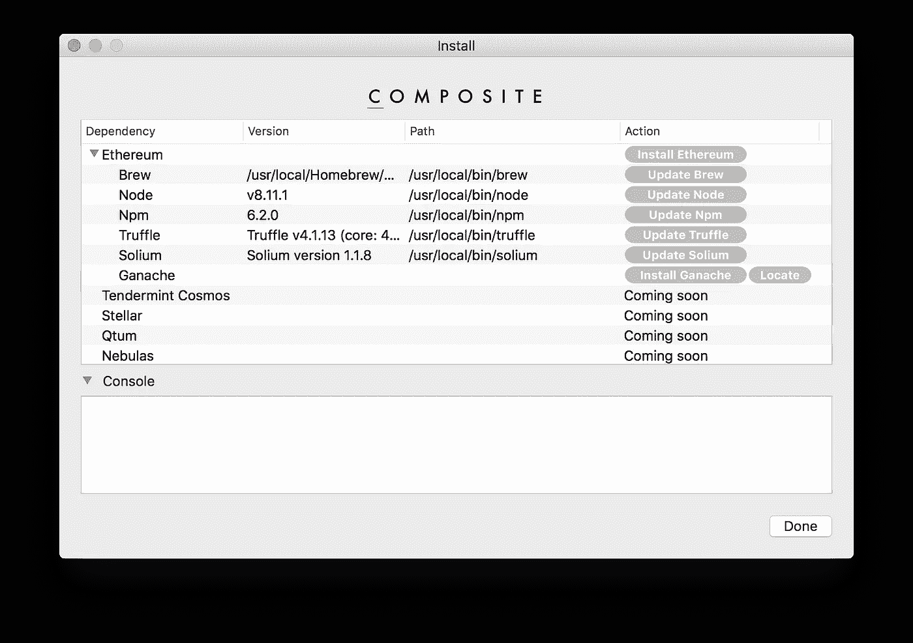
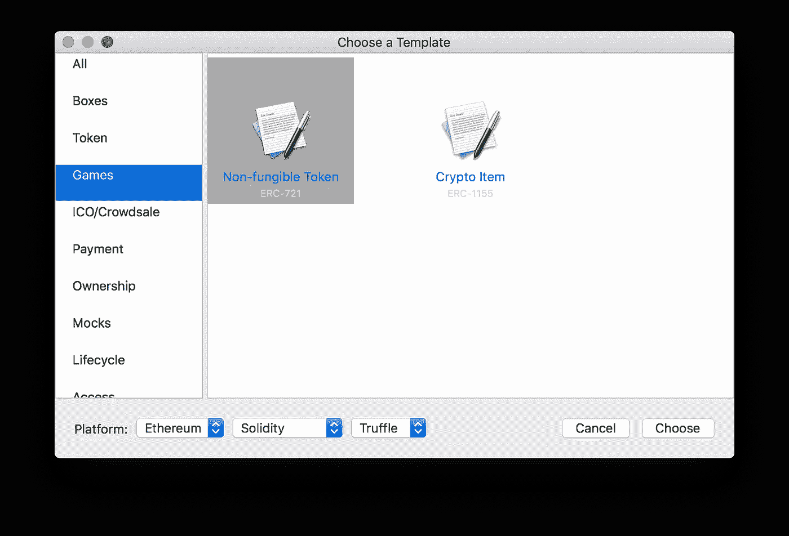
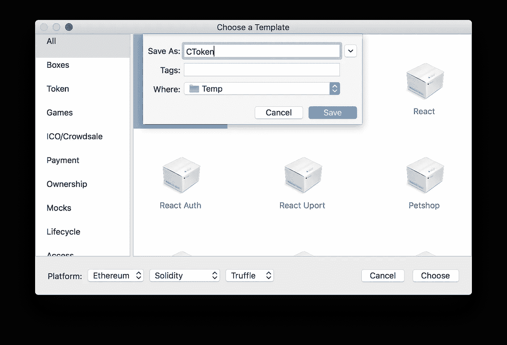
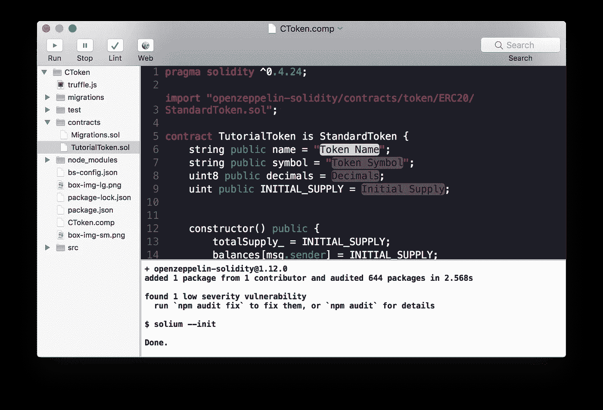
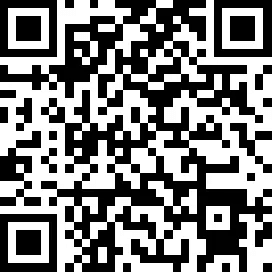

# 扩展加密用户体验

> 原文：<https://medium.com/hackernoon/scaling-crypto-user-experience-c7d5280eb477>

你认识的人中有多少人已经安装并设置了钱包，并且经常使用 [crypto](https://hackernoon.com/tagged/crypto) ？根据你的计算方法，目前的加密用户不太可能超过总潜在市场的 1%。

目前的低采用率可能表明加密的巨大增长潜力。想象一下多 10 倍的用户意味着什么——这仍然只占潜在市场的 10%。另一方面，我们也有可能永远达不到 10%。正如[瓦伦·马图尔在这篇推特风暴](https://twitter.com/varun_mathur/status/1038107664868208640)中正确指出的，有前途的技术以前失败过。

# 加密挑战

是什么阻碍了加密技术的广泛应用？我看到了三个尚未解决的主要问题:

*   可伸缩性(系统可以处理多少并发用户或事务？)
*   实用程序(我可以用它来做什么？)
*   用户体验(易用性如何？)

业内最聪明的头脑目前正致力于扩展区块链技术。一旦解决了扩展问题，效用将是下一个关注的领域。为了增加效用，良好的用户体验是必不可少的。

就精力和金钱花在哪里而言，用户体验目前似乎没有得到充分体现。当前的工具和应用程序将我们从 0 带到了 1%，但接下来的 10%用户可能不愿意(或不能)弄清楚经常令人困惑的界面。

# 从客户体验入手？

史蒂夫·乔布斯曾经说过:“你必须从客户体验开始，然后回溯到技术”。不幸的是，crypto 没有这种奢侈。正如 [Turbo Pascal](https://medium.com/u/f469d4d41280#Motivation_and_release) 的推出，这一切都改变了。创新之处在于将所有独立的工具打包到一个集成开发环境(IDE)中。这是第一次，整个开发工作流程可以被一个应用程序覆盖。Turbo Pascal 简化了编辑-编译-运行-调试循环。(49 美元的低价和异常好的文档也有帮助)

Borland 在最初的 2.5 年里卖出了 40 万份。考虑到潜在市场总量估计只有 30，000 个，这一点尤其令人印象深刻。Borland 创造了一个无人知晓的市场。

Turbo Pascal 成功的一个意想不到的副作用是 MS-DOS 应用程序的数量激增，从而促使 MS-DOS 成为主导平台。

# 复合:用于区块链的 Turbo Pascal

加密迫切需要它的涡轮帕斯卡时刻:一个如此强大和易于使用的工具，dApps 的数量和质量都将飙升。这样，更高的效用和更好的用户体验都将得到解决。

我一直在开发一个开源编辑器，它可能会成为区块链的 Turbo Pascal，称为 Composite。这是市场上最简单的开发工具。因为它是在 Swift/Cocoa 中开发的，所以它也是最快的开发工具。它快如闪电。

1\. Installing the toolchain and keeping it up-to-date is finally a breeze.

2\. Creating a new project is as easy as choosing a templates. You’ll be able to create your own templates in future versions.

3\. Name your new project.

4\. Editing, debugging, and deploying all from one single easy-to-use application.

# 那些不是以太坊的区块链呢？

Composite 当前的 alpha 前版本仅支持以太坊，但 Composite 旨在支持更多的区块链。我很想增加对更多区块链的支持，让每个区块链都能轻松开发 dApp。

如果你是一个聪明的合同开发者，并且喜欢在另一个区块链而不是以太坊上使用 Composite，请留下评论。

如果没有人收养或使用，区块链有什么价值？

没有用户或用途的区块链没有多大价值。Composite 使得区块链很容易吸引高质量的开发者，并让他们开发有用且易于使用的 dApps。如果你正在开发一个区块链，并且希望看到对你的区块链的复合支持，[给我发邮件](mailto:info@composite.app)。

# 下一步是什么？

*   如果你想了解复合材料的最新发展，请加入复合电报小组:【https://t.me/joinchat/F84Ewkd5t-RLL26-Wj7tPA
*   如果你喜欢测试 Composite 的预 alpha 版本，或者对在 Composite 中添加对你的区块链的支持感兴趣，[给我发电子邮件](mailto:info@composite.app)。
*   如果你在一家加密公司工作，并且对复合支持你的区块链感兴趣，[给我发电子邮件](mailto:info@composite.app)。
*   复合材料是自筹资金。如果想支持 Composite，可以考虑捐赠比特币:3 badhnwyuk 54 zva 1 drtj 6 jj 8 H2 bjz 63 RC或者以太坊0 x7e 77 BF 36 DAE 7202927 fbf 91 a5 f 9 e 2e 4 e 1837 f 077。提前感谢。

Bitcoin

Ethereum