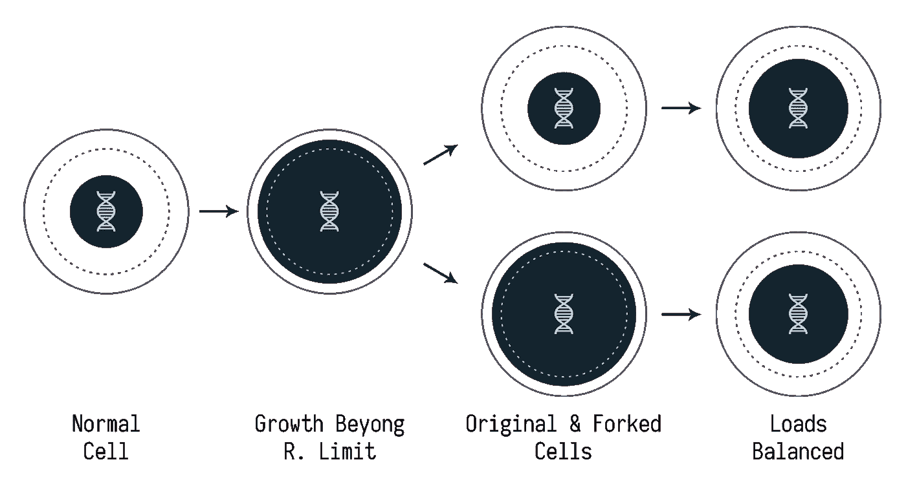

# 通过分叉扩展微服务

> 原文：<https://medium.com/hackernoon/scaling-microservices-via-fork-ing-37f8f9b3266c>

## 构建本地可扩展的微服务

Image from LONGLONGLIFE.org

# 介绍

几乎所有熟悉[微服务](https://hackernoon.com/tagged/microservices)架构的人都听说过*扩展*。伸缩是通过运行一个服务(容器)的多个实例来实现负载平衡的过程。

在任何现有的编排平台中，可以自动或手动进行扩展。但是，这两种方法都需要某种管理来决定微服务何时需要扩展。本文介绍了一种由操作系统调用驱动的自主扩展方法，无需外部干预。

# 动机

自治是微服务架构的主要原则之一，对于构建敏捷生态系统至关重要。在敏捷生态系统中，除了开发中的敏捷性，微服务还需要对操作条件做出即时反应的权限——高工作负载就是其中之一。当一个微服务承受高负载时，通过自我复制来降低其工作负载会更加方便快捷。

这有点类似于身体细胞的行为。当一个细胞生长时，在某个时候，它可能会经历一个分裂期，分裂成两个更小的细胞。

微服务通常被允许使用一小部分系统资源。将*增长*定义为与总可用资源相关的资源消耗量，当增长达到某个极限时，就是微服务进行复制的时候了。

Replication via Fork-ing

此外，通过这种方法，为了实现高可用性，不需要在出现故障时重新创建微服务，因为它的位置将被新一代自动取代。但是，需要最小数量的副本来防止早期故障导致的突然死亡。

# 履行

微服务通常作为单个操作系统进程来实现。操作系统中进程的复制被称为*fork*ing。系统调用创建一个子进程作为调用进程的精确副本。下面是使用`fork`函数在 C 语言中实现复制的一个例子:

在上面的代码中，`fork`创建了一个新的子进程，并根据函数的结果返回父进程及其子进程。随后，在子流程中，需要调用`execv`函数来将子流程从其父流程中分离和隐藏。否则，当子进程死亡时，它将变成一个僵尸进程，直到父进程*等待*或死亡时才会被清理。

# 缺点

请注意，本文中介绍的复制方法并没有消除对编排的需求。编排平台仍然需要播种微服务，即第一次实例化，并通过对允许的副本计数施加限制来控制系统资源利用。

另一方面，并不是所有的[编程](https://hackernoon.com/tagged/programming)语言都可以与 OS 系统调用交互，一些其他的语言出于安全考虑可能会阻止它们。但是，有一些方法可以解决这个问题，例如，通过直接执行程序或使用帮助服务来创建新的进程。

同样显而易见的是，fork-ing 只能在容器中使用，不能实例化新的容器。这与当前编排平台扩展微服务的方式形成了对比。但是，通过在新的集群节点上播种微服务，仍然可以支持集群。

# 阅读更多

这是实现创新的微服务架构所采用的思想，称为有机服务架构。你可以在这里阅读更多关于这个想法和建筑[的起源。](/@aslrousta/organic-service-architecture-concepts-47f1331d38f8)