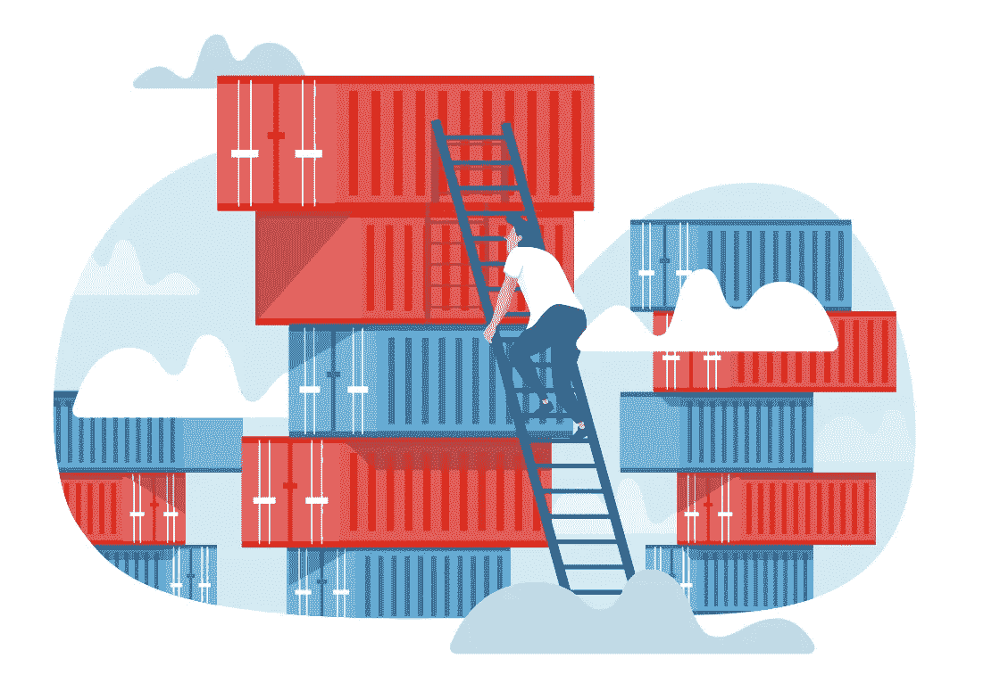
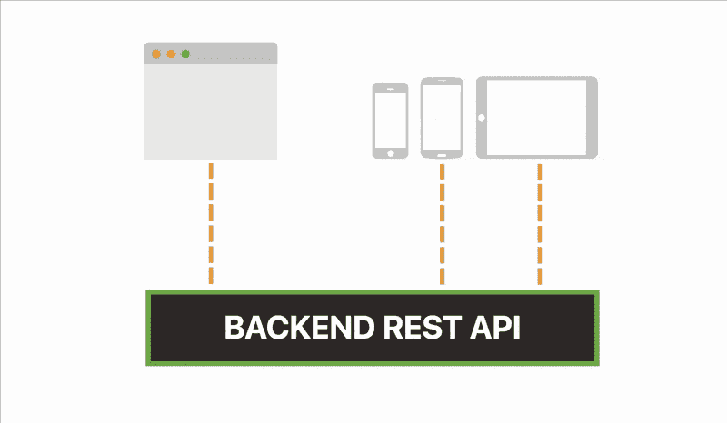
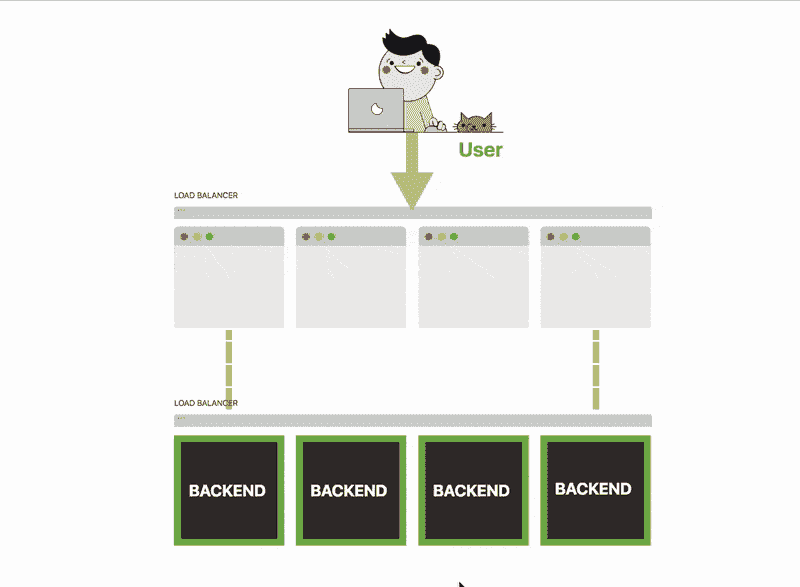
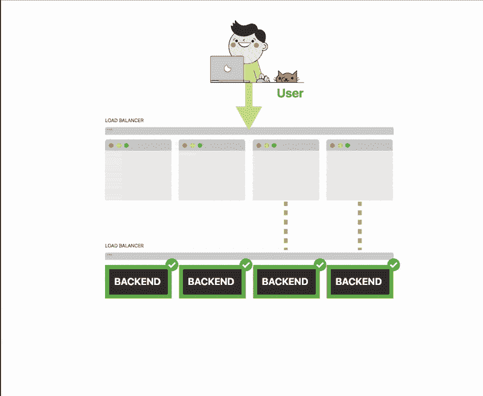
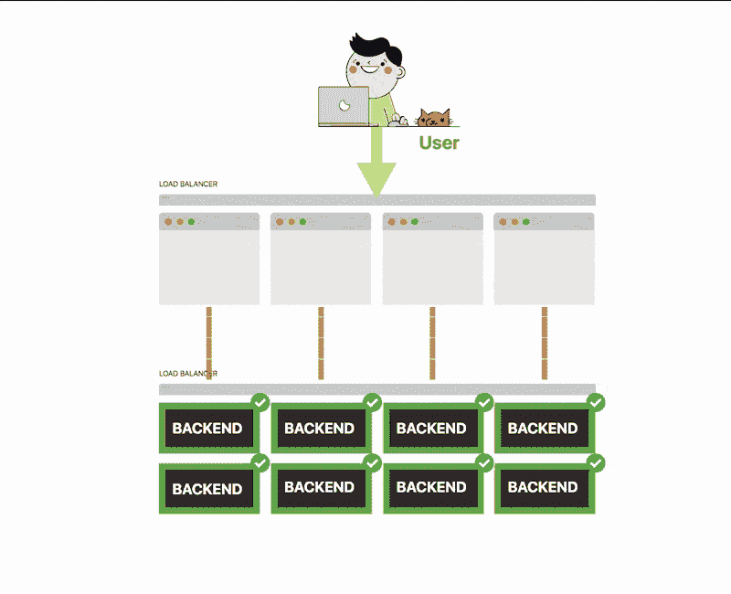
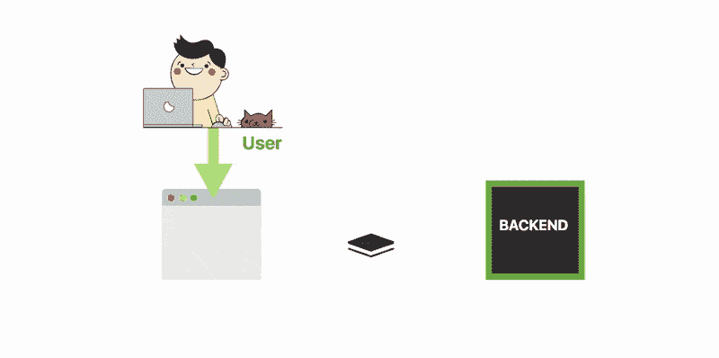
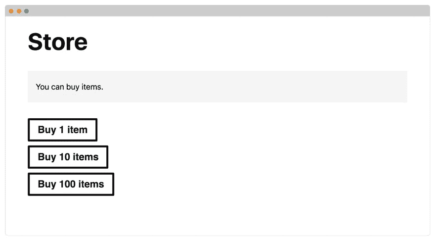
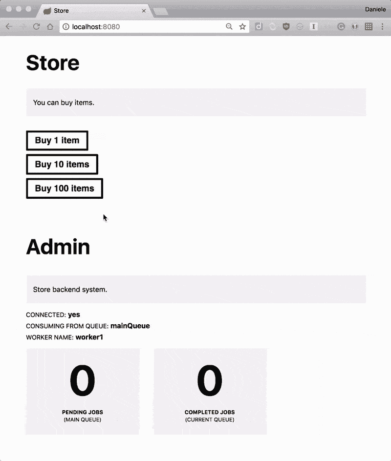
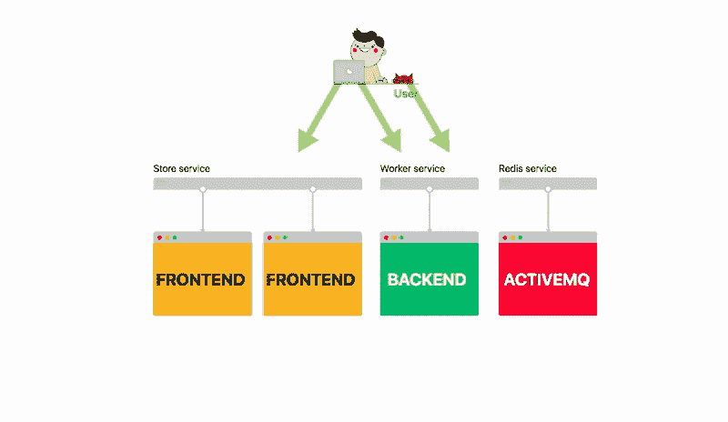
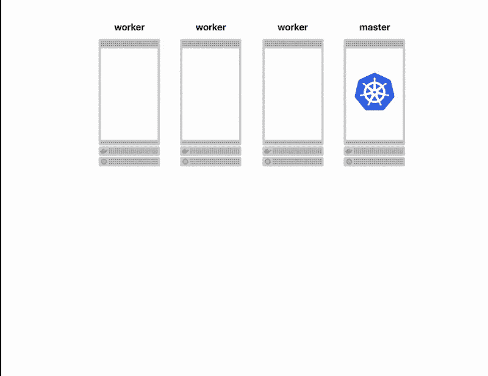

# 通过消息队列、Spring Boot 和 Kubernetes 扩展微服务

> 原文：<https://medium.com/hackernoon/scaling-microservices-with-message-queues-spring-boot-and-kubernetes-9ba4b0e48bdf>



当您大规模设计和构建应用程序时，您需要应对两个重大挑战:**可伸缩性和健壮性**。

您应该设计您的服务，以便即使它受到间歇性重负载的影响，也能继续可靠地运行。

*以苹果专卖店为例。*

每年都有数以百万计的苹果用户预先注册购买新的 iPhone。

那是数百万人同时购买一件商品。

如果您将苹果商店的流量描绘为一段时间内每秒的请求数，图表可能是这样的:


现在，假设您面临构建此类应用程序的挑战。

**你正在建立一个商店，用户可以在那里购买他们喜欢的商品。**

您构建一个微服务来呈现网页和服务静态资产。

您还构建了一个后端 REST API 来处理传入的请求。

您希望将这两个组件分开，因为使用相同的 REST API，您可以为网站和移动应用程序提供服务。



今天是个大日子，你的店开始营业了。

您决定将应用程序的前端扩展到四个实例，后端扩展到四个实例，因为您预计网站会比平时更加繁忙。



你开始收到越来越多的流量。

前端服务正在处理流量罚款。

您注意到连接到数据库的后端正在努力跟上事务的数量。

不用担心，您可以将后端的副本数量扩展到 8 个。



你收到的流量越来越多，后端处理不了。

一些服务开始断开连接。

愤怒的顾客联系你的客服。

现在你淹没在车流中。

你的后端处理不了它，它会丢失大量的连接。



你刚刚损失了一大笔钱，你的顾客很不高兴。

您的应用程序没有被设计为健壮和高度可用:

*   前端和后端是紧密耦合的— *事实上，没有后端 it 就无法处理应用程序*
*   前端和后端必须协调扩展— *如果没有足够的后端，您可能会淹没在流量中*
*   如果后端不可用，您将无法处理传入的事务。

交易的损失就是收入的损失。

您可以重新设计您的体系结构，用队列来分离前端和后端。



前端将消息发布到队列中，而后端一次处理一个挂起的消息。

新架构有一些明显的优势:

*   如果后端不可用，队列就充当缓冲区
*   如果前端生成的消息超过了后端可以处理的数量，那么这些消息将被缓存在队列中
*   您可以独立于前端扩展后端，也就是说，您可以拥有数百个前端服务和一个后端实例

很好，但是你如何构建这样的应用程序呢？

如何设计一个可以处理成千上万个请求的服务？

*您如何部署可动态扩展的应用程序？*

在深入部署和扩展的细节之前，让我们先来关注一下应用程序。

# 编写 Spring 应用程序

该服务有三个组件:前端、后端和消息代理。

前端是一个简单的 [Spring Boot](https://hackernoon.com/tagged/spring-boot) 网络应用程序与百里香叶模板引擎。

后端是一个使用队列中的消息的工作进程。

由于 Spring Boot 与 JSM 有很好的集成，你可以用它来发送和接收异步消息。

您可以在[learn k8s/spring-boot-k8s-HPA](https://github.com/learnk8s/spring-boot-k8s-hpa)找到一个包含连接到 JSM 的前端和后端应用程序的示例项目。

> *请注意，应用程序是用*[*Java*](https://hackernoon.com/tagged/java)*10 来杠杆化* [*改进的 Docker 容器集成*](https://blog.docker.com/2018/04/improved-docker-container-integration-with-java-10/) *。*

有一个单一的代码库，你可以配置项目作为前端或后端运行。

你应该知道该应用程序具有:

*   你可以购买物品的主页
*   一个管理面板，您可以在其中检查队列中的邮件数量
*   一个`/health`端点，当应用程序准备好接收流量时发出信号
*   接收表单提交并在队列中创建消息的`/submit`端点
*   一个`/metrics`端点，用于公开队列中待处理消息的数量(稍后将详细介绍)

该应用程序可以两种模式运行:

**作为前端**，应用程序呈现人们可以购买物品的网页。



**作为一个工作者**，应用程序在队列中等待消息并处理它们。


> *请注意，在示例项目中，通过使用* `*Thread.sleep(5000)*` *等待五秒钟来模拟加工。*

通过改变`application.yaml`中的值，您可以在任一模式下配置应用程序。

# 试运行应用程序

默认情况下，应用程序作为前端和工作程序启动。

您可以运行应用程序，只要您有一个本地运行的 ActiveMQ 实例，您就应该能够购买商品并让系统处理这些商品。



如果您检查日志，您应该看到工作人员正在处理项目。

成功了！

编写 Spring Boot 应用程序很容易。

一个更有趣的主题是学习如何将 Spring Boot 连接到消息代理。

# 使用 JMS 发送和接收消息

Spring JMS (Java 消息服务)是一种使用标准协议发送和接收消息的强大机制。

如果您过去使用过 JDBC API，您应该会发现 JMS API 很熟悉，因为它的工作方式类似。

可以使用 JMS 的最流行的消息代理是[ActiveMQ](http://activemq.apache.org/)——一个开源消息服务器。

有了这两个组件，您可以使用熟悉的接口(JMS)将消息发布到队列(ActiveMQ ),并使用相同的接口接收消息。

更好的是，Spring Boot 与 JMS 有很好的集成，所以你可以很快上手。

事实上，下面的短类封装了用于与队列交互的逻辑:

```
**@Component****public** **class** QueueService **implements** MessageListener { **private** **static** **final** **Logger** LOGGER = LoggerFactory.getLogger(QueueService.class); **@Autowired
  private** **JmsTemplate** jmsTemplate;
  **public** **void** send(**String** destination, **String** message) {
    LOGGER.info("sending message='{}' to destination='{}'", message, destination);
    jmsTemplate.convertAndSend(destination, message);
  } **@Override
  public** **void** onMessage(**Message** message) {
    if (message instanceof ActiveMQTextMessage) {
      **ActiveMQTextMessage** textMessage = (ActiveMQTextMessage) message;
      try {
        LOGGER.info("Processing task " + textMessage.getText());
        Thread.sleep(5000);
        LOGGER.info("Completed task " + textMessage.getText());
      } catch (**InterruptedException** e) {
        e.printStackTrace();
      } catch (**JMSException** e) {
        e.printStackTrace();
      }
    } else {
      LOGGER.error("Message is not a text message " + message.toString());
    }
  }
}
```

您可以使用`send`方法将消息发布到命名队列。

此外，Spring Boot 将对每个传入的消息执行`onMessage`方法。

拼图的最后一块是指导 Spring Boot 使用这个类。

您可以通过[在 Spring Boot 应用程序](https://docs.spring.io/spring/docs/current/spring-framework-reference/integration.html#jms-annotated-programmatic-registration)中注册监听器来在后台处理消息，如下所示:

```
**@SpringBootApplication
@EnableJms
public** **class** SpringBootApplication **implements** JmsListenerConfigurer {
  **@Autowired
  private** **QueueService** queueService; **public** **static** **void** main(**String**[] args) {
    SpringApplication.run(SpringBootApplication.class, args);
  } **@Override
  public** **void** configureJmsListeners(**JmsListenerEndpointRegistrar** registrar) {
    **SimpleJmsListenerEndpoint** endpoint = new SimpleJmsListenerEndpoint();
    endpoint.setId("myId");
    endpoint.setDestination("queueName");
    endpoint.setMessageListener(queueService);
    registrar.registerEndpoint(endpoint);
  }
}
```

其中 *id* 是消费者的唯一标识符，而*目的地*是队列的名称。

你可以从 Github 上的项目中阅读 Spring queue 服务的完整源代码。

请注意，您如何能够用不到 40 行代码编写一个可靠的队列。

你会爱上 Spring Boot 的。

# 您在部署中节省的所有时间都可以集中在编码上

您已经验证了应用程序可以工作，现在终于到了部署它的时候了。

此时，您可以启动 VPS，安装 Tomcat，花一些时间编写定制脚本来测试、构建、打包和部署应用程序。

或者，您可以编写一个描述，描述您希望拥有什么:一个消息代理和两个部署了负载平衡器的应用程序。

像 Kubernetes 这样的编排者可以读取您的意愿列表，并提供合适的基础设施。

因为花在基础设施上的时间越少，意味着编码的时间越多，所以这次您将把应用程序部署到 Kubernetes。

但是在开始之前，您需要一个 Kubernetes 集群。

你可以注册一个谷歌云平台或 Azure，并使用云提供商 Kubernetes 的产品。

或者，在将应用程序迁移到云之前，您可以在本地尝试 Kubernetes。

`minikube`是打包成虚拟机的本地 Kubernetes 集群。

如果你使用的是 Windows、Linux 和 Mac，它非常棒，因为创建一个集群只需要五分钟。

您还应该安装`kubectl`，客户端连接到您的集群。

你可以从[官方文档](https://kubernetes.io/docs/tasks/tools/)中找到如何安装`minikube`和`kubectl`的说明。

> *如果你在 Windows 上运行，你应该看看我们的* [*关于如何安装 Kubernetes 和 Docker*](https://learnk8s.io/blog/installing-docker-and-kubernetes-on-windows) *的详细指南。*

您应该使用 8GB 内存和一些额外的配置来启动集群:

```
minikube start \
  --memory 8096 \
  --extra-config=controller-manager.horizontal-pod-autoscaler-upscale-delay=1m \
  --extra-config=controller-manager.horizontal-pod-autoscaler-downscale-delay=2m \
  --extra-config=controller-manager.horizontal-pod-autoscaler-sync-period=10s
```

> *请注意，如果您正在使用一个预先存在的* `*minikube*` *实例，您可以通过销毁它并重新创建它来调整虚拟机的大小。仅仅添加* `*--memory 8096*` *不会有任何效果。*

您应该使用以下命令验证安装是否成功:

您应该会看到一些资源以表格的形式列出。

集群已经准备好了，*也许你现在应该开始部署了？*

还没有。

你得先收拾好你的东西。

# 有什么比超级罐子更好？容器

部署到 Kubernetes 的应用程序必须打包成容器。

毕竟，Kubernetes 是一个容器编排器，所以它不能本地运行您的 jar。

容器类似于 fat jars:它们包含运行应用程序所需的所有依赖项。

甚至 JVM 也是容器的一部分。

所以从技术上来说，他们是一个更胖的胖子。

将应用程序打包成容器的一种流行技术是 Docker。

> 虽然 Docker 是最流行的，但它并不是唯一能够运行容器的技术。其他热门选项还有`*rkt*`*`*lxd*`*。**

*如果没有安装 Docker，可以按照 Docker 官方网站上的[说明进行操作。](https://docs.docker.com/install/)*

*通常，您构建您的容器并将它们推送到注册中心。*

*这类似于将 jar 发布到 Artifactory 或 Nexus。*

*但是在这个特殊的例子中，您将在本地工作并跳过注册表部分。*

*事实上，您将直接在`minikube`中创建容器映像。*

*首先，按照这个命令输出的指令将 Docker 客户机连接到`minikube`:*

> **请注意，如果切换终端，需要重新连接到* `*minikube*` *里面的 Docker 守护进程。每次使用不同的终端时，您都应该遵循相同的说明。**

*从项目的根目录开始，使用以下内容构建容器映像:*

```
*docker build -t spring-k8s-hpa .*
```

*您可以使用以下命令验证映像是否已构建并准备好运行:*

```
*docker images | grep spring*
```

*太好了！*

*集群已经准备好，您已经打包了您的应用程序，*也许您现在已经准备好部署了？**

*是的，您最终可以要求 Kubernetes 部署应用程序。*

# *将应用程序部署到 Kubernetes*

*您的应用程序有三个组件:*

*   *呈现前端的 Spring Boot 应用程序*
*   *作为消息代理的 ActiveMQ*
*   *处理事务的 Spring Boot 后端*

*您应该分别部署这三个组件。*

*对于其中的每一项，您都应该创建:*

*   *一个*部署*对象，描述部署了什么容器及其配置*
*   *一个*服务*对象，作为由*部署*创建的应用程序的所有实例的负载平衡器*

*部署中应用程序的每个实例被称为一个 *Pod* 。*

**

# *部署 ActiveMQ*

*先说 ActiveMQ。*

*您应该创建一个包含以下内容的`activemq-deployment.yaml`文件:*

```
*apiVersion: extensions/v1beta1
kind: Deployment
metadata:
  name: queue
spec:
  replicas: 1
  template:
    metadata:
      labels:
        app: queue
    spec:
      containers:
      - name: web
        image: webcenter/activemq:5.14.3
        imagePullPolicy: IfNotPresent
        ports:
          - containerPort: 61616
        resources:
          limits:
            memory: 512Mi*
```

*该模板冗长，但易于阅读:*

*   *你从官方注册中心要求一个名为 [webcenter/activemq](https://hub.docker.com/r/webcenter/activemq/) 的 activemq 容器*
*   *容器在端口 61616 上公开消息代理*
*   *有 512MB 的内存分配给容器*
*   *您要求单个副本—您的应用程序的单个实例*

*用以下内容创建一个`activemq-service.yaml`文件:*

```
*apiVersion: v1
kind: Service
metadata:
  name: queue
spec:
  ports:
  - port: 61616 
    targetPort: 61616
  selector:
    app: queue*
```

*幸运的是这个模板甚至更短！*

*yaml 写道:*

*   *您创建了一个公开端口 61616 的负载平衡器*
*   *传入流量被分发到所有标签类型为`app: queue`的 pod(见上面的部署)*
*   *`targetPort`是吊舱暴露的端口*

*您可以通过以下方式创建资源:*

```
*kubectl create -f activemq-deployment.yaml
kubectl create -f activemq-service.yaml*
```

*您可以使用以下命令验证数据库的一个实例是否正在运行:*

```
*kubectl get pods -l=app=queue*
```

# *部署前端*

*用以下内容创建一个`fe-deployment.yaml`文件:*

```
*apiVersion: extensions/v1beta1
kind: Deployment
metadata:
  name: frontend
spec:
  replicas: 1
  template:
    metadata:
      labels:
        app: frontend
    spec:
      containers:
      - name: frontend
        image: spring-boot-hpa
        imagePullPolicy: IfNotPresent
        env:
        - name: ACTIVEMQ_BROKER_URL
          value: "tcp://queue:61616"
        - name: STORE_ENABLED
          value: "true"
        - name: WORKER_ENABLED
          value: "false"
        ports:
        - containerPort: 8080
        livenessProbe:
          initialDelaySeconds: 5
          periodSeconds: 5
          httpGet:
            path: /health
            port: 8080
        resources:
          limits:
            memory: 512Mi*
```

**部署*看起来和之前的很像。*

*不过，也有一些新领域:*

*   *有一部分你可以注入环境变量*
*   *有一个活跃度探测器，它会告诉您应用程序何时准备好接受流量*

*用以下内容创建一个`fe-service.yaml`文件:*

```
*apiVersion: v1
kind: Service
metadata:
  name: frontend
spec:
  ports:
  - nodePort: 32000
    port: 80
    targetPort: 8080
  selector:
    app: frontend
  type: NodePort*
```

*您可以通过以下方式创建资源:*

```
*kubectl create -f fe-deployment.yaml
kubectl create -f fe-service.yaml*
```

*您可以使用以下命令验证前端应用程序的一个实例是否正在运行:*

```
*kubectl get pods -l=app=fe*
```

# *部署后端*

*用以下内容创建一个`backend-deployment.yaml`文件:*

```
*apiVersion: extensions/v1beta1
kind: Deployment
metadata:
  name: backend
spec:
  replicas: 1
  template:
    metadata:
      labels:
        app: backend
      annotations:
        prometheus.io/scrape: 'true'
    spec:
      containers:
      - name: backend
        image: spring-boot-hpa
        imagePullPolicy: IfNotPresent
        env:
        - name: ACTIVEMQ_BROKER_URL
          value: "tcp://queue:61616"
        - name: STORE_ENABLED
          value: "false"
        - name: WORKER_ENABLED
          value: "true"
        ports:
        - containerPort: 8080
        livenessProbe:
          initialDelaySeconds: 5
          periodSeconds: 5
          httpGet:
            path: /health
            port: 8080
        resources:
          limits:
            memory: 512Mi*
```

*用以下内容创建一个`backend-service.yaml`文件:*

```
*apiVersion: v1
kind: Service
metadata:
  name: backend
  spec:
    ports:
    - nodePort: 31000
      port: 80
      targetPort: 8080
    selector:
      app: backend
    type: NodePort*
```

*您可以通过以下方式创建资源:*

```
*kubectl create -f backend-deployment.yaml
kubectl create -f backend-service.yaml*
```

*您可以使用以下命令验证后端的一个实例是否正在运行:*

```
*kubectl get pods -l=app=backend*
```

*部署完成。*

**然而，这真的有用吗？**

*您可以使用以下命令在浏览器中访问该应用程序:*

*和*

```
*minikube service frontend*
```

*如果有效，你应该尝试购买一些物品！*

*工作人员正在处理事务吗？*

*是的，如果有足够的时间，worker 将处理所有未决的消息。*

*恭喜你！*

*您刚刚将应用程序部署到了 Kubernetes！*

# *手动扩展以满足不断增长的需求*

*单个工作人员可能无法处理大量邮件。*

*事实上，它当时只能处理一条消息。*

*如果你决定购买成千上万的商品，需要几个小时才能排清队伍。*

*此时，您有两个选择:*

*   *您可以手动放大和缩小*
*   *您可以创建自动缩放规则来自动放大或缩小*

*我们先从基础开始。*

*您可以通过以下方式将后端扩展到三个实例:*

```
*kubectl scale --replicas=5 deployment/backend*
```

*您可以使用以下命令验证 Kubernetes 创建了另外五个实例:*

*应用程序可以处理五倍多的消息。*

*一旦工作人员清空了队列，您可以使用以下方法缩小规模:*

```
*kubectl scale --replicas=1 deployment/backend*
```

*如果你知道什么时候你的服务流量最大，那么手动缩放是很好的。*

*如果没有，设置一个自动缩放器允许应用程序自动缩放，而无需手动干预。*

*您只需要定义一些规则。*

# *公开应用程序指标*

*【Kubernetes 如何知道何时扩展您的应用？*

*简单，你要讲出来。*

*自动缩放器通过监控指标来工作。*

*只有这样，它才能增加或减少应用程序的实例。*

*因此，您可以将队列的长度公开为一个度量，并要求自动缩放器监视该值。*

*队列中等待处理的消息越多，Kubernetes 创建的应用程序实例就越多。*

**那么，如何公开这些指标呢？**

*应用程序有一个`/metrics`端点来公开队列中的消息数量。*

*如果您尝试访问该页面，您会注意到以下内容:*

```
*# HELP messages Number of messages in the queue
# TYPE messages gauge
messages 0*
```

*应用程序没有将指标公开为 JSON 格式。*

*格式为纯文本，是公开[普罗米修斯指标](https://prometheus.io/docs/concepts/metric_types/)的标准。*

*不要担心记忆格式。*

*大多数情况下，您将使用其中一个 [Prometheus 客户端库](https://prometheus.io/docs/instrumenting/clientlibs/)。*

# *在 Kubernetes 中使用应用程序指标*

*您几乎可以自动缩放了；您应该首先安装度量服务器。*

*事实上，默认情况下，Kubernetes 不会从您的应用程序中获取指标。*

*如果您愿意，您应该启用[自定义指标 API](https://github.com/kubernetes-incubator/custom-metrics-apiserver) 。*

*要安装定制度量 API，您还需要 [Prometheus](https://prometheus.io/) —一个时间序列数据库。*

*安装自定义指标 API 所需的所有文件都方便地打包在[learn k8s/spring-boot-k8s-HPA](https://github.com/learnk8s/spring-boot-k8s-hpa)中。*

*您应该下载该存储库的内容，并将当前目录更改为该项目的`monitoring`文件夹。*

```
*cd spring-boot-k8s-hpa/monitoring*
```

*在这里，您可以使用以下内容创建自定义指标 API:*

```
*kubectl create -f ./metrics-server
kubectl create -f ./namespaces.yaml
kubectl create -f ./prometheus
kubectl create -f ./custom-metrics-api*
```

*您应该等待，直到以下命令返回自定义指标列表:*

```
*kubectl get --raw "/apis/custom.metrics.k8s.io/v1beta1" | jq .*
```

*任务完成！*

**您已经准备好使用指标了。**

*事实上，您应该已经找到了队列中消息数量的自定义指标:*

```
*kubectl get --raw "/apis/custom.metrics.k8s.io/v1beta1/namespaces/default/pods/*/messages" | jq .*
```

*恭喜，您有了一个公开指标的应用程序和一个使用它们的指标服务器。*

*您终于可以启用自动缩放器了！*

# *Kubernetes 中的自动缩放部署*

*Kubernetes 有一个名为[Horizontal Pod auto scaler](https://kubernetes.io/docs/tasks/run-application/horizontal-pod-autoscale/)的对象，用于监控部署和缩放 Pod 的数量。*

*您将需要其中的一个来自动缩放您的实例。*

*您应该创建一个包含以下内容的`hpa.yaml`文件:*

```
*apiVersion: autoscaling/v2beta1
kind: HorizontalPodAutoscaler
metadata:
  name: spring-boot-hpa
spec:
  scaleTargetRef:
    apiVersion: extensions/v1beta1
    kind: Deployment
    name: backend 
  minReplicas: 1
  maxReplicas: 10
  metrics:
  - type: Pods
    pods:
      metricName: messages
      targetAverageValue: 10*
```

*这个文件很神秘，让我给你翻译一下:*

*   *Kubernetes 监视着`scaleTargetRef`中指定的部署。在这种情况下，是工人。*
*   *您正在使用`messages`指标来缩放您的*窗格*。当队列中有超过十条消息时，Kubernetes 将触发自动缩放。*
*   *部署至少应该有两个*吊舱*。十个*吊舱*是上限。*

*您可以通过以下方式创建资源:*

```
*kubectl create -f hpa.yaml*
```

*提交自动缩放器后，您应该注意到后端的副本数量为两个:*

*这是有意义的，因为您要求自动缩放器总是运行至少两个副本。*

*您可以使用以下命令检查触发自动缩放器的条件以及由此产生的事件:*

*自动缩放器表明它能够将吊舱缩放到 2 个，并准备好监控部署。*

*令人兴奋的东西，但它有用吗？*

# *负载测试*

*只有一种方法可以知道它是否有效:在队列中创建大量消息。*

*转到前端应用程序，开始添加大量消息。*

*添加消息时，使用以下工具监控水平窗格自动缩放器的状态:*

*豆荚的数量从 2 个增加到 4 个，然后 8 个，最后 10 个。*

**应用程序随着消息的数量而扩展！**

**万岁！**

*您刚刚部署了一个完全可伸缩的应用程序，它可以根据队列中挂起消息的数量进行伸缩。*

*另外，缩放的算法如下:*

```
*MAX(CURRENT_REPLICAS_LENGTH * 2, 4)*
```

> **文档在解释算法时帮助不大。你可以* [*在*](https://github.com/kubernetes/kubernetes/blob/bac31d698c1eed2b54374bdabfd120f7319dd5c8/pkg/controller/podautoscaler/horizontal.go#L588) *代码中找到详情。**

*此外，每分钟都会重新评估一次放大，而每两分钟就会缩小一次。*

*以上都是可以调的设置。*

*不过，你还没完成。*

# *什么比自动缩放实例更好？自动缩放聚类*

*跨节点扩展 pod 效果惊人。*

**但是，如果集群中没有足够的容量来扩展您的单元，该怎么办？**

*如果达到最大容量，Kubernetes 将让 pod 处于待定状态，等待更多资源可用。*

**如果您能使用类似于水平 Pod 自动缩放器的自动缩放器，那就太好了，但要针对节点。**

*好消息！*

*您可以拥有一个集群自动缩放器，当您需要更多资源时，它会向您的 Kubernetes 集群添加更多节点。*

**

*集群自动缩放器有不同的形状和大小。*

*它也是特定于云提供商的。*

> **请注意，您将无法使用* `*minikube*` *测试自动缩放器，因为根据定义它是单节点。**

*你可以在 Github 上找到[更多关于集群自动缩放器](https://github.com/kubernetes/autoscaler/tree/master/cluster-autoscaler#cluster-autoscaler)和[云提供商实现](https://github.com/kubernetes/autoscaler/tree/master/cluster-autoscaler#deployment)的信息。*

# *概述*

*大规模设计应用程序需要仔细的规划和测试。*

*基于队列的架构是一种优秀的设计模式，可以分离您的微服务，并确保它们可以独立扩展和部署。*

*虽然您可以推出部署脚本，但利用 Kubernetes 等容器编排器来自动部署和扩展您的应用程序更容易。*

*如果你喜欢这篇文章，你应该在 https://twitter.com/@danielepolencic 的推特上关注我*

**原载于 2018 年 7 月 11 日*[*learn k8s . io*](https://learnk8s.io/blog/scaling-spring-boot-microservices)*。**