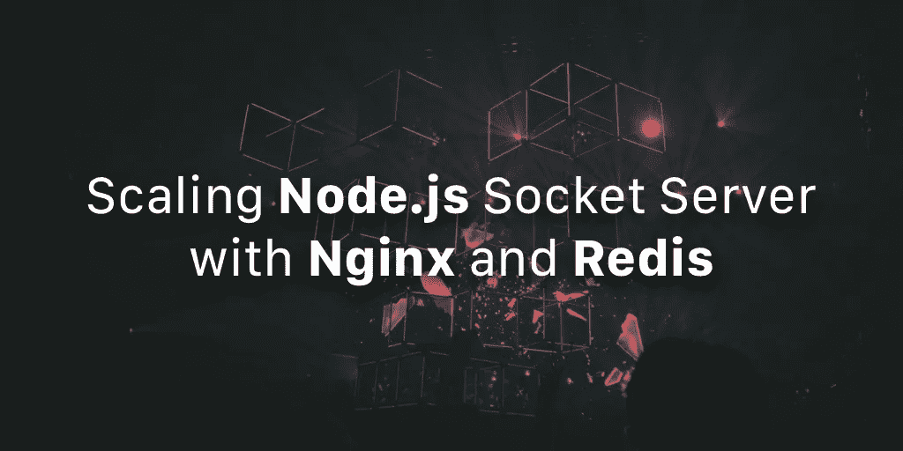
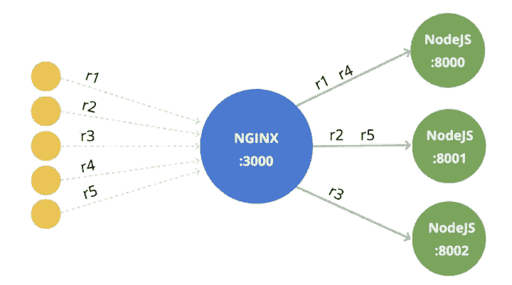
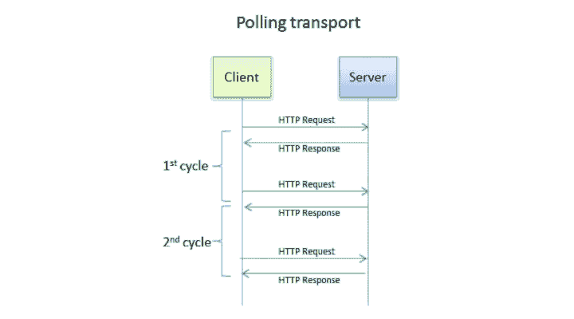
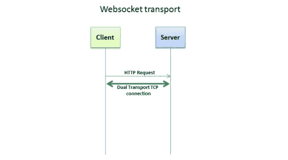
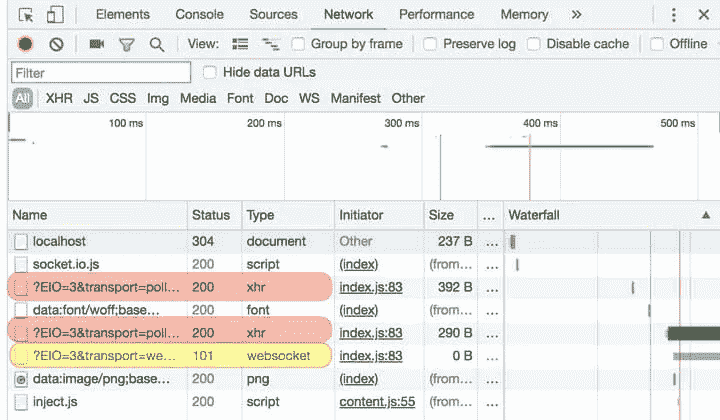
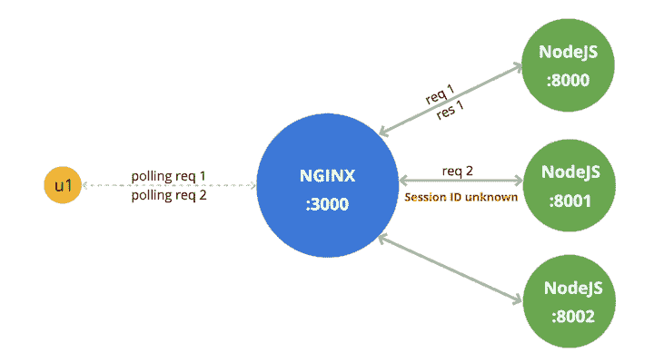
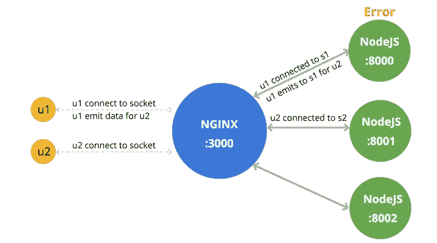
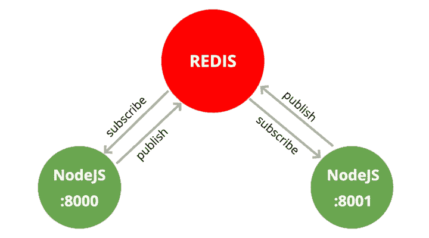
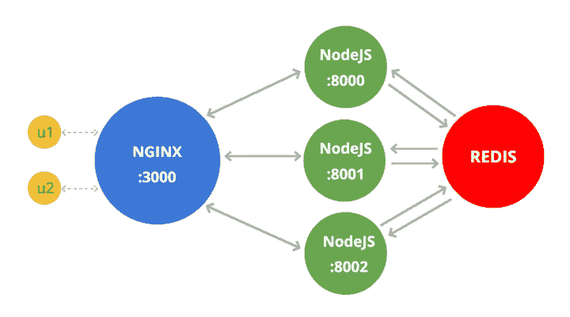

# 使用 Nginx 和 Redis 扩展 Node.js 套接字服务器

> 原文：<https://medium.com/hackernoon/scaling-node-js-socket-server-with-nginx-and-redis-d19bf5c07fa8>



后端开发中最有趣的话题之一是服务器的伸缩和分布。

有很多方法可以扩展你的应用程序，处理大量的请求和连接。在本文中，我们将解释 Node.js 应用程序最流行的扩展方式之一，特别是**套接字连接**。

假设您有一个每秒接收 300 个请求的节点应用程序。它工作得很好，但是有一天请求数会增加 10 到 100 倍。那么，你就有大问题了。节点应用程序并不意味着每秒处理 30k 个请求(在某些情况下，它们可以，但这仅仅是由于 CPU 和 RAM)。

正如我们所知，Node 是一个单线程，并不占用你的机器资源(CPU，RAM)。反正会无效。

您无法保证您的应用程序不会崩溃，或者您无法在不停止服务器的情况下更新服务器。在任何情况下，如果您只有一个实例，那么您的应用程序很可能会经历一些停机时间。

我们如何减少停机时间？如何才能有效利用 RAM 和 CPU？我们如何在不停止所有系统的情况下更新应用程序？

# NGINX 负载平衡器

其中一个解决方案是**负载平衡器**。在某些情况下，您也可以使用**集群**——但是我们建议您不要使用节点集群，因为负载平衡器更有效，并且提供更多有用的东西。

在本文中，我们将只使用负载平衡器。在我们的例子中，它将是 Nginx。这里有一篇文章将向你解释如何安装 Nginx。

所以，我们继续吧。

我们可以运行一个节点应用程序的多个实例，并使用 Nginx 服务器代理所有到节点服务器的请求/连接。默认情况下，Nginx 会使用`round robin`逻辑将请求按顺序发送到不同的服务器。



如您所见，我们有一个 Nginx 服务器，它接收客户端发送的所有请求，并转发到不同的节点服务器。我们已经说过，Nginx 默认使用`round robin`逻辑，这就是为什么第一个请求到达服务器:8000，第二个到达 8001，第三个到达 8002，等等...

Nginx 还有更多的功能(即创建备份服务器，这将有助于当服务器崩溃时，Nginx 会自动将所有请求移动到备份服务器)，但在本文中，我们将只使用代理。

这是一个基本的 Express.js 服务器，我们将在 Nginx 中使用它。

```
// server.jsconst  express  =  require('express');
const  app  =  express();app.get('/', (req, res) => {
    res.end(`Hi, PID: ${process.pid}`);
});app.listen(process.env.PORT);console.log(`Server running on ${process.env.PORT} port, PID: ${process.pid}`);
```

使用`env`,我们可以从终端发送端口号，express 应用程序将监听该端口号。

我们跑过去看看会发生什么。

```
PORT=8000 node server.js
```

在控制台和浏览器中，我们可以看到服务器 PID，这将有助于识别哪个服务器收到了我们的调用。

让我们在`8001`和`8002`端口再运行两个服务器。

```
PORT=8001 node server.js PORT=8002 node server.js
```

现在，我们在不同的端口有三个节点服务器。

*   `[http://localhost:8000/](http://localhost:8000/)`
*   `[http://localhost:8001/](http://localhost:8001/)`
*   `[http://localhost:8002/](http://localhost:8002/)`

让我们运行 Nginx 服务器。

```
upstream nodes {
    server 127.0.0.1:8000;
    server 127.0.0.1:8001;
    server 127.0.0.1:8002;
}server {
    listen 3000;location / {
        proxy_pass [http://nodes](http://nodes);
    }
}
```

我们的 Nginx 服务器监听`3000`端口，并代理到`upstream node`服务器。

重启 Nginx 服务器并转到`[http://127.0.0.1:3000/](http://127.0.0.1:3000/)`

多次刷新，会看到不同的`PID`号。我们刚刚创建了一个基本的负载平衡器服务器，它将请求转发到不同的节点服务器。这样，您可以处理大量的请求，并充分利用 CPU 和 RAM。

让我们看看套接字是如何工作的，以及我们如何以这种方式平衡套接字服务器。

# 套接字服务器负载平衡

首先，我们来看看 Socket 在浏览器中是如何工作的。

Socket 打开连接和监听事件有两种方式。它们是**长轮询**和**web socket**——它们被称为传输。

默认情况下，所有浏览器都通过轮询启动套接字连接，然后，如果浏览器支持 WebSocket，它将切换到 WebSocket 传输。但是我们可以添加可选的`transports`选项，并指定我们想要使用哪个或哪些传输进行连接。然后我们可以使用 WebSocket 传输一次打开套接字连接，或者相反只会使用轮询传输。

让我们看看轮询和 WebSocket 的区别。

# 长轮询

套接字允许从服务器接收事件，而无需请求任何东西，这可以用于游戏、信使等等。你不知道你的朋友什么时候会给你发消息请求服务器并得到响应。使用套接字，服务器将自动向您发送一个事件，您将接收该数据。

我们如何实现一个仅使用 HTTP 请求的功能，并提供一个能够从服务器接收一些数据而无需请求该数据的层？换句话说，我们如何仅使用 HTTP 请求来实现套接字？

想象一下，你有一个**层**，它向服务器发送请求，但是服务器没有立即响应你——换句话说，你只是等待。当服务器有东西需要发送给你时，它会使用你刚才打开的 HTTP 连接把数据发送给你。

一旦收到响应，您的**层**将自动向服务器发送一个新请求，并再次等待另一个响应，而不检查前一个请求的响应。

这样，您的应用程序可以随时从服务器接收数据/事件，因为您总是有一个等待服务器响应的打开请求。

这就是投票的工作方式。这是它工作的可视化。



# WebSocket

WebSocket 是一种协议，它只允许打开一个`TCP`连接并保持很长时间。这是另一个可视化图像，展示了 WebSocket 是如何工作的。



正如我们所说，默认情况下，大多数浏览器使用**轮询传输**(使用 XHR 请求)连接套接字服务器。然后，服务器请求将传输更改为 WebSocket。但是，如果浏览器不支持 WebSockets，它可以继续使用轮询。对于一些不能使用 WebSocket 传输的旧浏览器，应用程序将继续使用轮询传输，而不会升级传输层。

让我们创建一个基本的套接字服务器，看看它如何在 Chrome 的 Inspect 网络中工作。

**index.html**

```
<!Doctype html><html>
    <head>
        <title>Hello World</title>
        <script src="[https://cdnjs.cloudflare.com/ajax/libs/socket.io/2.1.1/socket.io.js](https://cdnjs.cloudflare.com/ajax/libs/socket.io/2.1.1/socket.io.js)"></script>
        <script>
            const socket = io('[http://0.0.0.0:3000'](http://0.0.0.0:3000'), {
                transports: ['polling']
                // transports: ['websocket']
            });socket.on('connect', () => {
                console.log(`Socket connected id: ${socket.id}`);
            });
        </script>
    </head>
    <body>
        <h1>Basic Socket connection</h1>
    </body>
</html>
```

**server.js**

```
const io = require('socket.io')(process.env.PORT);io.on('connection', (socket) => {
    console.log(`${socket.id} connected`);
});console.log(`Socket Server running on ${process.env.PORT} port, PID: ${process.pid}`);
```

在端口`3000`上运行 Node.js 服务器，在 Chrome 中打开`index.html`。

如您所见，我们使用`polling`连接到套接字，因此在幕后，它发出 HTTP 请求。这意味着，如果我们在“检查网络”页面中打开 XHR，我们将看到它是如何向服务器发送请求的。

从浏览器的检查模式中打开网络选项卡，查看网络中的最后一个 XHR 请求。它总是在等待的过程中，没有回应。一段时间后，该请求将被终止，新的请求将被发送——因为，如果一个请求长时间没有得到服务器的响应，您将得到超时错误。因此，如果服务器没有响应，它将更新请求并发送新的请求。

此外，请注意服务器发送给客户端的第一个请求的响应。响应数据如下所示:

```
96:0{"sid":"EHCmtLmTsm_H8u3bAAAC","upgrades":["websocket"],"pingInterval":25000,"pingTimeout":5000}2:40
```

我们已经说过，服务器向客户端发送选项，将传输从“轮询”升级到“websocket”。然而，由于我们在选项中只有“轮询”传输，它不会切换。

尝试用以下内容替换连接线:

```
const socket = io('http://0.0.0.0:3000');
```

打开控制台，从“检查网络”页面中选择“全部”。



当您刷新页面时，您会注意到，在一些 XHR 请求后，客户端升级到了“websocket”。注意网络控制台中网络项目的类型。正如您所看到的，“投票”是基本的 XHR，而网络套接字是“网络套接字”的类型。当你点击它时，你会看到框架。当服务器发出新事件时，您将收到一个新帧。还有一些事件(仅仅是数字，即 2，3)，客户机/服务器只是发送给彼此以保持连接，否则，我们将得到一个超时错误。

现在，您已经对套接字的工作原理有了基本的了解。但是，像前面的例子一样，当我们试图使用 Nginx 平衡套接字服务器时，会有什么样的问题呢？

# 问题

有两个主要问题。

**首先**，当我们有一个带有多个节点服务器的 Nginx 负载平衡器并且客户端使用轮询时，会出现一个问题。

您可能还记得，Nginx 使用循环逻辑来平衡请求，所以客户端发送给 Nginx 的每个请求都会被转发给 Node 服务器。

假设您有三个节点服务器和一个 Nginx 负载平衡器。用户使用轮询(XHR 请求)请求连接服务器，Nginx 将该请求平衡到 Node:8000，服务器注册客户端的 Session ID，以获知连接到该服务器的客户端。第二次，当用户做任何动作时，客户端发送一个新的请求，Nginx 将其转发给 Node:8001。

第二台服务器应该做什么？它从未连接的客户端接收事件。服务器将返回一个带有`Session ID unknown`消息的错误。

对于使用轮询的客户端来说，平衡成了一个问题。通过网络套接字的方式，您将不会得到任何这样的错误，因为您连接一次，然后接收/发送帧。

这个问题应该在哪里解决:在客户端还是在服务器端？



肯定在服务器里！更具体地说，是在 Nginx 中。

我们应该改变用于平衡负载的 Nginx 逻辑的形式。我们可以使用的另一个逻辑是`ip_hash`。

```
upstream nodes {
    ip_hash;
    server 127.0.0.1:8000;
    server 127.0.0.1:8001;
    server 127.0.0.1:8002;
}
```

每个客户端都有一个 IP 地址，因此 Nginx 使用该 IP 地址创建一个哈希，并将客户端请求转发给 Node 服务器，这意味着来自同一 IP 地址的每个请求都将被转发给同一服务器。

实际上，这是这个问题的最小解决方案；还有其他的可能。如果您想走得更远，有时这个解决方案会很短。您可以研究 Nginx/ [Nginx PLUS](https://www.nginx.com/products/nginx/) 的其他逻辑或使用其他负载平衡器(即 [HAProxy](http://www.haproxy.org/) )。

转到**第二个问题**:用户连接到一台服务器。

想象一种情况，你连接到 Node:8000，你的一个朋友连接到 Node:8001，你想给他/她发消息。你通过 socket 发送，服务器收到一个事件，想把你的消息发给另一个用户(你的朋友)。我想你已经猜到了我们会遇到什么问题:服务器想要向用户发送数据，而用户并没有连接到它，而是连接到系统中的另一个服务器。



解决方案只有一个，可以通过多种方式实现。

> *为服务器创建内部通信层。*

这意味着每台服务器都能够向其他服务器发送请求。

这样，`Node:8000`向`Node:8001`和`Node:8002`发送请求，它们检查*用户 2* 是否连接到它。如果 *user2* 连接，该服务器将发出`Node:8000`提供的数据。

让我们讨论一种最流行的技术，它提供了一个通信层，我们可以在节点服务器中使用它。

# 雷迪斯

正如[官方文件](https://redis.io/)中所写:

> *Redis 是用作数据库的内存中数据结构存储*

因此，它允许你在内存中创建`key-value`对。另外，Redis 提供了一些有用的特性。让我们来谈谈其中一个流行的功能。

这是一个消息系统，它为我们提供了一个**订阅者**和一个**发布者**。

在 Redis 客户机中使用 Subscriber，您可以订阅一个**频道**并收听消息。使用 Publisher，您可以将消息发送到订户将接收的特定通道。

就像 Node.js `EventEmitter`。但是当节点应用程序需要向另一个节点应用程序发送数据时,`EventEmitter`将无济于事。

让我们看看它是如何与 Node.js 一起工作的

**订户**

```
// subscriber.js
const redis = require('redis');const subscriber = redis.createClient();subscriber.on('message', (channel, message) => {
    console.log(`Message "${message}" on channel "${channel}" arrived!`)
});subscriber.subscribe('my channel');
```

**发布者**

```
// publisher.js
const redis = require('redis');const publisher = redis.createClient();publisher.publish('my channel', 'hi');publisher.publish('my channel', 'hello world');
```

现在，为了能够运行这段代码，我们需要安装`redis`模块。另外，不要忘记在本地机器上安装 Redis。

```
npm i -S redis
```

让我们跑一跑，看看结果。

```
node subscriber.js
```

和

```
node publisher.js
```

在“订阅者”窗口中，您将看到以下输出:

```
Message "hi" on channel "my channel" arrived!
Message "hello world" on channel "my channel" arrived!
```

恭喜你！您刚刚在不同的节点应用程序之间建立了通信。



这样，我们可以在一个应用程序中拥有订阅者和发布者，以便能够在彼此之间接收和发送数据。

你可以在官方文档上阅读更多关于 Redis PUB/SUB 的内容。此外，您可以查看 [node-redis-pubsub](https://www.npmjs.com/package/node-redis-pubsub) 模块，该模块提供了一种使用 Redis PUB/SUB 的简单方法。

# 连接所有这些部分

最后，我们来到了最有趣的部分之一。

为了处理大量连接，我们**运行 Node.js 应用程序**的多个实例，然后我们**使用 Nginx** 平衡这些服务器的负载。

使用 Redis 发布/订阅，我们在 Node.js 服务器之间建立通信。每当任何服务器想要发送数据给没有连接到它的客户机时，服务器就发布数据。然后，每台服务器都会收到它，并检查用户是否连接到它。最后，该服务器将提供的数据发送给客户端。

下面是后端体系结构组织方式的大致情况:



让我们看看如何在 Node.js 中实现这一点。您不需要从头开始创建所有这些。已经有一些软件包完成了部分工作。

*   [socket.io-redis](https://github.com/socketio/socket.io-redis)
*   [插座. io-发射器](https://github.com/socketio/socket.io-emitter)

这两个包为 [socket.io](http://socket.io/) 工作。

`socket.io-emitter`依赖项提供的一件有趣的事情是从套接字服务器外部向用户发出事件。如果您可以将服务器将接收的有效数据发布到 Redis，那么其中一个服务器就可以将套接字事件发送到客户机。这意味着拥有一个能够向用户发送事件的套接字服务器并不重要。您可以运行一个自定义服务器，它将连接到同一个 Redis，并使用 PUBLISH 向客户机发送套接字事件。

另外，还有一个名为 [SocketCluster](https://socketcluster.io/) 的包。 *SocketCluster* 更高级——它使用集群，集群有代理和工人。Brokers 帮助我们处理 Redis 发布/订阅部分，workers 是我们的 Node.js 应用程序。

还有[推动器](https://pusher.com/)帮助构建大型可扩展应用。它为他们托管的*发布/订阅*消息系统提供了一个 API，并且它还为一些平台提供了一个 SDK(*例如*，Android，IOS，Web)。但是，注意这是付费服务。

# 结论

在本文中，我们解释了如何平衡套接字服务器，可能会出现什么样的问题，以及如何解决这些问题。

我们使用 Nginx 来平衡多个节点的服务器负载。有很多负载平衡器，但我们推荐 Nginx/Nginx Plus 或 HAProxy。此外，我们看到了套接字如何工作以及轮询和 websocket 传输层之间的区别。最后，我们看到了如何在 Node.js 实例之间建立通信并一起使用它们。

因此，我们有一个负载平衡器，它将请求转发到多个 Node.js 服务器。请注意，您必须配置负载平衡器逻辑以避免任何问题。我们还为 Node.js 服务器提供了一个通信层。在我们的例子中，我们使用了 Redis PUB/SUB，但是您也可以使用其他通信工具。

我用过 Socket.io(用 Redis)和 SocketCluster，建议你无论大小项目都用。有了这些策略，就有可能拥有一个可以处理 30k 套接字连接的 SocketCluster 游戏。实际上，SocketCluster 库有点老，它的社区也不是很大，但是它可能不会给你带来任何问题。

有许多工具可以帮助您平衡负载或分配系统。我们建议您也了解 Docker 和 Kubernetes。尽快开始研究它们吧！

感谢您阅读这篇文章。欢迎提问或发推文 [@nairihar](https://twitter.com/nairihar) 。

*原载于*[*【blog.jscrambler.com】*](https://blog.jscrambler.com/scaling-node-js-socket-server-with-nginx-and-redis/)*作者* [乃日·哈若提欧年](https://blog.jscrambler.com/author/nairi)。