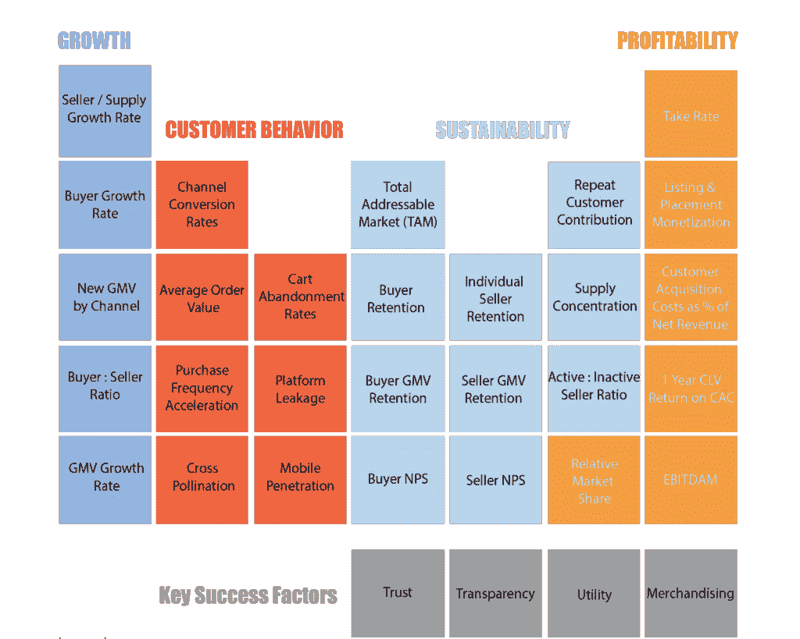

# 移动性的未来[颠覆者访谈]

> 原文：<https://medium.com/hackernoon/scaling-spothero-and-the-future-of-mobility-24d481763fff>

如何将某个东西缩放 10 倍，然后再缩放一次？答案出奇的简单，然而很少有组织有这样的纪律。我今天的嘉宾是 [Spothero](http://spothero.com/) 的战略和运营高级副总裁 Elan Mosbacher 。在这段对话中，我们讨论了 Elan 和他的团队如何将 SpotHero 发展成为美国最大的移动停车平台。

Elan 在建立市场业务、寻求战略合作伙伴关系等方面拥有丰富的经验。他还对未来的移动性进行了思考，我们围绕自动驾驶汽车和未来的发展方向进行了非常有趣的对话。

# 如何快速扩展

**迪:我知道当你第一次加入 Spothero 的时候，你主要是做市场营销，你的明确任务是帮助他们 10 倍。然后再做一次。我记得你说过你第一次对 10x 做的事情和第二次有很大不同。你在尝试快速扩展时学到了什么？**

早期，最重要的事情是找出谁是我们最好的客户。我们这个领域大概有 200 家不同的公司，我认为真正让我们与众不同的是我们对客户的理解。我们发现了这一点，并围绕获得最佳客户和为他们提供尽可能好的体验调整了我们的所有计划。

> *“真正让我们与众不同的是我们对客户的理解。我们发现了这一点，并围绕获得最佳客户和为他们提供尽可能好的体验调整了我们的所有计划。”*

几年后，我们看到我们最好的客户仍然在购买我们的产品。这也是我们相对于那些不关注最佳客户的竞争对手真正强大的原因。今天，他们每个月可能会获得大致相同数量的客户，但不会有三年、四年、五年、六年、七年的人加入他们的应用程序，他们仍然在购买。

另一个重要的教训就是**提升自己**和提升你的团队。作为一家初创企业的领导者，你必须和你的公司一样快地调整自己，如果不是更快的话。当你所做的一切都是为了你的公司时，很难做到这一点，你还必须为自己工作。

> 作为一家初创企业的领导者，你必须和你的公司一样快地调整自己，如果不是更快的话

对一些人来说，这可能是兼职 MBA，对另一些人来说，这可能是高管教练、阅读、播客、导师或董事会成员。但是投资于你自己真的很重要，以确保你至少比你的公司需要的领先一步。

# 如何衡量自己

DI:那对你来说是什么感觉？你认为哪些领域需要发展，你是如何着手的？

**Elan:** 我想我大概把以上都用上了。在加入 SpotHero 之前，我开始攻读非全日制 MBA，所以我花了大量时间研究如何将它应用到工作中。从我们如何找出谁是我们最好的客户，到如何制定商业计划，如何管理我们的团队，如何招聘和雇用。

我也读了很多。我的生活很忙，所以我会一两个月不看书，但之后我会在一个周末看四五本书。

SpotHero 还非常幸运地组装了一个非常出色的电路板。因此，有机会向董事会成员、董事会会议以及其他导师学习真的很有帮助。

你必须找到适合你的方法。除了做好你的日常工作，你必须找到一种学习的方法。

# 如何找出谁是你最好的客户

**戴:回到寻找最佳客户的问题上来——这似乎是初创企业的一个普遍问题。他们赚了一些钱，他们有快速增长的任务，他们最终将大量资金投入到付费收购中，要么他们需要一点时间来发现这些用户没有留下来，要么他们没有衡量正确的事情。他们把顶线增长误认为是产品/市场契合度。你是如何避免这种情况并找出谁是最好的客户的？**

Elan: 当我们成为 SpotHero 时，我们已经有了一个人们用来寻找停车位的产品。我们有合适的产品/市场，但我问我们的首席执行官马克，谁是我们最好的客户？我其实问过团队里的每个人，你们觉得我们最好的客户是谁？没有人真正有一个好的答案。

所以我们开始调查谁买的次数最多，实际上是采访他们。从那里我们发出了一份调查，做了一些统计分析。我们发现有一部分客户因为特定的原因使用我们的产品，他们比其他人的利润高 13 倍。事实上，他们是当时唯一盈利的部门。

从那时起，我们专注于根据顾客的需求打造停车场。我们专注于接触最佳客户的渠道。我们的销售和客户服务以最佳客户为中心。有了这些关注，我们不一定获得了最多的客户，但我们获得了更好、更有利可图的客户，这些客户多年后仍与我们在一起。

在这个过程中，我们收购了一个竞争对手，他不属于我们的 SpotHero 家族，但有一种非常不同的方法。对我们来说，观察我们如何做事和他们如何做事以及它们之间的差异是很有趣的。一件事是，我们有足够的资金专注于可能更昂贵的渠道，在那里可以找到我们最好的客户。他们的资金更加紧张，所以他们的方法是寻找在第一笔交易中获利的客户。当我们调查时，他们在建立库存方面做得非常好，并围绕该客户调整了他们的公司。

所以攻击事物有多种方式。但是无论你选择哪种方法，你都需要将你所有的努力都放在客户原型上。我要说的是，我认为我们对盈利客户的关注，即使他们的收购成本更高，但随着时间的推移，由于重复的业务，我们变得比他们更大。现在我们两全其美，因为我们有真正有粘性的客户，但我们也有这个伟大的渠道，客户可能只购买一次，但他们在第一次交易中就盈利了。

DI:你是用不同的方式和不同的信息来针对这些人吗？或者你正在使用相同的信息，你只是意识到其中一些人看起来像这样，而这些人看起来像这样？

**Elan:** 因此，最棘手的事情是，大多数初创企业使用的漏斗渠道(如搜索)的最大容量底部，实际上获得了最差的客户。最棘手的渠道，最昂贵的渠道，风险最大的渠道，可能是最好的客户。

> *“大多数初创公司使用的最大流量、最底层的渠道，比如搜索，实际上获得了最差的客户。最棘手的渠道、最昂贵的渠道、风险最大的渠道可能是最好的客户。”*

所以这对我们来说是一个挑战。但是，通过洞察我们的最佳客户，我们有信心在早期投资于线下和其他更昂贵、更难衡量的渠道。我们仍然做大量的搜索引擎优化、付费搜索等类似的事情。但是我们公司的那些顾客不会经常回头客。

# 向董事会推销重大战略变革

DI:听起来像是公司的一个重大转折点。当你把这一点带到你的董事会时，我会想象你的总目标市场(TAM)看起来会更小。这可能会影响之前的预测。“我们认为我们最赚钱的客户是这个市场的一小部分，获得他们的成本会高得多。”除了拥有优秀的董事会成员之外，你还使用了什么策略来以令人信服的方式描绘这个故事？

Elan: 我认为我们经历了两个时期。一个是广告方面——我们如何投资这些更昂贵的渠道？

另一个是在产品方面。实际上，我们开发了一款名为 SpotHero for Business 的产品，该产品针对非常强大的受众和非常强大的客户群定制了我们的产品。在这两种情况下，我们都进行了对话。

在广告方面，这很简单。一个简单的公式，堆叠排名，按渠道投资回报率真的很有帮助。基本上什么是终身价值，什么是客户获取成本，什么是渠道回报？我们将在哪里获得最大的效率？LTD 冲击比哪里最好？我们在哪里能获得最大的销量？如果我们意识到最大的有限客户将来自稍微贵一点的渠道，只要有投资回报率，那就没问题。有一些非常成熟的框架至少可以进行这样的讨论。

我们做的另一件事是将一定数量的预算，比如说 80%，分配给成熟的渠道。然后 10%到 20%是尝试新事物。有些会很昂贵，有些则不可测量，有些则有点疯狂。我们并没有把这笔钱算在自己头上，因为我们知道，如果它不起作用，我们随时都可以把它关掉。

在产品方面，当我们说，我们希望进行重大投资，为我们最好的客户改进产品时，董事会的反馈是，“为什么你不在六个月前这样做？”所以这也是一个非常容易的销售。

我认为，就在初创企业中孵化初创企业而言，主要的教训是 ***有一个单独的 P & L*** 。作为两个不同的实体运作。

如果你总是在一件大事和一件小事之间权衡取舍，那么短期内大事的投资回报率总是会比小事或新事物的投资回报率高。因此，将这两个项目分开绝对是我们所做的一件大事，可以帮助我们在尝试新事物时获得成功。

DI:你谈到了避免抄袭他人做法的必要性。在营销或“增长黑客”社区，有大量关于策略的内容，很多“优步做到了这一点，所以你也应该这样做。”我知道你觉得这可能是个错误的方法。

我会说从为什么开始。完全可以接受，也期待向别人学习。看看谁以前做过，并找出他们做了什么，可以为我们工作。错误在于照搬战术，而不考虑其背后的战略。

我们经常关注移动领域的类似公司，或者在移动领域走得更远的公司，关注策略以评估它们是否符合我们的战略。这没关系。但我见过一些公司只是模仿竞争对手。如果你不在领导岗位上，你试图通过模仿领导的做法来迎头赶上，这对你没有太大帮助。

> “如果你不在领导岗位上，你试图通过模仿领导的做法来迎头赶上，这对你没有太大帮助。”

我们以司机为目标。有一次，我们雇了一些人站在芝加哥一条高速公路的出口处，举着一个大牌子，上面写着“使用 SpotHero”和一个促销代码。几天后，在一个完全不同的垂直市场做营销的人告诉我，他们的首席执行官看到了，并想知道为什么我们不也做标牌广告。嗯，我们的目标是离停车只有几分钟路程的司机，我们想提醒他们。考虑到我们的受众和我们的战略，这是一个很好的策略，但那不是你的目标受众。你为什么要复制它？

另一个例子。在 2015 年或 2016 年，所有这些按需应用程序无所不包。有随叫随到的侍者，随叫随到的食物。所有这些应用程序都出现了。他们在脸书应用程序安装上花费了大量金钱。现在安装应用程序的成本很高。但是各种各样的人都说我们也应该这样做。但是我们一直在尝试，它一直不工作，在某一点上，我们只是停止了。对我们来说这不是正确的渠道。

因此，理解你想要达到的目标并根据你想要做的事情调整策略是非常重要的。

# 尝试 10 倍时的通道组合

**迪:当你被授权积极扩张时，这看起来确实是脸书、谷歌等公司的明显优势之一。是速度与规模。在使该通道饱和之前，您可以进行相当大的缩放。因此，对于室外等其他渠道，这似乎要困难得多。这与 10 倍左右的要求有什么关系——这些渠道是否能让你一路走到那一步，或者你仍然需要补充一些更常见的渠道，以弥补赤字？**

**Elan:** 我想这取决于你经营的是什么样的企业。有一些真正成功的企业在营销上几乎不花一分钱，而是通过产品和口碑来发展。还有其他业务完全依赖一个渠道，所以看情况。

当我们处于疯狂增长阶段时，我们试图决定是否应该在一个频道上投资。这一点，决定是，如果我们不花钱，我们会失去，如果我们花钱，我们可能会失去。所以我们花了。

渠道方面，真的要看你的业务了。在大多数企业中，当然是市场企业，通常有一个或两个主要渠道。通常是谷歌或脸书，这就是为什么他们作为公司如此有价值。但是其他公司的渠道不一样。

你也可以在产品内部做一些事情，比如向朋友推荐、转化率优化等等。但是很少有灵丹妙药。通常是一个、两个或三个主要渠道，然后是一大堆其他测试和优化。工作一天，一周，一个月，一年，然后就消失了。

我们的业务有点不同，因为我们是市场业务，而且我们也基于地理位置。有时我们向客户做广告，但实际上并不太关注消费者数量和这些消费者的盈利能力。有时，这实际上是为了填充商家或业务的供应端。

客户越多，库存就越多。如果你开始一个新的垂直或地理，你想获得一群客户和足够的供应让他们高兴，即使它不是超级有利可图。这与优步类似——当他们开始一个新城市时，他们向司机支付最低金额，直到他们获得足够的需求，他们不再需要这样做。

# 扩展市场业务的策略

DI:我们来谈谈市场。对很多人来说，这是一个具有挑战性的模型。你在试图同时建立市场的两个方面学到了什么？

**Elan:** 十年前，这方面的信息并不多，鸡和蛋的问题是个大问题。但是这些天它实际上被很好地记录了。我们的投资者之一 Insight Venture Partners 有一份名为[的市场业务周期表](https://www.insightpartners.com/blog/insights-periodic-table-of-online-marketplaces/)的文件，其中谈到了所有你必须查看的指标和示例基准。

让我们受益匪浅的一点是关注流动性而非地理位置，这意味着在尝试扩展之前，先从一个地理位置或一个垂直领域开始。我喜欢用脸书来做类比。脸书从哈佛开始，达到饱和，然后进入常春藤联盟学校，然后是东海岸，然后是大学，然后是高中，然后是成人，然后是商业。而他们的一些竞争者从第一天起就对所有人开放。

> *“关注流动性而非地理位置。在尝试扩展之前，先从一个地理区域或一个垂直区域开始。”*

我们只在芝加哥呆了几年，事实上我们在芝加哥的业务比任何全国性的竞争对手都大。只有当我们把剧本写下来后，我们才真正扩展到芝加哥以外，因此，当我们在新市场推出时，我们能够以快得多的速度前进。

如果你一开始就试图走得太远，很容易把自己分散得太开，所以这可能是最大的教训。

就先有鸡还是先有蛋而言，在大多数企业中，你都希望专注于供应端。商人更有耐心，因为他是商人。他们意识到，在你建立需求的同时，可能需要一段时间才能从你的平台中获得大量价值。但消费者会去你的网站一次，你没有他们想要的，他们会很快离开。

# 伙伴关系

DI:合作伙伴关系是一个不太常被提及的渠道。我知道你一直很积极地追求这些。你认为哪种类型的合作是有意义的？建立这些东西是有机会成本的。你用什么决策标准来评估什么是好的伙伴关系，什么是坏的伙伴关系？

**Elan:** 在过去十年左右的时间里，我经常在各种初创企业中作为第一营销人员起步。不可避免地，两三年后，你会说，好吧，我有脸书，我有谷歌。下一步是什么？最后总是以合作告终。

我之前提到了导师的重要性，以及在日常生活之外寻找学习方法的重要性。我的一位花了很多时间从事商业发展的老导师推荐了一本名为《T4》的书《相扑优势》。非常好的书，它基本上概述了初创企业的业务发展过程。

我有几种方式来思考这个问题。销售和业务发展或合作关系的区别是:对于销售，你通常会去找某人说，我要做这个，然后你给我开一张支票。随着业务发展或伙伴关系，我们通常会一起做这件事，以服务于我们共同的观众。因此，你必须想清楚谁是顾客，我们都想用不同的解决方案改善他们的生活。共生在哪里？

另一件要考虑的事情是——当你真的很大的时候，每个人都想和你做交易。但是当你很小的时候，你如何得到关注？在合作关系中，较小的公司通常寻求获得客户，而较大的公司通常寻求更具粘性的产品或更多的保留。

如果我是 Salesforce，我会寻找所有其他软件公司加入我的市场，这样当人们使用 Salesforce 时，他们也可以拥有他们需要的所有其他工具。如果我真的是小企业，我想要 Salesforce 的客户，所以我加入 Salesforce，以便让一小部分使用 Salesforce 的公司也使用我的产品。

当你是一家初创企业时，我发现的方法是说“嘿，BigCo，你的产品缺少一个功能集。我可以让你的产品更有粘性，增加你的 LTV，让你从竞争对手中脱颖而出。”

对于 SpotHero，我们着眼于针对类似受众的公司细分或垂直市场。谁有大量的司机观众？嗯，汽车公司、导航和移动型应用，最终还有自动驾驶汽车。然后我们看看谁是这个领域的领导者。然后，我们努力为我们的客户找到共同的价值支柱。然后我们投球，看情况如何。

最近，我们与芝加哥市的瓦兹建立了合作关系。瓦兹面临的一个挑战是，当有手机信号时，他们的全球定位系统工作得很好，但是如果你在隧道或地下道路上驾驶，你就没有手机信号，或者全球定位系统无法工作。对我们来说，问题是芝加哥的司机试图把车停在地下车库里，我们的顾客很难找到这些车库。

因此，我们与瓦兹合作，将他们介绍给芝加哥市。我们在芝加哥所有的地下道路上安装了瓦兹信标。现在他们有了更好的产品，我们的客户可以找到他们想停车的车库，芝加哥市有更好的交通流量和导航工作的所有好处。

另一个合作伙伴是谷歌助理。这是在消费电子展上宣布的，谷歌宣布，通过 Assistant，最终是 Android Auto，你可以从星巴克买咖啡，或者用 SpotHero 买一个停车位。这是更多产品创新的另一个例子。

我们已经做了分销交易，我们与那些插入我们的 API 的人合作，这样他们就可以为他们的观众提供停车位，我们还与一些小公司做了交易，我们利用他们的技术，插入我们的应用程序，让它对我们的观众更有吸引力，更好。这些都是我们最近建立伙伴关系和接触方式的例子。

# 心理模型

**DI:稍微改变一下话题，你和我过去已经多次谈到过关于精神模型的想法。你之前谈到了阅读和你试图提升自己的方式，我知道你试图培养一种不同的思维方式，或者思考你如何思考。你是怎么做到的？**

**Elan:** 根据具体情况，我喜欢使用很多框架。

我想问自己的一个问题是，“五年后 Elan 会在这种情况下做什么？”这真的迫使你跳出短期思维，我发现它帮助我在最佳状态下运作。

当试图评估要做的两件不同的事情时，这个问题的一个小变化是“五年后什么会重要？”我是否会记得参加过那个活动，见过那个人，完成了那个交易，或者我是否会记得我今天在收件箱零号？这是我在个人层面上使用的一个问题的两种变体。

就团队决策而言，我们使用的框架是尝试从极端的角度思考。一方面，我们要关闭这个项目吗？另一方面，我们是否让公司的每个人都关注这个项目？一方面，我们是否没有资源，另一方面，我们是否雇佣了世界上最好的人来做这件事？通过最初推动边界，你倾向于对中间的某种决定感到舒服。这就是我对战略和我们想把时间花在哪里的思考。

在公司层面，我最喜欢的一个框架是基于一本叫做[可预测的成功](https://predictablesuccess.com/)的书。一旦你这样做了几次，你就开始看到一个初创企业的模式和演变，你会想，哦，是的，它总是这样。可预测的成功是一个讨论这种进化的框架。

想象一个拱形，像彩虹一样，底部有**生存**。称之为努力让产品适应市场。许多公司都没有通过那里。

如果你这样做，第二阶段被称为**乐趣**。当你想出了办法，并且得到了资助，这就很有趣了。创始人在银行有一些钱，他们可能有薪水，他们在新闻界，他们的朋友就像，哦，也许你没有我们想象的那么疯狂。你雇了几个人，你得到了一个奖项，所有这些有趣的东西都来自于获得资金或实际上从客户那里得到报酬。你有几个人，一切都很好。

但是当你沿着彩虹往上走的时候，在彩虹的顶端有一个东西叫做**可预见的成功**。这就是你设定目标并达到目标的地方，你设定目标，并达到目标，你可以想想当今一些可能存在的世界级公司。

在乐趣和可预见的成功之间有一个中间阶段，叫做白水。想象一下，你正在漂流，遇到了这些急流，路上有颠簸，事情变得有点困难。也许在生活中，也许那是你的青少年时期，你在挣扎着你是谁，这个世界是什么样子。

你开始变得足够强大，而你早期的那些努力工作、学得很快的人，可能以前没有做到过，现在不一定是领导团队的合适人选了。有时候是，但通常不是。

事情开始变糟。当你有两个人、五个人或 10 个人时，你为沟通建立的流程在你有 100 人或 200 人时就不起作用了。当你拥有数百万客户时，你在拥有少数客户时开发的技术就不再有效了。

白水事件实际上是让合适的人员、流程和技术到位，以便您可以获得可预见的成功，并像世界级企业一样运营。我如此喜欢这个框架的原因是它提供了上下文。这是一个非常好的工具，可以让你的团队了解事情为什么会这样。

当你开始进入白水时，会很艰难。团队成员会说“不如以前有趣了”之类的话。或者“我不再有那么多时间和首席执行官在一起了。”或者“你为什么雇佣这个有经验的人做我的老板？”这些都是真正的痛点，可能会扼杀一种文化。但是，如果你真的很透明，并与你的团队交流你在旅程中的位置，给人们提供背景会有很大帮助。

它还有助于与新的团队成员交流。你把某人带进来，他们看着引擎盖下，问为什么这个过程到位，为什么事情如此混乱。我可以说“如果我在我们还是两个人的时候优化了与 200 个人交流的流程，我就永远不会有权利站在这里。我永远不会经历生存和乐趣，进入这个白水阶段。我雇佣你来建立流程，让我们从白水事件走向可预见的成功。”

# 早期成功

DI:你最近的大部分经历至少是在高速增长模式下。但我知道你前世在一个孵化器里工作。对于在企业创新团队或类似孵化器环境中的人，你有什么建议可以增加他们成功的机会吗？

**Elan:** 是的，我在沙盒里。那时候这里真的是一个整洁的地方，因为在同一层楼里，你可以看到从事风险投资的人，这些企业家在这里创业，还有人在经营企业。所以这是一个非常好的组合，也是一个非常好的学习机会。

当你第一次启动一家公司时，要做好很多事情真的很难。你必须选一个。你的生死取决于速度、动力、牵引力、变化和测试。

所有这些都与大公司截然相反，在大公司里，你希望缓慢而谨慎，不犯错误，不丢掉工作，不搞砸，不惹恼你的客户，不败坏你的名声。

就像我之前说的，在这两个不同的损益、不同的团队、不同的目标、不同的评估标准之间设置一堵墙，真的很有帮助。

# 移动性的未来

DI:在 SpotHero，你提升了你的思维，或者说拓宽了你的思维。这是为了帮助人们找到停车位，你做得很好。现在你的很多想法都是关于未来的。关于移动的未来可能是什么样子，以及交通的变化如何影响像您这样的企业。你认为未来的交通是什么样的？其次，你如何在如此模糊的情况下做出战略层面的决策？你如何下注？

**Elan:** 我们正处于一个非常有趣的交通时代。如果你想想科技世界，2000 年是关于网络和 SaaS 以及用户生成内容和社交网络的。过去的十年一直集中在移动领域。我认为在未来十年左右的时间里，围绕交通运输将会有一场相当大的革命。

SpotHero 始于移动革命之初。“为什么我要开车去市区，绕着街区转圈，不知道在哪里停车，不知道要花多少钱，还要付现金？”对于一个移动世界来说，所有这些东西都显得非常过时。

我们的业务已经从在网站上出售停车位发展到一个移动应用程序。但是当我们思考未来的时候，很多停车将由 API 驱动。你将会使用各种各样的界面——你车里的一台电脑，你车里的一个智能扬声器，你用来四处走动的另一个移动应用程序，或者甚至是停车场本身。这就是我们努力为自己定位的目标。

总的来说，在交通方面有很多挑战。城市变得越来越密集，如果你看看人口和城市化的数据，未来的城市会比现在更加密集。

在过去的几年里，交通变得越来越糟糕。拼车是其中很大一部分。现在有如此多的汽车，在某些情况下通勤时间比过去长了 10-30 分钟。这是另一个重大挑战。

另一个挑战是消费者的预期已经改变。人们不再愿意站在公共汽车站，不知道公共汽车什么时候会来。人们不愿意接受不接受信用卡的出租车。对交通方式的期望已经改变。但是由于基础设施、政府监管和各种疯狂的事情，改变交通比改变我们的期望需要更长的时间。

就未来而言，我认为重要的是要记住，仅仅因为媒体上说的一些事情并不意味着它会发生。当人们开始谈论自动驾驶汽车时，标题就像是“停车已死，因为自动驾驶汽车明年就会出现。”

但是自动驾驶汽车不会在明年出现——这需要时间。当这种情况真的发生时，他们会永远运动，一天 24 小时在街上开车吗？不行。那只会造成更多的交通堵塞。与自动驾驶汽车相关的最大成本将是它们上路和磨损，所以这没有任何意义。

然后头条变成了，“我会开着我的自动驾驶汽车去上班，然后它会开回我的私人车库。”因此，交通变得更加糟糕——不是每天一条腿来回，而是每天两条腿来回。

如果你实际上是这个行业的内部人员，你和汽车公司以及自动驾驶汽车公司交谈，他们都对一些事情非常感兴趣。

他们对导航感兴趣。我怎样才能算出汽车应该去哪里？

他们对 T2 的娱乐感兴趣。当有人在车里或者汽车自己在行驶的时候，他们会在这段时间里得到娱乐吗？

他们对**停车场**很感兴趣。汽车停在哪里，在哪里充电，车队在哪里清洗和保养。

回到拼车，它已经变得如此受欢迎和便宜，以至于它实际上没有吸引多少人开车。它让很多人远离了公共交通。举例来说，如果多花一美元，你就可以坐 Via，为什么要在又热又挤的纽约坐地铁呢？

Waze carpool 宣布他们正在全国范围内扩张。他们的论点是，改善基础设施以容纳所有人和车来解决交通问题的成本是疯狂的。但是，如果你只是和你的邻居或你社区的人一起骑车去上班，并且让人们在上下班时共用汽车，那会怎么样呢？

因此，我认为你将会看到更多关于我们如何更聪明地出行的创新，无论是在踏板车还是自动驾驶汽车上。

# 自动驾驶汽车采用面临的挑战

**DI:就自动驾驶汽车而言，你提到这不是一年后的事情，有大量关于飞行员的报道，看起来许多人要么变得更加谦虚，要么完全被搁置。对于没有关注这个领域的人来说，根据你的理解，为了让自主的东西成为合法的现实，必须解决哪些挑战？**

**Elan:** 一个是技术。自动驾驶汽车现在变得相关是有原因的，因为有一些技术已经出现，使之成为可能。但是仍然有一些技术问题需要解决。

有基础设施、保险和监管，比如有“注意义务”这个概念。作为一名车手，你必须尽最大努力保证其他人的安全。但是如果你是一台机器呢？如果你是一辆由算法驾驶的汽车，注意义务是什么样的？

伦理上，或者道德上，我们如何编程这些算法，所以如果你必须在击中人 A 或人 B 之间做出权衡，你如何做出决定？所以作为一个社会，有些事情我们必须弄清楚。那是一个大的。

还有其他人。普通汽车在路上行驶的时间是 11 年。所以假设明天，自动驾驶汽车无处不在。你打算怎么处理你的车？如果你还有你的车，你用自己的车会更便宜更方便，因为你有车。如果每个人都试图在同一时间出售他们的汽车，将会有惊人数量的二手车供应和低需求，所以那里将会发生一些事情。自然进化需要时间。

我认为会有自动驾驶汽车很有意义的用例，但也有一些没有意义的用例。如果你是一名老年人，是亚利桑那州郊区退休社区的一员，在那里路上没有疯狂的事情发生，也许你不会开车，自动驾驶汽车是惊人的。风险相对较低。但是当芝加哥有三英尺厚的雪时会发生什么呢？或者你在这些地方，那里有非常复杂的真实世界的挑战。这些是人们正在思考的一些事情。

# 踏板车

DI:那滑板车呢？你提到了城市化以及城市将会变得越来越密集。这些如何符合您对未来移动性的设想？

**Elan:** 上周我坐过飞机，坐过汽车，坐过火车，用过拼车。芝加哥还没有滑板车，但我已经在其他城市试过了。所以我认为我们正在进入一个多模式的交通世界。从 A 地到 B 地的选择或途径越多，对世界来说真的是一件好事。

似乎每个人都有自己的定位。如果你在城外 50 英里的地方，你可能会想乘坐通勤列车。如果你在城外 10 英里，你可能会想开车。如果一个或两个或三个邻居在同一时间倒下，你可能会想做乘车共享。如果你要去半英里到一英里，滑板车真的很有趣。他们不会把你带到 15 英里以外的地方，但如果我能更快地从我的办公室到火车，他们可能会每天给我多 5 分钟的时间。所以我认为他们都有自己的位置。

*原载于 2018 年 12 月 13 日*[*【digintent.com】*](https://digintent.com/scaling-spothero-and-the-future-of-mobility/)*。*