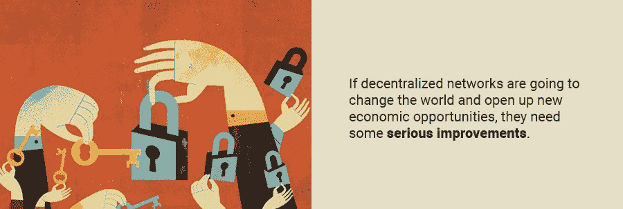
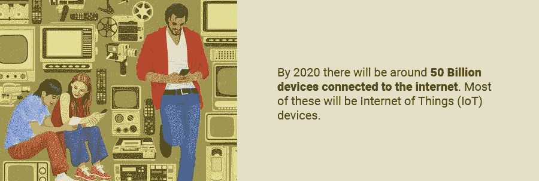

# 为明天的互联网扩展区块链

> 原文：<https://medium.com/hackernoon/scaling-the-blockchain-for-tomorrows-internet-f4aae1eac99f>

让我们面对现实吧，区块链科技现在根本没有兑现它的承诺。金融系统和互联网去中心化的主张已经被一个关键问题阻止了:可扩展性。

比特币和以太坊等分布式网络远远落后于它们需要的地方，即使是支付网络这样的简单应用也是如此。你也可以忘记即将到来的全球实时人工智能应用。如果分散式网络要改变世界并开启新的经济机会，它们首先需要一些重大的改进。

然而，这并不是说没有一些有趣的想法被开发出来解决这个可伸缩性问题。一些公司正在寻求改进现有的区块链，而另一些公司则在完全超越区块链的技术。一些人已经在展望未来，建立足够强大的基础设施，以实现人工智能的未来。

# 支付的区块链

区块链技术最简单也是最基本的用例是支付，大型分散式网络一开始就在苦苦挣扎。以太坊每秒可以处理大约 10-15 笔交易，比现代支付网络所需的 T2 少几个数量级。比特币[更加离谱](https://blockchain.info/charts/transactions-per-second)。

# 更高级的应用

如果这还不够糟糕的话，区块链科技的承诺不仅仅是支付。从分散的社交网络到视频游戏，一切都在区块链的基础设施上运行。

Twitter 每天处理数万个对其 API 的调用。这些事情包括推文、更新和搜索，许多呼叫需要分布式应用程序中的区块链事务。

目前的支付和社交网络规模巨大，但对区块链的研究人员来说，更令人畏惧的可能是未来的事情。到 2020 年，将有大约 500 亿台设备连接到互联网。其中大部分将是[物联网](https://www.forbes.com/sites/jacobmorgan/2014/05/13/simple-explanation-internet-things-that-anyone-can-understand/#6c85de8c1d09)设备。[像](https://www.postscapes.com/internet-of-things-award/winners/)智能自行车锁、钥匙圈和厨房电器这样的东西，联网后就有了全新的生活。

这些数十亿设备中的大多数已经在[相互通信](https://www.protectamerica.com/home-security-blog/tech-tips/how-do-iot-devices-communicate-a-guide_15527)，无需人工干预。[人工智能和机器学习也变得越来越重要](https://www.wired.com/brandlab/2018/05/bringing-power-ai-internet-things/)让这种机器对机器的交流更加有用。支持这些数字经济所需的基础设施必须非常快。

在一个安全、分散的网络中实现这种规模是密码行业迄今面临的最大技术挑战。

# 1.攀登以太坊

一个好的起点是扩展世界上最强大的区块链之一以太坊的功能。

目前在以太坊网络上，每个节点检查在区块链上执行的每个事务、变更和代码行。这是以太坊难以规模化的要求。以太坊区块链上的事务必须在整个网络上传播，然后下一个事务才能通过。这提供了很多安全性，但是它是一个巨大的可伸缩性瓶颈。

# 分片

尝试扩展以太坊区块链本身的一个想法叫做[分片](https://github.com/ethereum/wiki/wiki/Sharding-FAQs#what-are-some-trivial-but-flawed-ways-of-solving-the-problem)。在计算中，[分片意味着](https://searchcloudcomputing.techtarget.com/definition/sharding)将数据库分割成更小、更易管理的部分。就区块链而言，这意味着不再需要每个节点处理每个事务。

这实际上会将网络分割成更小的子链。每个子链都有自己的状态和事务历史。节点只需验证发生在其子链上的事务，并可以忽略其余的事务。网络的许多部分可以半独立运行，以增加事务吞吐量。

# 脱衣服-区块链

另一个想法是将一些交易从以太坊区块链中分离出来，单独处理。雷电网络(Raiden Network)是一个提议建立独立的“雷电”节点的想法，这些节点与以太坊节点一起运行。它们可以相互处理事务，并定期向主区块链结算它们的状态。这极大地提高了可伸缩性，因为数千甚至数百万个较小的事务可以压缩到一个事务中。

[等离子](http://plasma.io/)是一个类似的想法，建议在以太坊主链上使用智能合同来建立子链。这些子链做它们自己的处理，但是定期将它们的状态设置到以太坊主链。这意味着子链上的大量处理可以有效地压缩到少量主链事务中。子链甚至可以托管它们自己的子链，以便构建区块链的层次结构。

# 挑战

区块链可扩展性实际上是无法“解决”的。[区块链三元悖论](https://www.coinbureau.com/analysis/solving-blockchain-trilemma/)指出网络只能有以下两种属性:

*   分散
*   安全性
*   可量测性

为了扩大规模，以太坊将不得不牺牲一定程度的去中心化或安全性。这些都是高度政治化的话题，变革不会轻易到来。

扩展以太坊和比特币等区块链平台的另一个关键挑战是，它们使用了区块链数据结构。即密码链接块的顺序链。事实上，事务必须按块顺序添加，这是一个严格的约束。这是为了避免重复支出，但事实证明，这个问题还有其他解决方案…

# 超越区块链— DAG

物联网将需要更大的可扩展性。为了实现这一目标，一些分散式网络正以不同的方式放弃区块链。

IOTA 是一个加密项目，它用一种叫做[有向无环图](https://en.wikipedia.org/wiki/Directed_acyclic_graph)或 DAG 的数据结构取代了区块链。您可以将此视为区块链的推广，其中每个事务不一定要链接到最近的事务或最后一个块。不是链接事务块，而是在图形结构中将单个事务链接到较旧的事务。放宽这一要求消除了块创建率这一瓶颈，并意味着几乎可以立即确认事务。

这种方法还可以提高其他效率。IOTA 的 DAG 模型打开了[零交易费](https://iotasupport.com/whatisiota.shtml)的大门。使用以太坊和比特币，你需要向矿工支付一定费用来验证你的交易。使用 IOTA，您的事务必须验证另外两个事务才能包含在网络中。当您构建一个 IOTA 事务时，您实际上是在进行即时的挖掘。零费用对于物联网非常重要，因为“物”需要以非常高的速率与成千上万的其他“物”进行通信。交易费使得这种做法不经济。

# 挑战

乍一看，DAGs 似乎是对区块链的自然改进，但它们也带来了一系列巨大的挑战。其中许多仍未解决。

第一个问题是减少垃圾邮件。以太坊网络上的交易费用防止垃圾邮件发送者堵塞网络。拒绝服务攻击的代价太大，不值得。在自由交易中，情况并非如此。你可以完成尽可能多的交易，甚至足以阻塞网络。有些人认为这个问题比他们在白皮书中声称的更难解决。

批评家指出的另一个挑战是保持 DAG 网络中的节点与彼此的中心化同步。现在， [IOTA 使用一个中央协调器](https://iota.stackexchange.com/questions/4/what-does-the-iota-coordinator-actually-do)来保持 DAG 高效运行。

# 将一切连接到一切:获取

有一些项目正在努力实现甚至超过 IOTA 和 DAG 网络所希望的可扩展性。

[Fetch](https://fetch.ai/) 是一个承担为新互联网建设基础设施任务的项目。[计划](https://www.youtube.com/watch?v=NQ3zbo7KNXA)不仅仅是一个账本，而是创造一个完整的[去中心化的数字世界](https://www.unlock-bc.com/news/2018-03-29/fetchai-unveils-decentralised-digital-world-to-revolutionise-economic-activity-with-unique-smart-ledger)。人工智能驱动的自主“数字实体”可以相互交流。这些实体可以代表人、机器、服务、资产或数据，并使用人工智能技术自行行动。

正如首席技术官托比·辛普森[所说](https://www.unlock-bc.com/news/2018-03-29/fetchai-unveils-decentralised-digital-world-to-revolutionise-economic-activity-with-unique-smart-ledger)，“一个连接任何事物和任何事物的世界。”您可能已经猜到，一个连接一切的平台需要近乎无限的可伸缩性。这正是 Fetch 团队声称即将实现的目标。

为了实现这一点， [Fetch 从区块链和 DAG 数据结构中获得灵感](https://fetch.ai/technical-introduction)。结果看起来像多个区块链并行运行，并有一个机制来保持链同步。这些并行的事务链被称为“事务通道”获取网络可以维护的事务通道越多，网络运行的速度就越快。

[弄清楚](https://fetch.ai/pdf/Fetch-Ledger-Yellow-Paper.pdf)哪个事务应该去哪个车道是个难题。

有一个事务序列:

1.  事务分布在资源组中，
2.  然后它们的计算能力被划分到资源通道中，
3.  每个通道都以自己方式定义如何操作交易。

交易被分开，但它们的原始顺序被保存。因此，事务需要尽可能地并行化，同时保持一致的顺序。为了解决这个问题，Fetch 的团队提出了他们自己对[利害关系证明](https://en.wikipedia.org/wiki/Proof-of-stake)算法的看法。

在这里，不是解决[散列问题](https://en.wikipedia.org/wiki/SHA-2)来挖掘新块，而是获取网络上的矿工竞争解决事务通道难题。找到跨事务通道并行处理事务的最佳方法的人将获得奖励。

这个想法可能是革命性的。比特币挖矿网络如此强大，以至于它将很快使用全球电力的 0.5%。想象一下，如果所有的计算能力都可以用来使网络更快更有效。

# 挑战

以前从未以这种方式使用过有用的工作证明算法。这将需要大量的实验和测试，以确保它的行为符合设计者的预期，特别是如果它受到攻击。

像 Fetch 这样的想法，其价值来自于与数百万自主代理进行交互的可能性，以找到有趣的新机会进行交易和交互。最大的挑战将是把网络扩大到实际有用的规模。

# 结论

为了达到主流采用，分散式网络需要大幅提高其可扩展性。到目前为止，还没有人解决这个问题，但是一些项目有望接近成功。正在开发区块链和第二层技术，以允许以太坊处理现代互联网应用的交易吞吐量。

但是，就新兴的机器对机器互联网所需的可伸缩性而言，即使是这些解决方案也还有很长的路要走。像 IOTA 和 Fetch 这样的新项目正在开发专门为此目的构建的新数据结构和算法。如果他们的解决方案足够好，那么我们可以期待一些史诗般的新互联网平台。一种是提供更好的在线交流和合作，另一种是带来难以想象的经济可能性。

## 关于作者:

基里尔·希洛夫——geek forge . io 和 Howtotoken.com 的创始人[。采访全球 10，000 名顶尖专家，他们揭示了通往技术奇点的道路上最大的问题。加入我的**# 10k QA challenge:**](http://twitter.com/kirills4ilov)[geek forge 公式](https://formula.geekforge.io/)。