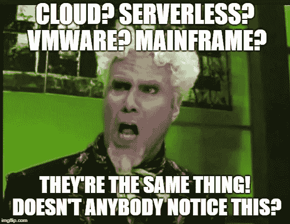
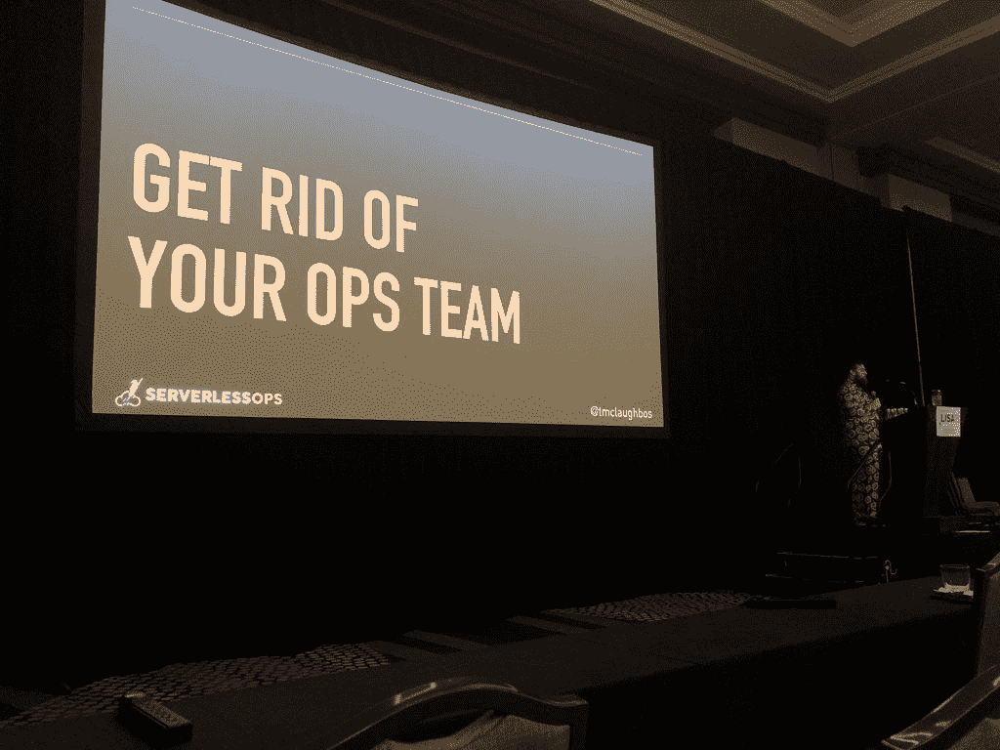
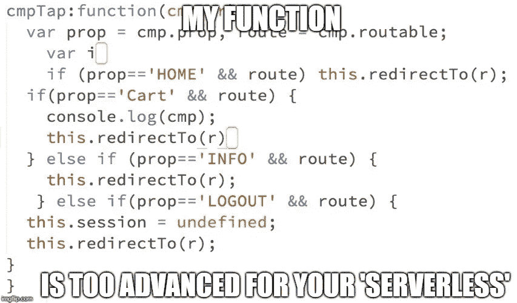

# 害怕无服务器—您如何处理来自 IT 团队的反对意见？

> 原文：<https://medium.com/hackernoon/scared-serverless-how-do-you-handle-opposition-from-your-it-group-c3a6a92f7260>

对于新世界技术人员来说，在企业 IT 地图上导航可能是危险的。以下是当您希望实现无服务器时，可能会遇到的五大异议。

Middle Management Earth holds the secrets to moving technology through IT.

您已经准备好让无服务器进入您的组织-您已经发现了一个机会，知道如何构建项目，现在是时候开始实施了。唯一的问题是，大部门的不有问题，这种新奇的技术，所以你要如何说服他们允许这种异端？

了解中层管理地球的布局是关键。让我们看看一些常见的问题，看看我们能否解决他们的主要异议。

# 异议 1:我们不需要这个。

Lambda 有什么用？调整图像大小。它在调整图像大小方面很棒，尤其是在 S3。不幸的是，大多数公司的应用程序不能仅仅通过调整图像大小来代替，所以我们需要扩展可能的用例领域，让人们思考。同样的例子如此频繁地重复出现，以至于我们需要讨论一下*实际上是如何使用*的。

几乎任何异步任务都是无服务器的良好候选——这些代表了典型公司中数量巨大的工作负载。Cron 作业、报告和批处理位于列表的顶部。甚至许多所谓的同步任务也可以工作，主要是因为延迟并没有那么可怕。

当你的 IT 领导对无服务器产品侧目而视时，提醒他们这不仅仅是功能**。功能很好，但是如果你添加 cdn、对象存储和数据库，你现在就有了将任何流程图转换成工作应用程序所需的所有工具。**

更好的是——他们应该喜欢这一点——您现在可以构建高度安全的应用程序，这些应用程序可以自动扩展，并且运行成本很低。而且，您不必管理任何基础架构来让这些工作负载永远运行。

咱们 TL；博士把那些要点重复了一遍:

*   高度安全
*   自动缩放
*   花费很少
*   没有需要管理的基础设施

因此，如果他们想要只需极少管理工作的应用程序，如*大多数应用程序一样，那么*恭喜，您找到了答案。跟我说:无服务器适用于所有人。

# 反对意见 2:这并不新鲜。额外收获:无服务器只是一个时髦词。

根据一些错误的观点，无服务器并不是什么新鲜事。新技术有一种令人瞠目结舌的倾向，那就是把它与过去的一些经验进行比较，而忽略了新技术的实际好处。在这种*极小*的创新观点中，FaaS 有点像主机上的分时租赁，就像出租车也是一样的[马车](https://www.britannica.com/topic/hackney-carriage-for-hire)。

这很困难，但我想我们能摆脱困境。

希望我们能同意马和汽车是不同的。别管速度、便利性、空调和没有马臭味，出租车的生态系统普遍升级了——成本大幅下降，出租车随处可见，你可以轻松增加乘客数量，它们催生了下一次迭代——拼车。街道上没有马粪也是非常好的事情。所以我的观点是，FaaS 对于主机的分时操作就像优步对于骑马一样。

另外，我最近被告知，“无服务器只是一个时髦词”，意思是“你所做的一切都是浪费时间”。这两种情绪在云的早期也很常见。当然，我可以告诉你，无服务器不仅仅是对空闲系统的有效利用，从几乎没有并发限制、基础设施管理、更高的灵活性，到完全重新关注业务需求而不是系统管理，但我了解这些人。

他们只是想告诉你，没有什么是真正新的。最好只是同意并继续前进到下一个路障。

# 异议 3:“但是供应商锁定！”

我只听到过一些公司的这种抱怨，这些公司签订了多年的 Oracle 合同，每个桌面上都有 Windows，基础架构没有任何多样性。对我来说真的很奇怪。我不知道这是对新想法的全面回应，还是对致力于单一云提供商的真正绝望。

老实说，任何技术选择都在某种程度上涉及到供应商锁定，尤其是在企业 IT 领域。问题真的是:你被困住了吗？是否有 5 年合同(如 Oracle)？廉价的蜜月期过后，价格会突然飙升吗(比如甲骨文)？你能转移到另一个平台(不像 Oracle)吗？从任何角度来看，与选择本地 RDMS 提供商相比，选择任何无服务器提供商的锁定问题都要少得多(我想不出任何例子)。

还不服气？好消息是，您可以混合搭配无服务器提供商。在 Lambda 上运行你的功能，在 Google 上做你的授权，在 Azure 上存储你的数据——去做吧，这是完全可能的。更好的是，添加像[无服务器](https://serverless.com/)这样的抽象框架，你可以变得更加独立于提供者。

从业务角度来看，与过去不断上涨的 IT 供应商成本和多年承诺不同，所有主要的云提供商都表现出相反的情况—成本持续下降，现在是一个按需付费的世界。即使你选择把自己锁在亚马逊或微软，你可能会很高兴你这样做了。

# 异议 4:“我的(团队|经理|老板|猫|狗)不会喜欢这样。”

我曾经认为这是技术圣战问题的另一面——你知道，使用一种技术的团队永远不会尝试其他技术。但我发现这更多是因为害怕人们的工作发生变化。

贝斯维克定律说[任何](https://www.cnbc.com/2018/07/25/mark-cuban-dangers-of-ai-terminator-is-coming.html) [主流讨论](https://www.foxnews.com/tech/fears-of-terminator-style-robot-wars-stop-society-benefiting-from-ai-expert-claims) [的](https://www.dailymail.co.uk/sciencetech/article-5449117/Terminators-style-AI-one-two-decades-away.html) [人工](https://www.cnet.com/news/do-you-trust-this-computer-elon-musk/) [智能](https://www.managementtoday.co.uk/5-real-dangers-ai-according-experts/future-business/article/1457779) [最终](https://www.wired.com/story/fei-fei-li-artificial-intelligence-humanity/)[引领](https://www.express.co.uk/news/science/901980/killer-robots-threat-ai-terminator-artificial-intelligence-danger) [走向一个](https://www.computing.co.uk/ctg/feature/3066550/artificial-intelligence-the-potential-and-the-reality) [头条](https://www.yahoo.com/entertainment/terminator-creator-wants-scientists-take-oath-avoid-robot-apocalypse-081415228.html) [带着](https://www.cnbc.com/2018/05/16/jurgen-schmidhuber-urges-humans-not-to-fear-artificial-intelligence.html) [图片](https://www.dailystar.co.uk/news/world-news/740905/robots-killer-un-outlawed-banned-ai-artificial-intelligence-antonio-guterres) [的](http://www.ibtimes.sg/terminator-coming-real-life-chinese-scientists-developing-shape-shifting-robot-28095) [终结者](https://www.salon.com/2018/11/17/the-future-of-artificial-intelligence-depends-on-human-wisdom/)。去吧——谷歌一下，我等着。

因此，既然无服务器就意味着没有服务器，没有服务器就意味着更多的自动化，而更多的自动化意味着失业办公室里一大群开发人员。DevOps 人将会爱上每周获得 100 美元所需的纸质表格、传真机和人际交往。想想看，这一切都要归功于一个无害的 Lambda 函数调整图像大小。

至少，这是一些高管听到的，而#NoOps 运动正在激怒一些根深蒂固的团队。但这都是假的——在我见过的每个无服务器实现中，DevOps 工程师都成了团队中最重要的开发人员。事实上，下面这个人，来自 ServerlessOps 的 Tom McLaughlin 经常提到这一点，尽管他的第一张演示幻灯片可能会让大多数 DevOps 会议相形见绌。

Ops Teams — Don’t be scared of the man in the pumpkin suit.

为什么？无服务器管理需要 DevOps 擅长的所有智能—从安全性到部署管理—并且该功能是完全无服务器环境的核心。的确，工作发生了变化——你失去了管理基础设施的烦人、重复和枯燥的部分——但(我认为)这更有趣。你会得到更多的睡眠。

这种反对往往带有一种对未知的恐惧——可以理解，但毫无根据。随着 IT 部门从成本中心转变为大多数公司的战略引擎，我们必须摆脱那些不能很好利用我们时间的活动。是的，这意味着每个人都要改变——但没有终结者。

# 异议 5:“无服务器还没有准备好。”

很大一部分 IT 执行管理人员都不擅长预测。这些年来，我听说…

*   没有人会在网上买东西
*   没有人会用手机办理银行业务
*   没有人会相信他们在云中的数据

…这些一贯错误且从未被追究责任的声音经常驱动着他们的 IT 部门。去想想。对无服务器的具体指控有两种形式。

首先，“没人用”。除了可口可乐、Zalora、Nordstrom、Next Door、Blackboard、CodePen、一位云专家、business、Localytics 和数以千计的其他公司之外，没有人知道。嗯，“没有人在大规模使用它*”——除了 Zillow、iRobot、汤森路透、网飞和(别忘了)亚马逊本身。*

*好吧，他们的意思是无服务器工具目前还不成熟，不支持<*在此插入任意需求* >。这些都是真的，但这就像抱怨飞行汽车很糟糕，因为它们不能治愈眩晕。不断有新公司加入生态系统来解决这些差距——看看 Stackery、Epsagon 和 Binaris 这几个闪亮的例子。*

*不要误解我——有些人对云提供商的控制台、API 限制以及可观察性和调试问题有合理的抱怨。我在这个领域认识的一些最聪明的人对所有这些问题甚至更多问题都有精彩的演讲。你知道吗？他们仍然使用无服务器。*

*其次,“为时过早”的说法是基于无服务器是新出现的，但事实并非如此。FaaS 运动的始祖 Lambda 已经 4 岁了，发展速度一直在不断加快。我不知道 AWS 在水里放了什么，但 Lambda 功能发布日志在过去 12 个月里变得疯狂了。*

*First release on the far left: “Do timesharing like the mainframe”.*

*仅仅因为你没有听说过某些东西并不意味着它是新的——无服务器已经存在了一段时间，它被一些主要项目和公司所使用，并且[成功故事](https://hackernoon.com/lessons-learned-a-year-of-going-fully-serverless-in-production-3d7e0d72213f)的普遍嗡嗡声应该是一个指标，它已经为你准备好了。从积极的一面来看，很久没有人说“无服务器中有服务器”，所以我们正在取得进展。*