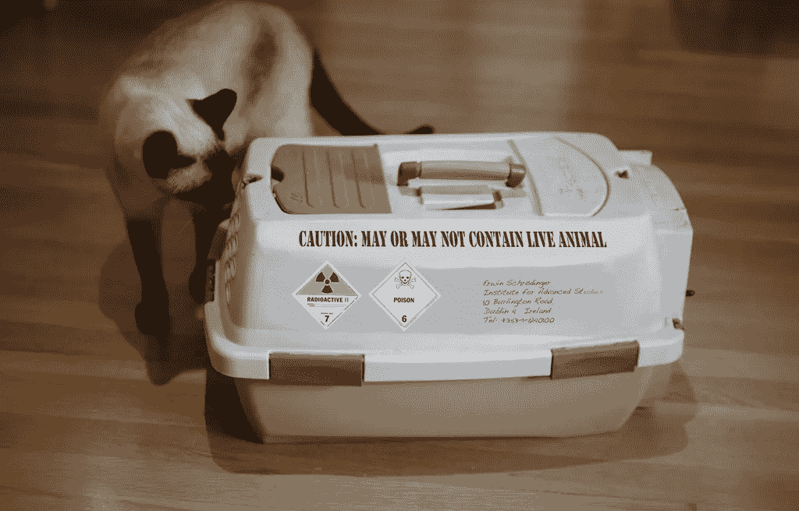

# 薛定谔的金子

> 原文：<https://medium.com/hackernoon/schr%C3%B6dingers-gold-67d9b18d3783>

到现在你可能已经体验过，或者至少听说过比特币网络的费用。不同的比特币钱包实施了不同的估算费用计算方法，费用本身根据价格和网络上的活动量而上下浮动。随着改进的*隔离见证*地址越来越多地被采用，我们可以预计费用在短期内会保持在合理的水平，随着闪电网络和其他第二层扩展解决方案的实施，费用会保持在合理的水平。然而，比特币的规模并没有完全解决，我们可以预计网络总会有某种形式的费用结构。

现在想象一下，比特币是你在网上购买的产品。与所有商品和服务一样，可能需要支付运输成本，或者直接通过运输费用，或者间接添加到产品价格中。那么你能把你的比特币运到哪里呢？答案立刻无处不在。一个比特币在任何时候任何地方都存在。如果有互联网连接，你可以访问你的比特币。如果你愿意，你可以把它记在脑子里。你可以带着任何金额跨越任何边境而不让任何人知道。这个功能被大大低估了。想象一下，从亚马逊订购一根金条或任何东西，只要不到一美元，就可以运到*的任何地方*。如果你从这个角度来看，这个系统现在看起来不再那么糟糕了，不是吗？

就像薛定谔著名的猫一样，在观察者出现并通过观察来确定猫的状态之前，它是活的和死的，一定数量的比特币的价值和新主人直到用户决定使用它才确定。在那之前，它以一种*叠加*的形式存在，就像猫一样。比特币的价值转瞬即逝，除了卖家，没有人能决定它对他们的价值。如果你拥有比特币，你可以随时选择不出售，只要每个拥有者都掌握这个概念，价值就会上升。

关于比特币是什么和不是什么，它应该是什么以及我们可以做什么的解释几乎和协议本身一样长。重要的是要记住，类比就是类比，唯一能真正解释比特币的是代码本身。它就在那里，任何人都可以免费阅读和解释。类比是有目的的，但它们也会给人错误的印象，从而产生错误的期望。整个“有了比特币，你将能够立即向世界上的任何人免费汇款”的叙述就是歪曲源代码的一个例子。比特币并不是你第一次遇到它时所期望的样子。这是它自己的事情，它产生于一种新的合作和决策方式。这是非常独特的，它和*几乎没有什么*共同点，当谈到永恒性时，似乎无尽的克隆人和剽窃紧随其后。薛定谔的潘多拉盒子被打开了，在里面我们发现了一只全新的猫，非常野性，非常有活力。