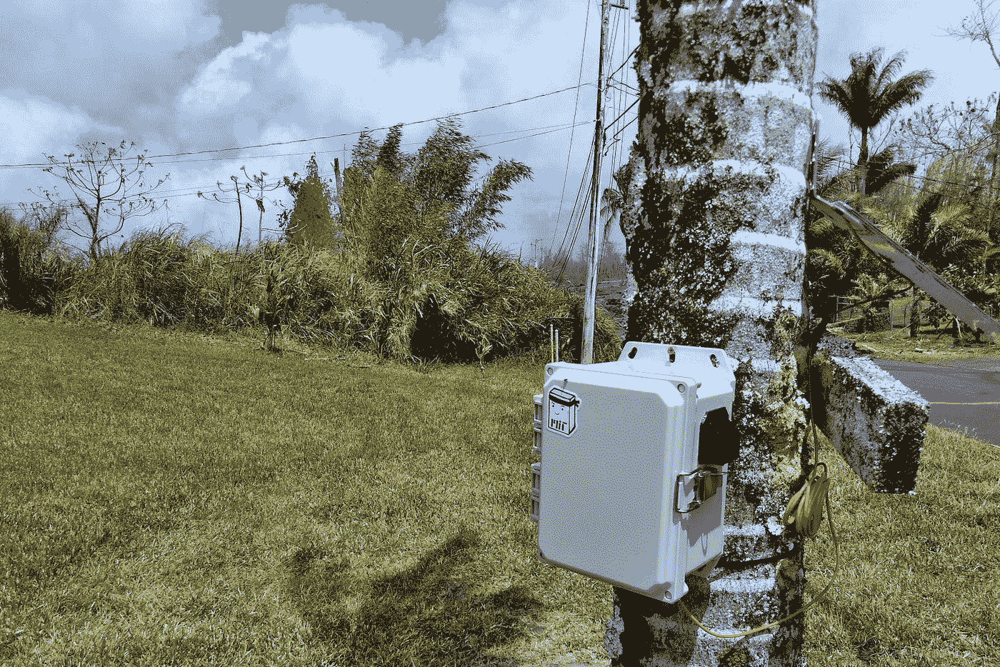

# 科学家部署物联网网络对抗基拉韦厄火山的致命烟雾

> 原文：<https://medium.com/hackernoon/scientists-deploy-an-iot-network-to-battle-kilaueas-deadly-fumes-a8ab3429a613>

## 从夏威夷到印度，科学家们正在使用物联网传感器来监测空气中的有害污染物。

麻省理工学院的科学家和科哈拉中心的科学家创建了一个 T2 夏威夷岛 Vog 网络，提供对夏威夷二氧化硫和颗粒物等有害气体的实时测量。该网络使用低功率传感器收集数据，这些传感器位于火山爆发区附近，并通过一个[电子](https://www.particle.io/products/hardware/electron-cellular-2g-3g-lte/)连接到互联网。

> *“我们是真正将物联网传感器用于科学的主要团队之一，并从工程角度对其进行改进，使其可用于其他科学研究。”—大卫·哈根，麻省理工学院科学家*

# 基拉韦厄火山的持续喷发

麻省理工学院的科学家(也被称为 Kroll 集团)和科哈拉中心希望了解更多关于夏威夷大气中的污染物，并通过可访问的方式向公众提供这些信息。

由于夏威夷最活跃的火山基拉韦厄火山在 5 月初爆发，对这个网络的需求再及时不过了。

在一个月的时间里，基拉韦厄火山摧毁了大约 700 所房屋，导致至少 21 条裂缝出现，并使居民暴露在高浓度的二氧化硫气体中。

即使在今天，这些危险的烟雾仍在火山中沸腾，地质学家警告说，这些喷发可能会持续数月或数年。

# 问题是

随着火山在过去三十年里频繁喷发，二氧化硫的排放已经对夏威夷周围的一些地区造成了危害。

由于健康风险如此之高，市民们一直在搜索跟踪火山 vog(火山气体烟雾)的数据，以便他们知道应该避开哪些区域。

然而，岛上的居民很难轻易获得空气质量信息。

通常情况下，环境保护署(EPA)会建立空气质量监测站来监测毒素和污染物。在美国，每个站点的建立和运行费用约为 10 万美元。然而，他们收集的数据对于公众来说并不总是容易获得的。

# 解决方案

*Tata Center Air Quality Sensor*

夏威夷岛 Vog 网络由低功率传感器供电。与 EPA 站点不同，这些传感器的成本约为 1000 美元，而且经常性成本极低(手机服务等)。通过粒子电子，这些传感器能够将数据远程传输到网络，而无需人工干预。与典型的空气质量监测器相比，传感器的小尺寸和低成本也允许它们被更广泛地部署，这意味着它们可以捕捉高度本地化的空气质量数据。

# **测量印度德里的城市空气质量**

麻省理工学院的科学家之一大卫·哈根已经发现这些传感器在其他地方有很好的应用。根据世界卫生组织的数据，印度拥有 14 个世界上污染最严重的城市。这些城市中的大多数只有几个空气质量站点来监测这些空气污染物，但这些站点无法提供监测暴露所需的具体数据。

然而，低成本的[物联网](https://hackernoon.com/tagged/iot)传感器正在提供更好地了解城市环境中产生的污染物所需的粒度。David 目前拥有实时监测数据的现场原型，他继续在实验室开发生产模块。通过这些传感器，大卫希望全面了解大气空气质量，并努力帮助政府减轻城市空气污染的影响。

# **为了科学和社区**

借助物联网硬件，麻省理工学院和科哈拉中心的科学家们正在提供可靠、准确和实时的夏威夷和大城市空气污染物信息。这些设备不仅部署成本更低、易于使用，还能提高需要数据的人获取数据的能力。他们已经与大岛上的当地学校合作，将环境科学和数据分析融入课程中。他们还将很快推出一个网站，提供来自传感器的所有信息，让居民登录并轻松检查空气质量。