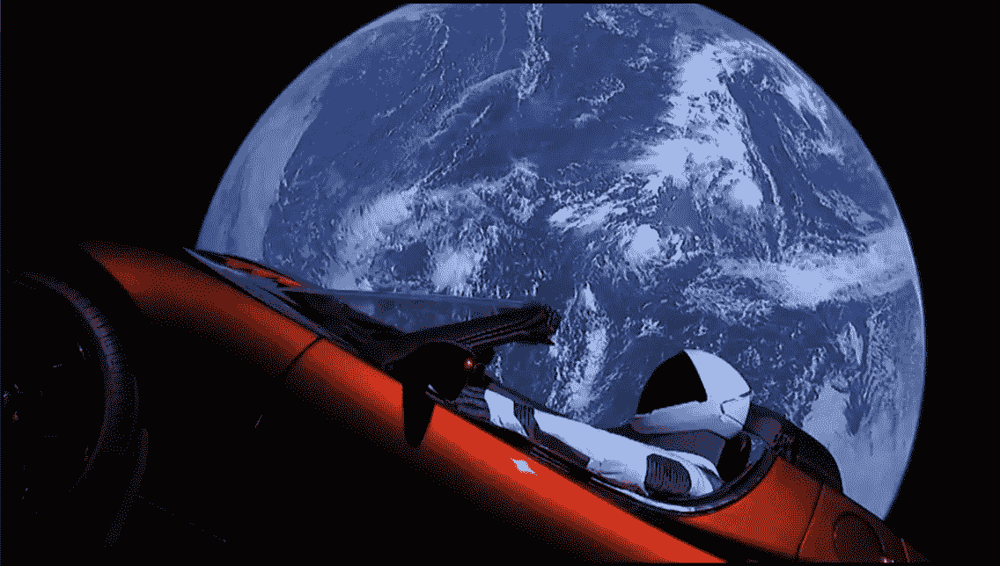
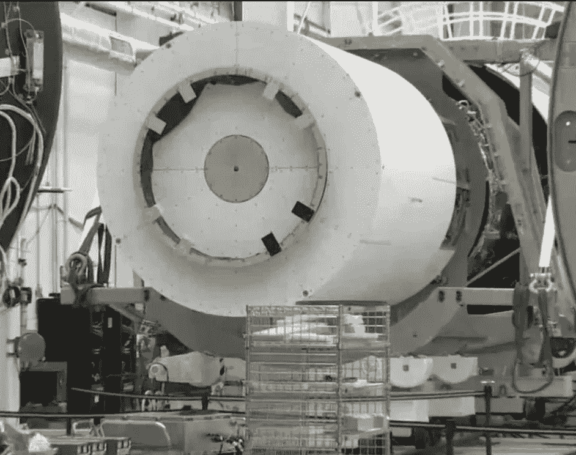
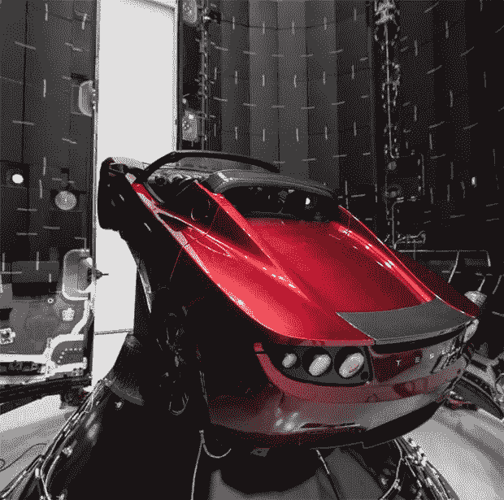
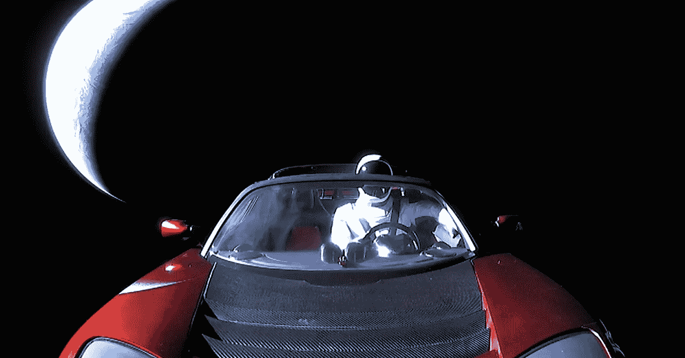

# Scope Creep &埃隆的太空跑车

> 原文：<https://medium.com/hackernoon/scope-creep-elons-space-roadster-79887a039aee>

A car in space

当然，你已经听说过埃隆·马斯克和 SpaceX 在猎鹰重型火箭的基础上推出了特斯拉[跑车](https://hackernoon.com/tagged/roadster)。

那么，为什么是跑车？

通常情况下，在测试火箭时，它们会装载质量模拟器来模拟真实有效载荷的重量。你不想让昂贵的卫星在测试中爆炸，所以你派了一个假人。

A mass simulator. How boring is that?

埃隆·马斯克决定他不想变得“无聊”(看我是怎么做的)，所以他决定把一些有趣而又荒谬的东西送上轨道。

A decidedly not boring mass simulator

# **好吧，这和范围蔓延有什么关系？**

想象一下[埃隆](https://hackernoon.com/tagged/elon)和他的团队在得知他们要向火星发送一辆装有人体模型的汽车时，肯定会对跑车提出要求:

> 我们要一路去那里，所以我们为什么不在 Starman 里面增加一个摄像机，在我们漂浮在太空的时候提供一个人类视角！！

或者，

> 既然你无论如何都要送这辆车，那就最好加一个传感器来跟踪和报告辐射对油漆、皮革和橡胶的影响！

或者这个，

> 为什么我们不在那里放几个传感器来记录宇航服的磨损情况呢！这是个千载难逢的机会！

毕竟，你是在派一辆装有宇航服的汽车去那里。想想可能性吧！

与整体范围相比，这些请求中的每一个都相对较小，但看起来有很大的好处。

这些请求也是**范围蔓延的典型案例。**

让我们举个例子，为一个 Starman 视点添加一个摄像机。

**让我们在《星人》里“附赠”一台摄像机吧！**

实施开始了，故事是这样展开的:

> 斯塔曼摄像机延迟了。
> 
> 我们拿到摄像头了。但是等等，摄像机没有贴在人体模型上。
> 
> 我们需要一种能承受 10 克的新型粘合剂。供应商延期交货 6 个月！
> 
> 我们无法通过宇航服将电源线连接到摄像头和发射器，所以我们给人体模型添加一个电池组。
> 
> 人体模型需要重新设计，以容纳相机电池组。
> 
> 摄影小组要求 10 张发射架的票。
> 
> 去他妈的。还是送个混凝土块吧！

我认为埃隆公司巧妙地拒绝了这些请求。

# 把它绑在一起

你会在软件项目中看到很多这种类型的“*让我们再做一件事*”。这些年来我肯定有过。

你会看到一些非常有用的附加功能，比如创收器、顾客快乐创造者和 NPS 克星。

诱惑是把它们扔进去，就像把小鹅卵石放在大石头之间。

在大多数情况下，这些“鹅卵石”会给你的交付等式增加几个变量。复杂性和不确定性在开发周期的每一步都呈指数增长。

帮助我抓住这些范围小兵的是以下内容:

问问我自己&其他人:鉴于 X 从未出现在早期版本中，那么在这个版本中 X 如此迫切地被需要，现在又发生了什么变化？

*牢记发布的总体目标:对我们的客户有什么好处，对我们的业务有什么好处。*

*在我的开发过程中的每一步都在脑海中走一遍，并估算成本:设计、编码、单元测试、质量保证测试、文档、错误修复、市场营销等等。*

所以，当心令人毛骨悚然的特征！

Gratuitous SpaceX image.

我不能肯定地说 Starman 是否没有我上面提到的一些特征，但 Elon 没有给出任何迹象表明 Starman 或 roadster 返回了任何数据。