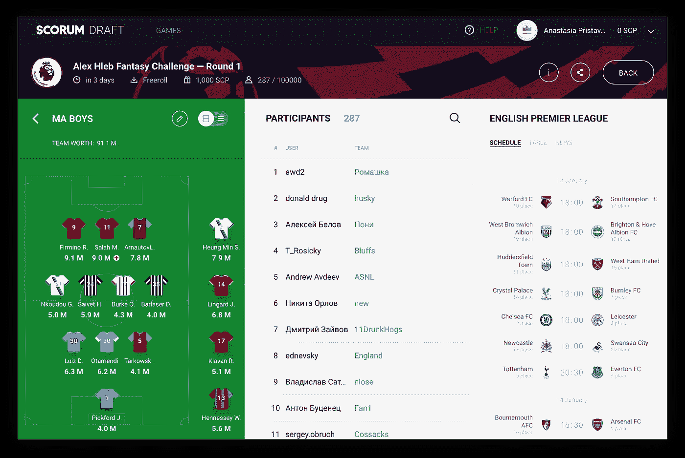

# Scorum 草案:第一个拼图块到位

> 原文：<https://medium.com/hackernoon/scorum-draft-the-first-puzzle-piece-falls-into-place-6dd44715ac75>

## 随着每日幻想体育平台 [Scorum Draft](http://draft.scorum.com) 的推出，玩家将能够赢得 Scorum Coins token(SCR)，体育媒体的发展迈出了第一步。

世界各地球迷的竞争天性让他们更接近自己热爱的运动，并让他们在比赛中加入一点激情。然而，这一次将不再有**的费用支付**，所有的战利品将直接归赢家所有。

作为 Scorum 全面的下一代体育媒体平台的一部分，daily fantasy sports 为会员提供了一种有趣和迷人的方式来**与世界各地的其他粉丝联系和竞争**。最初，它将只适用于足球/英式足球，但 Scorum 平台的动态特性将允许向社区要求的任何方向扩展！

## 我们也赚不到一分钱，这就是为什么我们对此完全没有意见:

*   **早期采用:**通过在众筹期间推出足球 FS 原型，我们的目标是尽早吸引最终用户加入 Scorum 平台。 *Scorum 是为粉丝创造的，而不是为加密货币投机者*。为此，我们希望第一批“进门”的人是热爱足球的球迷，他们非常想免费玩梦幻联赛。
*   **即时用例**:一旦我们的区块链上市，SCR 登陆买家账户，我们的梦幻体育联盟玩家就有机会用 SCR 买入和支付。这将由联盟委员来设定买入条款，但是 Scorum 将不会为此收取任何费用。Scorum 的好处是**SCR 加密货币的即时效用**。
*   **技能游戏:**[免佣金博彩交易](https://hackernoon.com/scorum-and-sigma-join-forces-to-open-a-cryptocurrency-betting-solution-for-integration-8a1157861d21)将是 Scorum 的一大部分，但不幸的是当地法规将禁止我们向所有用户提供它。幻想体育被认为是一种技能游戏，而不是一种赌博形式，使我们能够向世界各地的广大用户提供 SCR 幻想联盟。除了无聊的法律原因，玩梦幻体育很有趣，并挖掘了球迷的竞争灵魂。

## **独家签名大奖赛拉开了 ScorumDraft 的序幕**

虽然 Scorum Crowdsale 将于 1 月 14 日至 2 月 11 日举行，但 Scorum Draft 的玩家可以享受由欧洲足球锦标赛冠军 Alexander Hleb 签名的免费锦标赛。四轮比赛将于 1 月 13 日英格兰超级联赛第 23 个比赛日开始。每轮的获胜者将获得一个赫莱布签名球，而第五名的亚军将获得一个签名 Scorum 咖啡杯。

Scorum Advisor and UEFA Champ Alexaner Hleb

想有机会从 Hleb 赢得大奖吗？点击查看详情[。](/@scorum/scorums-fantasy-leagues-kick-off-with-signature-prizes-from-alexander-hleb-fd8bf11c7a22)

## **谁玩梦幻体育？**

FSAT [估计](https://fsta.org/research/industry-demographics/)去年在美国和加拿大**五分之一的人**积极参加梦幻体育活动，总共有近 6000 万人参加。这比 2010 年的 3200 万有所增加，参与数据显示自 2003 年以来持续增长。

在这些玩家中，超过三分之一是青少年，幻想体育参与者的平均年龄为 38 岁。18 岁以上的玩家平均每年花费 556 美元参与梦幻体育运动。

所有这些对幻想体育比赛的兴趣推动了体育媒体的进一步参与，近三分之二的幻想玩家表示，由于他们参加了幻想联盟，他们观看了更多的现场体育比赛，阅读了更多的体育报道。

*Alex Hleb Challenge at Scorum Draft*

考虑到这些数字，Scorum 的价值主张为 fantasy sports 玩家提供了一个一站式平台，供他们观看和阅读他们最喜爱的运动的报道，以及集成的联盟，他们可以使用 SCR 令牌买入并与朋友和其他用户竞争。

## **统计+幻想:完美的组合**

Scorum 的统计中心为各种水平的梦幻体育运动员提供所有最新信息，以便他们做出明智的选择并在竞争中胜出。正如[我们的测试版显示的](http://stats.scorum.com)，球迷可以通过我们的多重比赛浏览器跟踪几个联赛的比赛，如下所示:

*All the games in one place*

随着游戏跟踪，Scorum 成员可以快速跟踪和调查个人球员的表现，他们选择他们的球队或潜在的球员，他们正考虑交易。

> 不介意自己去挖掘所有的数据吗？记者们 [@scorumstats](https://www.instagram.com/scorumstats/) 在这里处理数字，并与所有人分享有用的数字魔法金块。

看那个。我们有点失控了。这是**两个合适的拼图块**，完美地组合在一起启动 Scorum 社区。要想知道其余的将如何排列，请查看[我们的路线图](https://hackernoon.com/champagne-and-fireworks-scorums-resolution-roadmap-for-2018-a45245f7c11e)。

## 喜欢你看到的吗？加入 1 月 14 日 17:00 GMT 开始的 [Scorum 大拍卖](http://www.scorumcoins.com/sign-in)

*   传播消息并[获得免费 SCR 代币](https://hackernoon.com/believe-in-blockchain-tech-and-love-sports-a5daaf051f89)
*   在[电报](https://telegram.me/SCORUM)上与我们聊天
*   通过[脸书](https://www.facebook.com/SCORUM.COMMUNITY/)和[推特](https://twitter.com/SCORUM_en)获取最新更新