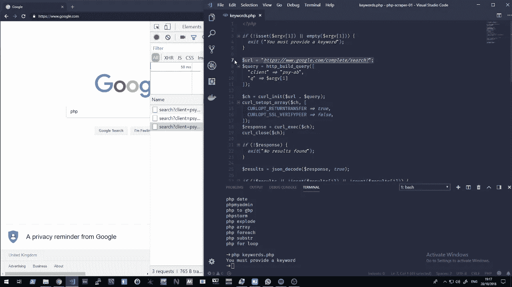

# 在终端用 PHP 抓取 Google 建议

> 原文：<https://medium.com/hackernoon/scraping-google-suggestions-with-php-at-the-terminal-9ddbd02213fb>

最近不写那么多了，开始制作视频。我发现用视频教学比用文本教学更好，而且制作内容对我来说也更容易。

我推出了一个名为“James❤Code".”的系列节目在我的系列中，我讨论任何与计算机和程序员有关的东西。我有点无所不知，我喜欢与他人分享知识。

在我的第一集里，我讨论了使用 PHP 在终端上抓取 Google 建议。PHP 在终端上运行得非常好，我已经多次使用它来作为一个进程运行 PHP 代码。

我希望你喜欢我的第一个视频…