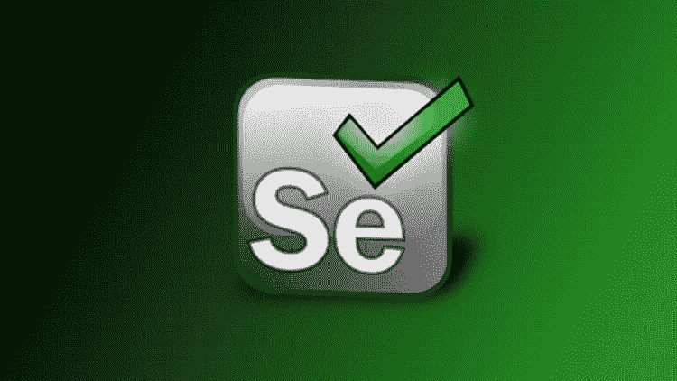
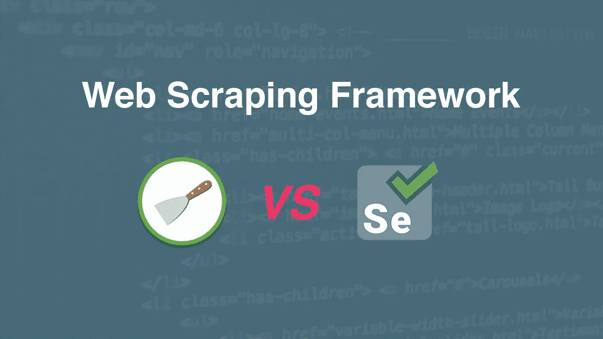

# 痒还是硒？

> 原文：<https://medium.com/hackernoon/scrapy-or-selenium-c3efa9df2c06>

# Scrapy

***Scrapy*** 是一个网页抓取框架，它将整个抓取过程划分为小的过程，使得抓取过程井井有条！

抓取数据( **spider.py** ) - >旋转代理或 IP(**middleware . py**)->

清理数据( **items.py** )- >存储数据( **pipeline.py** )

带所有设置( **setting.py** )。

> 最大的特点是，它是建立在 Twisted，一个异步网络库，所以 Scrapy 是使用一个非阻塞(又名异步)代码实现并发，这使得蜘蛛性能非常大。— **迈克尔·尹**

# **硒**

Selenium 是一个免费的自动化测试套件，用于跨不同浏览器和平台的 web 应用程序。虽然是为了 web app 上的自动化测试而创建的，但是真的很容易应用到 scrape 网站上！你只需要

*   ->下载 chrome、firefox 或其他驱动->使用它们的 API 抓取网站。

***我使用硒面临的问题:***

1.  速度相当慢。
2.  需要相当多的内存，如果你想建立一个多线程爬虫，以加快进程。

***我用 Scrapy 面临的问题:***

1.  更难调试。
2.  如果你正在实现 Scrapy-Splash，就更难连接到[或](https://www.torproject.org/)。
3.  当你想使用飞溅时，参考较少。

**分享我的经历:**

起初，我学习 Selenium 是因为它更容易学习和调试，因为我需要渲染 JavaScript 网站。当我第一次使用 selenium 时，它满足了我的所有需求，在规定的时间内抓取了所有网页。然后使用多线程加速，一切都会变得非常顺利。

Yeah Really Smooth!

但是有一天，一个特定的网站通过实施**完全自动化的公共图灵测试来区分计算机和人类** **(验证码)来阻止我。我真的被卡住了，但我被要求想办法解决这个问题。所以，在我尝试了所有解决验证码的方法后，我想为什么不使用另一个框架来尝试看看它是否能绕过验证码。**

Bang my head and hope something magical come to my mind :(

最后，我发现了 Scrapy 框架，不仅解决了验证码问题，而且是我学习一个真正强大的爬行框架的开始！Scrapy 的学习曲线比 Selenium 陡峭得多，但基于下面的五点**绝对值得:**

1.  与 selenium 相比，用更短的 Python 脚本编写爬虫代码。
2.  爬行速度比硒快很多。
3.  如果你正在使用 scrapy-splash，在 localhost:8050 上有一个很棒的终端 splash 渲染，这样你就可以尝试你的 Lua 脚本。
4.  以一种真正结构化的方式组织你的爬虫代码，这样你可以获得最大的满足:)
5.  Scrapy 可以很好地扩展，如果你的项目需要抓取大量的网站。

Scrapy-Splash 绝对值得尝试来渲染重载 Javascript 网站，但与 Splash 相比，Scrapy-Splash 的资源要少得多。

这里有一些我觉得对学习 Scrapy-Splash 有用的资源。

1.  【https://splash.readthedocs.io/en/stable/faq.html 号
2.  【https://www.cnblogs.com/shaosks/p/6950358.html】T4(中文网)
3.  https://juejin.im/post/5afe47b3f265da0b767db40e(中文网)

这里有一些学习 Scrapy 的非常有用的资源。

1.  [https://doc.scrapy.org/en/latest/intro/tutorial.html](https://doc.scrapy.org/en/latest/intro/tutorial.html)
2.  [https://www . analyticsvidhya . com/blog/2017/07/we B- scraping-in-python-using-scrapy/](https://www.analyticsvidhya.com/blog/2017/07/web-scraping-in-python-using-scrapy/)
3.  [https://blog . Michael yin . info/scrapy-tutorial-5-how-create-simple-scrapy-spider/](https://blog.michaelyin.info/scrapy-tutorial-5-how-create-simple-scrapy-spider/)
4.  [https://python . go trained . com/scrapy-tutorial-we B- scraping-craigslist/](https://python.gotrained.com/scrapy-tutorial-web-scraping-craigslist/)

这里有一些真正有用的学习硒的资源。

1.  [https://selenium-python.readthedocs.io/](https://selenium-python.readthedocs.io/)
2.  [https://www.softwaretestingmaterial.com/selenium-tutorial/](https://www.softwaretestingmaterial.com/selenium-tutorial/)
3.  [https://www.tutorialspoint.com/selenium](https://www.tutorialspoint.com/selenium)

**所有资源都基于 Python。快乐学习！**

***如果你正在找人帮你搜集数据，请填写下面的免费访问链接，谢谢:)***

[http://datainfinite.strikingly.com/](http://datainfinite.strikingly.com/)

如果你有兴趣了解更多关于 Scrapy-Splash，Scrapy 或 Selenium 的教程，欢迎在下面发表评论！