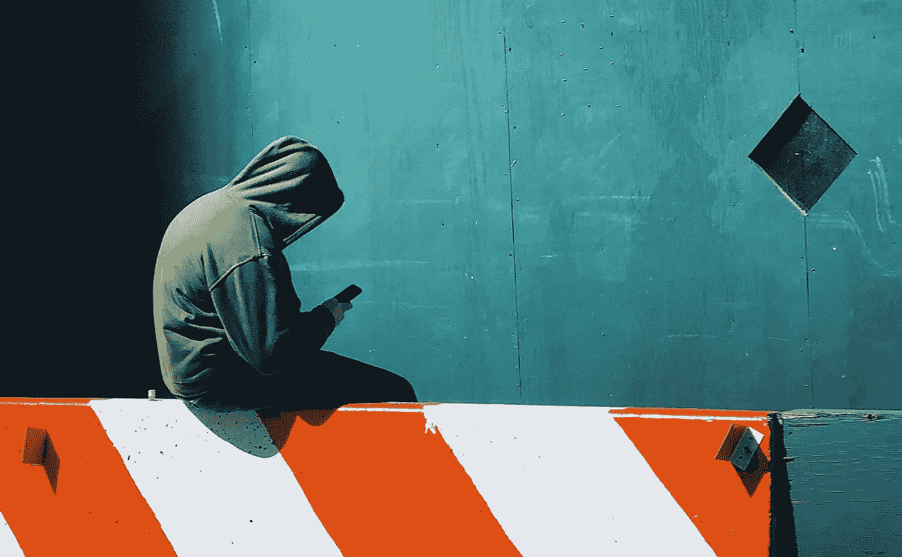
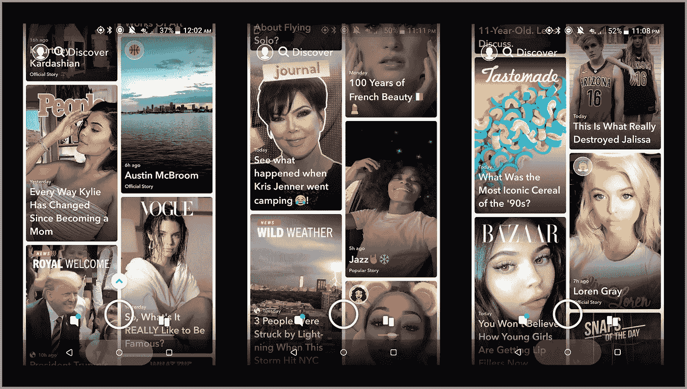
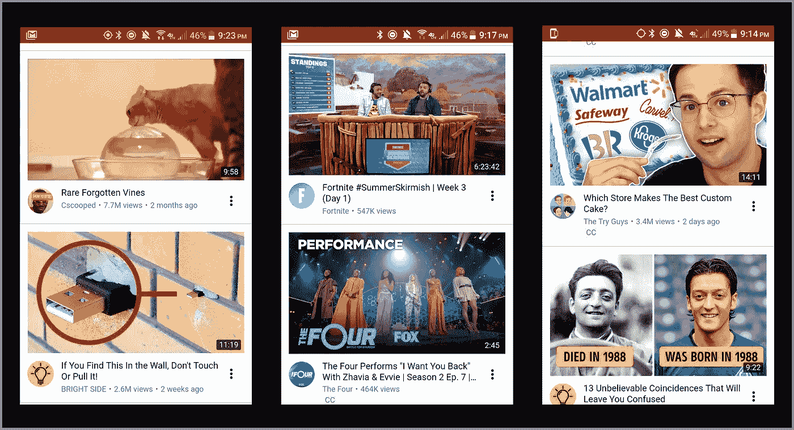
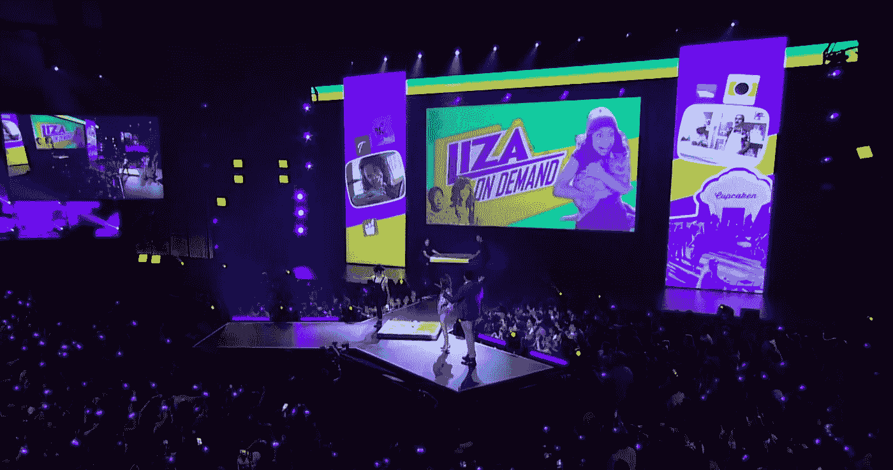
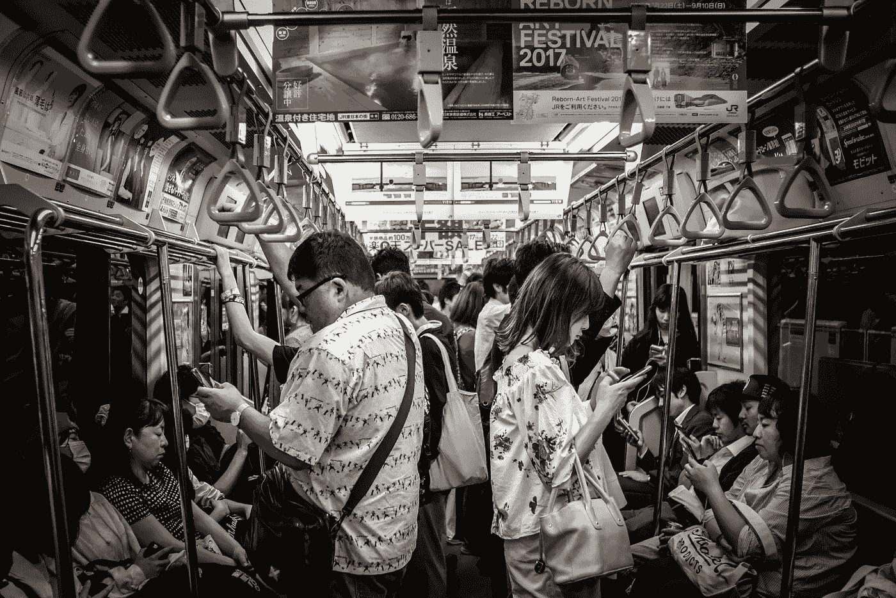
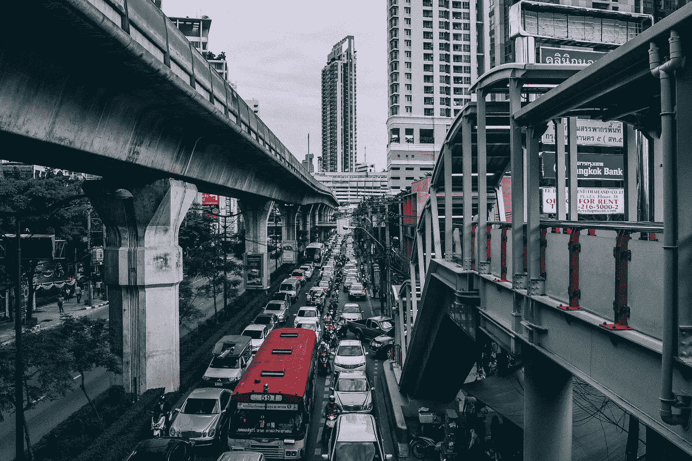

# 屏幕成瘾不是问题

> 原文：<https://medium.com/hackernoon/screen-addiction-is-not-the-problem-7a14b77f5417>

这里有许多值得关注的理由[屏幕成瘾](https://hackernoon.com/tagged/screen-addiction)。也许你有一些朋友不拿手机就无法交谈。也许你因为上网时间太长而脖子疼。也许你有一种直觉，面对日常生活中无休止的通知和令人上瘾的平台，我们无能为力。

至少对我来说，这些听起来都是真的。但我不认为我们是无助的，我也不认为“屏幕成瘾”正是我们应该与之斗争的。我相信，构建面向消费者的平台的人可以通过关注内容来彻底改变这些与屏幕相关的问题。**当平台上充斥着对用户有价值的内容时，屏幕瘾将不再相关。**

我会详细说明，但首先，我想后退一点。

# 当前的技术状态有点可笑

今天，我们可以立即免费获得最全面的历史百科全书。我们有能力虚拟旅行到世界上的任何地方。无论我们生活中的人去哪里，我们都可以和他们保持联系。见鬼，如果我们以某种方式轻触手机，我们甚至可以把食品杂货送到我们家门口。

屏幕赋予我们 20 年前做梦也想不到的奢侈品。那么他们怎么会毁了我们的生活呢？

## 你是产品，你正在失去

需要注意的一个重要区别是，屏幕并没有让我们的生活变得更好——而是让我们的生活变得更糟。更糟糕的是，尽管我们可以通过屏幕看到所有惊人的创新，但我们仍然在抱怨它们。

我们的孩子开始玩电子游戏，无法停止。我们的青少年睡眠越来越少，越来越肥胖，也越来越孤独。由于我们花在社交媒体上的时间太多，我们的[心理健康](http://time.com/collection/guide-to-happiness/4882372/social-media-facebook-instagram-unhappy/)正在受到影响。我们不能在餐馆吃饭而不本能地检查我们的手机。但我们无法与之抗争，因为作为对所有在线免费内容的交换，我们付出了我们的注意力。

面向消费者的科技公司希望你使用并喜爱他们的产品。在依赖内容的产品中，你盯着它们看的时间越长就越有利可图(即社交媒体和分享平台)，这意味着平台设计师花时间对产品的每个细节进行原型设计和测试，从“阅读更多”按钮的弯曲度到你将收到的通知数量，所有这些都是为了优化你的体验(即，为了你大脑中的[多巴胺达到](/thrive-global/how-technology-hijacks-peoples-minds-from-a-magician-and-google-s-design-ethicist-56d62ef5edf3))。

有许多看似良性的功能却非常有效地让我们沉迷其中——想想网飞一集接一集的自动播放，Instagram 无止境的反馈，甚至是可变的“奖励”(赞、评论等)。)我们一接到脸书的通知就收款。如果你认为它们不起作用，看看统计数据:2018 年，40%的社交媒体用户报告说他们发现很难停止使用社交媒体，而 4 年前的 28%的社交媒体用户在 2014 年。当你手机上的每个应用程序都被精心制作成不同的高科技药物来尝试时，“放下手机”变得越来越难。

Netflix makes it easier to keep watching than to stop.

作为消费者，我们不会赢得与技术的战争。

# 科技的未来岌岌可危

我们知道我们使用的产品正在操纵我们，这一事实对科技行业没有任何帮助——它增加了硅谷周围所有关于隐私、安全和即将到来的反乌托邦毁灭感的审查。

但是对于我们这些科技行业的人来说，如果我们说我们将停止制造令人上瘾的产品，那我们就是在撒谎。事实上，随着越来越多的人花更多的时间在他们的设备上，我们将会开发越来越多吸引眼球的产品。但是如果某种产品 X 的用户逐渐开始感觉到他们的行为被操纵(或者如果他们，比如说，读了一篇商业内幕文章关于为什么 X 让他们的生活变得更糟】,这可能会迫使他们放弃。还记得[#删除 Facebook](https://www.washingtonpost.com/news/the-switch/wp/2018/04/09/why-apple-co-founder-steve-wozniak-is-joining-the-deletefacebook-movement/?noredirect=on&utm_term=.6219413124ca) 吗？甚至(或者尤其是)最大的公司也不能幸免于公众的反对。公众对科技的不信任最有可能削弱 T4 的产业。

这就是为什么我认为我们需要回到我们正在建设的核心。我相信**构建面向消费者平台的人**(这意味着任何人，从工程师、设计师、项目经理到数据科学家、内容战略家、执行官)**需要感受到创造值得*吸引人们的东西的责任。***还有一个极其重要但经常被忽视的方面，那就是特别关注**他们平台上的内容*。***

## “自从当了妈妈，凯莉的方方面面都变了”

抱歉，凯莉·詹娜，但是和你一起度过我的虚拟时光我不会有什么收获。Snapchat 的 Discover 没有帮助——几个月前，我点击了几个名人做无聊日常事情的自拍视频，现在我只看到这些。

Keeping up with the Kardashians — Snapchat style

但是 Snapchat 显然在做正确的事情，如果它是美国青少年的首选应用的话。但是，如果你是 Snapchat 用户，你可能已经理解了真正的朋友对重新设计的关注度下降所导致的反弹。我猜，随着货币化和重新定义他们作为“相机公司”的角色的压力越来越大(不管这意味着什么？)，Snapchat 很想给我看更多卡戴珊的视频。

让我们明确一点:Snapchat 试图建立更多合作伙伴关系并引入新的现金流机会这一事实并没有直接困扰我。我相信他们知道他们希望自己的企业朝什么方向发展。让我困扰的是，他们试图让我看的内容*很烂*。

## 但不仅仅是 Snapchat。

其他例子:YouTube 有大量高质量的内容，但我总是看到相同类型的脱口秀片段、BuzzFeed 视频和主页上的“你不会相信会发生什么……”点击诱饵。脸书在组织活动和与老朋友重新联系方面非常有用，但我的新闻 feed 现在 95%是 gif 和 meme 视频，这让我的 CPU 粉丝疯狂。这并不是说这些内容本质上是恶意的或邪恶的，甚至是*那样糟糕的*，但是从长远来看，在它们上面浪费了几个小时之后，我感觉很糟糕。

如果 Discover 上的内容像他们朋友的故事一样有趣或相关，Snapchat 的用户就不会对重新设计感到如此愤怒。如果人们看到更有价值的内容，他们就不会把 YouTube 和脸书视为他们来之不易的空闲时间的敌人。

# 这是一个内容问题。

内容是区分值得上钩的产品和不值得上钩的产品的主要标准。一个内容问题不可能像修复 bug 一样解决。它依靠搭建平台的人的不断努力来推广有价值的内容。

## 一、什么是“有价值的内容”？

在我定义任何东西之前，我只想承认这纯粹是我关于什么使内容有价值的总体想法。我认为对于在不同平台上工作的人来说，明确定义他们对“有价值的内容”的具体想法是非常重要的

好吧，回到正题:总的来说，我认为内容(无论是视频、滚动提要、游戏、信息应用、文集、虚拟现实环境，还是其他任何可以想象的东西)是有价值的，如果它从长远来看有利于用户的健康和幸福。更具体地说，实现这一点的一些方法包括: **促进有意义的社会互动，提供教育价值，激励更健康的习惯，或促进生产力。**

我将在下面详述这些。

## 我们不再说话了

有意义的社交互动是任何能让你与他人建立更亲密关系的事情。通常，这意味着平台必须让你和其他人面对面地聚在一起，这提供了更多[回报](https://www.sciencedirect.com/science/article/pii/S074756321000213X)的人际交流。今天，我们很幸运有各种信息渠道与我们的圈子交流，但当我们允许这些渠道取代线下交流时，我们变得[不那么高兴了。但是，不仅仅是为了促进面对面交流的产品仍然可以鼓励面对面的交流。想象一下，如果一个社交媒体网站的“发布”按钮旁边有一个“组建一个聚会”复选框，那么你可以选择发布一些可以在现实生活中引发令人满意的对话的内容。](https://www.independent.co.uk/voices/social-media-is-making-us-depressed-lets-learn-to-turn-it-off-a6974526.html)

## 活着就是学习…

重要的**教育**基础知识以及专业学术领域的顶级指导都可以在线[获得](https://www.khanacademy.org/)。但是，即使在更普通的社交平台上，也有大量的机会来传播有趣的信息——例如，我喜欢在 YouTube 上观看 TED 演讲，我已经了解到一些非常有趣的事实，即使是在 reddit 的丛林中。从我书呆子的内心深处，我相信在创意平台上整合教育内容有潜力让学习变得无限有趣。但是，当人们在网上阅读他人的见解、想法和故事时，他们拓宽了自己的视角。在一个充满分歧和偏见的世界里，相互教育应该是当务之急。

## 健康热可能是虚拟的

让你**更健康**的平台类别包括任何能提高你长期生活质量的东西。在健康方面，可以是任何与营养、[睡眠、](https://justgetflux.com/)锻炼、甚至情感支持或压力管理有关的事情。特别是当屏幕鼓励许多不健康的习惯——过度坐着，忽视睡眠，忽视自己——如果我们想避免增加医疗问题，这变得越来越重要。

## 把事情做完

帮助我们更有效率的产品让我们有更多的时间做我们关心的事情。消除日常琐事的麻烦会让你更有效率。有助于你明确目标和确定目标优先级的事情会让你更有效率。能让你与他人交流重要信息的东西会让你更有效率。即使是纯粹的娱乐也能让你得到急需的休息，从而提高工作效率，但所有让你沉迷几个小时的自动播放/无止境的 feed 式技巧都可能抵消它的好处。在这种情况下，支持生产力的唯一理由就是减少那些消耗意志力的特征。有很多 [的](/s/story/how-tech-companies-can-make-their-products-less-addictive-4e409df8316)[有趣的](https://www.nytimes.com/2018/01/17/technology/apple-addiction-iphone.html) [文章](https://futurism.com/should-make-technology-less-addicting-developers-ever-want/)讲述为什么以及如何做到这一点。

# 如何解决内容问题

好吧，这些想法听起来很好，也很健康——但是我们怎样才能把它们变成现实呢？

答案是:平台构建者需要同时致力于**平台本身**和**平台的内容**，以便创建一个有价值的内容可以广泛获得和访问的环境。

## 1.改进平台本身

不可否认，这在不同的平台上有很大的不同。以下是使平台更有助于对每个用户相关和有价值的内容的一般想法。

## "高级选项"

给用户更多的选项来定制他们的内容通常是一个好主意。这并不意味着你必须在用户第一次注册时给他们 30 个不同的复选框来点击，从而导致决策疲劳——你可以保留那个时尚、用户友好的界面，但也让人们可以轻松访问高级选项，以真正控制他们所看到的内容。

基于你已经看过的内容的内容并不总是可靠的——如果有人疯狂点击诱饵，这并不一定意味着他们的主要兴趣是点击诱饵。定制选项对于任何想要对所看到的内容进行任何程度的控制的人来说都是无价的。

## 监管和多样化的默认内容

当我如饥似渴地走进西夫韦时，我看到那一摊软糖，我会想:*吃点没什么坏处！*虽然得到一袋棉花糖并不一定会鼓励我在购物篮中添加更多的棉花糖，但观看游戏视频*将*让我走上更多游戏视频的道路，特别是通过推荐。

我们在线浏览的基调是从我们点击的第一个东西开始设定的——这就是默认内容如此重要的原因。此外，大多数人接触的内容通常是*而不是*最有价值的内容。这就是真人治疗的用武之地。

Not-so-curated content on my YouTube homepage

如今，我相信人类比任何算法都更能挑选出有趣的、相关的、能让我积极受益的内容。平台应该让内容管理员挑选与平台使命同义的内容，然后增加这些内容在默认和推荐功能上的排名。对于作为消费者的我们来说，找到好的内容是如此困难和耗时，这就是为什么平台本身应该承担一些负担。

## 2.改进内容本身

如果有价值的内容很难找到，那么生产就更难了。

人们在公共平台上贡献最多的内容不一定是最好的内容。在 YouTube 上，如果用 clickbait 很容易获得更多的浏览量，为什么不制作 clickbait 呢？

## 奖励和激励

需要推动创造更多样化的内容，而平台本身正处于这样做的最佳位置。现在，YouTube 有针对高用户数的[奖](https://www.youtube.com/intl/en-GB/yt/creators/awards/)和一个[合作伙伴项目](https://support.google.com/youtube/answer/72851?hl=en)来盈利视频。他们甚至赞助了 2017 年有超过 30，000 人参加的视频会议。平台有如此多的机会来认可内容贡献者，这意味着除了纯粹的热门内容外，他们还有许多机会来认可制作更多样化和更有价值内容的人。

VidCon 2018 (photo credit: VidCon YouTube channel)

另一个例子:Yelp 通过为特别活跃的贡献者建立一个[精英计划](https://gradadmissions.mit.edu/blog/2017/Irene_C/blog1)，鼓励许多人留下高质量的评论和当地企业的照片。如果 Yelp 可以让人们写关于当地花店的大段文字，其他平台也可以鼓励他们想要的内容。

但这只是冰山一角。随着时间的推移，依赖内容的平台可以用无数的想法来改进他们的内容。

## 行动项目

一个拥有“有价值内容”的平台只是一个宽泛的最终目标。个人和公司必须有意识地为自己的平台定义有价值的内容，然后采取措施激励更多的内容。

对于任何参与搭建平台的人，无论是工程、设计、领导、营销还是其他方面，**请开始思考如何积极推动有价值的内容**。即使你在任何平台都没有发言权，**请传播讨论，这样那些有发言权的人就可以让他们的产品对你这个用户有价值。**

# 为什么平台建造者要关心这个？

我还没有真正解决这个尴尬的问题:**为什么在一个平台上工作的人要对这一切负责？**当用户很容易消费任何其他内容时，很难看到推广“有价值内容”的任何财务激励。

如果你担心未来会是什么样子，如果你相信我们正在建设的新技术会让这个世界变得更糟，哪怕只有一丁点儿的可能性——那么你就有答案了。如果没有来自平台建设者的压力，平台将继续看起来一样，犯同样的错误，在它干扰了公众的生活足够多之后，引发公众的集体愤怒，冲洗和重复。

我真的相信最可持续的消费技术不是由病毒或新奇组成的——它们会一直存在，因为它们是真正让我们生活变得更好的创新。看看你的周围——我们仍然使用搅拌机，但我们不再使用榨汁机。同样，让平台有益于有价值的内容是确保其成功和长久的关键。

# 最后一个类比

让我们先来看看一些关于我们与屏幕关系的令人担忧的事实。

台湾一名男子在连续玩了三天电子游戏后因筋疲力尽而死亡。研究表明，沉迷于网络的人会丢失他们大脑中“处理部分”(灰质)的物质。我们每天在社交媒体上花费超过 1.5 小时，平均每年为技术和通讯设备支付 2300 美元。

然而令人惊讶的是，汽车给我们带来了类似的危险。

汽车每年造成数百万起事故。道路交通事故是 10-19 岁美国人死亡的主要原因，交通污染实际上已经被证明会减缓儿童大脑发育。我们每天在汽车上花费大约 50 分钟，每年在汽油上花费超过 2000 美元。

但是没有人会说我们对汽车上瘾。

这个类比可能听起来很疯狂，但是我们不能否认使用汽车伴随着它的风险和缺点。但我们并不努力寻找“汽车瘾”的解决方案，因为汽车解决了我们生活中的一个重大问题:它们让我们的通勤更加高效，让我们的生活方式成为可能。

最纯粹的屏幕瘾——在我们的设备上花太多时间——并不是最大的问题。面向消费者的平台习惯于推广浪费时间的内容，这就是问题所在。但是我相信这个问题可以用我上面提到的所有方法来解决，甚至更多。

也许这是我太乐观了，但当内容问题得到更好的解决时——当我们使用的平台和产品在支持和改善我们的日常生活中不可或缺时——**我希望“屏幕瘾”听起来像“汽车瘾”一样荒谬。**