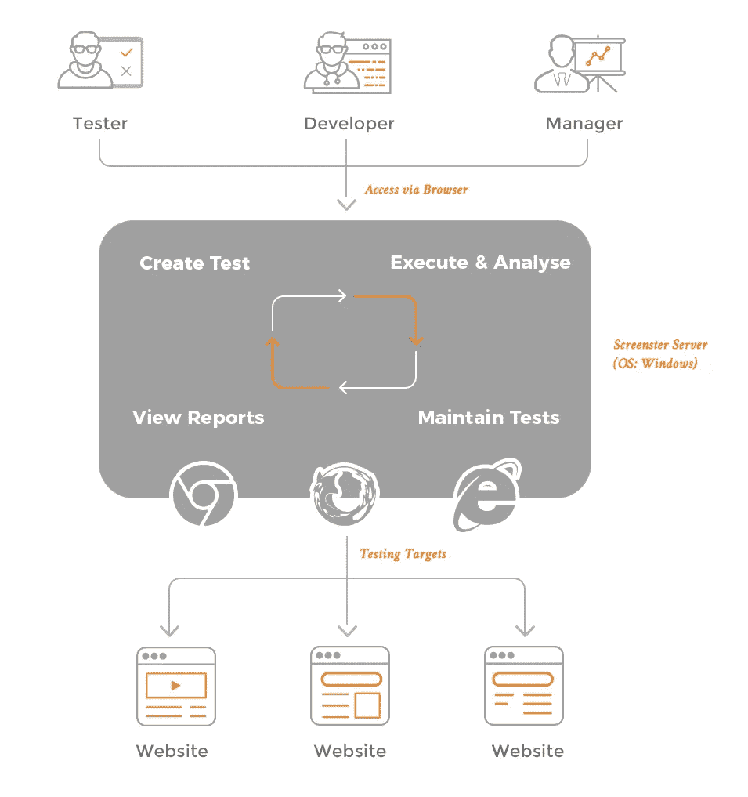

# Screenster vs 经典录音/回放 IDEs

> 原文：<https://medium.com/hackernoon/screenster-vs-classic-record-playback-ides-97acc70ec1fa>

一个经验丰富的测试人员在听到记录/回放 IDE 时首先想到的是:“去过了，做过了，它不工作。我会坚持用硒，非常感谢。”我们围绕测试记录建立了 Screenster，所以我在这里讨论为什么 Screenster 会成功，而无数的 Selenium 替代品却失败了。

# 经典录制/回放 ide 的问题

每个供应商都有一个。大多数测试者都尝试过一个。然而，我所知道的 99%的进步公司都使用 Selenium 或量角器或其他框架进行 UI 测试。请允许我对记录/回放方法的主要缺陷发表意见。

这些 ide 背后的想法是，它们使测试人员能够快速创建测试。即使是一个不太理解 JavaScript、HTML、CSS 和他们正在测试的应用程序背后的底层[技术](https://hackernoon.com/tagged/technology)的测试人员。

问题是，像 UFT 和 TestComplete 这样的经典 ide 使用*脚本*作为记录的输出。脚本通常是用某种[编程](https://hackernoon.com/tagged/programming)语言自动生成的代码行，测试人员必须理解和维护这些代码行。在最坏的情况下，它也是测试人员必须学习的定制语言。

所以记录是容易的，但是你会被你不太理解的垃圾代码所困扰，这是非常难以维护的。值是硬编码的，没有多少重用，选择器过于简单，围绕整个测试架构的组织非常少。您为自己节省了 30 分钟的代码输入时间，但最终却留下了一堆本应保持多年的烂摊子。痛苦。

诚然，这些 ide 中的一些已经在过去几年中有所改进。一些工具提供了不需要处理自动生成代码的解决方案。但是大多数工具仍然很难学习和管理。虽然有很好的特性，但这些野兽需要千兆字节来安装，手册有数百页，最终，你既不是一个好的开发人员，也不是一个好的自动化测试人员。每件事都要花很长时间，而且毫无乐趣可言。

# Screenster 有何不同

我们创建 Screenster 有几个目标。应该没有要安装的东西。它不需要阅读手册。简单的事情要容易，复杂的事情要可能。自动化一个测试用例不应该超过 10 分钟。维护费用应该很低。没有难看的自动生成代码。它应该和人类测试人员一样出色。哦，是的，它应该是一个快乐的使用:-)

让我们看看我们是如何在这些公认的崇高目标中的每一个上取得成功，而其他人却失败了。

## 没有要安装的内容

Screenster 是 100%基于网络的，没有插件作弊。运行在云或本地安装的服务器上，甚至在离线模式下。

## 没有需要阅读的手册

努夫说。只要开始使用它，你就会发现它。我们会指导您完成每一步，并且有一个面板提供有助于产品发现的有用提示。对于更高级的东西，我们有非常短的教程，你可以在不到 10 分钟内完成。

## 简单的事情应该很容易

我们围绕常见流程设计了 UX，因此无需猜测。我们在每一步都施展了魔法，比如自动提取参数、使用智能自我修复选择器和智能超时处理。一切都是可视化的，只需简单的鼠标点击即可发现。这很简单，因为你通常需要考虑和实现的 90%都是现成的。

## 复杂的事情应该是可能的

那是一个大的。我们不想拿走你的玩具:-)我们认识到，没有任何记录/回放工具可以覆盖 100%的测试逻辑。所以我们专注于让 95%的逻辑开箱即用，剩下的 5%留给测试人员在不离开浏览器的情况下使用 Selenium API 用 Java 编码。

还有一个 JavaScript 命令，允许编写 JS 代码在页面中运行。所有的 Screenster 魔法都可以通过它的 API 访问，所以你可以两全其美。

## 不到 10 分钟的测试用例自动化

像大多数记录/回放工具一样，Screenster 擅长测试开发。当你点击测试用例的时候，你实际上已经完成了自动化测试。您需要再次运行它并检查结果，但通常情况下，只需几次点击。

## 没有自动生成的代码

您可以使用 IDE 编辑测试流、添加、删除和更改测试步骤，而无需接触代码。Screenster 在幕后处理 WebDriver，为您提供有效的自动化功能。

## 维修费用低

我们通过减少测试人员在测试用例被记录后编辑它的次数达 90%,实现了低维护。Screenster 自动提取参数并应用到用户输入，因此更改在 3 个不同位置输入的值是一个参数更改。

Screenster 存储一个完全合格的选择器，然后使用智能匹配算法来查找移动和更改的元素。在每次运行期间，它分析页面状态并更新测试脚本和基线，这样您就不会有它。

当检测到差异时，它会直观地显示在页面的屏幕截图上，并且可以标记为 bug，批准为基线的预期更改，或者在未来的比较中忽略。

## 做得和人类测试员一样好

如果没有智能视觉验证，任何测试都无法涵盖人类将会看到的内容。您可能有一千个通过 Selenium 测试的用户界面，因为样式表被更改、图像被部署错误、文本错误或者按钮对用户不可见。人类测试人员很容易发现这些问题，这也是为什么大多数测试仍然由人工测试人员完成的原因。

Screenster 的视觉测试是世界上最好的。真的！没有比这更好的了。原因如下。绝大多数工具甚至都懒得进行视觉测试，所以门槛很低。少数广告“[屏幕截图比较](https://screenster.io/image-and-screenshot-comparison-tools-for-ui-testing/)”依赖于对一些存储图像的逐像素比较，一些公差表示为允许不匹配的像素的百分比。

女士们先生们，虽然这比什么都没有好，但这是一个注定要失败的方法，这就是为什么没有人真正使用它。由于页边空白的增加，简单地将所有内容下移几行将导致像素 100%不同，从而导致每个测试用例失败。页面上移动的面板也会破坏它。抗锯齿会导致失败。但是小的变化，即使是有意义的变化，如丢失标签或数字，如果低于允许的阈值，也不会被检测到。

Screenster 能够处理以上所有情况，因为它有复杂的视觉比较算法，而且它将 DOM 与截图结合在一起。它理解一组像素是文本，一组字符是日期，然后相应地应用更高级别的验证。因此，每次运行测试时不断变化的“当前日期”不会导致视觉验证失败。

Screenster 处理移动的内容、移动的元素和不断变化的动态区域。这种魔法在进行非常严格的验证时减少了 90%的误报，不会遗漏疲惫的人类会忽略的变化。

## 使用乐趣

面对现实吧，测试并不好玩。一遍又一遍地测试同一个用户界面是一件令人麻木和堕落的事情。对一个优秀的开发人员来说，编写简单的 Selenium 代码一点也不具有挑战性，它需要很长时间，并且没有增加任何商业价值。

我们设计出了一款快速、简单且出色的产品。它解放了人类去做他们应该做的事情，这种自由让 Screenster 成为一种乐趣。看看吧，试着告诉我们硒是更好的选择，我谅你也不敢:)。

# 布丁好坏

关于 Screenster 有多棒，我有很多话可以说。但事实是，看它是否对你有用的唯一方法就是去尝试。你可以免费这样做，只要去我们的[网站](https://screenster.io/)并捆绑我们的在线演示。我相信你会喜欢 Screenster，我们的团队将非常感谢你的反馈。