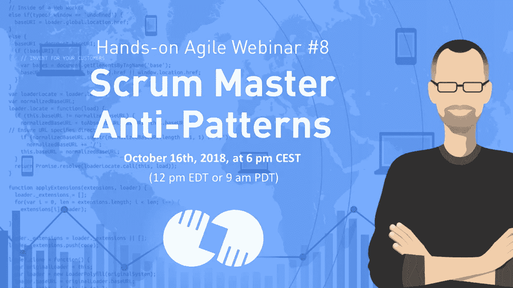
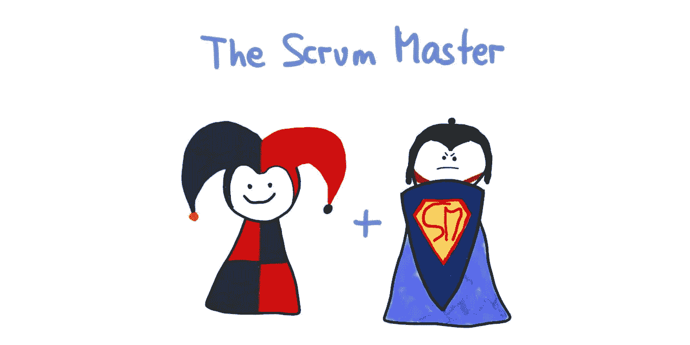

# 网络研讨会#8: Scrum Master 反模式[视频]

> 原文：<https://medium.com/hackernoon/scrum-master-anti-patterns-dfb69b42b0f>

# TL；DR:网上研讨会 Scrum Master 反模式

第八次实践敏捷网络研讨会 Scrum Master 反模式解决了你的 Scrum Master 的十二种反模式——从不合适的个人特质和对个人议程的追求到对团队本身的失望。

# 网上研讨会 Scrum Master 反模式的重播已经发布

网上研讨会的视频现已发布:

Hands-on Agile Webinar #8: Scrum Master Anti-Patterns

## 如果你喜欢这篇文章，帮我一个忙👏👏 👏多次—您的支持对我来说意味着一切！

***如果你更喜欢邮件通知，请*** [***注册我的每周简讯***](https://age-of-product.com/subscribe/?ref=Food4ThoughtMedium) ***，加入 20，064 位同行。***

# 网上研讨会 Scrum Master 反模式:章节

Talking truth to power and shielding the journey—not the team—to become agile

让我们从 Scrum 指南[中的简短回顾开始网上研讨会 Scrum Master 反模式。根据它,“Scrum 大师负责推广和支持 Scrum，正如 Scrum 指南中所定义的。Scrum 大师通过帮助每个人理解 Scrum 的理论、实践、规则和价值观来做到这一点。Scrum Master 是 Scrum 团队的仆人领导。最后，“Scrum 大师帮助那些 Scrum 团队之外的人理解他们与 Scrum 团队的互动哪些是有帮助的，哪些是没有帮助的。Scrum Master 帮助每个人改变这些交互，以最大化 Scrum 团队创造的价值。”](https://www.scrumguides.org/scrum-guide.html#team-sm)

*   第一个 Scrum Master 反模式涵盖了敏捷经理。自组织并不意味着管理的缺失:为什么作为一个 Scrum 团队来处理薪酬角色？因此，将任务外包给管理层是很常见的。然而，Scrum 绝不是关于执行命令和控制；Scrum 大师不是主管。泰勒主义的典型标志是:提供工作协议，以加速新团队或无经验团队的生产阶段，将日常 scrum 变成报告会议，推动团队在 sprint 规划期间承担更多任务，向开发人员分配子任务，或定义技术解决方案:工程师变成了 sm，现在“建议”scrum 团队如何执行任务。
*   第二个 Scrum Master 反模式涵盖了 Scrum 团队秘书和 Scrum 家长。Scrum 父代通常将团队与冷酷无情的世界隔离开来，创造了一个安全快乐的敏捷泡泡。一些表现是:Scrum 家长亲自处理所有障碍，尽管几乎任何其他团队成员也可以行动。Scrum 家长过滤来自利益相关者的反馈，尤其是任何负面的反馈。通常情况下，她不仅仅是通过限制与团队的接触，而是将其关闭。Scrum 家长纵容团队，例如跑腿，或者担任团队秘书，有时近乎助手综合症。Scrum 家长也在尽可能地防止团队失败。如果失败是容易修复的，并且不会造成损害，这甚至是适用的。(经验主义建立在学习的基础上，而学习不可避免地与失败联系在一起。Scrum 家长没有挑战团队。一旦达到一定的熟练程度，她似乎就满足了。(Kaizen 呢？)Scrum 家长可能会设定界限，但很少强制执行。她倾向于容忍团队成员的破坏性行为，并(徒劳地)希望罪魁祸首会有洞察力，并随着时间的推移而改进。
*   第三个 Scrum Master 反模式覆盖了冒名顶替者。Dolla，dolla，bill ya ll——Scrum 大师冒名顶替者认为敏捷/scrum 这种东西只是一种时尚——这有多难，Scrum 指南只有 17 页。"我将通过获得 scrum master 证书来度过对项目经理需求的暂时下降."
*   第四个 Scrum Master 反模式涵盖了 Scrum 教条主义。Scrum 大师喜欢教学(并且从未离开 Shu 阶段)。舒哈日模式是基于达到精通的模式。最终，学生将超越大师。分三个阶段:1)舒:循规蹈矩(= > Scrum 高手授课)。2) Ha:打破常规(= > Scrum Master 辅导)。3) Ri:成为规则。(= > Scrum 大师的建议。)问题是:教书感觉很好。团队成员来寻求帮助(= >目的)，人们遵守规则(= >影响或权威)，Scrum 大师可以很容易地将团队的进步或成功归因于他或她的教学。然而，要成为自组织的，团队需要超越 Shu 阶段。在这种情况下，最突出的反模式是 Scrum 的机械应用，创造了空洞的仪式，导致了货物崇拜 Scrum。
*   第五个 Scrum Master 反模式包括在容量游戏中的失败。Scrum master 并没有通过对抗 100%利用率的推动来解决空闲时间的必要性。卓越的技术是实现敏捷性的途径——参见 Nicole Forsgren und Jez Humble 的《DevOps 报告》或《加速》。如果团队不能在每个冲刺阶段都解决技术债务，那么 Scrum 团队的效率将会大打折扣。如果没有时间结对、围攻、训练和知识共享，团队也会受到影响。100%的利用率总是会降低团队的长期生产力。注意:它不是立即可见的，它会随着时间的推移而恶化。100%的利用率是工业时代泰勒主义的经典管理思想。
*   第六个 Scrum Master 反模式涵盖了破坏 Scrum Master 的流程。Scrum Master 允许涉众在冲刺阶段扰乱开发团队的流程。例如，就开发团队的准入而言，SM 有一个自由放任的政策。或者 Scrum Master 不反对管理层邀请工程师作为主题专家参加随机会议。或者 Scrum Master 允许涉众或管理者将日常的 Scrum 变成一个报告会议。
*   第七种 Scrum Master 反模式对 Scrum Master 有度量迷恋，追求有缺陷的度量。Scrum Master 跟踪个人绩效指标，比如每个 sprint 的每个开发人员的故事点数。更糟糕的是，Scrum Master 可能会向那个人的直线经理报告度量标准。这是一个主管黑客通过后门重新引入命令和控制。
*   第八个 Scrum Master 反模式包括 Scrum Master 忽略 Scrum 价值观。正如 scrum 指南所说:“当 Scrum 团队体现并实践了承诺、勇气、专注、开放和尊重的 Scrum 价值观时，透明性、检查和适应这些 Scrum 支柱就会变得鲜活起来，并为每个人建立信任。Scrum 的成功使用依赖于人们更加熟练地实践这五个价值观。”
*   第九个 Scrum Master 反模式涵盖了跳过的回顾。所有的 Scrum 事件对于团队的成功都是必不可少的——你不能忽略任何事件。初级 Scrum 团队可能会试图跳过回顾，以争取更多的时间来实现冲刺目标。接受这个“交易”的 Scrum Master 只是一个头衔上的 Scrum Master。这个提议已经表明了这个团队需要一个回顾会有多重要。
*   第十个 Scrum Master 反模式涵盖了土拨鼠日回顾。回顾展从不改变构图、地点或长度。在这种情况下，团队可能会一遍又一遍地重温相同的问题——这是一个没有快乐结局的土拨鼠日，尽管是一个空洞的仪式。
*   第 11 个 Scrum Master 反模式包括回顾会上的经理提醒。Scrum Master 允许涉众和更糟的直线经理参与团队回顾。在这种情况下，团队应该拒绝参与。什么是替代品？与利益相关者进行单独的全面回顾，或者指出其他解决利益相关者沟通需求的 Scrum 仪式:冲刺评审，可能是产品 backlog 精化，每日 Scrum。一个棘手的情况是直线经理也在 Scrum 团队中工作。我的建议:不惜一切代价避免这种情况；晋升意味着你可能也需要一个新的团队成员。
*   第十二个 scrum master 反模式提供了思考的食粮:如果你的 Scrum Master 受挫了怎么办？Scrum 大师已经努力工作了几个月，但是团队并没有对此做出回应。(对牛弹琴？)好的 Scrum 大师是有目的的；他们想产生影响。这一级别的失败有很多潜在的原因:缺乏组织高层的支持，普遍认为“敏捷”只是最新的管理时尚，因此可以忽略不计。团队构成不对。解决团队内部的问题没有心理安全感。没有失败文化——从失败中学习只是嘴上说说。公司文化不重视透明度。或者个别团队成员怀有与团队目标不一致的个人议程。(= >激励是基于个人，而不是团队。)Scrum 大师无法独自解决这些问题。团队的合作需要把 Scrum 大师从挫折中拖出来。

# 📖下载 Scrum 反模式指南

超过 [160 次提高游戏水平的机会](https://age-of-product.com/scrum-anti-patterns/)—免费:

# 🎓你还想这样多读书吗？

好吧，那么:

*   📰*加入 20064 同行* [*报名我的每周简讯*](https://age-of-product.com/subscribe/?ref=Food4ThoughtMedium)
*   🐦*关注我的*[*Twitter*](https://twitter.com/stefanw)*并订阅我的博客* [*产品时代*](https://age-of-product.com)
*   💬*或者，免费加入* [*Slack 团队【动手敏捷】的 4225+同行*](https://goo.gl/forms/XIsABn0fLn9O0hqg2) *。*

网上研讨会#8: Scrum Master 反模式首次发表于 Age-of-Product.com。