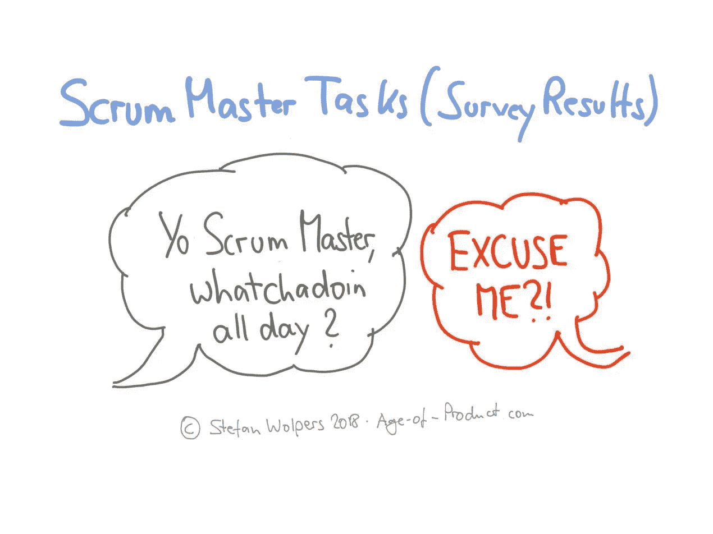
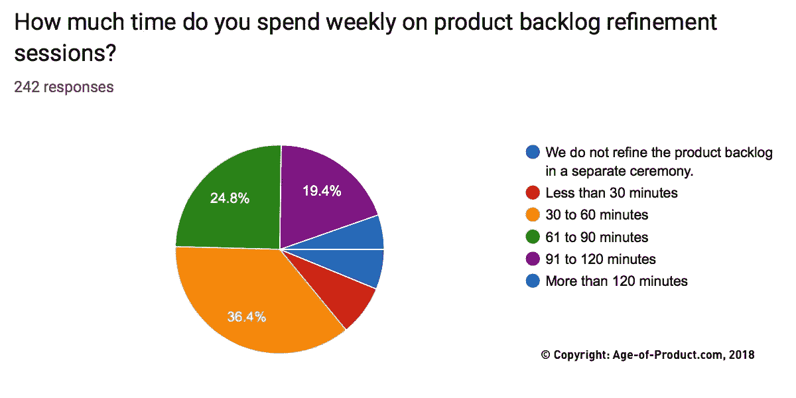
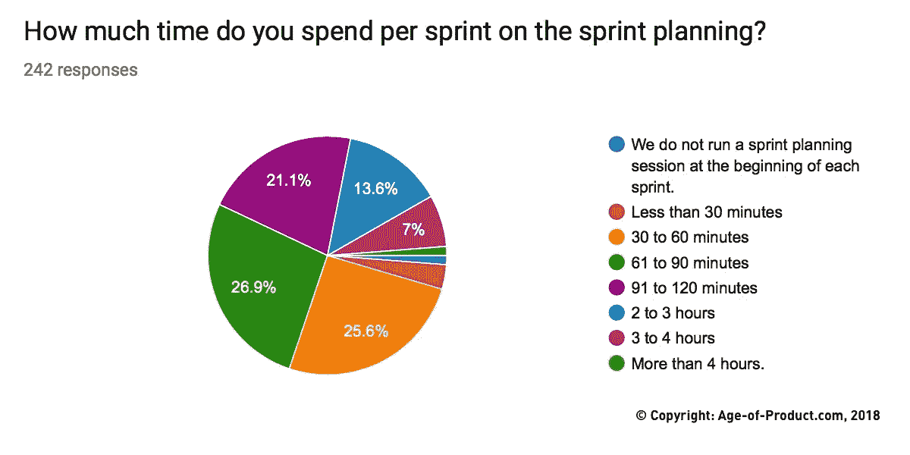
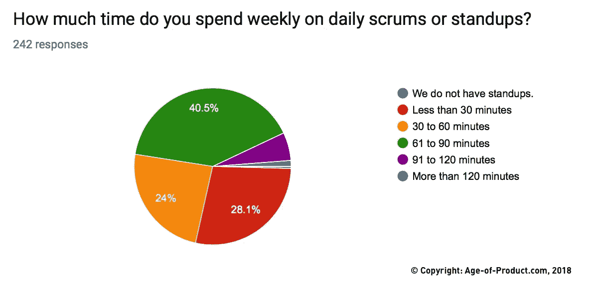
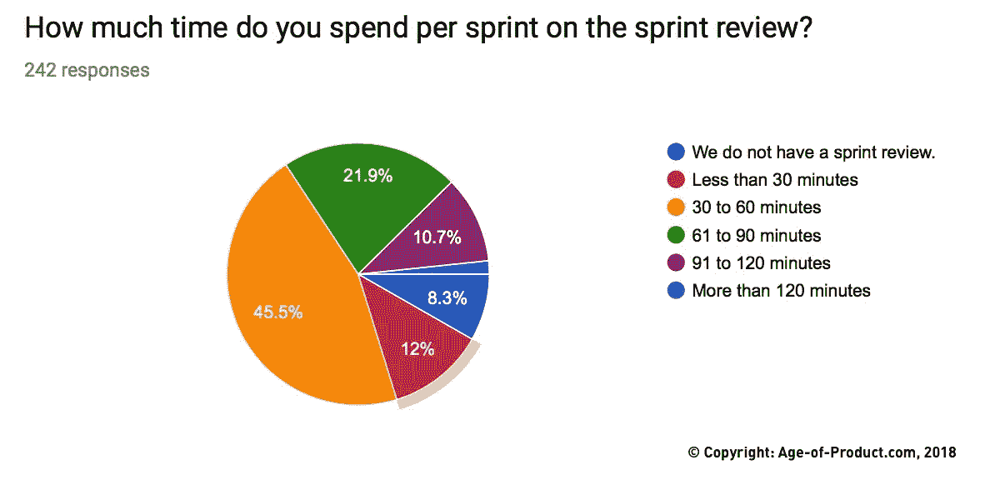
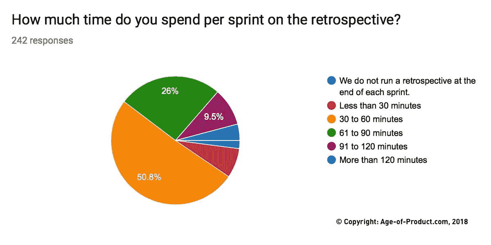
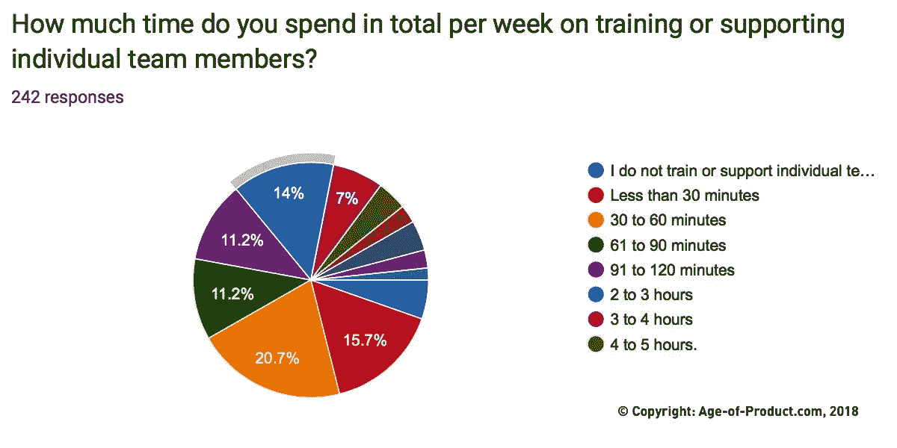
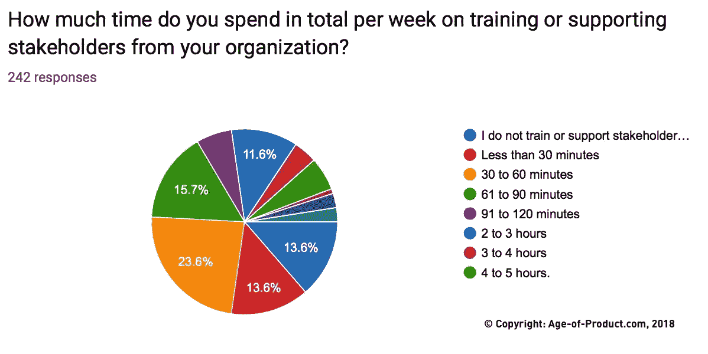
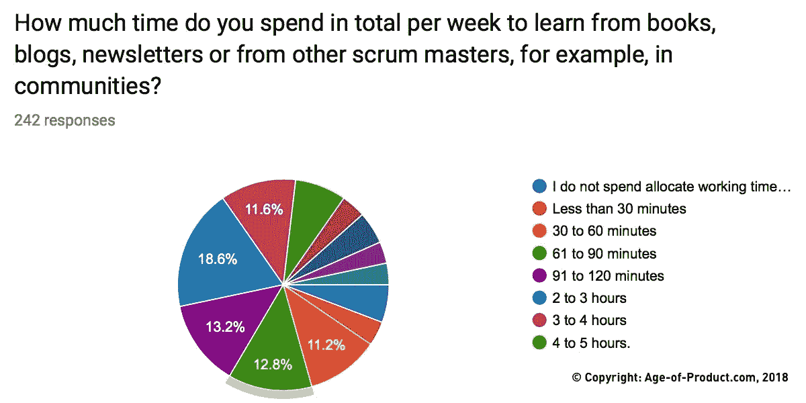

# 唷，Scrum 大师，你整天都在做什么？(调查结果)

> 原文：<https://medium.com/hackernoon/scrum-master-duties-80c7a0ed6b81>

# TL；DR: Scrum Master 职责，服务于单个团队

Scrum Master 的职责:据说，一个伟大的 Scrum master 只为一个 scrum 团队服务——这至少是 scrum 社区中流行的说法。然而，也有一个响亮的声音质疑这种方法:你一整天会做什么——和一个团队一起？难道它们不应该随着时间的推移变得自组织吗？如果是的话，那么 scrum 需要一个全天候的 scrum master 吗？

我在 scrum 团队中担任产品负责人多年，没有专门的 scrum master——这很好——我也很想了解更多关于这个问题的知识。因此，我在 2018 年 6 月底和 7 月初进行了一项调查，调查结果如下。

在 2018 年 7 月 5 日之前的两周内，共有 261 名 scrum masters 参与了这项非代表性的调查。19 名参与者选择不同意谷歌处理并存储他们的答案。因此，他们的贡献被删除，导致样本大小为 242 个答复。

# Scrum Master 职责:调查结果

该调查包括十个问题，两个解决技术问题(冲刺长度和团队规模),八个解决两个最密集的工作领域:scrum 仪式以及队友、利益相关者和 scrum master 本人的教育和培训。

## Scrum 团队的规模

问题:你的 scrum 团队有多少人？

三分之二的受访者在一个至少有七名团队成员的 scrum 团队中工作。四至五人的小型 scrum 团队在样本中不到 20%。

## 冲刺长度

**问题**:你的冲刺长度是多少？

绝大多数回答者都是 scrum 团队的成员，有两周的冲刺期。(百分之八十一。)

## Scrum Master 职责:产品积压优化

**问题**:你每周花多少时间在产品积压优化会议上？

超过一半的受访者每周花在产品积压优化会议上的时间不超过一小时。鉴于 [Scrum 指南](https://www.scrumguides.org/scrum-guide.html#artifacts-productbacklog)分配了高达 10%的 sprint 来细化产品 backlog，这意味着处于低端。可能，回答者并没有一直参与产品待办事项细化？(调查的目的不是为了获得这类信息。

## Scrum Master 职责:冲刺计划

**问题**:你每次冲刺花多少时间在冲刺规划上？

冲刺计划是分布最均匀的 scrum 仪式:中间值大约是 75 分钟。

## Scrum Master 职责:日常 Scrum 或站立

**问题**:你每周花多少时间进行日常锻炼或站立锻炼？

不出所料，考虑到本次调查中大多数 scrum 团队的规模，超过 40%的团队在每次站立或每日 scrum 会议上花费了 12 到 18 分钟。另一方面，几乎 30%的团队每次站立不到 5 分钟。

## Scrum Master 职责:冲刺评审

**问题**:你每次冲刺花多少时间在冲刺复习上？

几乎一半的 scrum 团队花 30 到 60 分钟在 sprint 回顾上。有趣的是，五分之一的团队没有 sprint 评审，或者设法在不到 30 分钟内完成评审。

## Scrum Master 职责:回顾

**问题**:你每次冲刺花多少时间做回顾？

一半的团队每次冲刺只花 30 到 60 分钟进行回顾，超过三分之一的团队在 90 分钟左右。

## 如果你喜欢这篇文章，帮我一个忙👏👏 👏多次—您的支持对我来说意味着一切！

***如果你更喜欢邮件通知，请*** [***注册我的每周简讯***](https://age-of-product.com/subscribe/?ref=Food4ThoughtMedium) ***，加入 18194 位同行。***

## Scrum Master 职责:培训和支持团队成员

**问题**:您每周总共花多少时间培训或支持团队成员？

这个问题的答案是广泛的:超过 10%的受访者每周至少花 4 个小时辅导其他团队成员。另一方面，40%的人每周花在指导队友上的时间不到一小时，或者根本不做这件事。

## Scrum Master 的职责:培训和支持涉众

**问题**:你每周总共花多少时间来培训或支持你公司的利益相关者？

四分之一的受访者根本没有辅导利益相关者，或者每周分配给这项任务的时间不到 30 分钟。其余的分配不同的时间给利益相关者教育，通常是每周一两个小时。

## Scrum Master 职责:学习

**问题**:你每周总共花多少时间从书籍、博客、时事通讯或其他 scrum 大师那里学习，比如在社区里？

四分之三的 scrum 大师每周至少花一个小时自学，其中 30 %的人每周花三个小时。

# Scrum Master 的职责:做数学

基于这个调查，一个典型的 scrum 团队有超过 7 个成员，并运行一个为期两周的 sprint。

平均来说，团队的 scrum 主管分配他或她的时间大致如下，标准化为每周小时数:

*   **产品积压细化** : 1.00 小时/周
*   **冲刺计划** : 0.75 小时/周
*   **单口相声** : 1.50 小时/周
*   **冲刺评审** : 0.50 小时/周
*   **冲刺回顾** : 0.75 小时/周
*   **学习** : 2.00 小时/周
*   **队友训练** : 3.00 小时/周
*   **利益相关者培训** : 2.00 小时/周

如果你计算一下——花费在 scrum 仪式、自我教育或培训队友和利益相关者上的总时间分别约为 **11.50 小时/周**。

在下一段中，了解单个团队的 scrum masters 还会转向什么其他活动。

# 来自调查参与者的额外 Scrum Master 活动

以下是调查参与者的一些补充意见:

“准备会议、演示、思考团队习惯并为回顾做准备、自我反思、写内部博客、准备并执行组织向敏捷转变的战略/计划。”

“我在中途加入了一个团队，在这个团队中，PO 同时负责 PO 和 SM，与团队建立信任、检查和适应非常具有挑战性。一些团队成员不相信有什么需要改进的，但是他们从来没有达到他们的冲刺目标。”

"其他任务是:工作障碍，准备物理任务板. "

“[我]也花了大量时间做典型的项目管理杂务:项目清单、计划等。”

“我的大部分时间都花在帮助消除障碍和与瀑布团队的团队协调上(我们所有的 LOB 团队都是组件化的)。此外，我在报告计划和内部“敏捷”计划上花费了大量时间。”

“[我]总共与四个团队一起工作，花 3 到 4 个[小时][同步]与其他短信和团队。”

“[我]正与一家敏捷的初创公司合作，试图与银行内部的瀑布流程保持一致，试图扩大敏捷的采用范围。”

"根据冲刺的情况，我可能会花几个小时来准备复古. "

特别是，我们已经“破坏”了 scrum 来最好地适应我们公司的环境。我不会称之为 scrum，我们正在基于它做一些事情，我们试图捍卫价值观和原则，但流程本身会根据团队的需要而变化。”

“[我]正在与其他团队、外部供应商联络。将团队与组织流程和工具结合起来。指标和报告。”

"收集敏捷指标并为领导层准备报告. "

“作为一个敏捷蔻驰，我们花在外部团队上的时间比花在直接团队上的时间要多。真的，一个中/高级 SM 只有一个团队？我认为这是胡说八道。”

“训练机会通常出现在常规的短跑项目中，我不将这些项目与其他项目分开计算。通常情况下，训练在一周内批量进行，而我大部分时间只花在训练上。那么训练就会减少。这就是为什么我选择了一个中间地带进行训练，就好像要持续几个月一样。”

“我还观察了许多人的互动，并帮助解决冲突。”

“在我的组织中，我们仍然处于实施 scrum 的过程中。管理层和组织参与 scrum 的程度很低。组织想要变得敏捷，但是不采用敏捷实践(甚至还没有完成所有的仪式)。任重道远！”

“关于我的支持的一些细节:它是关于指导人们，确保仪式的正确实施，以及使 scrum 框架适应非 it 环境。”

“我和我的团队共处一地。我在团队房间里倾听谈话，以确定事情是否进展顺利，或者是否需要我的帮助。作为一名[scrum master]，你必须倾听没有说出来的内容，并像听出来的内容一样关注这些问题。我与团队成员进行了很多一对一的对话，并鼓励他们跟进项目。这增强了团队成员的能力，团队得以成长。”

# Scrum Master 职责，服务于单个团队——结论

你这个 scrum master，整天都在做什么？

我害怕；鉴于调查的非代表性，我们无法回答这个问题。然而，如果你考虑一下回答者在“其他任务”类别中列出的内容，你会对当今现实生活中“scrum master position”的性质有一个很好的印象。

# 📺在产品时代的 Youtube 频道上加入 500 多名敏捷同行

**现已在产品时代 Youtube 频道**上线:

*   关于[产品负责人反模式](https://www.youtube.com/playlist?list=PLEUCSYe8YDkIrgyJMYW7ue_fJEwKlITph)的实践敏捷网络研讨会#6。
*   关于 [sprint 规划反模式的实践敏捷网络研讨会#5。](https://www.youtube.com/watch?v=oJliMvqU2TU&list=PLEUCSYe8YDkItuTivvgi3SBB2X_5iGC13)
*   关于[敏捷失败模式的实践敏捷网络研讨会#3。](https://www.youtube.com/watch?v=PKYokXnWEII)

# ✋不要错过:加入 3550 多人的强大的“动手敏捷”Slack 团队

我邀请你加入[“手把手的敏捷”Slack 团队](https://goo.gl/forms/LObbRtSF9vvxN3CL2)，享受来自世界各地的敏捷实践者的快速增长、充满活力的社区带来的好处。

如果你现在想加入，你现在所要做的就是[通过这个谷歌表格](https://goo.gl/forms/LObbRtSF9vvxN3CL2)提供你的凭证，我会帮你注册。顺便说一句，**这是免费的。**

# 🎓你还想这样多读书吗？

好吧，那么:

*   📰*加入 18194 同行* [*报名我的每周简讯*](https://age-of-product.com/subscribe/?ref=Food4ThoughtMedium)
*   🐦*关注我的* [*推特*](https://twitter.com/stefanw) *订阅我的博客* [*产品时代*](https://age-of-product.com)
*   💬*或者，免费加入* [*Slack 团队的 3550 多名同行“动手敏捷”*](https://goo.gl/forms/XIsABn0fLn9O0hqg2) *。*

[Scrum Master 职责，服务于单个团队(调查结果)](https://age-of-product.com/scrum-master-duties/)最早发表于 Age-of-Product.com。