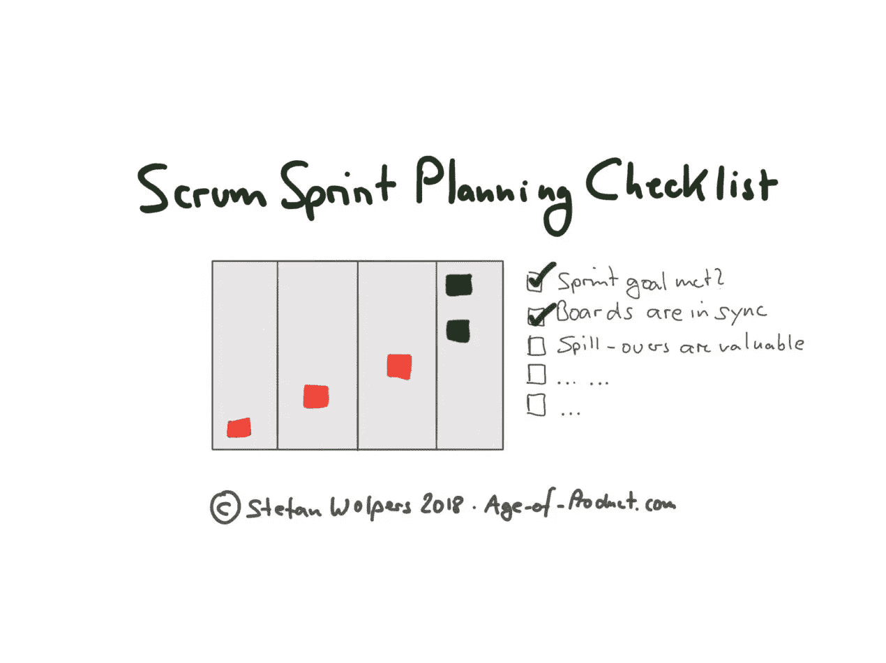

# Scrum 冲刺计划清单

> 原文：<https://medium.com/hackernoon/scrum-sprint-planning-checklist-88efc227cc92>

# TL；DR: Scrum 冲刺计划清单

冲刺规划清单？你怎么敢:Scrum 是一种思维方式，而不是一种方法。这是一个旅程，而不是目的地。没有放之四海而皆准的方法，你还能用所有标准化流程之母的清单来涵盖什么呢？

嗯，这总是取决于工具应用的目的。阅读更多为什么 scrum 清单是一个方便的工具，如果在操作层面应用，减少你的认知负荷，腾出时间做更相关的事情。

# 清单的魔力

你们中的一些人可能知道[清单源于一次航空事故](https://hackernoon.com/happy-national-checklist-day-learn-the-history-and-importance-of-october-30-1935-17d556650b89)。一架载有一批经验丰富的试飞员的新飞机在起飞时坠毁了。原来飞机根本没有机械问题，只是机组人员在起飞过程中忘记了一个简单的步骤。

可能是对复杂性的过度自信，一种“我们知道我们必须做什么，因为我们一直在做”的感觉导致了这个错误。不管最后是什么，其结果都是在航空领域强制执行清单。或者在医院。或者在任何地方，手头任务的复杂性可能被证明是认知负荷太高，以至于不能相信一切都会顺利进行。

因此，从我的角度来看，清单不是强加标准化过程的邪恶手段，而是对实践者有用的工具，即使他或她是使用 sprint 规划清单的 scrum 高手。

# 敏捷过渡——来自战壕的手册

下载最新的，212 页的版本**“敏捷过渡——来自战壕的实践手册”**

[这里有**、**还有免费的](https://age-of-product.com/download-agile-transition-hands-guide-trenches/)。

# Scrum 冲刺计划清单——细节

这个 sprint 规划清单是根据我当前团队的工作方式量身定制的。换句话说，您可能无法不加修改地将这个清单应用到您的团队中。例如，在每周的产品积压优化会议期间，我们投入了大量的精力来准备冲刺计划。(我们通常计划两到三次冲刺。)

实际上，sprint 计划本身是对我们在上次 backlog 精化中已经决定的东西的一种确认。我们可能会在容量规划期间调整 sprint backlog 的范围。然而，例如，我们很少改变冲刺的目标。因此，典型的冲刺规划#1 只需要 30 到 60 分钟。

因此，如果你的工作更传统，下面的 sprint 计划清单将缺少一些步骤。

关于下面的时间线，T=0 是指即将到来的 sprint 的开始日期，T-1 是这个 sprint 开始的前一天。而且，T+1 是冲刺规划的后一天。

# 带时间表的冲刺计划清单

## 准备冲刺规划:

*   **☐** T-2:在代码评审&准备接受列中处理开放票的数量。在开始处理新票证之前，请团队成员专注于将票证移动到完成状态。
*   **☐** T-1:让团队成员更新公告板。
*   **☐** T-1:跑冲刺复习。
*   ☐t-1:进行冲刺回顾。

## 如果你喜欢这篇文章，帮我一个忙👏👏 👏多达 50 次—您的支持对我来说意味着一切！

***如果你更喜欢邮件通知，请*** [***注册我的每周简讯***](https://age-of-product.com/subscribe/?ref=Food4ThoughtMedium) ***，加入 15，952 位同行。***

## 在冲刺规划期间:

*   **☐** T=0:通过为那些无法亲自参与冲刺规划的团队成员分享一个推进会议，启动冲刺规划。
*   ☐:所有的团队成员都出席来运行冲刺计划了吗？(产品负责人的缺席可能是一个挑战。)
*   **☐** T=0:检查每张票的状态，必要时移动票，与整个团队一起清理旧板。将离线讨论板与吉拉讨论板同步。(提前回答的一个问题:哪个局领先？如果一些团队成员在 sprint 规划期间远程工作，选择在线板。)
*   ☐:讨论可能的溢出效应:这些效应还有继续存在的价值吗？(溢出是一个合适的团队指标，也是回顾的好主题。如果溢出持续了几个 sprints，这可能会引发各种讨论，例如:
    **☐** 用户故事或标签的大小合适吗？
    **☐** 用户故事或门票的质量是否符合 ready 的定义？☐ 看板会更适合团队吗？
    **☐** 如果尚未完成的用户故事或票证不会溢出到即将到来的 sprint，则将它们移动到产品待办事项列表或删除/存档。
*   ☐:如果还没有，在团队的在线工具中创建一个新的“sprint ”,例如 Jira。
*   **☐** T=0:关闭之前的冲刺:
    **☐** 我们达到冲刺目标了吗？☐如果你使用在线工具，确保你将所有溢出的任务转移到正确的桶中，例如，即将到来的冲刺或产品积压。
    **☐** 清除之前冲刺阶段留下的旧痕迹。
*   **☐** T=0:开始下一个冲刺计划:
    **☐** 算出团队可用的冲刺能力:谁能在下一个冲刺过程中贡献工作？
    **☐** 要求产品负责人定义冲刺目标。
    **☐** 将产能与产品负责人的冲刺目标相匹配:这现实吗？
    **☐** 如果冲刺目标和团队能力不匹配，试着剥离冲刺的范围:团队能交付一个缩小版的冲刺目标吗？☐:如果团队不能交付提议的冲刺目标，要求产品负责人提出一个现实的冲刺目标。☐让团队挑选用户故事，以及满足冲刺目标所需的其他任务。☐ 询问团队是否所有的用户故事和其他满足冲刺目标所需的任务都满足团队对就绪的定义。(如果不是这样，确保问题得到解决，并且团队同意如何协作处理问题。)
    **☐** 询问团队工作范围是否留出了处理意外问题的空闲时间。
    **☐** 询问团队工作范围是否提供了解决技术债务的能力，以及防止技术债务的缺陷。
    **☐** 用用户故事和任务为物理板创建粘性。(确保遵循不同类型胶粘物的颜色代码；尖峰、用户故事、技术任务、子任务和 bug 都有明显不同的颜色。)
*   **☐** T=0:对之前的 sprint 进行匿名调查。
*   **☐** T=0:总结回顾会的结果，并用行动项目更新董事会。
*   **☐** T=0:总结冲刺复习的结果。

## 冲刺规划后:

*   **☐** T+1:同步离线板和在线板。
*   ☐:很可能，开始为即将到来的回顾收集数据，比如，建立一个 sprint 邮箱。
*   **☐** T+2:敬请提醒团队成员参与杰出冲刺调查。建议的最少参与者人数为八人。
*   **☐** T+3:公布上一次 sprint 的 sprint 调查结果。

# Scrum 冲刺计划清单——结论

清单既服务于初级实践者——我必须做什么——也服务于有经验的敏捷实践者来处理手边的复杂性。像这个 sprint 规划清单的例子这样的清单绝不是对敏捷宣言的违背，而是减轻了运行仪式和实践的认知负荷。

可以把 scrum 清单看作是需要定期回顾和调整的进行中的工作。在这方面，scrum 清单与工作协议或完成的定义没有太大的不同。

作为 scrum 大师或敏捷教练，你在日常工作中使用清单吗？请在评论中与我们分享。

# ✋不要错过:加入 2900 多人的强大的“动手敏捷”Slack 团队

我邀请你加入[“手把手的敏捷”Slack 团队](https://goo.gl/forms/LObbRtSF9vvxN3CL2)，享受来自世界各地的敏捷实践者的快速增长、充满活力的社区的好处。

如果你现在想加入，你现在所要做的就是[通过这个谷歌表格](https://goo.gl/forms/LObbRtSF9vvxN3CL2)提供你的证书，我会帮你注册。对了，**是免费的。**

# 你还想这样多读书吗？

好吧，那么:

*   📰*加入 15952 位同行和* [*报名我的每周简讯*](https://age-of-product.com/subscribe/?ref=Food4ThoughtMedium)
*   🐦*关注我的* [*推特*](https://twitter.com/stefanw) *订阅我的博客* [*产品时代*](https://age-of-product.com)
*   💬*或者，免费加入* [*Slack 团队【动手敏捷】的 2900 多名同行*](https://goo.gl/forms/XIsABn0fLn9O0hqg2) *。*

[冲刺规划清单](https://age-of-product.com/sprint-planning-checklist/)首次发布于产品时代。

# 冲刺规划清单—相关文章

[28 产品积压和精化反模式](https://age-of-product.com/28-product-backlog-anti-patterns/)

Scrum: 19 个冲刺规划反模式。