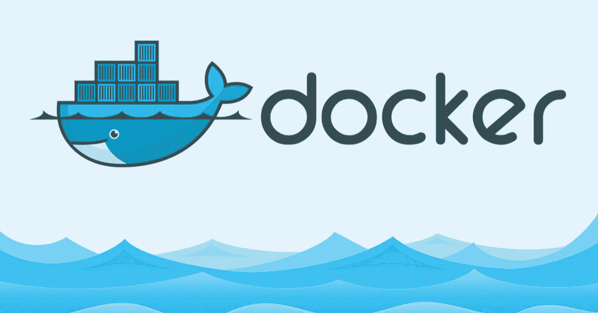

# Raspberry Pi 的无缝交叉编译 Rust

> 原文：<https://medium.com/hackernoon/seamlessly-cross-compiling-rust-for-raspberry-pis-ede5e2bd3fe2>

在过去的几周里，我把大部分时间都集中在一个项目上，我们称之为 ***spark*** 。本质上，它是一个建立在 Raspberry Pi 之上的数据网关，将机器和能源指标从现有基础设施连接到我们的数据管道。

由于我们的主要关注点是高达 100Hz 的高频读数，所以很快就发现 python(通常是我的首选语言)并不合适。经过一番研究后，我很快就选定了 Rust，因为它具有尖端的性能，并且有一句话叫“*如果我编译，它就是安全的”*。

但和往常一样，一切都是有代价的:虽然 Rust 速度惊人，让我们能够满怀信心地开发和发布新功能和修复程序，但它需要针对特定的架构进行编译——在我们的例子中是 armv7。在 MacbookPro 上工作时，我最初解决这个问题的方法是拉动整个回购并在 Raspberry Pi 本身上构建应用程序，这导致了长达 30 分钟的不耐烦。

为了寻找更简化的构建过程，我最终实现了一个构建在 [Docker](https://hackernoon.com/tagged/docker) 之上的交叉编译管道，我想和你分享一下。

## 对你有什么好处？

这篇文章旨在帮助您逐步构建自己的自动化交叉编译管道:

1.  首先，我们将建立一个小的 Rust 程序，稍后我们将为 armv7 交叉编译它。
2.  其次，我们将创建一个定制的 Docker 映像，它将处理大量的交叉编译系统依赖以及我们的应用程序。
3.  最后，我们将编写一个 shell 脚本来执行交叉编译过程。

既然我们已经设定了范围，让我们为起飞做好准备吧！

# 准备我们的防锈应用

由于这篇文章主要关注 Rust 应用程序的自动交叉编译，我们将建立一个裸支架并添加一个系统依赖项，我发现这特别棘手:OpenSSL。

我们首先创建一个名为`hello-rpi`的新目录，并将`cd`放入其中。然后，我们通过在我们选择的终端中运行`cargo new --bin hello-rpi`来初始化一个新的 cargo 项目。现在，我们应该有一个名为`hello-rpi`的项目目录，其文件夹结构如下:

```
hello-rpi
|
|--- hello-rpi
*    |--- Cargo.toml
     |
     |--- src
     *     |--- main.rs
           *
```

生成我们的最小应用程序后，在我们的`Cargo.toml`文件中添加`openssl = “0.10.5”`作为依赖项，并在`main.rs`中将`openssl`声明为外部机箱。经过我们的小调整，我们的`Cargo.toml`和`main.rs`应该是这样的:

**Cargo.toml**

```
[package]
name = "hello-rpi"
version = "0.1.0"
authors = ["your handle <[your@mail.c](mailto:deniz.saner@rwth-aachen.de)om>"][dependencies]
openssl = "0.10.5"
```

**main.rs**

```
extern crate openssl;fn main() {
    println!("Hello, world!");
}
```

最后，继续将以下几行添加到`hello-rpi/hello-rpi/.cargo/config`中的板条箱货物配置文件中:

```
[target.armv7-unknown-linux-gnueabihf]
linker = "arm-linux-gnueabihf-gcc"
```

这将告诉 cargo 使用哪个链接器，当我们指定`armv7-unkown-linux-gnueabih`作为我们的目标时，这是我们 Pi 的架构。有了这几行代码，我们就完成了 Rust 端的工作。

# 创建我们的自定义 Docker 图像



我们的最小应用程序集已经准备就绪，现在我们把重点放在自动化应用程序的交叉编译过程上。为此，我们将创建一个 Docker 映像，它将处理我们的应用程序以及我们的依赖项的交叉编译，即我们的 OpenSSL。

幸运的是，我们不必从零开始——斯蒂芬·瑟沃尔的码头工人形象`raspberry-pi-cross-compiler`，可以在这里找到，提供了一个很棒的样板。当不带任何参数运行时，基于该映像的容器返回一个助手脚本，该脚本反过来让您与容器交互并开始实际的交叉编译。

所以让我们开始吧！在我们的项目中创建一个新文件夹(不是板条箱！)根命名为`rpxc`，创建一个`Dockerfile`并粘贴以下内容到其中:

哇，这里发生了很多事情——让我们分解一下:首先，我们将我们的基础映像指向 sdthirwall 的`raspberry-pi-cross-compiler`,并通过`apt-get`安装一些包——没什么特别的。

然后我们使用`ENV`表达式来设置指向我们的`Cargo`和`Rustup`安装以及 OpenSSL `lib`和`include`目录的环境变量。

随后的`RUN`块借用了`rust:1.26.0`图像，用于安装 Rust 工具链并添加`armv7-unknown-linux-gnueabihf`作为编译目标。顾名思义，这是我们的树莓架构的编译器。

然后，第二个`RUN`命令为我们的目标架构下载、解压缩和交叉编译 OpenSSL。注意，我们指向 OpenSSL 的`lib`和`include`目录的环境变量与我们的安装路径相匹配。

没那么复杂，对吧？更重要的是，这种设置通过简单地扩展我们的`Dockerfile`-没有比这更容易的了。

# 自动化构建过程

随着我们`Dockerfile`的建立，我们离构建管道只差一步之遥。更准确地说，我们想

*   构建我们刚刚定义的 Docker 映像
*   启动一个容器来获得我上面提到的交叉编译脚本
*   使用该脚本启动交叉编译过程

将这个过程转换成一个 shell 脚本并进行一些清理会产生六行代码，这些代码需要放在`rpxc`目录中才能正常工作。

就是这样！我们定义了自定义 Docker 映像，它在构建时处理交叉编译系统依赖关系，并编写了一个 shell 脚本来实际构建和交叉编译整个应用程序。现在，你可以简单地将`cd`转换成`rpxc`，运行上面的脚本，坐下来观看神奇的事情发生。

# 摘要

在这篇文章中，我们构建了一个构建管道，让我们只需执行一个 shell 脚本就可以交叉编译 armv7 架构的任何 Rust 应用程序。为此，我们构建了一个定制的`Dockerfile`，添加了特定于应用程序的系统依赖项，并编写了一个小的 shell 脚本，开始了交叉编译过程。

这种设置是有利的，原因有很多:首先，只要安装了 Docker，就可以在任何机器和平台上构建应用程序。因此，您可以轻松地将整个构建过程集成为持续集成管道的最后一步。此外，您可以通过扩展`Dockerfile`来添加任何额外的系统依赖性，这使得该解决方案可扩展到更复杂的应用程序，这些应用程序可能依赖于大量的系统依赖性。

我这边就是这样！我希望你喜欢我的第一篇帖子，并且我能够让你开始为 [Raspberry](https://hackernoon.com/tagged/raspberry) Pis 交叉编译 Rust。如果你对我的帖子有任何问题或批评，请在下面的评论中告诉我！

***全披露:*** 我是 Enlyze 的联合创始人之一。我们是一家位于德国亚琛的初创公司，它将功耗视为任何电器健康状况的通用指标。我们的六人团队由充满激情的人工智能研究人员和电子及软件工程师组成。如果你想联系，给我们发一封去 hello@enlyze.com 的邮件。