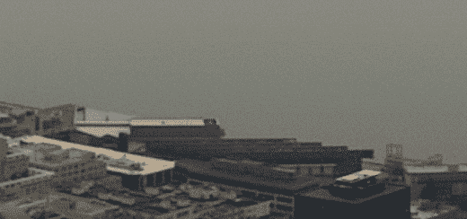
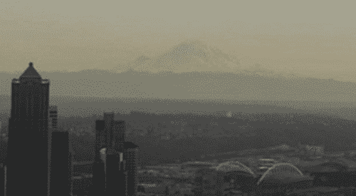
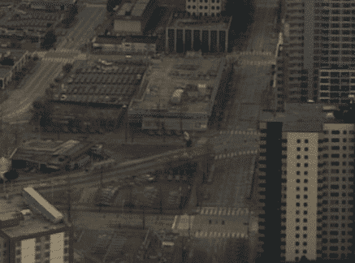
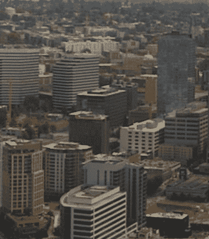
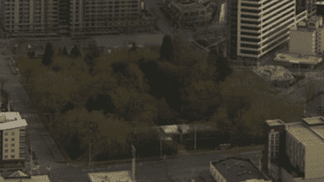
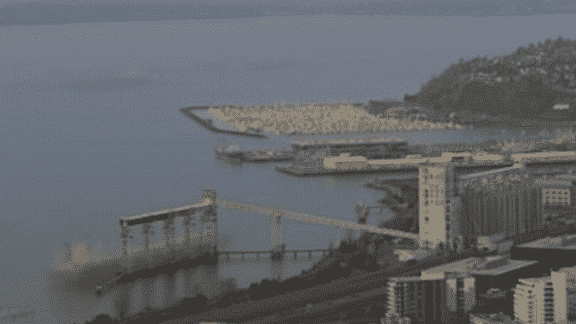
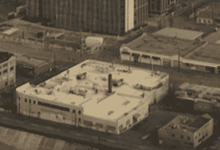
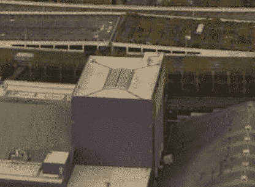
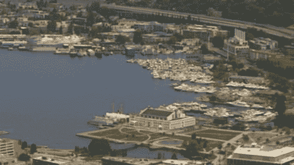
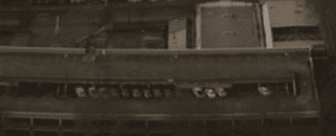

# 来自太空针的西雅图 3 年延时视频

> 原文：<https://medium.com/hackernoon/seattle-3-year-time-lapse-video-from-the-space-needle-9a9e76cfe8bf>

自从西雅图的太空针在针的顶部安装了一个高清 360 网络摄像头后，我就被捕捉到的镜头迷住了。

在过去的几个月里，我收集了一段 360 摄像头在过去 3 年里拍摄的延时视频。看看下面，继续阅读更多关于它的细节，了解它是如何制作的。

# 它是如何制作的？

在过去的两年里，我每天拍摄两张全景照片，超过 2000 张。然后，序列稳定下来，因为相机随着时间的推移而震动和移动，要么是因为被撞，要么是因为风和其他自然力量。最后一步是在时间上平滑序列，以消除天气和光照条件造成的变化。下面的视频直观地展示了这一过程，但更多技术细节请参见本常见问题的最后一节。

# **市区前面的幽灵游轮是什么？**

在夏季的几个月里，大型游轮每周有一两天停靠在西雅图的海滨。因为游轮只有大约四分之一的时间在那里，时间平滑表示它是 75%透明的，因此，它看起来像一艘幽灵游轮！

Cruise ships appear as ghosts in the Seattle waterfront, as they only spend a couple of days a week in port.

# **瑞尼尔山在延时摄影中可见吗？**

是啊！但几乎没有。为了从 80 多英里外的太空针上看到瑞尼尔山，大气条件必须非常清晰。时间正则化产生了一种“移动平均”效应，这使得人们在阳光充足的时候可以更好地看到它。然而，在阴天期间，这座山几乎从时间推移中消失。

Mount Rainier appears in the time-lapse, though very faint (contrast enhanced). Note how the mountain has more snow during the winter months.

# **为什么有些建筑的影子在动？**

在夏季的几个月里，丹尼大街周围的建筑投下的阴影清晰可见，因为西雅图阳光明媚。它们随着拍摄时间上午 10:30 和下午 2:30 的太阳位置在夏至前后的天空中升起而移动。

Shadows moving around the summer solstice. Also note the streets taking yellowish and gray colors as the seasons go by.

# **延时摄影中还有哪些很酷的小片段？**

有无数有趣的细节值得一看！以下是我最喜欢的一些:

Skyscrapers popping up in the northeast end of Downtown. Most of the area is restricted to 400 feet / 40-story towers, and thus all look the same height.

A tree on the lower right corner of Denny Park turns yellow in the spring before turning green, and loses its leaves before the other trees in the park — what kind of tree is it?

Boats don’t always dock in the same position in the grain terminal. Also see the seasonal activity in the Interbay port terminal.

An old industrial building is demolished in South Lake Union, and a new apartment building appears, all within 18 months. Seattle is one of the fastest growing cities in the US.

Double shadows cast by McCaw Hall, due to the images used for the time-lapse being taken at 10:30 am and 2:30 pm (see technical details in the next section)

Boat shows extend the marina into the South tip of Lake Union twice a year for a brief period of time.

What is going on with the cars on the top floor of this parking garage in Queen Anne? They seem to stay in the same spot for months at a time.

# **你做过其他延时视频吗？**

是的，几年前我提出了一种从互联网照片生成延时视频的方法。为了制作西雅图的延时镜头，我使用了同样的技术来平滑时间序列。看看下面的视频吧！

# **延时拍摄用了多少张照片？**

我使用了 2166 张全景照片，相当于一天两张照片，分别在过去三年的每天上午 10:30 和下午 2:30 拍摄。一些照片不见了，可能是因为相机暂时离线。

# **延时的原始大小是多少像素？**

延时视频的大小与 360 网络摄像头拍摄的每个全景图相同，即 8283 像素宽，1080 像素高，约 900 万像素。

# 图像是如何处理的？

处理流水线包括两个步骤:

*   首先，原始全景图像使用光流技术进行运动稳定，因为相机由于风和其他自然力而在整个序列中抖动和移动。我选择了一个参考全景图，并使用 CPM 光流包( [paper](https://pdfs.semanticscholar.org/ab47/1d4c06133607abbf5dc533546abc20738618.pdf) ， [github](https://github.com/YinlinHu/CPM) )将所有图像的切片扭曲到参考全景图。
*   第二，稳定的序列在时间上被平滑以去除由于天气和照明条件引起的闪烁。我使用了我之前的工作中展示的技术，从互联网照片中进行延时挖掘。

处理发生在 512 个像素(总共 17 个)的切片中，每个切片花费 20 分钟进行运动稳定，一个小时进行时间正则化，这是在 pycuda 中实现的，在 GPU 上运行。